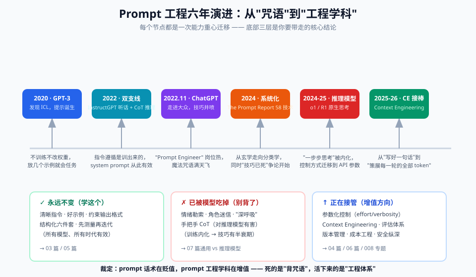

# 00 - 背景篇：Prompt 工程前史与全景

> 【本节问题】① 在 prompt 出现之前，人们怎么"指挥" NLP 模型？② ICL 是怎么被发现的，为什么它是一次范式转移？③ "prompt 工程师"这个岗位经历了什么？④ 2025-2026 年这个词为什么开始被 context engineering 取代？

---

## 1. 为什么要学前史？（黄金圈的 Why 补充课）

**一句话人话**：不知道 prompt 从哪来，你就分不清哪些技巧是"物理定律"（长期有效）、哪些是"民间偏方"（换个模型就失效）。

**生活类比**：学 SQL 之前先懂关系模型，你就不会被某个数据库的方言绑架；学 prompt 之前先懂范式变迁，你就不会被某篇爆款文章的"神级提示词模板"绑架。

## 2. NLP 四次范式变迁（30 年压缩史）

| 阶段 | 时期 | 人机沟通方式 | 死因 |
|---|---|---|---|
| **规则时代** | 1980s-1990s | 人工写语法规则、正则模板 | 语言太灵活，规则写不完 |
| **统计时代** | 1990s-2010s | 标注数据 + 特征工程 | 特征靠人设计，天花板低 |
| **预训练+微调时代** | 2018-2020 | BERT 式：预训练模型 + **每个任务单独微调一个头** | 一个任务一个模型，成本高、不通用 |
| **提示时代** | 2020-今 | GPT 式：**一个模型，用自然语言描述任务** | （当前范式，演进方向是 context engineering） |

**分岔路口**：2018 年 BERT 和 GPT 几乎同时出现，但走了两条路——

- **BERT（encoder，双向）**：像做完形填空（看前后文填中间），擅长理解，但生来就要微调
- **GPT（decoder，单向）**：像接龙（看前文续后文），生来就会"生成"，为"你给它开头，它接着写"的交互模式埋下伏笔

> 💡 费曼检验：为什么是 GPT 系而不是 BERT 系催生了 prompt 工程？——因为"接龙"这个交互模式天然支持"把任务描述写在前文里"，而填空模式的输入输出结构太死板。

先纵览全程时间线，再逐段展开：



## 3. ICL 的诞生：2020 年 GPT-3 论文（本领域的"创世纪"）

**论文**：《Language Models are Few-Shot Learners》（Brown et al., 2020，arXiv:2005.14165）

关键实验：不给 GPT-3 任何梯度更新（不训练、不微调），只在输入前面放几个"任务示例"，模型就能做英法翻译、问答、算术。他们给这个现象起名 **In-Context Learning（ICL，上下文学习）**，把输入前缀起名 **prompt（提示）**。

```text
（前史：GPT-2 2019 已经零星发现"提示"现象——比如给 "The capital of France is" 
续写出 "Paris"，但没人把它当方法论）

GPT-3 few-shot 示例：
"请把英语翻译成法语：
  sea otter => loutre de mer
  cheese => fromage
  peppermint => menthe poivrée
  giraffe =>                              ← 模型接龙：girafe"
```

**为什么是范式转移**：

- 以前：任务能力 = 预训练 + **你**做微调（改模型权重，要 GPU、要数据）
- 以后：任务能力 = 预训练 + **模型**在上下文里现学（不改权重，改输入文本）

**类比**：微调像送员工去读一个专业学位（贵、慢、一次一个方向）；ICL 像开会前把三份范文贴在白板上（快、免费、随时换方向）。

## 4. 两条关键支线（2022）：让"听人话"成为可能

### 支线 A：RLHF 对齐 —— InstructGPT（2022-01）

原始 GPT-3 只会"接龙"，你问"帮我写首诗"，它可能接着生成"帮我写首诗，然后我把它念给朋友听"（网络文本的惯性）。**InstructGPT 用 RLHF（人类反馈强化学习）**教会模型"把用户输入当指令执行而不是当文本续写"。论文结论：1.3B 的 InstructGPT 在用户偏好上胜过 175B 的原始 GPT-3。

→ 这就是为什么今天 system prompt 能生效：**指令遵循是训练出来的能力，prompt 只是触发它**。

### 支线 B：思维链 —— CoT 论文（2022-01）

**Wei et al.《Chain-of-Thought Prompting》**：在大模型 few-shot 示例里把"推理过程"也写出来，数学题正确率大幅提升（PaLM 540B 在 GSM8K 从 ~18% → ~57%）。

→ 开创了"prompt 里管理模型的思考过程"这条线，是后来 ReAct、推理模型的前身。

## 5. 成学科与降温：prompt 工程师的过山车（2022-2024）

| 时间 | 事件 | 含义 |
|---|---|---|
| 2022-2023 | ChatGPT 发布；"Prompt Engineer" 成招聘热词，年薪传闻 $300k+ | 技巧大量涌现（角色扮演、Delimiters、"深呼吸一步步来"） |
| 2023 | 学术界开始系统化：《The Prompt Report》启动，最终收录 **58 种文本技术**（2024，arXiv:2406.06608） | 从玄学走向分类学 |
| 2023-2024 | 争论出现：《Prompt Engineering is Dead》类文章；研究发现很多"神级技巧"（如情绪勒索 EmotionPrompt）在新模型上增益趋近于零 | 技巧红利被训练进模型（"吃进 RLHF"） |
| 2024-2025 | GPT-4o/o1、Claude 3.5+/4.x、DeepSeek-R1、Gemini 2.x：**推理模型**原生会思考 | "诱导思考"类技巧被 API 参数取代（reasoning_effort、thinking budget） |
| 2025-2026 | Anthropic 官方发文《Effective context engineering for AI agents》（2025-09）：context engineering 是 prompt engineering 的**自然演进** | 焦点从"一句话怎么写"升级为"每一轮该让模型看到什么" |

**结论（帮你建立稳定心智模型）**：prompt 工程**没有死，但重心持续上移**——

1. 底层不变的："给清晰指令、给好示例、约束输出格式"（所有模型所有时代有效）
2. 已被模型吃掉的：花式话术、情绪技巧、手把手 CoT（对推理模型反而有害）
3. 正在接管的：上下文策展（context engineering）、参数化控制（effort/verbosity）、评估体系

> 💡 费曼检验：为什么"请深呼吸并一步一步思考"这类技巧会失效？——因为它解决的问题（模型不爱显式推理）已经被推理模型在训练阶段解决了；训练会持续把有效的提示模式"内化"，技巧于是有半衰期。

## 6. 术语全景（精选自 The Prompt Report 的 33 术语）

| 术语 | 一句话解释 | 本笔记位置 |
|---|---|---|
| **Prompt** | 发给模型的全部输入前缀 | 02 |
| **System Prompt** | 设定全局行为约定的最高优先级消息 | 02 |
| **ICL** | 上下文学习：靠输入里的示例"现学"任务 | 02 / 03 |
| **Few-shot** | 在 prompt 里放少量输入→输出示例 | 02 |
| **CoT** | 思维链：让模型显式写出推理步骤 | 02 / 04 |
| **Answer Engineering** | 答案工程：设计答案的形状/取值空间/抽取方式 | 04 |
| **Prompt Template** | 带变量槽位的提示模板（`{query}` 等） | 02 |
| **Role Prompting** | 给模型分配角色/视角 | 02 |
| **Prompt Injection** | 用输入劫持模型行为（安全攻击） | 02 / 06 |
| **Prompt Chaining** | 多个提示串联成流水线 | 04 |
| **Meta-prompting** | 用模型生成/优化提示词 | 04 |
| **Context Engineering** | 上位概念：策展每一轮进入上下文的全部 token | 07 |
| **Reasoning Model** | 原生长思考的模型（o 系/R1/GPT-5 等） | 02 / 07 |

## 7. 一张图记住全景

```text
规则/统计 NLP ──► 预训练+微调 ──► 提示时代（2020-）
                    │                    │
                BERT(填空)          GPT-3 发现 ICL（2020）
                死于不通用               │
                                ┌───────┴────────┐
                          InstructGPT(2022)   CoT(2022)
                          "听懂指令"           "显式推理"
                                │                │
                                └──► ChatGPT 爆发，prompt 工程师热（2023）
                                         │
                              The Prompt Report 收编 58 技术（2024）
                                         │
                              推理模型原生思考，技巧被参数取代（2025）
                                         │
                              Context Engineering 接棒（2025-2026）
```

---

## 【本节自测】

1. NLP 四次范式变迁中，"提示时代"替代"微调时代"的核心区别是什么？（一句话）
2. BERT 和 GPT 的训练目标差别是什么？为什么这条分岔决定了只有 GPT 系催生 prompt 工程？
3. ICL 这个名字里，"in-context" 和什么过程相对？（提示：什么过程是它替代的）
4. InstructGPT 的 RLHF 解决了什么问题？它和"system prompt 为什么有效"有什么关系？
5. CoT 论文发表于哪一年？它为什么是 ReAct 和推理模型的"祖先"？
6. prompt 技巧为什么有"半衰期"？举例说明一个已被模型内化的技巧。
7. context engineering 和 prompt engineering 的关系，Anthropic 的官方说法是什么？
