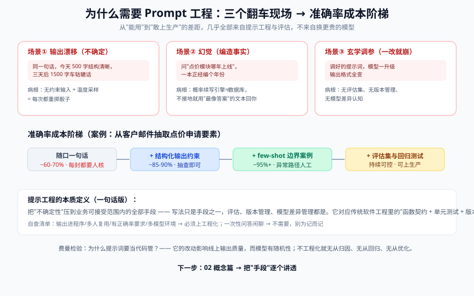

# 01 - 问题篇：为什么需要 Prompt 工程

> 【本节问题】① "会说话就会写提示词"错在哪？② 同一个提示词，为什么今天灵明天不灵？③ 不做工程化，生产环境会炸在哪几个点？④ 哪些场景根本不需要 prompt 工程？

---

## 1. 黄金圈第一圈：Why——先看三个真实场景

### 场景 A： vibes 聊天 vs 生产输出（不确定性）

```text
同事甲：帮我总结一下这个合同的风险点。
模型：好的，主要风险有三点……（输出 500 字，结构清晰）

同一句话，三天后：
模型：这个合同看起来是一份贸易合同，风险点包括但不限于……（输出 1500 字，车轱辘话）
```

**病根**：没有约束输入，就没有可预期的输出。温度采样 + 无结构指令 = 每次重掷骰子。

### 场景 B：幻觉（编造事实）

问模型"中基集团 CTRM 系统的点价模块是哪年上线的"——它会一本正经编一个年份。

**病根**：模型是概率续写引擎，不是数据库。**没有接地的提示（不给资料、不要求引文），它就用最像答案的文本回答你**。解法见 05 实战篇（引文接地）和 005-RAG 专题。

### 场景 C：一改就崩的"玄学调参"

你精心调好的提示词，模型一升级（GPT-4 → GPT-5），输出格式全变了；换个 Claude 又是另一种风格。

**病根**：把提示词当成一次性聊天，没有：① 评估集（怎么算"好"没定义）；② 版本管理（改了什么不知道）；③ 模型差异认知（写法不通用）。

## 2. 算一笔账：没有提示工程的真实成本

以"从客户邮件里抽取订单要素（品名/数量/价格/交期）"任务为例：

| 做法 | 单次准确率 | 人工返工 | 结论 |
|---|---|---|---|
| 随口一句话 | ~60-70% | 每封邮件都要人工核对 | 自动化无意义 |
| + 结构化输出约束（JSON Schema） | ~85-90% | 抽查即可 | 及格线 |
| + few-shot 边界案例示例 + 字段定义 | ~95%+ | 异常路径人工 | 可上生产 |
| + 评估集 + 回归测试（06 篇） | 持续可控 | 极少 | 工程化完成 |

**结论**：从"能用"到"敢上生产"的差距，几乎全部来自提示工程与评估，不来自换更贵的模型。

三个翻车场景与准确率阶梯，一图看全：



## 3. 反面教材：三类典型错误姿势

| 错误姿势 | 具体死法 | 解法 |
|---|---|---|
| **写小作文**（把所有要求堆成一大段口语化文字） | 指令互相冲突（"要详细又要简洁"）、模型抓不住重点；GPT-5 官方指南专门警告：**矛盾指令会被模型点出或拒绝** | 结构化分段（03 篇六件套） |
| **零示例硬上复杂任务** | 输出格式漂移、边界案例乱来 | few-shot 示例（02/05 篇） |
| **对推理模型手把手教思考** | 对 R1/o 系/GPT-5 写"step 1 先…step 2 再…"反而画蛇添足，甚至干扰其内置思考链 | 区分模型类型（07 篇） |

## 4. 什么时候不需要 prompt 工程？（自查清单）

- [ ] 一次性问答、闲聊 → 不需要，自然语言就行
- [ ] 结果不需要复现（写首诗、头脑风暴） → 简单提示即可
- [ ] 需要稳定、可解析、可回流的输出（进数据库、进下游程序） → **需要**
- [ ] 同一提示词会被多次调用、多人使用 → **需要**
- [ ] 输出有正确率要求 / 涉及业务数据 → **必须 + 评估**
- [ ] 多模型、多版本环境 → **必须 + 差异管理（07 篇）**

**结论**：提示工程的本质是**把"不确定性"压到业务可接受的范围内的全部手段**——写法只是手段之一，评估、版本、模型差异管理都是。

## 5. 与传统软件工程的对照表（工程师视角速懂）

| 传统软件 | Prompt 工程 |
|---|---|
| 函数签名（入参/出参类型） | 提示词的指令 + 输出格式约束 |
| 单元测试 | 评估集（eval set）+ 回归测试 |
| 代码审查 | 提示词评审（是否冲突、是否可测） |
| 版本管理 | 提示词版本 + 模型版本双轨记录 |
| 异常处理 | 输出校验失败的重试/修复循环 |
| 性能调优 | token 成本/延迟/准确率三角权衡 |

> 💡 费曼检验：能不能不看笔记，向同事解释"为什么提示词要当代码管"？——因为它的改动会影响线上输出质量，而模型本身有随机性，不改成工程流程就无从归因、无从回归、无从优化。

---

## 【本节自测】

1. 场景 A 中"同一句话输出时好时坏"的两个技术根源是什么？
2. 为什么"没有接地的提示"必然导致幻觉？哪两个手段能缓解？
3. 从 60% 到 95% 准确率，中间的关键三步分别是什么？
4. 三类典型错误姿势各自的死法和解法？
5. 列出至少三个"必须上提示工程"的场景特征。
6. 用传统软件工程的概念，给"评估集"找一个对应物，并说明为什么对应。
