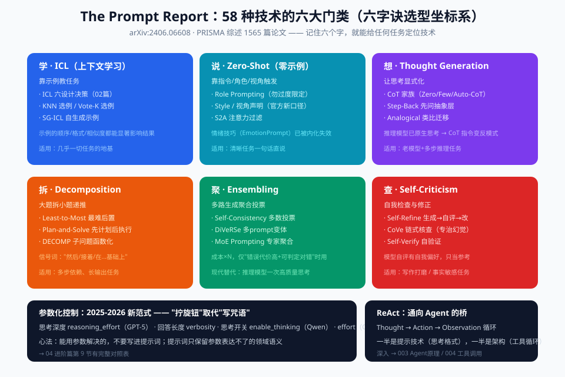

# 04 - 进阶篇：高级技术与 The Prompt Report 58 技术地图

> 【本节问题】① 58 种提示技术怎么分成六大类？② CoT 家族有哪些变体、分别在什么场景用？③ Self-Consistency / ToT / ReAct 各解决什么问题？④ 什么是 Meta-prompting？⑤ 推理模型时代，哪些技术被 API 参数取代了？

---

## 1. The Prompt Report：58 种技术的六大类（权威分类，必背框架）

《The Prompt Report》（arXiv:2406.06608，UMD + OpenAI 等，PRISMA 系统综述 1565 篇论文）把文本提示技术分为六类——**这就是你的"技术选型坐标系"**：

```text
                    提示技术六大门类
        ┌────────────┬────────────┐
   【In-Context Learning】   【Zero-Shot】
    靠示例教任务               靠指令/角色/情绪触发
    ICL 六决策 / KNN选例 /      Role / Style / S2A /
    Vote-K / SG-ICL           EmotionPrompt / 复述问题
        └────────────┬────────────┘
        ┌────────────┼────────────┬──────────────┐
   【Thought Generation】  【Decomposition】 【Ensembling】
   让思考显式化              拆解复杂问题        多路投票
   CoT家族/Step-Back/        Least-to-Most/     Self-Consistency/
   Analogical/自动CoT        Plan-and-Solve/    DiVeRSe/MoE Prompting/
                             DECOMP             多Prompt聚合
                    ┌────────────┘
              【Self-Criticism】
              自我检查与修正
              Self-Refine / Self-Verify /
              Chain-of-Verification(CoVe)
```

同一张地图的图形版（六色分区 + 参数化控制新范式 + ReAct 桥接 Agent）：



> 💡 记忆锚点：**"学（ICL）—说（Zero）—想（Thought）—拆（Decomp）—聚（Ensemble）—查（Self-Crit）"** 六字诀。05 实战不需要全用，但要知道全图。

## 2. CoT 家族（最常用，重点掌握）

| 技术 | 怎么做 | 适用 | 注意 |
|---|---|---|---|
| **Zero-shot CoT** | 加一句"让我们一步一步思考" | 通用老模型 + 推理类任务 | 推理模型上**多余**（内置思考） |
| **Few-shot CoT** | 示例里**连推理过程一起写** | 需要特定推理风格的任务 | 示例的推理质量直接决定输出质量 |
| **Auto-CoT** | 让模型自己生成多样示例的推理链 | 省人工标注 | 质量不齐，需抽查 |
| **Step-Back** | 先问抽象层问题（"这类合同通常有哪些风险维度？"）再答具体问题 | 域知识密集任务 | 两步调用，成本×2 |
| **Analogical Prompting** | "回忆相似问题的解法，再套用" | 算法/数学题 | 类比质量依赖模型知识面 |

## 3. Self-Consistency（自洽性投票）

- **一句话人话**：让模型对同一题独立作答 5~10 遍，少数服从多数。
- **类比**：五个医生独立看片会诊，取多数诊断——单次推理有随机性，投票能抵消。
- **怎么做**：temperature 调到 0.7+，同 prompt 采样 N 次，对最终答案做多数投票。
- **代价**：成本×N。只在**答案可判定对错**（数学、分类、抽取校验）且**错误代价高**时用。
- **现代替代**：推理模型一次高质量思考 ≈ 多次投票的效果，成本更低。

## 4. Decomposition（分解）：Least-to-Most 与 Plan-and-Solve

- **一句话人话**：大题拆小题，逐个击破，答案递推。
- **Least-to-Most**：先让模型把问题拆成有序子问题 → 依次求解，后一问可以用前面的答案。
- **Plan-and-Solve**：先制定完整计划再执行（Agent 规划模式的雏形 → 003 专题）。
- **适用信号**：任务里出现"然后"、"接着"、"在……基础上"（多步依赖）；或输出超长导致质量下降。

## 5. Ensembling（集成）速览

- **DiVeRSe**：多个 prompt 变体 + 多次采样 + 投票（三层随机性对冲）
- **MoE Prompting**：同一问题让多个"专家角色"分别回答再聚合
- **判断标准**：单次调用准确率 85% 时，集成到 92% 值不值 3 倍成本？——生产上通常**先用推理模型/更好的提示把单次做高**，集成为保底方案。

## 6. Self-Criticism（自我批评）：Self-Refine 与 CoVe

- **Self-Refine**：生成 → 自评 → 按自评修改，循环到满意。适合写作、代码重构类"没有唯一答案"的任务。
- **Chain-of-Verification (CoVe)**：先出草稿 → 根据草稿生成核查问题 → 逐题独立回答 → 按核查结果修订。**专治幻觉**（核查问题独立作答，避免"自我确认偏误"）。
- **坑**：模型给自己打分有"自我偏好"，自评分数只能当参考；生产上用独立模型当 judge 更可靠（→ 06 篇 LLM-as-judge）。

## 7. ReAct：推理与行动交织（通向 Agent 的桥）

```text
Thought（我想需要先查合同状态） → Action（调用工具 get_contract） 
→ Observation（工具返回：合同履行中） → Thought（下一步检查违约条款）
→ …… → Answer
```

- ReAct = Reasoning + Acting 交替（Yao et al. 2022, arXiv:2210.03629）——**Agent 的最小可行模式**。
- 它一半是提示技术（思考格式），一半是架构（工具循环）。深入见 `003-agent原理与架构` 和 `004-工具调用`。
- 提示角度的关键：给模型的思考→行动格式要有**明确的停机条件**，否则无限循环（GPT-5 官方指南专门讲"早停标准"）。

## 8. Meta-prompting：用模型优化提示词（官方工具已产品化）

- **一句话人话**：让 GPT 当你的提示词编辑。
- **做法**：把草稿提示 + 3~5 个失败案例喂给模型，要求"指出歧义、冲突、缺失约束，重写"。
- **官方产品化**：OpenAI **Prompt Optimizer**（平台内置，专查指令冲突）；Anthropic Console **Prompt Improver**（自动加 XML 结构/推理步骤/格式约束）。
- **工程节奏**：草稿 → 跑 eval → 失败案例喂 meta-prompt → 重写 → 再跑 eval。**永远别手工凭感觉迭代超过三轮**。

## 9. 参数化控制：2025-2026 的新范式（"拧旋钮"取代"写咒语"）

推理模型时代，很多行为控制从提示词迁移到了 API 参数——**这是本笔记最重要的时效性变化之一**：

| 你想控制什么 | 老办法（提示词） | 新办法（参数） | 模型 |
|---|---|---|---|
| 思考深度 | "深入分析这个问题" | `reasoning_effort: low/medium/high` | GPT-5 系 |
| 回答长短 | "简明扼要/详细展开" | `verbosity: low/medium/high`（可被提示按段落覆盖） | GPT-5 系 |
| 思考预算 | —— | `effort` 参数（默认 high）、自适应思考 | Claude Sonnet 4.6+/Sonnet 5 |
| 推理开关 | "一步步思考" | `enable_thinking: true/false` | Qwen3 系 |
| 采样随机性 | —— | temperature/top_p 在新 Claude 上**禁用**（400） | Claude 4.6+ |
| 推理上下文保持 | 把历史全量重发 | Responses API `previous_response_id`（τ-bench 零售 73.9%→78.2%） | OpenAI |

**选型心法**：能用参数解决的，不要写进提示词；提示词只保留参数表达不了的领域语义（业务规则、字段口径、风险判断）。

## 10. 技术选型决策树（贴在工位上）

```text
任务有唯一正确答案吗？
├─ 有（数学/抽取/分类）
│   ├─ 错误代价高？→ 推理模型 + Self-Consistency 兜底
│   └─ 错误代价低？→ 通用模型 + 结构化输出 + few-shot
└─ 没有（写作/头脑风暴）
    ├─ 需要长文/多步？→ Plan-and-Solve / Prompt Chaining
    └─ 单轮短文？→ 直接生成，温度调高，Self-Refine 一轮
多步依赖 / 需要外部信息？
└─ 是 → ReAct / Prompt Chaining（进入 Agent 世界 → 003/004）
```

---

## 【本节自测】

1. 六大门类是什么？各自解决什么问题？用六字诀默写。
2. Zero-shot CoT 在推理模型上为什么多余？Step-Back 适合什么任务？
3. Self-Consistency 的启用条件和成本陷阱？现代有什么低成本替代？
4. CoVe 为什么能专治幻觉？它和让模型"自己检查一遍"的本质区别？
5. ReAct 的 Thought→Action→Observation 循环里，提示工程要额外设计什么？（提示：停机条件）
6. Meta-prompting 的标准工作节奏是什么？为什么不能纯手工迭代？
7. 列出至少 3 个"从提示词迁移到 API 参数"的行为控制，并说出对应模型。
8. 用决策树走一遍：贸易合同要素抽取（错误代价高）该选什么组合？
