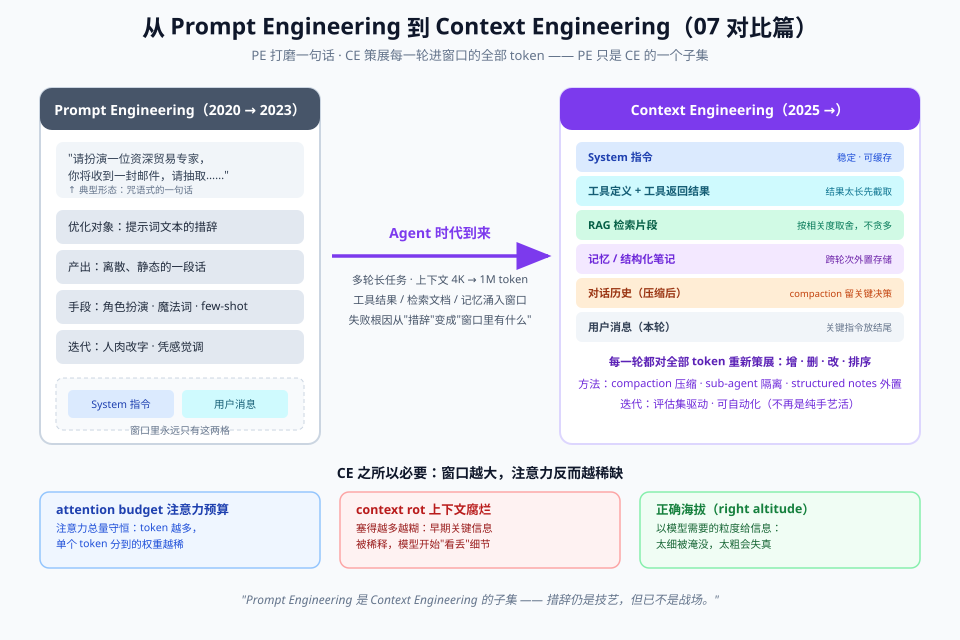

# 07 - 对比篇：各家模型提示风格差异 & 从 PE 到 CE 的趋势

> 【本节问题】① GPT-5 / Claude / Gemini / DeepSeek / Qwen 的提示词格式偏好差在哪？② OpenAI 和 Anthropic 官方指南的哲学分歧是什么？③ 通用 vs 推理模型的提示策略完整对照？④ "prompt engineering 已死"的争论真相？⑤ 中文提示有什么特殊考量？

---

## 1. 各家模型格式差异速查表（2026-09，写提示词前先对表）

| 维度 | OpenAI（GPT-5 系） | Anthropic（Claude 4.6+/Sonnet 5） | Google（Gemini） | DeepSeek | Qwen | Meta（Llama 4） |
|---|---|---|---|---|---|---|
| **结构偏好** | 扁平标签段落（Role/Goal/Constraints/Output…），无包装语法 | XML 标签块（复杂 prompt 时）；简单标题也可 | XML 或 Markdown 标题，**单 prompt 内必须一致** | 未官方文档化（有 Prompt Library 范例库） | 未文档化；注意 chat template 与 `enable_thinking` | 特殊 token chat template |
| **system 消息** | messages 里 `role:"system"` | **独立 `system` 参数**（放 messages 会被降级折叠） | messages 里 system | 同 OpenAI 格式 | 同 OpenAI 格式 | 视 chat template |
| **采样参数** | temperature 可用 | **4.6+ 禁用**（非默认值 400） | 可用但有官方反模式警告 | 可用 | 可用 | 可用 |
| **思考控制** | `reasoning_effort` | `effort`（默认 high）+ 自适应思考 | thinking budget | v4-flash / v4-pro 两型号 | `enable_thinking: true/false` | —— |
| **回答长度** | `verbosity` 参数（可被提示按场景覆盖） | max_tokens + 提示 | 提示控制 | 提示控制 | 提示控制 | 提示控制 |
| **prefill** | 可用（有限场景） | **已废弃（4.6+ 400）** | —— | beta 端口可用 | —— | —— |
| **长上下文放置** | 重要指令可重复 | 文档在前问题在后 | **官方明确要求 query last** | —— | —— | 格式指令放模型"必看"处 |

**跨模型迁移口诀**：内容（Role/Task/Context/Constraints/Format）不变，**变的是包装**——写好一份扁平标签版，按目标模型重包一层即可。真正会 break 的是四件机械事：system 层位置、prefill、采样参数、chat template。

## 2. OpenAI vs Anthropic 官方指南哲学对比（理解两派思路）

| 议题 | OpenAI（GPT-5 指南） | Anthropic（文档 + context engineering 文章） |
|---|---|---|
| 核心隐喻 | **参数化控制**：行为尽量用 reasoning_effort / verbosity 拧旋钮 | **海拔论**：提示要写在"具体到能指导行为，抽象到不脆弱"的区间 |
| 结构主张 | 扁平标签段落，明确警告**指令冲突**（矛盾指令会被点出/拒绝） | 复杂 prompt 用 XML 标签；但 2026 年口径已放宽：现代模型不强依赖 XML |
| 角色提示 | 鼓励精确角色（System = Role + Context） | **已降温**：不过度限定角色，"你是一个可靠助手" 优于 "永不犯错的全球顶级专家"；常直接给视角而非人设 |
| Agentic 控制 | eagerness 谱系：早停标准、工具调用预算、safe/unsafe 动作分级、tool preambles | 长任务三招：compaction / structured notes / sub-agent（→ 008 专题） |
| 配套工具 | Prompt Optimizer（查冲突） | Prompt Improver（Console 内重构提示） |
| 独特贡献 | `previous_response_id` 保留推理上下文（跨工具调用提分） | attention budget / context rot 概念化；引文接地示范 |

> 💡 两派共同的底层主张（这是不变的）：**具体、无冲突、给示例、约束输出格式、先测量再迭代**。

## 3. 通用模型 vs 推理模型：完整对照（最容易踩的坑）

| 提示要素 | 通用模型（GPT-4o / DeepSeek-V3形态 / Qwen非思考态） | 推理模型（GPT-5 / R1形态 / Claude thinking / o 系） |
|---|---|---|
| 指令风格 | 结构化 + 显式步骤（"第一步…第二步…"） | **只给目标+约束+验收标准**，别教过程 |
| CoT | 要写（或示例里带推理） | **不写**（内置思考，外部 CoT 指令添乱） |
| few-shot | 强烈推荐 2~5 个 | 通常不需要；示例可能把推理路径带偏 |
| "think step by step" | 有效 | 反模式 |
| 角色/情绪技巧 | 可能有增益 | 基本无效（对齐训练已内化） |
| 成本画像 | 便宜快 | 思考 token 计费，贵 3-10 倍、慢 |
| 典型任务分配 | 格式转换、简单抽取、分类 | 多步推理、复杂审查、Agent 主控 |

**Qwen3 特有**：`enable_thinking` 是运行时开关，同一模型两种形态——提示策略要跟着开关切换。

## 4. "prompt engineering 已死"争论的真相

**双方论点整理（2024-2026 社区争论）**：

- **"已死"派**：① 技巧被训练内化（情绪勒索等已失效）；② 推理模型让你只说目标；③ 官方自己都在转向 context engineering（Anthropic 2025-09 发文、Karpathy 等人推 CE 术语）
- **"没死"派**：① 生产系统对**稳定性、可评估、可迁移**的要求反而更高了（06 篇整套东西是刚需）；② 模型差异管理（07 篇表格）更复杂了；③ "说话技巧"死了，"工程学科"诞生了

**本笔记的裁定**：prompt engineering 作为**话术**在贬值，作为**工程学科**在增值。真正死掉的是"背 50 条魔法咒语"这个职业想象；活下来并更值钱的是：评估、版本、安全、成本、跨模型迁移——也就是你在这套笔记里学的东西。

PE→CE 的演进全景（含 attention budget / context rot / 正确海拔三个底层概念）：

## 5. 中文提示的特殊考量

| 议题 | 说明 |
|---|---|
| token 效率 | 中文按字/词切 token，1 汉字 ≈ 0.6~1 token；同义压缩可省 20-30% 成本 |
| 混合提示 | 指令用中文 + 字段名/枚举值用英文是常见工程实践（JSON key 用英文更稳） |
| 标点陷阱 | 全角引号""混进 JSON 导致解析失败；提示词里明示半角 |
| 术语接地 | 业务术语表必须给（升贴水/点价/移库这类行话，通用模型理解不稳） |
| 国产模型 | DeepSeek/Qwen 对中文业务语境更顺；但格式未官方文档化，**更要靠自己的评估集锁定行为** |

## 6. 提示工具生态速览

| 工具 | 归属 | 用途 |
|---|---|---|
| Prompt Optimizer | OpenAI 平台内置 | 检测指令冲突、优化 GPT-5 提示 |
| Prompt Improver | Anthropic Console | 自动重构：加结构/推理步骤/格式约束 |
| Prompt Library | DeepSeek 官方 | 中文任务范例库（学习模板结构的好材料） |
| Promptfoo / LangSmith / PromptLayer | 第三方 | 评估、回归、版本、观测（→ 06 篇） |
| instructor / outlines / Pydantic AI | 开源库 | 结构化输出的类型化封装 |
| Learn Prompting（Prompt Report 团队） | 教育站 | 系统教程，与本笔记 04 篇互为索引 |

---

## 【本节自测】

1. 五家模型的结构偏好分别是什么？跨模型迁移时"不变的是什么、break 的是什么"？
2. Anthropic 的新口径下，什么时候才需要 XML 标签？角色提示为什么被建议"降温"？
3. 对推理模型写提示的三条禁忌是什么？
4. 复述"已死 vs 没死"双方论点，并给出你自己的裁定（用自己的话）。
5. 中文提示的三个特有坑？
6. 你的 CTRM 场景如果同时用 DeepSeek-V4（便宜）+ GPT-5（疑难），路由策略怎么设计？（综合题，联系 06 篇模型分级）
