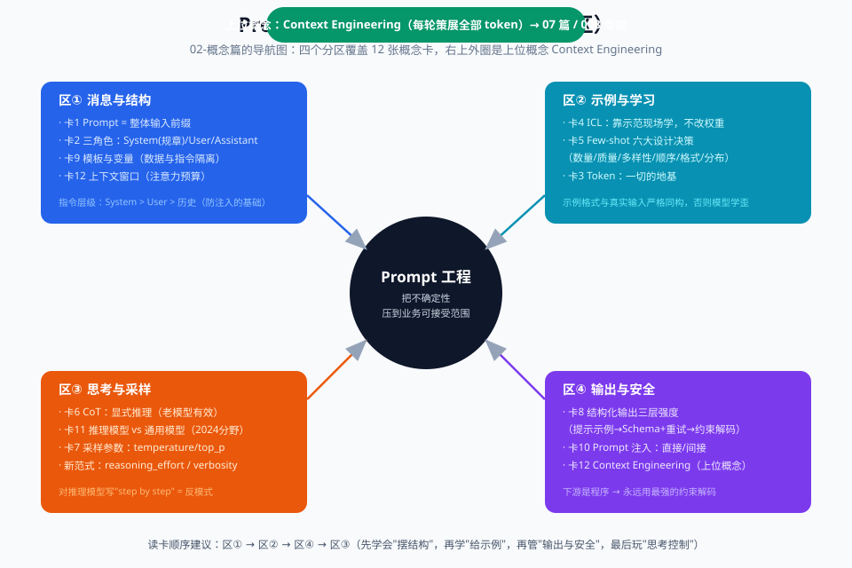

# techniques - 提示技术体系：学习路线图

> 主案例不是某个产品，而是**你自己的提示词从"聊天废话"进化到"生产级工程品"的全过程**。

## 概念地图（先看图再进章节）

```text
                    ┌─────────────────────────────────────┐
                    │      提示词 = 给模型的工作说明书        │
                    └─────────────────────────────────────┘
                                   │
        ┌──────────────┬───────────┼───────────────┬──────────────┐
        ▼              ▼           ▼               ▼              ▼
   【写什么】      【怎么写】    【怎么控思考】    【怎么控输出】   【怎么保住质量】
   01 问题篇      02 概念篇     04 进阶篇        02+05         06 生产篇
   为什么要工程化  12 个概念卡    58 技术地图      结构化输出     评估/版本/安全
   痛点+数字      角色/示例/CoT  CoT家族/投票/树  JSON Schema   注入防御/迁移
                   03 原理篇        ▲
                   为什么有效        │
                   ICL 假说      07 对比篇
                   解剖学六件套   各家模型差异
                                推理 vs 通用
```

概念的图形版（彩色分区更直观，与上图对照着看）：



## 章节路由（按需取用）

| 你现在的状态 | 直接读 |
|---|---|
| "提示词不就是打字聊天吗？" | 01-问题篇 |
| "角色、few-shot、CoT 这些词到底什么意思" | 02-概念篇 |
| "为什么加个示例模型就学会了？底层发生了什么" | 03-原理篇 |
| "我要系统掌握全部技术分类" | 04-进阶篇 |
| "我要立刻写出能上生产的提示词（带代码）" | 05-实战篇 |
| "提示词上线后怎么评估、防注入、应对模型升级" | 06-生产篇 |
| "GPT-5 / Claude / DeepSeek 提示词写法有什么不同" | 07-对比篇 |
| "测一测我到底学会了没" | 08-自测篇 |

## 本专题的三个贯穿原则

1. **提示词是代码**：要版本管理、要测试、要评审——不是聊天记录。
2. **技巧有半衰期，原理不过期**：记不清技巧时，回到 03-原理篇用第一性原理推导。
3. **先测量再优化**：没有 eval 的提示词优化 = 闭眼调参（06-生产篇）。
