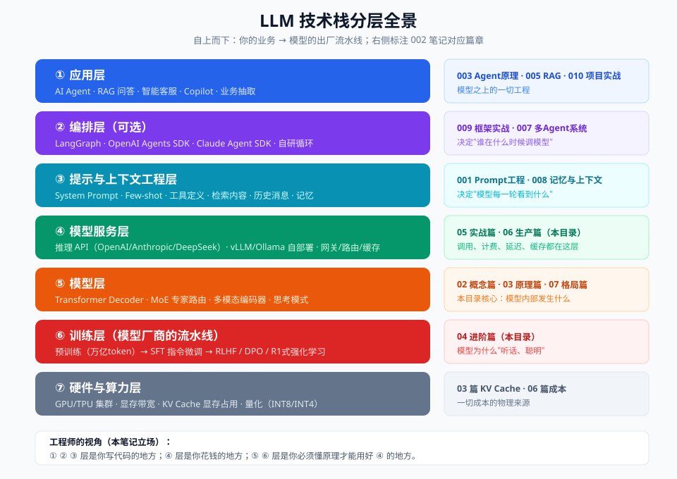

# 00 - 背景篇：从语言模型到 LLM 时代

> 【本节问题】① "语言模型"到底在建模什么？② 从 RNN 到 Transformer 发生了什么质变？③ BERT 和 GPT 的路线之争为什么 GPT 赢了？④ 从 2017 到 2026，哪些关键节点塑造了今天的格局？



## 1. 为什么要学前史？（Why 补充课）

**一句话人话**：LLM 不是凭空出现的魔法，是一条 40 年的进化链。知道每个环节解决了什么问题，你才能理解今天每个"习以为常"的设计（token、注意力、对话格式）为什么长这样。

**生活类比**：用 Vue 的人不需要读过源码，但要懂"响应式"思想——不懂的人永远写不出正确的心智模型。LLM 同理，你要懂的核心思想是：**预测下一个 token**。

## 2. 语言模型在建模什么（一个公式讲完）

语言模型的本质任务：**给定前文，计算下一个词的概率分布**。

```text
P(下一个词 | 前文)  ——  "点价数量是 ___" → "500"(概率0.62) "三"(0.05) "很"(0.03) ...
```

把这句话学会，奇迹就会涌现：语法（接得通顺）、事实（接得正确）、推理（多步接龙=思考）。**所有惊人的能力，都是"预测下一个词"这件事练到极致后的副产品**——这是理解 LLM 最重要的一个认知。

## 3. 四代技术演进（谁解决了谁的死穴）

| 代际 | 代表 | 怎么建概率 | 死穴 |
|---|---|---|---|
| **统计语言模型**（1990s） | N-gram | 数前 2~3 个词的共现频率 | 只看近处，上下文窗口≈3 个词 |
| **神经网络语言模型**（2003-2017） | word2vec、RNN/LSTM | 词变向量，RNN 逐词读、传隐藏状态 | 长序列信息衰减（记不住开头）；串行计算慢 |
| **Transformer**（2017） | 《Attention Is All You Need》 | **自注意力：任意两个位置直连**，并行计算 | （没有致命死穴，但有算力开销 n²） |
| **LLM 时代**（2018-今） | GPT/BERT→GPT-5/Claude/Gemini/DeepSeek | Transformer + 海量数据 + 疯狂堆规模 | 对齐、幻觉、成本（当前战场） |

**RNN → Transformer 的质变（费曼版）**：RNN 像传话游戏——第 1 个人的话传到第 100 个人嘴里早变了样；Transformer 像**开会**——每个人（token）都能直接看到并"注视"在场的所有人，谁重要看谁，信息不衰减，而且所有人同时发言（GPU 并行，训练速度起飞）。

## 4. 2018 年的分岔口：BERT 路线 vs GPT 路线

| | BERT（2018-10） | GPT（2018-06 起） |
|---|---|---|
| 结构 | Transformer **Encoder**（双向） | Transformer **Decoder**（单向） |
| 训练目标 | 完形填空（遮住中间猜） | 接龙（看前文猜下一个） |
| 天赋 | 理解（分类、匹配、抽取） | 生成（续写、对话） |
| 使用方式 | 微调后用 | **Zero/few-shot 直接提示**（GPT-3 2020 证明） |
| 结局 | 统治 NLP 竞赛 3 年，随微调范式一起退场 | 长成今天的 LLM 全部主流 |

**胜负手**：GPT 路线"一个模型 + 自然语言指挥"的通用性碾压了"一个任务微调一个模型"的效率。2017 论文里的完整 Encoder-Decoder（翻译架构），今天只剩 Decoder 独大——但 Encoder 的技术遗产（embedding、注意力）活在 RAG 检索模型里（005 专题）。

## 5. LLM 时代大年表（2017-2026 关键节点）

```text
2017  Transformer 论文（Google）          ── 架构地基
2018  GPT-1 / BERT                       ── 路线分岔
2020  GPT-3：175B，发现 ICL              ── "提示"成为方法论（→001 专题）
2022  InstructGPT（RLHF）+ CoT 论文       ── 会听话 + 会推理
2022.11 ChatGPT 发布（5 天百万用户）      ── 走入大众
2023  Llama 开源 → 开源社区爆发            ── 权力下放
2023  GPT-4 / Claude 2：100k 上下文       ── 长上下文竞赛开始
2024  o1 发布：推理时思考（test-time compute）── 第二缩放定律：思考越多越聪明
2024.12 DeepSeek-V3（MoE 671B/37B）      ── 开源追平闭源的开端
2025.01 DeepSeek-R1 开源推理模型          ── R1式RL训练范式公开
2025  MoE 全面主流；1M 上下文逐步标配       ── 效率竞赛
2026  GPT-6 Astra / Claude Opus 5 / Gemini 3.1
      1M 上下文成旗舰标配；思考 token 计费成常态；Agent 专用优化
```

## 6. 2026 年格局的三个结构性事实（07 篇展开）

1. **MoE 成为绝对主流**：从 DeepSeek 到 GPT-5.6 系，"总参数巨大、每 token 只激活一小部分"是同时做大容量和低成本的唯一解。看懂"总参/激活参"（如 1.6T/49B）是读懂 2026 模型新闻的基本功。
2. **上下文战争进入"质量"阶段**：1M token 是旗舰标配（table stakes），比拼的是**满窗口的召回质量**（context rot 的对抗）与长上下文计费策略。
3. **思考 token 成为产品维度**：推理模型把"算力换智能"做成可调参数（reasoning_effort/effort/thinking budget），并按输出计费——它既是能力来源也是成本大头。

---

## 【本节自测】

1. 用一个公式说清语言模型在建模什么？为什么说"惊人能力是副产品"？
2. RNN 和 Transformer 的核心区别，用"传话游戏 vs 开会"的类比展开讲。
3. BERT 和 GPT 训练目标的差别？GPT 路线胜出的关键是什么？
4. 2022 年的两篇关键工作（InstructGPT/CoT）分别解决了什么问题？
5. o1（2024）开创的"第二缩放定律"和之前堆参数的缩放有什么本质不同？
6. MoE 的"总参/激活参"是什么意思？为什么 2026 年全是 MoE？
7. 看图复述：技术栈七层里，哪几层是你写代码的、哪层是花钱的、哪层要懂原理？
