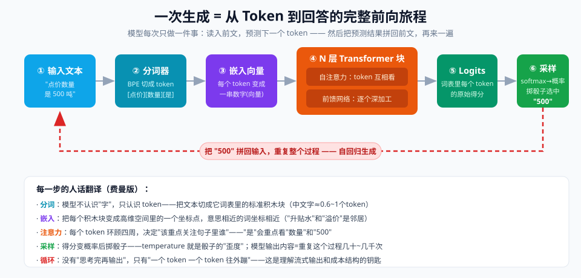
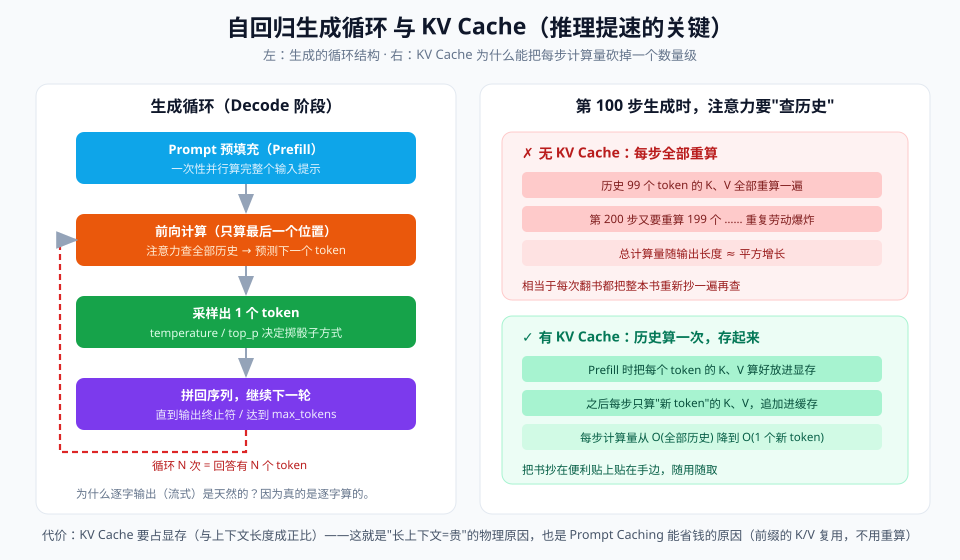

# 03 - 原理篇：从 Token 到回答的完整旅程

> 【本节问题】① 一次前向计算内部分几步？② Q/K/V 到底在算什么（不用数学）？③ 一句"500"是怎么被采样出来的？④ 推理速度瓶颈在 Prefill 还是 Decode？



> 目标：读完能**凭记忆画出**下面这张流程图，并向同事讲清每一步。数学公式已刻意降到最低。

---

## 1. 全景：六站流水线

```text
输入文本 → ① 分词 → ② 嵌入 → ③ N×Transformer块 → ④ 输出头(logits) → ⑤ softmax → ⑥ 采样
                    （③ 内部：注意力(互相看) + 前馈网络(深加工)，循环 N 次）
```

一次 API 调用 = 把这六站跑一遍，输出**一个** token；然后第六站的产出拼回输入，再跑一遍……直到吐出终止符。

## 2. 逐站拆解（每站：发生什么 + 为什么需要它）

### ① 分词（Tokenization）

- 字节级 BPE：高频字符组合合并成词表条目。`"点价数量是500吨"` → `[点价][数量][是][500][吨]`（示意）
- **为什么要它**：模型输出层是固定大小的概率表（词表），必须把无穷文本映射到有限积木。

### ② 嵌入（Embedding）+ 位置信息

- 查表：每个 token 映射为一个向量（如 4096 维）；再叠加**位置编码**（主流 RoPE 旋转位置编码）告诉模型"它在第几位"
- **为什么要位置**：注意力本身"天生无序"（集合视角），没有位置信息"猫追狗"和"狗追猫"就没区别

### ③ Transformer 块 ×N（核心车间）

每层块做两件事，结果残差连接累加：

**a. 自注意力（互相看）**

```text
每个 token 派出三个分身：
  Q（Query，我要找什么）
  K（Key，我是什么标签）
  V（Value，我携带的信息）

配对过程（费曼版）：
  我用我的 Q 去和所有 token 的 K "对暗号" → 对上了（点积大）= 你重要
  → 按重要度加权接收大家的 V → 得到"看完全句后的我"
```

- 多头：几十组 Q/K/V 并行（有的头盯语法、有的盯指代、有的盯数字）
- GQA（分组查询注意力）：KV 分身共用，显存大降——2026 标配

**b. 前馈网络 FFN（深加工）**

- 两层 MLP 把"看完全句的我"再深度变换，参数量占大头（专家知识存这里，MoE 的"专家"就是多套 FFN）

### ④⑤ 输出头（Logits → 概率）

- 最后位置的向量 × 词表矩阵 → 每个词表 token 的原始得分（logits）
- softmax + 温度：`概率 ∝ e^(logit/T)`——T 越小分布越尖（确定），T 越大越平（发散）

### ⑥ 采样

- temperature=0：直接取最大（贪心）
- top_p=0.9：按概率从高到低累计到 0.9 的候选池里抽
- 采到 `500` → 拼回输入 → 回到 ①，直到终止符

## 3. 自回归循环与 KV Cache（性能的钥匙）



```python
# 伪代码：把整个旅程压缩成 15 行
def generate(prompt, max_new_tokens):
    tokens = tokenize(prompt)
    kv_cache = []                                # Key/Value 索引卡盒
    kv_cache = prefill(tokens, kv_cache)          # Prefill：并行吃下全部输入，建好所有卡

    out = []
    for _ in range(max_new_tokens):               # Decode：逐 token 循环
        logits = forward(last_token, kv_cache)    # 只算新 token（旧 token 查卡即可）
        prob   = softmax(logits / temperature)    # 温度调骰子
        new_tok = sample(prob, top_p)             # 掷骰子
        if new_tok == EOS: break                  # 终止符
        out.append(new_tok)
        kv_cache.append(kv_of(new_tok))           # 新卡入盒
    return detokenize(out)
```

**两阶段延迟结构（排障必备）**：

| 阶段 | 在干什么 | 瓶颈 | 对应体感 |
|---|---|---|---|
| **Prefill** | 并行处理输入 prompt | 算力（大 prompt 一次算完） | **首字延迟 TTFT**——发 100k 文档后"卡住不动"就是在 prefill |
| **Decode** | 逐 token 生成 | **显存带宽**（每步读全部 KV cache） | 每秒输出 token 数（吞吐） |

## 4. 为什么这套设计能并行训练（Transformer 的第二天赋）

- 训练时所有位置的目标都已知 → **一次算出全部位置的预测损失**（不需要像 RNN 那样串行）
- GPU 万卡并行的前提 → 才有"堆万亿 token 预训练"的可行性
- 这就是 2017 论文标题的野心：*Attention Is All You Need*——只要注意力（可并行），不要循环（慢）

## 5. 读懂 API 行为的四个推论（原理的直接变现）

1. **长 prompt → 首 token 慢**：prefill 要算完全部输入（也解释了 prompt caching 为什么有效——prefill 跳过）
2. **输出 token 贵且慢**：逐 token 串行生成，每个都要过全部 N 层
3. **多轮对话成本线性涨**：历史拼回输入重新 prefill（除非缓存命中），每轮都是全量再算
4. **max_tokens 截断是硬停止**：循环到上限即停，不管话说完没有——所以 `finish_reason: length` 不是异常是机制

---

## 【本节自测】

1. 凭记忆画六站流水线，标注哪两站在 Transformer 块内循环。
2. Q/K/V 各自的角色？用"对暗号"语言向同事解释注意力配对。
3. RoPE 解决什么问题？没有位置信息的 attention 会犯什么错？
4. temperature 在 softmax 里的作用位置？温度趋近 0 时分布怎么变？
5. TTFT 由哪个阶段决定？长文档场景"卡住"在干什么？
6. KV cache 为什么省算力？为什么它又反过来把瓶颈推向"显存带宽"？
7. 四个 API 行为推论，分别对应原理里的哪一站？
8. （动手）用任一家 playground 的 tokenizer 把"客商合同额度批量导入"切分，数一数几个 token。
