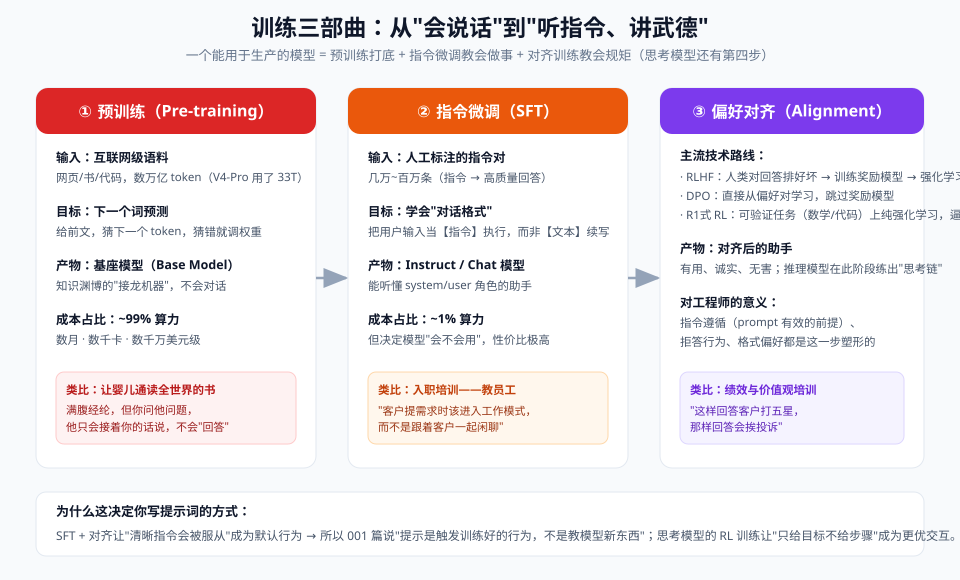

# 04 - 进阶篇：训练三部曲与对齐

> 【本节问题】① 三部曲各自的数据/目标/产物？② RLHF 的完整流程？③ R1 式强化学习为什么能"练出思考"？④ 缩放定律说了什么、涌现能力是真是假？⑤ 蒸馏是什么、为什么推理模型都能出小杯？



> 立场声明：你不是训练工程师，但**训练方式决定模型行为**——读懂本章，你就能解释"为什么不同模型脾气不同"、"为什么思考模型不能手把手教"。

---

## 1. 第一部曲：预训练（Pre-training）

| 维度 | 内容 |
|---|---|
| 数据 | 互联网级语料：网页/书籍/代码/论文。量级：**数万亿 token**（DeepSeek V4-Pro 官方披露 33T） |
| 目标 | 下一词预测（next token prediction），全数据一遍遍扫 |
| 算力 | 数千~数万卡 × 数月；成本千万~亿美元级。**占全流程 ~99% 算力** |
| 产物 | **基座模型（Base）**：知识渊博的接龙机，不会对话 |
| 关键技术 | 缩放定律（下节）、数据清洗与配比（代码数据占比直接影响推理能力）、MoE 架构（容量↑ 单token成本↓）、Muon 等新优化器（DeepSeek V4 披露） |

**缩放定律（Scaling Laws）——LLM 时代的摩尔定律**：

- Kaplan 2020：模型越大、数据越多、算力越足，损失（预测误差）可预测地下降 → "大力出奇迹"有了理论依据
- Chinchilla 修正（2022）：**参数与数据要同比放大**——给定算力，70B 模型喂 1.4T token 优于 280B 喂 0.35T → 后来的模型都"吃得更多"
- 2024 后的第二曲线：**推理时计算缩放**（test-time compute）——o1 证明"让模型多思考"也能换智能，思考 token 是新的可缩放维度

## 2. 第二部曲：SFT（监督微调）

| 维度 | 内容 |
|---|---|
| 数据 | 人工/模型辅助写的**指令-回答对**，几万~百万条，质量>>数量 |
| 目标 | 学会对话格式：把用户输入当**指令**执行，而非文本续写 |
| 算力 | 预训练的 1% 以下 |
| 产物 | Instruct/Chat 模型：认识 system/user/assistant 角色 |

**为什么工程师在乎 SFT**：你写的 system prompt 之所以有"特权地位"，是因为 SFT 训练数据里 system 角色的指令被示范为"必须遵守"。**指令遵循是训出来的行为模式**（呼应 001 篇"提示是触发不是教学"）。

## 3. 第三部曲：对齐（Alignment）

### 3.1 RLHF（InstructGPT/ChatGPT 的经典配方）

```text
① 人类标注员对模型的多个回答排序（哪个更有用/诚实/无害）
② 用排序数据训练一个"奖励模型"（RM）——学会给回答打分
③ 用 PPO 强化学习优化主模型：最大化 RM 给分，同时 KL 约束别跑太远
```

- **效果**：1.3B 的 InstructGPT 在人类偏好上赢了 175B 的 GPT-3——"对齐税"花得值
- **副作用**：可能变谄媚（sycophancy，迎合用户）、拒答过敏——你遇到的部分"模型脾气"来自这里

### 3.2 DPO（直接偏好优化）

- 简化路线：跳过奖励模型，直接从"偏好对（好答案，坏答案）"学习
- 更稳更省，成为开源模型对齐主流之一

### 3.3 R1 式 RL：可验证奖励强化学习（2025 范式转折）

```text
场景：数学题/代码题——答案可以程序化判定对错（可验证奖励）
做法：不给标准解题步骤，只给题目和"对/错"信号，让模型自己探索
      → 答对给奖励，答错不给 → 模型自发学会"先写长思考再作答"
产物：思考链（reasoning）不是模板教出来的，是 RL 涌现的行为
```

- DeepSeek-R1（2025.01）公开了这条路线，触发了 2025-2026 全行业推理模型竞赛
- **对提示工程的直接影响**（001 篇呼应）：思考是内生行为 → "step by step" 指令多余甚至有害 → 控制思考用参数（effort/thinking budget）

## 4. 涌现能力：真是奇迹还是幻觉？

| 观点 | 内容 |
|---|---|
| 涌现派（Wei et al. 2022） | 规模跨过某阈值，多步推理等能力"突然出现" |
| 度量派（Schaeffer et al. 2023） | 部分涌现是**指标假象**：用"完全答对才算分"的不连续指标，平滑进步也会表现为"突然跳变"；换连续指标后曲线是平滑的 |
| 工程结论 | 能力随规模**渐进提升**，但"能否跨过你的任务阈值"确实是断崖的——选型时用你自己的 eval 实测，别迷信排行榜（07 篇） |

## 5. 蒸馏（Distillation）：把大模型的思考装进小模型

- **一句话人话**：让小模型抄大模型的作业——用大模型生成海量"题目+优质回答（含思考链）"，拿去 SFT 小模型
- 证据：DeepSeek-R1 发布时同步放出 1.5B~70B 蒸馏版，小杯也能推理
- 工程意义：① 端侧/本地部署小模型（Qwen3.6-27B 单卡）能获得远超同体积原生模型的能力；② 你的业务可以用大模型造数据、小模型降本（06 篇成本路由的高级玩法）

## 6. 一张表收束：训练方式 ↔ 你看到的行为

| 训练阶段 | 决定了什么行为 | 对应你的工作 |
|---|---|---|
| 预训练 | 知识面、语言能力、代码能力 | 选模型的"底子"（07 篇） |
| SFT | 对话格式、指令遵循、角色认知 | system prompt 为什么有效 |
| RLHF/DPO | 语气、拒答边界、谄媚倾向 | 输出风格差异、过敏感拒 |
| R1式RL | 思考行为、难题攻坚 | 推理模型的交互方式与成本 |

---

## 【本节自测】

1. 三部曲的数据、目标、产物、算力占比各是什么？
2. 缩放定律和 Chinchilla 修正各说了什么？第二缩放定律"缩放"的是什么？
3. RLHF 三步流程？DPO 简化了什么？
4. R1 式 RL 为什么必须依赖"可验证奖励"？什么任务适合、什么任务不适合？
5. "涌现能力"争论的双方论点？对你的选型行为有什么实际影响？
6. 蒸馏的原理和工程价值？R1 蒸馏版说明了什么？
7. 用"训练方式↔行为"表，解释你遇到过的某一个模型"怪脾气"。
