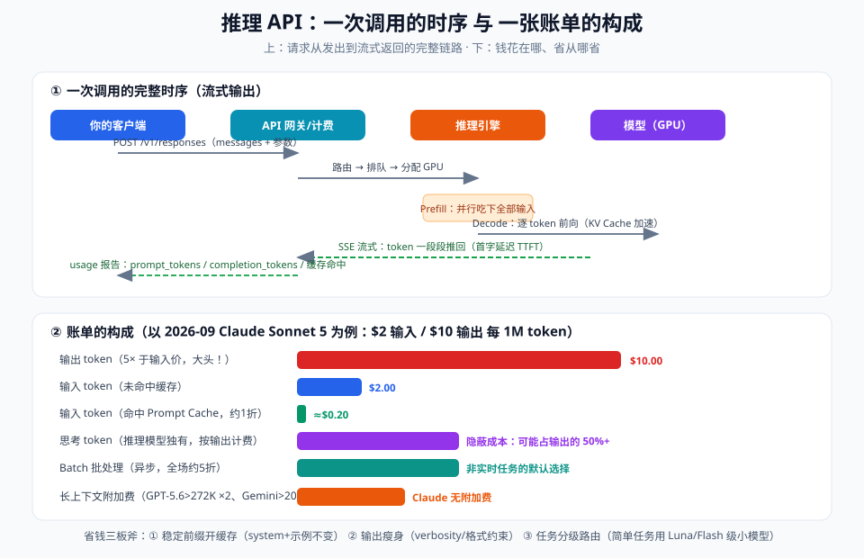

# 06 - 生产篇：成本、延迟、质量三角

> 【本节问题】① 一张 LLM 账单由几部分构成、哪部分最肥？② 缓存/batch/路由各自能省多少？③ 延迟优化的抓手？④ 模型退役怎么办（真实案例）？⑤ 怎么防止"月底账单吓一跳"？



---

## 1. 账单解剖学（2026-09 实价）

| 计费项 | 说明 | 量级关系（以主流价为参照） |
|---|---|---|
| 输入 token | prompt 全部内容 | 基准价（$0.2~$10 /1M） |
| 输出 token | 回答 + **思考 token** | **输入的 4~6 倍**——最肥的一块 |
| 缓存命中输入 | 相同前缀复用 KV | 输入价的 **0.1~0.2 倍** |
| 长上下文附加费 | GPT-5.6 >272K ×2；Gemini >200K 翻倍；Claude 无附加 | 容易被忽略的暗坑 |
| batch 异步 | 全场约 5 折 | 非实时任务的默认选择 |

**成本公式**：

```text
单次成本 = 输入token × 输入单价 × (1-缓存折扣×命中率) + 输出token(含思考) × 输出单价 × (1-batch折扣)
```

**Agent 场景警报**：多轮工具循环中，历史每轮重新计输入费——一个 50 轮的 Agent 会话，**重复前缀的浪费可达总成本的 60%+**。三个对策：稳定前缀缓存化、历史裁剪（008 专题）、`previous_response_id` 类会话复用（OpenAI Responses API）。

## 2. 省钱抓手（按 ROI 排序，可直接执行）

| 抓手 | 做法 | 预期收益 |
|---|---|---|
| ① 模型分级路由 | 简单任务（分类/抽取/改写）→ Luna/Flash/Haiku 级；疑难 → 旗舰 | 综合 **-60%~-90%** |
| ② Prompt Caching | 稳定内容（system+术语表+few-shot）固定在 prompt 开头；可变内容放后 | 重复调用场景 **-50%~-80%** 输入成本 |
| ③ 输出瘦身 | verbosity=low / 格式约束 / "只输出 JSON 不要解释" | 输出是输入 5 倍价，砍输出=砍大头 |
| ④ 思考预算控制 | 简单任务 effort=low / 关闭 thinking（Qwen enable_thinking=false） | 推理模型场景常常 **-50%+** |
| ⑤ batch 化 | 非实时任务走 batch 端口 | -50% |
| ⑥ 历史裁剪 | 多轮会话滚动摘要、工具结果不全文回流 | Agent 场景 -40%+ |
| ⑦ 本地小模型兜底 | 高频简单任务本地化（Qwen3.6-27B / Mistral Small 4） | 边际成本≈电费 |

**反模式警告**：为省钱把旗舰任务塞给小模型 → 返工率上升 → "每次调用便宜了 80%，总成本反升 30%"。**口径永远是：每次成功任务的成本，不是每次调用的成本**。

## 3. 延迟优化（体验工程）

| 手段 | 原理（03 篇呼应） |
|---|---|
| 流式输出 | 把总延迟切成首字延迟，体感大幅改善 |
| 缩短 prompt | prefill 时间 ∝ 输入长度（TTFT 的大头） |
| 降低思考深度 | effort=low：思考 token 少，首字和总时长双降 |
| 并行调用 | 无依赖的多路请求同时发（注意限流） |
| 就近部署 | 国内业务选 DeepSeek/Qwen/阿里云百炼，跨境延迟差可观 |
| 投机解码 | 本地 vLLM 场景的小模型草稿+大模型验证（了解即可） |

**预算参考（Sonnet 5 级）**：TTFT 1~3s（1k prompt）/ 5~15s（100k prompt）；吞吐 50~100 token/s。超预期先查：prompt 是否过长、是否误用高 effort。

## 4. 质量守护：不要只看"感觉变好了"

- **固定评测集**：50~200 条真实业务样本 + 判定规则（呼应 001 篇 eval），每次换模型/换参数全量跑
- **A/B 灰度**：新旧配置各 5% 流量，比"成功任务成本+人工复核率"两个指标
- **监控面板最小集**：调用量、token 用量（输入/输出/思考/缓存命中四分开）、P95 延迟、错误率、每千次调用成本
- **漂移告警**：成本或复核率周环比 >20% 即排查（常见：厂商静默调价/升级、上游数据格式变化）

## 5. 模型退役：真实案例与迁移清单

2026-06-15：**Claude Sonnet 4 / Opus 4 全线退役，调用直接报错，无自动 failover**。这不是孤例——OpenAI/Google 同样常态化下架旧模型。

**迁移 Checklist**：

```text
□ 订阅厂商 deprecation 公告（邮件/更新日志）
□ 代码里模型名集中管理（配置/网关），全仓搜硬编码
□ 读迁移指南：prefill 废弃、采样参数禁用、thinking 配置变更、JSON 转义差异
□ 全量 eval 跑新旧对比（看分布不只看均值）
□ 灰度 5% → 观察 badcase → 全量
□ 更新成本基线与监控阈值
```

（对应 001 篇 06 章的 prefill 迁移映射表——那次退役波及大量线上 pipeline。）

## 6. 一页成本优化 SOP（贴在团队 wiki）

```text
新功能上线前：
1. 估算：预估日均调用 × 单次 token → 月成本区间（悲观=3×）
2. 选型：默认 Terra/Sonnet/Flash 级；证明需要再升旗舰
3. 结构：稳定前缀在前（吃缓存）；可变内容在后
4. 输出：格式约束 + verbosity 下限
5. 非实时：全部走 batch
上线后：
6. 监控四分账单（输入/输出/思考/缓存）
7. 每月复核一次：能否降档、能否增缓存命中、能否裁历史
```

---

## 【本节自测】

1. 账单五项各自的量级关系？哪项最肥？
2. Agent 多轮场景为什么成本爆炸？三个对策分别作用在哪个环节？
3. "每次调用便宜 80% 但总成本升 30%"的反模式是怎么发生的？正确口径是什么？
4. 缓存命中的条件？你的提示词结构要怎么排布？
5. TTFT 和吞吐分别由什么决定？两条优化路径？
6. 模型退役案例给我们的工程教训是什么？（至少三条）
7. 手算：日均 1 万次调用，prompt 2k token（90% 缓存命中）+ 输出 500 token，Sonnet 5（$2/$10，缓存 0.1×）月成本多少？改走 batch 再算一遍。
