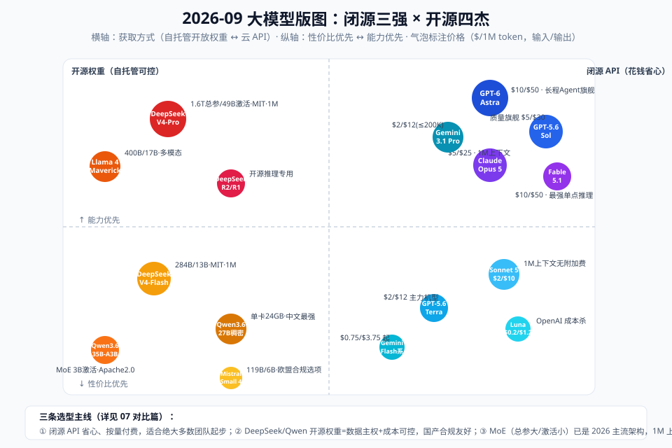

# 07 - 对比篇：2026 模型格局全景与选型

> 【本节问题】① 闭源三强和开源四杰各家的牌面？② MoE 是怎么统一 2026 的？③ 你的场景该选谁？④ 价格之外的隐藏差异？



> 时效声明：以下为 2026-09 快照（多家比价站交叉核对），价格/阵容每季度都变——**结构比数字长寿**，学结构。

---

## 1. 闭源三强（API 优先视角）

| | OpenAI | Anthropic | Google |
|---|---|---|---|
| 旗舰 | GPT-5.6 Sol（$5/$30）/ GPT-6 Astra（$10/$50，长程 Agent） | Claude Opus 5（$5/$25）/ Fable 5.1（$10/$50，最强单点推理） | Gemini 3.1 Pro（$2/$12 ≤200K，超则翻倍） |
| 主力 | GPT-5.6 Terra（$2/$12） | **Claude Sonnet 5（$2/$10，1M 无附加费）** | Gemini 3.5/3.8 Flash（$0.75~1.5） |
| 便宜量足 | GPT-5.6 Luna（**$0.20/$1.20**） | Haiku 4.5（$1/$5） | Flash-Lite（$0.10/$0.40 全场最低价） |
| 上下文 | 400K~1M（>272K 输入 ×2） | 1M（无附加费） | 1M（>200K 翻倍） |
| 独门 | reasoning_effort/verbosity 参数化、Responses API 推理上下文复用 | 合同/代码长文一致性口碑、effort 自适应思考、缓存 97.5% off（Fable 5.1） | 多模态全家桶、Flash 性价比、超长上下文 |
| 风格 | 参数化控制，工程化程度高 | 企业级稳定性叙事、长任务可靠性 | 多模态与价格侵略性 |

## 2. 开源四杰（自托管/数据主权视角）

| 模型 | 架构 | 上下文 | 许可证 | 一句话定位 |
|---|---|---|---|---|
| **DeepSeek V4-Pro** | MoE 1.6T/49B 激活 | 1M | MIT | 开源天花板，代码/推理最强（预训练 33T token，压缩稀疏注意力） |
| **DeepSeek V4-Flash** | MoE 284B/13B | 1M | MIT | 性价比主力，API 极便宜 |
| **Qwen3.6-27B** | 稠密（Gated DeltaNet 混合注意力+MTP） | 262K（YaRN 可扩 1M） | Apache 2.0 | **单卡 24GB 可跑，中文最强本地模型** |
| **Qwen3.6-35B-A3B** | MoE 35B/3B | 262K→1M | Apache 2.0 | 3B 激活的效率怪物 |
| **Llama 4 Scout/Maverick** | MoE 109B/17B、400B/17B | Scout 理论 10M / Maverick 1M | Llama 社区许可（<700M MAU 商用） | 多模态开源标杆、西方生态默认底座 |
| **Mistral Small 4** | MoE 119B/6B | — | Apache 2.0 | 欧盟合规选项，单 A100 可跑 |
| DeepSeek R1 系（蒸馏 1.5B~70B） | 稠密/蒸馏 | — | MIT | 开源推理小杯 |

## 3. MoE 是怎么统一 2026 的（结构理解）

```text
稠密模型：每个 token 过全部参数 → 容量想要大，单 token 成本就爆炸
MoE：    路由器为每个 token 从 N 个专家里挑 2~8 个 → 总参管"知识库存量"，
        激活参管"单 token 成本" → 两者解耦，第一次让 1.6T 模型可以便宜地跑
```

- 读名口诀：`DeepSeek-V4-Pro 1.6T/49B`、`Qwen3.6-35B-A3B`（A=激活）、`Maverick 400B/17B`——**第二个数才是推理成本的决定量**
- 你的显存规划看总参（量化后），你的延迟/吞吐预期看激活参

## 4. 选型决策树（贴给团队用）

```text
数据能出内网吗？
├─ 不能 → 本地部署：中文场景 Qwen3.6-27B（单卡）；多模态 Llama 4 Scout；
│         推理小杯 R1-Distill-32B；生产并发 vLLM 托管
└─ 能 → 调用量级？
    ├─ 小/中（<100 万次/月）→ API：
    │   ├─ 追质量：GPT-5.6 Sol / Claude Opus 5 / Gemini 3.1 Pro
    │   ├─ 平衡（默认）：Claude Sonnet 5 / GPT-5.6 Terra
    │   └─ 海量简单任务：GPT-5.6 Luna / Gemini Flash-Lite
    └─ 大（>100 万次/月）→ 混合：高频简单任务 → DeepSeek/Qwen API 或本地小模型
                          低频疑难 → 旗舰 API；中间层 Sonnet/Terra
中国业务加分项：DeepSeek/Qwen/百炼 的合规、备案与延迟优势
```

## 5. 价格之外的隐藏差异（容易被忽略）

| 维度 | 差异点 |
|---|---|
| 缓存策略 |各家命中折扣与最小前缀长度不同（Claude Fable 5.1 缓存 97.5% off；有的 1024 token 起缓存） |
| 长上下文附加费 | GPT/Gemini 有阈值翻倍档；Claude 无——**长文档场景选 Claude 可能更便宜** |
| 思考计费 | 各家对思考 token 的计费与暴露方式不同（完整可见/仅摘要） |
| 工具调用质量 | 同样"支持工具"，并行调用可靠度差异大——Agent 场景必实测（004 专题） |
| 中文 token 效率 | DeepSeek/Qwen 词表对中文更友好，同内容 token 数常少 20-30% |
| 合规 | 国产模型备案齐全；出海数据出境评估、欧盟 AI Act → 影响 API vs 自托管选择 |

## 6. 本笔记的立场（可检验的判断）

1. **默认档**：Sonnet 5 / Terra / Flash 是 2026 年的"生产默认档"——90% 的业务任务不需要旗舰
2. **国产组合拳**：DeepSeek（质量）+ Qwen（本地/多模态）+ 百炼/DeepSeek API（合规通道）已能覆盖国内企业大部分场景
3. **1M 上下文是营销数字优先**：先问你的场景是否真有 >100K 的单次输入；没有，就别为它付溢价（context rot 也在等你）
4. **结构判断**：MoE + 长上下文 + 可调思考 = 2026 三大件；选型时核对这三项的参数化程度，比看跑分有用

---

## 【本节自测】

1. 三强各自的"旗舰/主力/便宜"三档型号与价格？
2. 开源四杰各自的定位一句话？中文本地场景选谁、为什么？
3. MoE 解耦了什么和什么？"第二个数才是成本决定量"指的是什么？
4. 走一遍决策树：你的 CTRM 系统（数据敏感、日均 2 万次抽取+少量复杂审查）怎么选？
5. 隐藏差异六条中，哪三条最可能改变你的账单？
6. 本笔记"1M 上下文是营销数字优先"的判断，你同意吗？给出你场景的论据。
