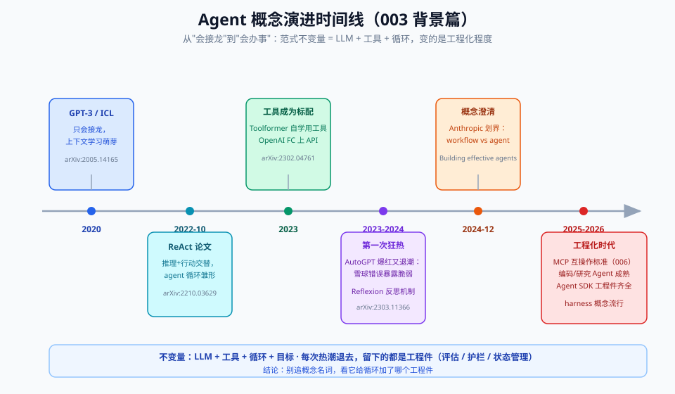

# 00 - 背景篇：Agent 前史与全景

> 【本节问题】① "Agent"这个词在 AI 里存在多少年了？② LLM Agent 是怎么从 2022 年的一篇论文长成 2026 年的工程学科的？③ 这门学科现在"卷"到哪里了？④ 对 Java 开发者来说，Agent 到底是噱头还是新栈？

---

## 1. 前史：Agent 不是 LLM 时代的发明

**【一句话人话】** "Agent（智能体）"在 AI 学科里已经 40 年了，指"能感知环境、自主决策、采取行动达成目标的系统"——LLM 只是给这个老概念装上了第一个像样的"大脑"。

**【生活类比】** 恒温器、扫地机器人、游戏 NPC、股市交易程序，都是经典意义的 Agent：传感器（感知）→ 规则/模型（决策）→ 执行器（行动）。它们的问题：**决策逻辑是死的**。LLM Agent 的革命在于把"规则/模型"换成"通用推理的大语言模型"——决策逻辑第一次可以"看懂没见过的情况"。

里程碑坐标（非 LLM 部分）：

| 时间 | 事件 | 意义 |
|---|---|---|
| 1986 | Minsky《The Society of Mind》提出心智由"agents"组成 | 多 agent 思想源头 |
| 1995 | Russell & Norvig《AIMA》把 rational agent 作为全书组织框架 | 学科定义定锚："感知-决策-行动" |
| 1999~ | BDI 模型（Belief-Desire-Intention）、MAS 多智能体系统 | 学术 Agent 理论成熟，但工程落地靠硬编码规则 |
| 2010s | RPA（机器人流程自动化）兴起 | "用程序模拟人操作 UI"——后来被 Agent 部分取代/融合 |

**给 Java 开发者的锚点**：你写的每一个 `@Scheduled` 任务 + 规则引擎（Drools）组合，本质上就是一个弱 Agent——只是"决策"这层是死规则。LLM Agent 相当于把 Drools 规则表换成一个会读上下文、会调接口、会反思的推理引擎。

## 2. LLM Agent 编年史（2022 → 2026-09）

| 阶段 | 时间 | 关键事件 | 对工程师的意义 |
|---|---|---|---|
| **萌芽** | 2022-10 | ReAct（arXiv:2210.03629）提出"推理+行动交替" | 第一次证明：让模型边想边调工具，比纯推理强 |
| **狂热** | 2023-03~06 | AutoGPT / BabyAGI 爆红；OpenAI 发布 Function Calling（2023-06） | 民众第一次看到"AI 自主跑任务"，但死循环、烧钱、烂尾是常态；工具调用从此成为 API 标准能力 |
| **冷静** | 2023~2024 | 社区反思"AutoGPT 式全自主不可靠"；RAG、workflow 化方案上位 | 共识形成：**可靠的自动化优先于炫酷的自主性** |
| **定标** | 2024-12 | Anthropic 发布《Building effective agents》：workflow vs agent 概念切分 + 五模式 | 行业第一次有了权威的共同语言（详见 04 篇） |
| **落地** | 2025 | Deep Research、Claude Code、Coding Agent 全线爆发；Anthropic 发布 MCP 协议（2024-11）与《Effective context engineering for AI agents》（2025-09）；OpenAI 发布《A practical guide to building agents》（2025-04） | Agent 从 demo 进入生产；上下文工程、护栏工程成为独立话题 |
| **工程化** | 2026 上半年 | **Harness Engineering 定名**（Agent = Model + Harness，2026-02~03）；Anthropic Managed Agents 给出运行时三分法（Brain/Hands/Session）；评测基准大换代（τ²-bench、Terminal-Bench 2.x、OSWorld 2.0） | 差异化从"选什么模型"转移到"怎么设计模型外围的工程系统" |

## 3. 2026-09 全景：这门学科现在的样貌

- **定义之争基本收敛**：Anthropic 的切分（workflow=代码写死路径，agent=模型自主决定路径）成为最广为接受的工程口径；学术界口径（感知-决策-行动循环）与工程口径兼容。
- **核心方法论三大件**：《Building effective agents》（编排模式）、《Effective context engineering for AI agents》（上下文管理）、《A practical guide to building agents》（落地与护栏）。三者叠加就是本专题 04/06/07 篇的骨架。
- **评测在换代**：老一代综合基准（AgentBench）已退役，GAIA 基本饱和；活跃的是 τ²-bench（策略一致性的多轮工具使用）、SWE-bench Pro（抗污染）、Terminal-Bench、OSWorld 2.0。详见 06 篇。
- **行业重心迁移**："模型选型" → "Harness 设计"。2026 年社区公认：同等模型下，Agent 体验差距主要来自 harness（上下文策略、工具设计、错误恢复），而非模型本身。

## 4. 它和你（CTRM 系统 Java 开发者）的关系

| 常见怀疑 | 事实核查 |
|---|---|
| "又是炒概念，本质是 if-else 调 API" | workflow 部分确实是结构化代码；但 agent 的控制流由模型运行时生成，这是**新的系统形态**——相当于你的 Spring 状态机变成了会自己推理的引擎 |
| "我们 Java 栈（Java 11 + Vue 2.7）接不了" | Agent 对接方就是 HTTP API：Java 侧提供 REST 工具接口，Python/网关侧跑循环即可；05 篇手写的循环 <200 行，无任何框架依赖 |
| "点价业务规则性强，用不上 Agent" | 恰恰是典型混合场景：要素抽取/异常邮件理解需要模型（非结构化输入），库存校验/风控是死规则。07 篇会论证：点价申请应落在"workflow 为主 + 局部 Agent"的频谱上，不是全自主 |

## 5. 本专题的学习契约

读完本专题你应当能：
1. 凭记忆画出 Agent 核心循环图（03 篇），并写出 ≤100 行的最小实现（05 篇）；
2. 对任意新需求，快速判断它落在"自主性频谱"哪一格，以及为什么（04/07 篇）；
3. 列出至少 6 种生产失败模式及对应缓解手段（06 篇）；
4. 在面试中把 workflow/agent、ReAct/Reflexion、harness 这些概念讲出层次（08 篇）。

---

## 【本节自测】

1. 经典 Agent 理论的"感知-决策-行动"三要素，分别对应 LLM Agent 里的什么？（提示：上下文/模型推理/工具调用）
2. 2023 年 AutoGPT 狂热后行业学到的最大教训是什么？这个教训如何体现在 Anthropic 的"最简单方案"原则里？
3. ReAct 论文（arXiv:2210.03629）的核心贡献用一句话概括是什么？
4. "Harness Engineering"为什么在 2026 年才定名而不是 2024 年？它把行业关注点从什么转移到了什么？
5. Anthropic《Building effective agents》（2024-12）和《Effective context engineering for AI agents》（2025-09）分别解决什么问题？两篇的关系？
6. 对 CTRM 点价申请场景，你直觉认为它该是全自主 agent 还是 workflow 为主？列出两个支持你判断的理由（读完 07 篇后回来对照）。
7. 2026-09 的 agent 评测基准格局里，哪些"死了"，哪些"活着"？（不精确到分数，说出趋势即可）

答案要点

1. 感知=构建上下文（读邮件/查库）；决策=LLM 推理选工具；行动=工具调用执行。
2. 教训：全自主+长循环会放大错误且不可控（成本、死循环、不可调试）；体现在 Anthropic 主张"找到最简单的可行方案，仅在必要时增加复杂度"，多数生产场景 workflow 即可。
3. 让 LLM 以"思考→行动→观察"的循环交替进行，用工具结果反馈修正推理轨迹，显著优于纯思维链。
4. 因为 2024~2025 各团队已在建但没有统一词汇；当模型能力趋同，差异只剩模型外围工程，需要命名；关注点从"选模型"转移到"设计模型外围的循环/上下文/工具/护栏系统"。
5. 前者解决"控制流怎么编排"（五模式+agent 循环）；后者解决"每一步给模型看什么"（注意力预算、压缩/笔记/子代理）；前者定形状、后者定内容。
6. 开放题。合理答案：workflow 为主（固定要素抽取→查价→生成建议单，路径可预测、涉及资金合规要可控），局部用 agent（异常邮件理解、多源查证）。理由要提到可预测性/审计/成本。
7. 死：AgentBench（退役）、GAIA（饱和）、SWE-bench Verified（污染争议）；活：τ²-bench、SWE-bench Pro、Terminal-Bench、OSWorld 2.0、BFCL V4。

