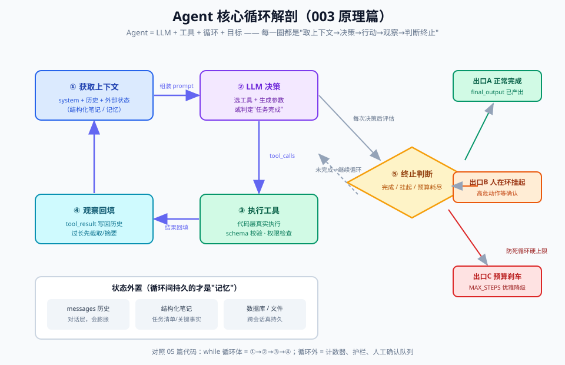

# 03 - 原理篇：Agent 循环解剖

> 【本节问题】① 一轮循环内部分几步、每步发生什么？② state/session 在循环里怎么流转？③ 模型怎么"知道该停了"？④ 事件循环伪代码长什么样、每次循环的成本结构是什么？



> 目标：读完能**凭记忆画出**上面这张图，并写得出 20 行伪代码。这是全专题的枢纽篇——05 篇的 200 行代码就是它的工程化。

---

## 1. 全景：五步心跳

Agent 没有魔法，只有一圈一圈稳定的心跳：

```text
        ┌────────────────────────────────────────────┐
        │                                            │
        ▼                                            │
  ① 获取上下文 → ② 决策/行动(工具调用) → ③ 观察结果      │
        （组装 state 进窗口）  （模型推理选工具）  （执行器返回）│
                                                      │
        ⑥ 终止判断 ←—— ⑤ 更新上下文（state/session 落账） │
        （完成？→ 退出） （追加消息历史+事件日志）────────┘
```

每圈的"载体"是一次 LLM API 调用：上下文 = 请求体，决策 = 返回里的 tool_call 或文本，观察 = 你把工具结果追加回去。**循环体在模型外面（harness），模型只负责第②步的推理。**

## 2. 逐步解剖（以点价 Agent 一圈为例）

### ① 获取上下文（组装"模型此刻该看什么"）

- 输入源：system prompt（职责书，稳定，放最前）→ 工具定义 → 业务 state（已抽取要素、已查价格）→ 对话历史（最动态，放最后）
- **Anthropic 推荐的排序原则：稳定在前、动态在后**——既符合注意力衰减规律，又最大化 prompt caching 命中（002 卡12）
- 点价实例：第 3 圈时窗口里 = 职责书 + 5 个工具定义 + "已抽取：品种豆粕/数量500吨" + 前两圈的消息

### ② 决策（模型推理，产出三种可能）

- **a. 发起工具调用**：`{"name":"query_futures","arguments":{"symbol":"M2505"}}`
- **b. 输出中间文本**（思考/向用户澄清）——注意"思考"也是普通文本输出，只是不被当行动执行
- **c. 判断完成**：不再调用工具，或调用 `submit_pricing_proposal` 这类 final 工具收尾

### ③ 观察（执行器干活，返回结果）

- 你的代码：schema 校验参数 → 权限检查 → 执行（查库/调期货接口）→ 捕获异常 → 包装成**模型可读的文本/JSON** 返回
- 关键纪律：**结果就是模型的眼睛**。SQL 报错要翻译成人话（"品种代码无效，可用值：M/RM/Y"），不要把堆栈原样扔回去

### ④⑤ 更新上下文与落账

- tool result 追加进消息历史（state 更新）
- 同时追加进 session 事件日志（append-only：`{turn:3, action:"query_futures", ok:true, ms:210}`）
- 超过预算阈值（如 70% 窗口）→ 触发压缩（摘要替换旧轮次，保留：要素、价格快照、当前计划）

### ⑥ 终止判断（系统说了算，不是模型说了算）

| 终止类型 | 判据 | 触发后行为 |
|---|---|---|
| 正常完成 | 模型调用了 final_output 工具 / 返回无 tool_call | 退出，交付结果 |
| 预算刹车 | 步数 ≥ max_steps | 退出，返回"未完成+已得信息"（**优雅降级**，不是抛异常） |
| 异常熔断 | 连续 N 次工具失败 / 同参数重复调用 | 退出并告警 |
| 人在环暂停 | 命中高危工具（写库/下单） | 挂起 pending，等审批回调后继续 |
| 费用刹车 | 累计 token/费用超限 | 退出并告警 |

## 3. State / Session 在循环中的流转

```python
state = {
  "messages": [ ... ],          # 给模型看的：system+tool defs+历史（可被压缩）
  "extracted": {"品种":"豆粕","数量":500},   # 业务状态：跨压缩存活
  "price_cache": {"M2505": 3128.0},
  "pending_approval": None      # 人在环挂起点
}
session = []                    # 案卷：append-only，永不改写
# 每圈末尾：state["messages"].append(...)；session.append(event)
```

**核心区分**（02 卡6 的落地）：`messages` 是"给模型的工作台"，可压缩、可清理；`session` 是"给审计和恢复的案卷"，只增不改。压缩丢信息时，真相仍在 session 里。

## 4. 事件循环伪代码（背下来）

```python
def agent_loop(task, tools, max_steps=25):
    state = init_state(task)                      # system prompt + 工具定义 + 目标
    session = []
    for step in range(max_steps):                 # ⑥① 预算刹车 + 获取上下文
        resp = llm.chat(state["messages"], tools=tools)   # ② 决策
        if not resp.tool_calls:                   #   出口A：模型自然收工
            return finish(state, resp.text, session)
        for call in resp.tool_calls:              # ②' 可能一轮回多个工具
            if is_dangerous(call):                #   护栏：高危动作
                state["pending_approval"] = call  #   出口B：人在环挂起
                return suspend(state, session)
            result = execute(call, tools)         # ③ 观察（校验+执行+翻译错误）
            state["messages"] += [call_msg, result_msg]   # ④⑤ 更新上下文
            session.append(log(step, call, result))
            if maybe_compact(state):              #   上下文卫生：接近70%则压缩
                compact(state)
        if detect_loops(session):                 #   出口C：异常熔断
            return abort(state, session, reason="死循环/连续失败")
    return degrade(state, session)                #   出口D：优雅降级
```

## 5. 成本结构：为什么"循环"是账单放大器

每圈 = 一次完整 API 调用，且**输入随轮次增长**（消息历史只增不减）：

| 循环轮数 | 输入 token（示意） | 计费输入累计 | 缓解手段 |
|---|---|---|---|
| 1 | 2,000 | 2,000 | —— |
| 5 | 6,000 | 22,000 | 工具结果清理（旧结果替换为占位） |
| 20 | 20,000 | 180,000 | prompt caching（稳定前缀命中 1~2 折，002 卡12）+ 压缩 |

**给 Java 开发者的锚点**：这个循环很像消息驱动的状态机——`for` 循环 + 幂等工具 + 事务边界（人工确认点=提交点）。用 Spring 的话说：循环体是 `@Transactional` 外的编排层，工具是 Service 方法，pending_approval 就是一张待办的补偿事务。

## 6. 与 002 的联动：每圈内部发生什么

循环里每一次 `llm.chat`，都是 002-03 篇那趟完整旅程（分词→注意力→采样）；三个由此推导的工程结论：
1. **工具定义占 system prompt**——每次循环都要重新"读"一遍，工具太多=每圈都多交"阅读费"，且摊薄注意力（context rot）；
2. **稳定前缀命中 KV cache**——system prompt 和工具定义别动，动态内容拼在后面，成本立省 60~80%；
3. **温度/思考预算按环节分**——抽取用低温、异常研判可开思考（推理模型），不要全局一个参数。

---

## 【本节自测】

1. 画出五步循环图。循环体（for 循环本身）住在模型里还是 harness 里？模型负责其中哪一步？
2. 上下文组装的排序原则是什么？这个原则同时优化了哪两件事？
3. 模型"决策"的三种可能输出是什么？"思考"算不算行动？
4. 终止判断的五类出口分别是什么？为什么说"终止是系统说了算"？
5. state 里的 messages 和 session 有什么不同的读写纪律？压缩时信息丢了怎么办？
6. 为什么循环到第 20 轮时输入成本是线性还是超线性增长？两个主要缓解手段？
7. 把"执行器要把 SQL 报错翻译成人话"这条纪律，用"工具结果是模型的眼睛"解释一遍。
8. 点价 Agent 第 6 圈命中"高危工具"是什么意思？pending_approval 状态和数据库事务的提交点有什么类比关系？

<details>
<summary>答案要点</summary>

1. 获取上下文→决策→观察→更新→终止判断；循环体在 harness，模型只负责决策（推理）。
2. 稳定在前动态在后；同时优化注意力分配（衰减规律）和 prompt caching 命中率。
3. 工具调用/中间文本（思考或澄清）/判断完成；思考只是文本输出，不被执行，不算行动。
4. 正常完成、预算刹车、异常熔断、人在环暂停、费用刹车；步数/费用/熔断判据都是代码判的，模型只提请，系统裁决。
5. messages 可压缩可清理（工作台），session append-only 永不改写（案卷）；压缩丢的信息可从 session 回溯重建。
6. 超线性（输入随轮次增长，累计计费是 Σ）；缓解=工具结果清理+prompt caching（+压缩）。
7. 模型对世界的全部认知来自窗口里的文本；原始堆栈是"给人看的眼睛"，模型需要"给它看的眼睛"（可读、可行动的描述），否则下一步决策就是瞎猜。
8. 该工具是写操作/资金相关（如写回 CTRM），需人审批；类比：pending=未提交的事务挂起，人工确认=commit，拒绝=rollback。
</details>
