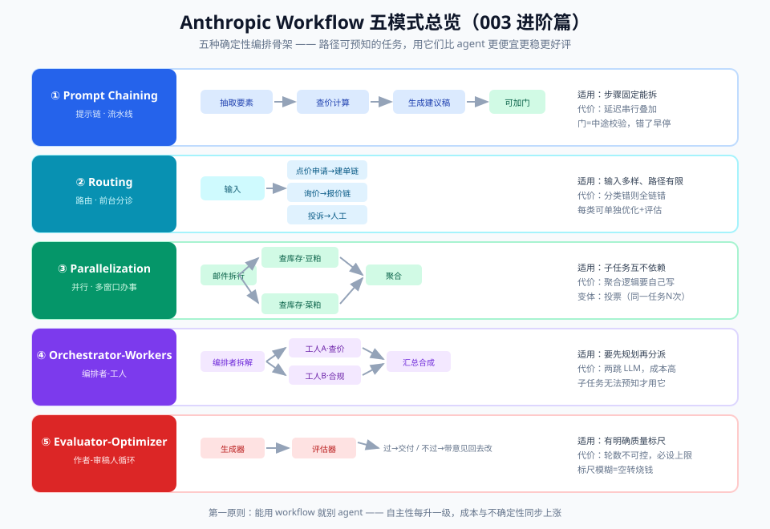
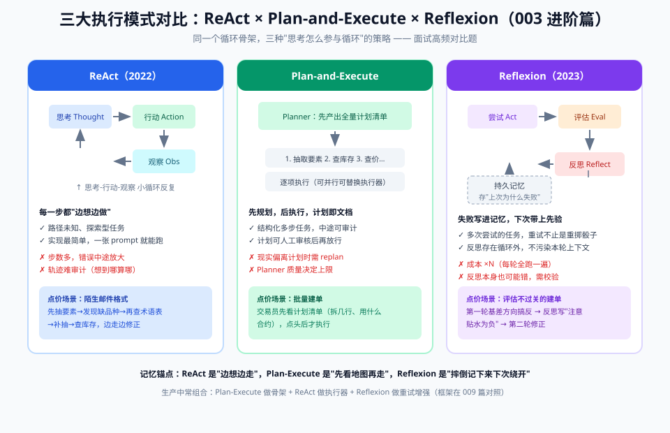
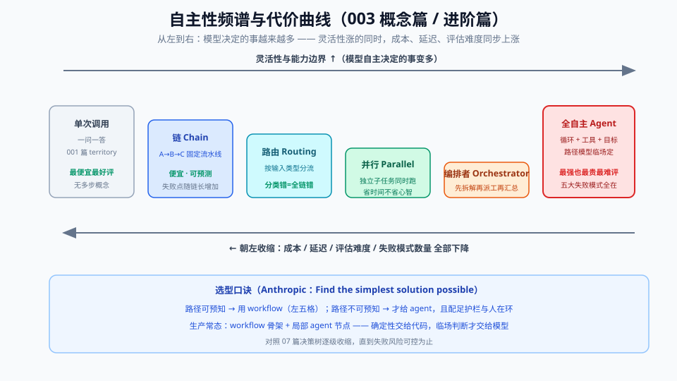

# 04 - 进阶篇：编排模式与自主性频谱

> 【本节问题】① Anthropic 五种 workflow 模式各自适合什么场景、代价是什么？② ReAct / Plan-and-Execute / Reflexion 三大执行模式怎么选？③ 自主性频谱的六档分别什么价位？④ 什么时候才真的需要多 agent？



---

## 1. Anthropic 五模式：控制流预定义的五种形状

来源：Anthropic《Building effective agents》（2024-12）。共同契约：**控制流写死在代码里，模型只是链上的零件**。

| 模式 | 做什么 | 适用场景 | 代价/风险 | 点价案例映射 |
|---|---|---|---|---|
| **Prompt Chaining**（提示链） | 任务拆成固定子任务顺序串联，中间可加程序化检查点（gate） | 任务能干净拆成固定步骤，用延迟换准确率 | 链越长延迟越高；中间环节格式错会传染 | 抽取要素 →（校验）→ 查价 →（校验）→ 生成建议单 |
| **Routing**（路由） | 先分类输入，再导向专用的提示/模型/流程 | 输入种类多，一套提示喂不饱所有类型 | 分类器错分则全链错；分类标准要维护 | 邮件分诊：标准点价申请/询价/投诉/垃圾邮件 → 各走各路 |
| **Parallelization**（并行） | 切独立分支同时跑（**sectioning** 分块）或同一任务跑多次投票（**voting**） | 子任务独立；或需要多视角交叉验证 | 汇总逻辑要写好；voting 成本×N | 库存、期货价、信用额度三路并发查；可疑申请双模型交叉判断 |
| **Orchestrator-Workers**（编排者-工人） | 中心 LLM **运行时**动态拆任务、派工、汇总 | 子任务事先无法确定种类和数量 | 最贵的 workflow；编排质量=天花板 | 客户邮件夹带补充协议+改单要求，中心模型动态决定要派哪些子任务 |
| **Evaluator-Optimizer**（评估-优化） | 一个生成、一个评估打分，循环到达标 | 有明确可校验标准，且迭代确实能提升 | 成本×迭代数；评估器不可靠则空转 | 建议单质检器：逐条校验"有依据/数字对/风险已标注"，不过关打回重写 |

**选型口诀**：能 chaining 不 routing，能 routing 不 orchestrator——**每右移一档，成本、延迟、调试难度上一级台阶**。

## 2. 三大执行模式：ReAct vs Plan-and-Execute vs Reflexion

这三种是 agent 循环的**执行策略**（控制流交给模型时的三种经典节拍）：

| 维度 | **ReAct**（arXiv:2210.03629, 2022-10） | **Plan-and-Execute**（2023，Plan-and-Solve 等衍生） | **Reflexion**（arXiv:2303.11366, 2023-05） |
|---|---|---|---|
| 核心思想 | 想一步做一步：Thought → Action → Observation 交替 | 先出完整计划，再逐项执行 | 执行失败后写"语言化反思"，存进记忆再试 |
| 节拍 | 每步都思考 | 思考一次（规划），之后机械执行+必要时重规划 | 多轮 trial，轮间有反思 |
| 优势 | 反应快，能利用环境的即时反馈；实现最简单 | 目标漂移少（计划外置=显式锚点）；任务结构清晰 | 错误不重复犯；能积累"经验教训" |
| 劣势 | 长任务易**目标漂移**（忘了初衷）；无全局观 | 环境一变计划就过时（脆）；重规划成本高 | 反思质量依赖模型自省力；多 trial 成本倍增 |
| 适用 | 短链工具任务、探索式查证（点价查价环节） | 多文件改造、结构明确的多步任务 | 可反复验证的任务（生成→校验→反思） |
| 反模式 | 拿 ReAct 硬扛 50 步长任务 | 拿它跑环境多变的研究任务 | 拿它做不可验证的开放式任务 |

**组合拳**（生产常见）：Plan-and-Execute 定骨架 → 每步内部 ReAct 执行 → 关键节点 Reflexion 复盘（点价场景：先列"抽取/查证/生成"计划，查证步用 ReAct，建议单被质检打回时写反思再改）。



## 3. 自主性频谱：六档价位表



| 档位 | 形态 | 控制流归属 | 灵活性 | 成本 | 可评估性 | 典型例子 |
|---|---|---|---|---|---|---|
| L0 | 单次调用 | 代码（无控制流） | ★ | ¥ | 易（单点测试） | 要素抽取接口 |
| L1 | 链 chaining | 代码 | ★★ | ¥¥ | 易（逐环节测） | 抽取→查价→生成 |
| L2 | 路由 routing | 代码（分支在代码里） | ★★★ | ¥¥ | 中（测分类器） | 邮件分诊 |
| L3 | 并行/投票 | 代码 | ★★★ | ¥¥¥ | 中 | 三路并发查证 |
| L4 | 编排者-工人 / 局部 agent | 代码定骨架，模型定子任务 | ★★★★ | ¥¥¥¥ | 难 | 动态拆解杂类邮件 |
| L5 | 全自主 agent | **模型** | ★★★★★ | ¥¥¥¥¥ | 最难（端到端+轨迹评估） | 开放式研究/编码任务 |

**两条铁律**：① 每右移一档，评估从"测单元"变成"测轨迹"；② 生产系统通常**左端为主、右端局部**——点价主链 L1~L3，只有"疑难邮件理解"值得 L4/L5。

## 4. 什么时候才真的需要多 Agent？

两份指南口径一致地保守：

- **OpenAI（2025-04）**：两模式——**Manager**（管理者用 tool call 派工并汇总，保持统一用户体验）与 **Decentralized handoffs**（对等 agent 直接移交控制权，适合分诊后 specialists 各自接管）。大多数团队应该从单 agent 循环起步，单 agent 真成瓶颈再上多 agent。
- **Anthropic（2024-12）**：orchestrator-workers 的前提是"子任务无法预先确定"；否则用普通 workflow。其多 agent 研究系统报告的适用域也是"并行探索有红利"的复杂研究。

**升级触发器（满足其一才考虑）**：
1. 单 agent 上下文装不下任务（→ 拆子代理隔离脏上下文，联动 02 卡12）；
2. 子任务天然并行且互相独立（→ 并行 workers 提吞吐）；
3. 上下文需要**隔离权责**（审计要求"查价逻辑"与"建议生成"分开，各自干净上下文）。

反模式：把"多 agent 编排"当架构炫技——通信开销、错误传播、调试难度三杀（06 篇）。

## 5. 点价案例的完整编排方案（本篇收束）

```text
邮件进站 ──→ [Routing] 分类（4 类）
   ├─ 标准点价申请 → [Chaining] 抽取→gate校验→查价(并行三路)→生成建议单
   │                    └→ [Evaluator] 质检器循环（≤2 轮，不过关转人工）
   ├─ 询价/咨询     → 单次调用+检索（L0，别过度设计）
   ├─ 投诉/改单     → 转人工（挂 pending）
   └─ 疑难杂类     → [局部 agent L4] 动态拆解（ReAct 执行），产出结构化摘要
最终：建议单 → 人工确认（人在环）→ 写回 CTRM
```

可以看到：**没有任何一步是"因为想用 agent 所以用 agent"**——每一档都是被场景特征（可预测性/开放性/风险）推出来的。

---

## 【本节自测】

1. 五模式的共同契约是什么？各自配一个点价场景以外的例子。
2. Parallelization 的 sectioning 和 voting 有什么区别？各举一例。
3. ReAct 为什么容易目标漂移？Plan-and-Execute 用什么机制缓解这个问题（联动 06 篇"计划外置"）？
4. Reflexion 的适用前提是什么？为什么说"不可验证的任务别用它"？
5. 自主性频谱右移一档，评估方式发生什么本质变化？
6. 需要多 agent 的三个触发器是什么？Manager 模式和 handoff 模式的核心区别？
7. 写出点价案例的编排方案，并标注每个环节的频谱档位。
8. "能 chaining 不 routing"口诀背后的成本逻辑是什么？

<details>
<summary>答案要点</summary>

1. 控制流预定义在代码里；例：chaining=翻译→润色→校对；routing=客服按问题类型转专家坐席；parallel=多路风控信号聚合；orchestrator=研究任务动态拆分；evaluator=文案生成+合规审查循环。
2. sectioning=拆独立子任务并行（如合同各章节并行审）；voting=同任务多次跑取多数（如可疑交易多次研判）。
3. ReAct 每步只看局部反馈，长链后初衷被稀释（lost in context）；Plan-and-Execute 把计划写成显式外置文本，每步对照计划=锚点防漂移。
4. 前提=有明确可校验信号能触发反思；不可验证则评估器给不出可靠信号，反思就是自说自话，多轮成本纯浪费。
5. 从"测单点输出"变成"测轨迹与端到端结果"（步数、轨迹合理性、最终达成率），需要轨迹级评估与沙箱。
6. 上下文装不下、天然并行、需要权责隔离；Manager=管理者保持控制与统一出口（agents as tools），handoff=控制权直接移交（specialist 接管对话）。
7. 见本篇第 5 节图示；档位：分类 L2、主链 L1/L3、质检 evaluator、疑难邮件 L4、询价 L0。
8. 每右移一档，多一份模型调用的钱/延迟/调试难度；在低档能解决时右移是纯亏。
</details>
