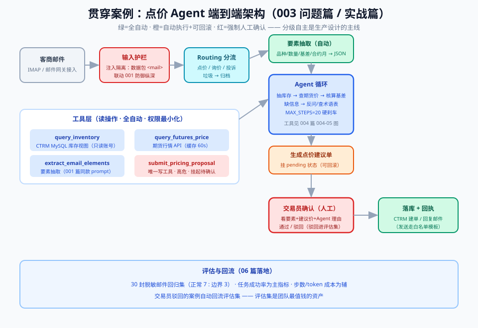

# 05 - 实战篇：手写一个 Agent 循环（全代码）

> 【本节问题】① 不用任何框架，最小 agent 循环怎么写？② 工具怎么注册、校验、防幻觉调用？③ 点价 Agent 怎么从 03 篇伪代码变成可跑代码？④ 步数预算、人工确认、优雅降级怎么落地？



> 依赖：本篇代码是 03 篇伪代码的工程化。只用 `openai` 官方 SDK（v1.x，任何兼容 OpenAI 协议的端点都能换），**零 agent 框架**——先懂原理再谈框架（07 篇对比）。

---

## 1. 设计图：四类工具 + 三个出口

点价 Agent 的工具面（少而精，Anthropic 原则）：

| 工具 | 读/写 | 风险级 | 作用 |
|---|---|---|---|
| `extract_email_elements` | 读 | 低 | 从邮件抽取要素（品种/数量/基差/合约月）——也可以用一次普通调用实现，这里做成工具让模型按需调用 |
| `query_inventory` | 读 | 低 | 查库存（品种→可用量、仓库） |
| `query_futures_price` | 读 | 低 | 查期货合约最新价与基差参考 |
| `submit_pricing_proposal` | **写** | **高** | 生成点价建议单 → 挂起等交易员人工确认（final_output 工具） |

三个出口：正常完成（submit 被调用）/ 人在环暂停（写操作挂 pending）/ 预算刹车（max_steps 优雅降级）。

## 2. 全代码（Python，可直接跑通结构）

```python
# -*- coding: utf-8 -*-
"""最小点价 Agent：Agent = LLM + 工具 + 循环 + 目标
依赖：pip install openai  （v1.x；任何 OpenAI 兼容端点均可替换 base_url）
"""
import json
from openai import OpenAI

client = OpenAI()  # 或 OpenAI(base_url=..., api_key=...)
MODEL = "gpt-4.1-mini"          # 主力模型：便宜、快，用于抽取/路由
MODEL_HEAVY = "gpt-4.1"         # 疑难邮件/最终建议单时升级
MAX_STEPS = 20                  # 步数预算：防死循环的硬刹车

# ---------- ① 工具定义：JSON Schema（工具文档本质是 prompt，写给模型看的） ----------
TOOLS = [
  {"type": "function", "function": {
    "name": "extract_email_elements",
    "description": "从客户邮件文本中抽取点价申请要素。邮件措辞不规范时优先使用。",
    "parameters": {"type": "object", "properties": {
        "email_text": {"type": "string", "description": "邮件正文原文"},
        "variety":    {"type": "string", "enum": ["M", "RM", "Y", "豆粕", "菜粕", "豆油"],
                       "description": "品种，不确定时返回 null"},
        "tons":       {"type": "integer", "description": "申请数量（吨）"},
        "basis":      {"type": "number", "description": "基差（元/吨），如 -80"},
        "contract_month": {"type": "string", "description": "合约月份，如 M2505"}},
      "required": ["email_text"]}}},
  {"type": "function", "function": {
    "name": "query_inventory",
    "description": "按品种查询当前可用库存。返回可用量与仓库列表；品种无效时返回可用品种。",
    "parameters": {"type": "object", "properties": {
        "variety": {"type": "string", "description": "品种代码，如 M"}},
      "required": ["variety"]}}},
  {"type": "function", "function": {
    "name": "query_futures_price",
    "description": "查询期货合约最新价与基差参考价。",
    "parameters": {"type": "object", "properties": {
        "symbol": {"type": "string", "description": "合约代码，如 M2505"}},
      "required": ["symbol"]}}},
  {"type": "function", "function": {
    "name": "submit_pricing_proposal",
    "description": "提交点价建议单，进入人工确认。调用前必须已核实库存与价格，要素不全或矛盾时禁止调用。",
    "parameters": {"type": "object", "properties": {
        "variety": {"type": "string"}, "tons": {"type": "integer"},
        "contract_month": {"type": "string"}, "basis": {"type": "number"},
        "futures_price": {"type": "number"},
        "inventory_ok": {"type": "boolean"},
        "risks": {"type": "string", "description": "风险与依据说明，引用已查询到的数据"}},
      "required": ["variety", "tons", "contract_month", "futures_price"]}}},
]

SYSTEM_PROMPT = """你是中基集团 CTRM 系统的点价申请处理助手。
职责：处理客户点价申请邮件，产出经过核实的点价建议单，提交人工确认。
流程要求：
1. 先弄清要素（品种/数量/基差/合约月）；邮件含糊时用 extract_email_elements，仍含糊则向客户回函澄清，禁止猜测。
2. 核实两件事：query_inventory 确认库存充足；query_futures_price 拿到最新价格。
3. 数字必须来自工具返回，禁止编造；库存不足或价格异常波动时在 risks 中说明。
4. 全部就绪后调用 submit_pricing_proposal。你无权执行点价，只有建议权。"""

# ---------- ② 工具实现：真实世界在这里（错误要翻译成人话） ----------
def tool_extract(args):
    # 生产中这里再走一次结构化抽取调用；演示直接透传
    return {"variety": args.get("variety"), "tons": args.get("tons"),
            "basis": args.get("basis"), "contract_month": args.get("contract_month"),
            "note": "字段为 null 表示邮件中未明确，需澄清"}

def tool_inventory(args):
    fake_db = {"M": {"available": 1200, "warehouses": ["南通港", "东莞"]},
               "RM": {"available": 300, "warehouses": ["南通港"]}}
    v = str(args.get("variety", "")).upper()
    if v not in fake_db:                       # 报错给人看也该给模型看
        return {"error": f"品种 {v} 无效，可用值：M / RM / Y（豆油）"}
    return fake_db[v]

def tool_futures(args):
    sym = args.get("symbol", "")
    if not sym.upper().startswith(("M", "RM", "Y")):
        return {"error": f"合约代码 {sym} 无效，示例：M2505"}
    return {"symbol": sym.upper(), "last_price": 3128.0, "basis_ref": -80.0, "ts": "2026-09-19 10:00"}

def tool_submit(args):
    # 高危写操作：不真正写库，挂起等人工确认（人在环）
    return {"status": "PENDING_APPROVAL",
            "proposal_id": "PP-20260919-001", "msg": "已生成建议单，等待交易员确认"}

TOOLBOX = {"extract_email_elements": tool_extract,
           "query_inventory": tool_inventory,
           "query_futures_price": tool_futures,
           "submit_pricing_proposal": tool_submit}
DANGEROUS = {"submit_pricing_proposal"}       # 风险评级：写操作=高危

# ---------- ③ Agent 循环：03 篇伪代码的工程化 ----------
def run_agent(email_text: str, max_steps: int = MAX_STEPS):
    messages = [{"role": "system", "content": SYSTEM_PROMPT},
                {"role": "user", "content": f"客户邮件：\n{email_text}"}]
    session = []                                        # append-only 案卷
    for step in range(1, max_steps + 1):
        resp = client.chat.completions.create(
            model=MODEL, messages=messages, tools=TOOLS, temperature=0.1)
        msg = resp.choices[0].message

        if not msg.tool_calls:                          # 出口A：模型自然收工（如要求澄清）
            return {"outcome": "reply_customer", "text": msg.content, "steps": step}

        messages.append(msg)                            # 助手的 tool_calls 必须回填
        for call in msg.tool_calls:
            name = call.function.name
            try:                                        # 防幻觉调用：不在白名单/schema 一律拒绝
                args = json.loads(call.function.arguments or "{}")
            except json.JSONDecodeError:
                result = {"error": "参数不是合法 JSON，请修正后重试"}
                name = None
            if name and name in DANGEROUS:              # 出口B：高危动作挂起等审批
                session.append({"step": step, "tool": name, "status": "pending"})
                return {"outcome": "pending_approval",
                        "proposal": args, "steps": step, "session": session}
            result = TOOLBOX[name](args) if name else result
            messages.append({"role": "tool", "tool_call_id": call.id,
                             "content": json.dumps(result, ensure_ascii=False)})
            session.append({"step": step, "tool": name, "ok": "error" not in result})
    return {"outcome": "budget_exceeded", "steps": max_steps,   # 出口C：优雅降级
            "text": "已达步数预算，未完成处理，请人工介入", "session": session}

# ---------- ④ 跑起来 ----------
if __name__ == "__main__":
    demo_email = "帮我点一下豆粕500吨，M2505的货，基差-80，明天上午前确认。"
    print(json.dumps(run_agent(demo_email), ensure_ascii=False, indent=2))
```

## 3. 代码逐段复盘（每段对应哪个原理）

| 代码段 | 对应原理 | 若省略会发生什么 |
|---|---|---|
| `TOOLS` 的 `description` | 工具文档=prompt（02 卡4） | 模型选错工具、编参数 |
| `required` + `enum` | schema 校验防幻觉调用 | 传进来的品种五花八门 |
| `SYSTEM_PROMPT` 的"禁止猜测/禁止编造数字" | 引文接地（001 篇）+ 正确海拔 | 数字幻觉直接进建议单 |
| `if not msg.tool_calls` | 终止条件：自然收工 | 循环没有正常出口 |
| `DANGEROUS` + pending | 人在环 + 风险评级（02 卡11） | 写操作无人审批 |
| `except json.JSONDecodeError` + 错误翻译 | 工具结果是模型的眼睛 | 一次格式错误 → 反复重试 |
| `max_steps` + `budget_exceeded` | 预算刹车+优雅降级 | 死循环烧钱（06 篇） |
| `session.append` | append-only 案卷（02 卡6） | 出问题无法审计回放 |

## 4. 生产化改造清单（从 demo 到上线）

1. **模型分工**：路由/抽取用轻模型，疑难邮件与最终建议单切 `MODEL_HEAVY`（或推理模型）——省 70% 成本的常见做法；
2. **幂等与重试**：工具执行器加超时、幂等键（同一 proposal_id 不重复提交）；连续 N 次同类错误触发熔断（03 篇异常熔断）；
3. **压缩**：`messages` 超过阈值时把旧轮次摘要化，`session` 不动（联动 02 卡12、008 专题）；
4. **审批回调**：`pending_approval` 落库（状态机：`PENDING → APPROVED/REJECTED`），审批通过后**开新循环**继续执行写操作，而不是在原进程里死等；
5. **可观测**：每圈记录步数/token/工具耗时，报表盯三件事：平均步数、熔断率、人工改判率（06 篇评估指标）。

**给 Java 开发者的锚点**：这套结构搬到 Spring 就是——`TOOLS` ≈ `@Tool` 注解的方法清单（经 MCP/自研网关暴露）；`TOOLBOX` ≈ Service 注册表；`run_agent` ≈ 一个 `CommandLineRunner` 式的编排器；`pending_approval` ≈ 状态机 + 补偿事务的"待提交"状态；`session` ≈ 操作流水表（append-only，审计用）。Vue 2.7 前端只需渲染 proposal 卡片 + 确认/驳回两个按钮。

## 5. 变体练习（学完必做）

- 把 `submit_pricing_proposal` 拆成"生成建议单"（低危）+"写回 CTRM"（高危，审批后执行）两个工具，体会风险评级为什么按**动作**而不是按**工具名**；
- 给 `query_futures_price` 加一个"价格波动 >3% 需在 risks 说明"的系统规则——思考：这条规则放 system prompt 还是放工具返回里？（提示：放工具返回里，它是"数据属性"而非"行为规则"，且随行情变化）
- 实现 `detect_loops(session)`：同一工具+同参数连续出现 ≥3 次即熔断。

---

## 【本节自测】

1. 复述最小公式的四部件在本代码中各对应什么？
2. 为什么"工具的 description 写给模型看"是一种 prompt engineering？写烂的后果是什么？
3. 防幻觉调用的两道防线是什么？分别拦截什么？
4. 高危工具为什么不"直接执行+事后审计"，而是"挂起+审批后继续"？审批通过后为什么开新循环？
5. `budget_exceeded` 为什么返回"未完成+已得信息"而不是抛异常？这体现什么工程原则？
6. `session` 在代码里承担什么角色？如果把它删了，三个能力会退化？
7. 模型分工（轻/重模型）省钱的原理是什么？哪些环节适合轻模型？
8. 把"价格波动 >3% 说明"放工具返回而不是 system prompt 的理由是什么？

<details>
<summary>答案要点</summary>

1. LLM=chat.completions 调用；工具=TOOLS+TOOLBOX；循环=for + 消息追加；目标=SYSTEM_PROMPT+终止条件（submit/预算）。
2. 模型依据名称+描述+参数说明选择工具并生成参数；写烂→选错工具/编造参数/该调不调。
3. 工具白名单（不在 TOOLBOX 一律拒绝）+ JSON Schema 校验（required/enum/类型）；分别拦"幻觉工具名"与"幻觉参数"。
4. 写操作不可逆且涉资金合规；审批在进程外完成（可能隔小时/天），必须能从持久化状态重新入，原进程不应阻塞等待。
5. 优雅降级：部分成果（已抽取要素、已查价格）对人工仍有价值；抛异常则全部浪费且系统表现为故障。
6. 审计回放、熔断检测（detect_loops 输入）、压缩依据；删除后无法审计、无法识别死循环、无法低成本压缩。
7. 循环中大多数轮次是简单步骤（查一次价、报一个数），轻模型足够；重模型留给低频高难环节；token 单价差数倍至数十倍。
8. 波动阈值随行情数据变化，是数据属性；工具返回携带让模型"看到即规则"，避免 system prompt 膨胀（context rot）且缓存前缀稳定。
</details>
