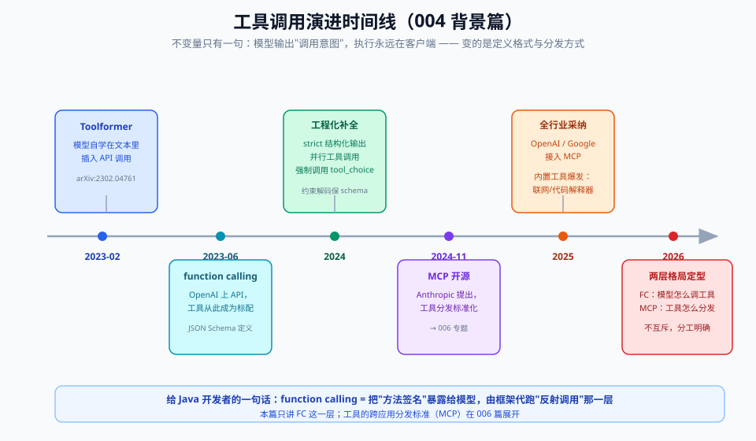

# 00 - 背景篇：从对话到行动的前史

> 【本节问题】① LLM 生来只会"说话"，"动手"的能力是怎么补上的？② Toolformer 是怎么教会模型自己决定何时用工具的？③ 2023-06 那次 OpenAI API 更新为什么是分水岭？④ 工具满天飞之后，MCP 又解决了什么新问题？

---

## 1. 缺口：会说话 ≠ 能办事

2020~2022 年的 GPT-3 时代，模型的所有输出都是**文本续写**。你问"今天沪铜主力合约多少？"，它会**编一个像样的数字**——因为它只是在预测"这段话后面最可能出现什么字"，而不是在查询行情。

这就是**行动鸿沟（the gap between knowing and doing）**：

| 你以为模型在干 | 模型实际在干 |
|---|---|
| 查数据库 | 输出一段"像查询结果的文字" |
| 算 38500×1.02 | 输出一个"像算过的数字" |
| 发邮件 | 输出一段"像发完邮件的确认话术" |

2022 年 10 月，**ReAct**（arXiv:2210.03629）第一次系统性地给出解法模板：让模型交替输出 `Thought → Action → Observation`，其中 Action 是发给外部环境（搜索、数据库）的指令，Observation 是环境的返回。ReAct 当时还是**纯提示词技巧**——模型把工具调用写在文本里，靠正则解析。它是 003 专题 Agent 循环的思想源头，也是本专题"工具调用"的直接前身。

## 2. Toolformer（2023-02）：模型自学"什么时候该用工具"

> 论文：Schick et al., *Toolformer: Language Models Can Teach Themselves to Use Tools*, arXiv:2302.04761（Meta AI）

Toolformer 的回答是：**不用人教，模型自己学**。流水线四步：

1. **采样**：对海量预训练文本，让模型"往里插 API 调用"（可能的调用点+参数）；
2. **执行**：真的把插进去的调用跑一遍，拿到结果；
3. **过滤**：比较"带结果"与"不带结果"两种续写的困惑度——只有**调用结果显著降低困惑度**的样本才保留（即"这个调用真的有用"）；
4. **微调**：用过滤后的增强语料继续训练基座模型。

- **一句话人话**：给模型一本"什么时候打电话求助"的自编教材——凡是打电话能答得更好的场景，才算有效教学。
- **生活类比**：新员工上班第一天记录"哪些事我自己会、哪些事该找财务/找法务"，之后遇到同类事自动转给对口部门。
- **技术要点**：实验用 6 个 API（问答、计算器、翻译、日历、维基搜索、机器学习模型）；约 6.7B 的 GPT-J 级模型学会后，在 LAMA 知识探测上**超过了自己大 10 倍的基座**；关键洞察是**插入式调用标注（API call annotation）让调用成为文本流的一部分**——这个形态直接遗传给了今天的 tool_calls。
- **坑**：Toolformer 是"模型自发决定何时调用"，2023-06 之后工业界走的是"开发者显式注册工具清单"路线——**控制权从模型侧移到了应用侧**，这是后面一切安全设计的基础。

同期（2023-05）UC Berkeley 的 **Gorilla**（arXiv:2305.15334）用 APIBench 微调专门做 API 调用并配合检索感知训练，证明"专职模型+检索文档"能显著降低幻觉 API——这正是后面 BFCL 榜单的同一个团队。

## 3. 2023-06-13：function calling 进 API——能力变成"接口"

2023 年 6 月 13 日，OpenAI 在 `gpt-3.5-turbo-0613` / `gpt-4-0613` 上线 **function calling**：开发者传 `functions` 数组，模型返回结构化 JSON 参数，执行权留在开发者手里。三点意义：

1. **协议固化**："工具描述 → 模型输出 JSON → 开发者执行 → 结果回填"这个五步循环从此成为事实标准（详见 03-原理篇）；
2. **所有权清晰**：模型只出意图，权限、审计、审批全在应用侧——企业才敢接；
3. **生态传染**：Anthropic（tool use）、Gemini（function calling）、Mistral、GLM、Qwen、DeepSeek 在两年内全线跟进，且大部分兼容 OpenAI 的消息形态（07-对比篇详表）。

- **一句话人话**：从"模型偶尔在文本里夹私货地表达想调 API"升级为"厂商在 API 合同里给模型开了一个正式的请假单格式"。
- **生活类比**：以前员工想订会议室只能口头说（解析靠人肉），现在公司给了标准 OA 表单——提交、审批、留痕全流程化。

## 4. 2023~2025：从"一个功能"到"标配能力"

| 时间 | 事件 | 意义 |
|---|---|---|
| 2023-11 | OpenAI Assistants API（内置工具编排） | 平台化尝试（已于 2025-08 废弃，2026-08-26 移除，被 Responses API 取代） |
| 2024-08 | OpenAI Structured Outputs（`strict: true`） | 参数从"尽力符合 Schema"到"约束解码保证符合" |
| 2024-11 | Anthropic 开源 **MCP** | 工具"分发"标准化：一套协议连任意工具源（→006） |
| 2025-03 | OpenAI Responses API + Agents SDK | 工具调用成为一等公民（typed output items、内置工具、服务端状态） |
| 2025-11 | Anthropic Programmatic Tool Calling（PTC） | 模型写代码调工具，中间结果不进上下文 |
| 2026 | BFCL V4 / 各家 Agent 榜单 | 工具调用从"能不能"进入"准不准、稳不稳、省不省"的精细评测时代 |

同期国产阵营：DeepSeek、Qwen（DashScope）、GLM、Kimi、MiniMax 全线支持 OpenAI 兼容的 tool_calls 格式；Qwen 原生支持 MCP；部分厂商（如 Qwen DashScope）在 `/beta` 端点提供 strict 模式（来源：TheRouter.ai 跨服务商对比，2026）。

## 5. MCP（2024-11）：工具的"分发"标准化（006 预告）

当每个应用都要手写一遍"MySQL 工具 + 飞书工具 + GitHub 工具"的适配时，Anthropic 开源了 **Model Context Protocol**：

- **一句话人话**：给"模型↔工具"的连接定一个 USB-C 口——任何 MCP Server（数据源/系统）插上就能被任何 MCP Client（Agent）发现和调用。
- **与 function calling 的分工**：function calling 定义"**单次调用长什么样**"（调用协议层）；MCP 定义"**工具从哪来、怎么被发现、怎么被描述**"（分发协议层）。模型侧依然是标准的 tool_calls。
- **坑**：MCP 不改变"模型只生成调用意图"这条铁律——MCP Client 依然是你写的那个执行器。

> 深入 MCP 架构、tool 发现与安全模型 → 006 专题。本专题只需记住：**MCP 是工具调用的上游供给标准，不是替代品。**

## 6. 给 CTRM 开发者的映射

| AI 世界的概念 | 你熟悉的 Java 世界 |
|---|---|
| tools 数组 + JSON Schema | 接口的 OpenAPI/Swagger 定义 |
| tool_calls（模型输出） | 前端发来的 JSON 请求体（**不可信，必须校验**） |
| 客户端执行工具 | Controller → Service 的真实业务调用 |
| tool_result 回填 | HTTP Response，但要喂回给模型继续对话 |
| 强制 tool_choice | 接口约定"本端点必须返回 X 格式" |

你在 001 篇已经做过"点价申请要素抽取"，本专题之后，同样的场景可以升级为：模型自己决定查库存 → 查价 → 建单 → 发邮件（贯穿案例，01 篇正式登场）。

---

## 【本节自测】

1. ReAct 的 Thought→Action→Observation 与今天的 tool_calls 机制，本质区别是什么？（提示：解析方式）
2. Toolformer 的过滤器为什么用"困惑度下降"作为保留标准？直接用"调用成功"行不行？
3. 2023-06 function calling 进 API 为什么被认为比 Toolformer 更具工程意义？说两点。
4. function calling 与 MCP 各解决哪一层的问题？一句话区分。
5. "模型输出一段像查询结果的文字"这种幻觉，根源是模型的什么机制？（提示：002 卡 4 自回归）
6. Assistants API 为什么退役、被什么取代？（这一问同时是 07-对比篇的引子）
7. 把"工具描述"类比成 Swagger 文档，那"tool_calls 参数幻觉"类比成什么？
8. 从 Toolformer 到 PTC，"中间结果进不进模型上下文"这条线发生了什么变化？为什么变？

> 答案要点：① ReAct 靠正则解析文本、脆弱；tool_calls 是 API 级结构化输出 ② 有用≠成功，无用但成功的调用同样污染训练信号；困惑度直接度量"对生成的帮助" ③ 协议固化进 API 合同 / 执行权与权限留在应用侧 ④ 前者是调用协议层，后者是工具分发层 ⑤ 自回归只是预测下个 token，没有"真实性校验"机制 ⑥ 编排被 Responses API 以 typed items + 服务端状态取代 ⑦ 客户端拿假参数调真接口——所以服务端仍要参数校验 ⑧ 从"全进上下文"到 PTC"中间结果不进上下文"，为省 token 与注意力预算（联动 001 attention budget）
