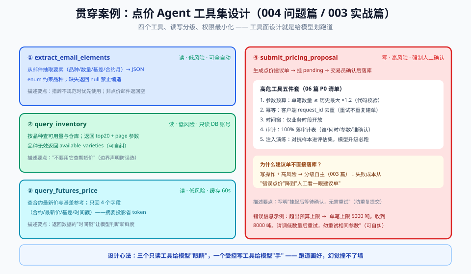

# 01 - 问题篇：为什么纯聊天不够用

> 【本节问题】① 交易员问"现在能点价吗"，纯聊天模型会怎么翻车？② 四类翻车现场各自对应什么机制缺口？③ CTRM 系统里哪些环节天然是"行动"而非"对话"？④ 为什么"把数据库查询结果复制粘贴给模型"也不是答案？

---

## 1. 一个真实的早晨

交易员对 AI 助手说：**"现在 CU2509 还有货吗？价格怎么样？帮我点价 50 吨。"**

纯聊天模型的回答大概率是：

> "您好！CU2509 目前库存情况良好，价格约 78,500 元/吨，我可以帮您提交点价申请。请提供您的交易账号……"

三个问题：库存数是**编的**、价格是**编的**、"帮您提交"是**空话**——模型没有任何提交动作，它只是在生成"像客服的下一句话"。

## 2. 四类翻车现场（以及背后的机制缺口）

| 翻车现场 | 例子 | 机制缺口 |
|---|---|---|
| **① 知识截止** | 问今天的期货价，模型还停在训练截止日 | 模型权重是静态快照，不联网不查库 |
| **② 数字幻觉** | 编造库存 320 吨（实际 180 吨） | 自回归只是预测"像真的"的 token，没有事实校验（002 卡 4） |
| **③ 无法行动** | 说"帮您提交申请"但什么都没发生 | 模型输出只有文本，没有触达外部系统的通道 |
| **④ 算不可靠** | 保证金 78500×50×9% 算成 350,000 | LLM 不是计算器，位数一多错率飙升 |

其中 ②③ 是致命的：在 CTRM 场景，**一个编造的库存数字可能导致超卖点价，一句"已提交"可能导致交易员错过锁价窗口**。

- **一句话人话**：模型是个读过全世界的实习生——知识渊博但没有工牌，碰不了你的任何系统，还特别好面子，不知道的也硬答。
- **生活类比**：请了一位只出主意的顾问，他不能替你按转账按钮，你也不会希望他"凭印象"报账户余额。

## 3. 行动鸿沟：对话与系统的四个断层

把 001 篇"点价申请要素抽取"再往前推一步，你会发现业务流程是一串**动作**，不是一段**文本**：

```text
问库存（动作）→ 查期货价（动作）→ 判断点价窗口（推理）→ 建申请单（写操作）
→ 发确认邮件（写操作）→ 汇报结果（对话）
```

| 断层 | 聊天模型的表现 | 需要的能力 |
|---|---|---|
| 数据时效 | 编/用旧知识 | 实时查询通道 |
| 计算精度 | 估算 | 确定性计算工具 |
| 状态变更 | 口头承诺 | 有鉴权的写接口 |
| 流程编排 | 靠用户逐条喂 | 模型自主决定下一步调什么 |

## 4. "那我把查询结果复制给它"行不行？

交易员自己查好行情粘给模型？**是缓解，不是解法**：

1. **用户变成了搬运工**——Agent 的价值就是消灭搬运，搬运回来了还叫什么 Agent；
2. **粘贴内容不可控**——长页面贴进来，token 爆炸且混入无关内容（001：attention budget 被摊薄）；
3. **写操作永远解决不了**——查库存可以人肉搬运，"帮我建单"没法人肉搬运。

结论：**模型必须获得一条"说人话 → 调真实系统"的受控通道**，这条通道就是工具调用。

## 5. 解法的完整定义（预告后续篇章）

给模型接上工具，本质上要回答四个问题，正好对应后面四篇：

| 问题 | 答案在哪 |
|---|---|
| 通道的**协议**长什么样（字段、格式、谁发给谁） | 02 概念篇 + 03 原理篇 |
| 通道上跑的**接口**怎么设计（描述、参数、错误） | 04 进阶篇 |
| 三家厂商的通道**实现**有什么差别（SDK 代码） | 05 实战篇 + 07 对比篇 |
| 通道**上了生产**怎么不出事（超时、注入、权限） | 06 生产篇 |

而贯穿案例的工具集就是下面这四个（在 04 篇逐一定义，在 05 篇三家 SDK 跑通）：



---

## 【本节自测】

1. "编造库存数字"和"口头承诺已提交"，分别对应哪两个机制缺口？
2. 为什么说 LLM 不是计算器？大数乘法错在哪个环节？
3. 用户自己粘贴查询结果给模型，这个方案的两个致命缺陷是什么？
4. CTRM 点价流程里，哪一步是纯推理、哪三步是必须走工具的动作？
5. "行动鸿沟"这个词里，"鸿沟"两边的分别是什么？
6. 如果只允许你给点价 Agent 配**一个**工具，你选哪个？为什么？
7. 从 001 篇的"要素抽取"到本篇的"自主点价"，模型的角色发生了什么变化？
8. 预判题：工具调用上线后，"模型调错工具"和"模型编参数"哪个更危险？你的第一直觉是什么？（04/06 篇会验证）

> 答案要点：① ②→知识/事实校验缺口；③→行动通道缺口 ② 大数逐位接龙，无算术电路 ③ 用户变搬运工 + 写操作无法搬运（还有 token 污染）④ 判断点价窗口=推理；查库存/查价/建单（+发邮件）=动作 ⑤ 一边是文本生成，一边是真实系统状态 ⑥ 没有标准答案，参考思路：create_price_apply（写操作最难人肉替代）或 get_futures_price（信息密度最高）——重点是你能论证 ⑦ 从"被喂材料的格式化器"变成"自主决定调什么的执行发起者" ⑧ 记录直觉，学完 04/06 回来对答案
