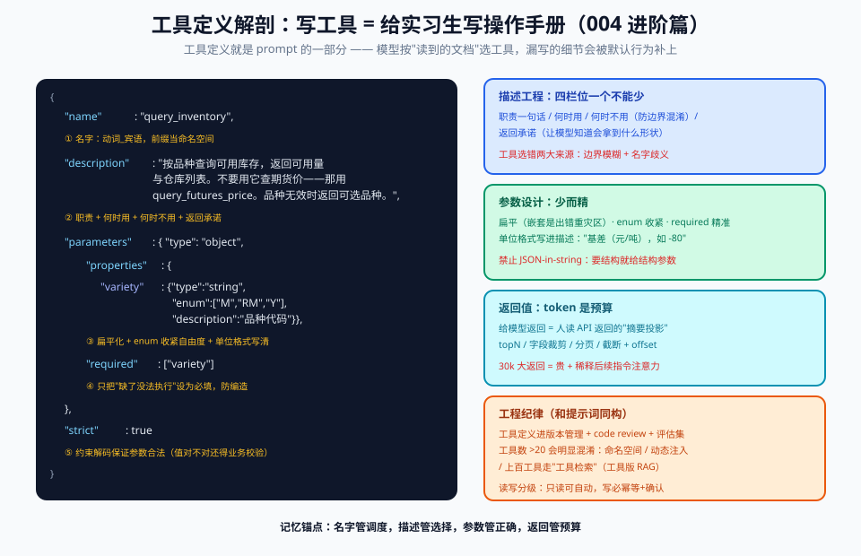

# 02 - 概念篇：核心概念精讲（12 张概念卡）

> 【本节问题】tools 数组长什么样、谁发给谁？tool_calls 和 tool_result 怎么配对？并行调用、强制调用、strict mode 各解决什么问题？工具描述为什么值得当接口文档来写？幻觉参数和工具 token 成本怎么理解？

> 每张卡：【一句话人话】→【生活类比】→【技术要点】→【常见坑】。代码示例以 OpenAI Chat Completions 形态为准（最通用），三家差异见 07-对比篇。

---

## 卡 1：tools 数组与 JSON Schema（请求侧定义）

- **一句话人话**：tools 是你递给模型的"工具清单"，每件工具附带一份 JSON Schema 格式的"使用说明书"。
- **类比**：新员工入职发的《可代办事项手册》——每项写清楚叫什么、干嘛用、要你提供哪些信息（必填项）。
- **技术要点**：每个工具 = `name`（标识符）+ `description`（自然语言说明）+ `parameters`（JSON Schema：类型/枚举/必填/描述）。Schema 里每个参数也可以带 `description`——模型填参数时主要看它。
- **坑**：name 用中文或带空格会直接被拒（用 `snake_case`）；Schema 不是越花哨越好——`oneOf`/深层嵌套会拉高模型出错率，各家对支持子集也有差异（07 篇）。

## 卡 2：tool_calls / function_call（响应侧输出）

- **一句话人话**：模型想用工具时，不会说"我想查库存"，而是**直接吐出一张填好的调用单**：工具名 + JSON 参数。
- **类比**：不是喊"我要寄快递"，而是把面单填好贴在包裹上——收件人、地址、物品一字不差，就等你揽收。
- **技术要点**：OpenAI 形态在 assistant 消息上挂 `tool_calls` 数组，每项含 `id`（`call_xxx`）、`function.name`、`function.arguments`（**JSON 字符串，要 json.loads**）；Anthropic 形态是 content 里的 `tool_use` block（`input` 已是解析好的对象）；Gemini 是 parts 里的 `functionCall`。出现 tool_calls 时 `finish_reason`/`stop_reason` 通常为 `tool_calls`/`tool_use`。
- **坑**：① OpenAI 的 `arguments` 是**字符串不是对象**，忘记 loads 是新手第一坑；② 并行调用时数组里有**多项**，循环处理时漏掉只取 `[0]`；③ arguments 可能是**不合法 JSON**（未开 strict 时），try/except 必须有。

## 卡 3：tool role 与 tool_result（结果回填）

- **一句话人话**：你执行完真实函数后，把结果以一条"工具消息"的形式**贴回对话历史**，模型读它继续生成。
- **类比**：实习生把填好的调用单交出去，你把盖章的回执**贴回他的工位白板**——他下一步的思路完全取决于回执上写了什么。
- **技术要点**：OpenAI 用 `role: "tool"` + `tool_call_id` 配对；Anthropic 把 `tool_result` block 放在下一条 **user 消息**里（配对键 `tool_use_id`，可带 `is_error: true`）；Gemini 用 `functionResponse` part。配对键错了直接 400。
- **坑**：① 回填消息的顺序/位置各家有讲究（OpenAI 要求 tool 消息紧跟 assistant 的 tool_calls；Anthropic 要求 tool_result 在 user 消息里）；② 结果必须是**字符串或受支持的结构**，直接塞对象会报错；③ 多轮之后历史里残留的工具结果会持续吃 token（06 篇讲清理）。

## 卡 4：stop_reason / finish_reason（循环的指挥棒）

- **一句话人话**：模型用这个字段告诉你"这轮我为什么停笔"——是想调工具、还是话说完了。
- **类比**：外卖骑手 App 的状态字段——"取餐中/配送中/已送达"，你的调度逻辑全靠读它。
- **技术要点**：工具循环的关键分支：`tool_calls`/`tool_use` → 执行并回填、继续循环；`stop`/`end_turn` → 正常收尾退出；`length`/`max_tokens` → 被截断（工具 JSON 可能残缺！）；`content_filter` → 被拦。
- **坑**：① 拿 `stop_reason` 前先假设 tool_calls 一定存在——**别这么写**，要按状态分支；② `max_tokens` 截断时的 arguments 半截 JSON 一解析就炸；③ Anthropic 还会返回 `pause_type`/`refusal` 等新值，switch 要有 default 分支。

## 卡 5：并行工具调用（Parallel Tool Calls）

- **一句话人话**：模型在一轮回复里**同时开多张调用单**——查库存和查价互不依赖，没必要排队。
- **类比**：好助理打两个电话同时问供应商报价，而不是打完一个再打下一个。
- **技术要点**：OpenAI 默认开启（`parallel_tool_calls=true`），设 `false` 强制每轮最多一调；Anthropic 默认并行，在 `tool_choice` 里用 `disable_parallel_tool_use: true` 关闭；Gemini 天然支持一轮多个 `functionCall`。**客户端并行执行后按各自 id 回填**。
- **坑**：① 有**先后依赖**的工具（先建单、后发邮件）要靠提示词或关闭并行来约束顺序；② Qwen 思考模式不支持并行（07 篇）；③ OpenAI 内置工具（web_search 等）与并行互斥；④ 微调模型一轮多调时 strict 会被禁用（官方文档注明的坑）。

## 卡 6：tool_choice / 强制工具调用

- **一句话人话**：旋钮，控制模型"必须/可以/不许"用工具——从全自动到全手动。
- **类比**：驾驶模式——auto 是自动驾驶、required 是"今天必须走高速"、指定函数是"导航到这个目的地"、none 是手动挡。
- **技术要点**：四档通用语义：`auto`（默认，模型自己定）/ `required` / `any`（Anthropic 的"必调"）/ 指定工具（OpenAI `{"type":"function","name":...}`、Anthropic `{"type":"tool","name":...}`、Gemini `mode="ANY"+allowed_function_names`）/ `none`。OpenAI Responses 还独有 `allowed_tools`（不删工具清单、限定本轮可用子集，保住 prompt caching）。
- **坑**：① 强制调用适合"结构化抽取"伪装成工具，但**不适合多轮 Agent 循环**（每轮都被迫调工具会死循环）；② `none` 是"临时禁用不删定义"的好办法，删了定义会破坏缓存前缀；③ 强制指定工具时模型仍可能把**参数值**填错——强制的是调用，不是正确性。

## 卡 7：strict mode 与结构化输出（json_schema）

- **一句话人话**：给参数 JSON 上"物理约束"——模型在解码时**写不出**违反 Schema 的 token。
- **类比**：表单把省写成下拉框而不是文本框——不是"提醒别填错"，是"想错都错不了"。
- **技术要点**：OpenAI `strict: true` 基于 Structured Outputs（约束解码，2024-08 上线），要求 `additionalProperties: false` 且**所有字段必须出现在 required**（可选字段用 `type: ["string","null"]` 表达），不满足会 400 并列出缺失项；Responses API 会**尝试自动归一化**为 strict，不能归一则回退并在响应里标 `strict: false`；Chat Completions 默认非 strict。**Anthropic 没有 strict mode**（靠 schema 遵从训练 + 提示）；Qwen 在 `/beta` 端点提供 strict（Beta）；DeepSeek 不支持。
- **坑**：① strict 的代价是 Schema 子集受限（不支持任意 oneOf 等）；② "结构对了"≠"值对了"——`quantity: -50` 结构合法但业务荒谬，**业务校验永远在你侧**；③ Gemini 的 `VALIDATED` 模式（Gemini 3 起连带强制 required 参数）是对齐 strict 的路线（官方 function calling 文档）。

## 卡 8：工具描述工程（description engineering）

- **一句话人话**：description 不是注释，是**模型选工具的唯一依据**——等于把 Swagger 文档+使用教程+避坑指南浓缩成三行话。
- **类比**：菜单上的菜名+配图+小字说明——客人（模型）全靠它决定点什么；写"chef's choice"客人就盲选。
- **技术要点**：高分描述的骨架：**一句话功能 + 何时该用 + 何时不该用/与谁区分 + 参数含义与格式示例**。Anthropic 官方建议描述要"给一个刚入职、聪明但对你系统零上下文的 contractor 看"。
- **坑**：① 缺"不该用"的边界 → 相近工具乱选（`get_futures_price` vs `get_spot_price` 不写清楚，模型五五开）；② 把业务黑话塞进描述而不解释（"点价"要不要展开？——对内系统可以不展开，通用系统要展开）；③ 描述改动 = 上下文前缀变了 = **prompt caching 失效**（002 卡 12），改描述要像改代码一样走评审。

## 卡 9：命名空间与工具命名

- **一句话人话**：工具多了以后，用**前缀/分组**给名字分地盘，防止模型在几百个工具里迷路。
- **类比**：大公司通讯录按"财务-张三 / 法务-李四"编组，而不是全公司叫"张三/李四"。
- **技术要点**：常见做法：前缀命名（`ctrm_get_inventory`、`mail_send_confirm`）；或清单分层注入（先列目录再按需加载细节，MCP 的 tool search 思路）；OpenAI `allowed_tools` 做本轮子集限制。工具数量上：Anthropic 建议 ≤ 64（实测过 64+ 会有选择质量下降风险），实践上"模型能挑准"的甜蜜区通常在 **10~20 个以内**（见卡 10）。
- **坑**：① 名字起成 `do_something`/`process_data` ——模型完全无法从名字推断；② 动词+名词是行业惯性（`get_/create_/send_`），违背它等于给模型加阅读理解题；③ 前缀变了 = 模型训练时见过的惯例变了，小模型尤其敏感。

## 卡 10：工具选择准确性（Tool Selection Accuracy）

- **一句话人话**：模型面对工具清单时"选对工具、填对参数"的命中率——Agent 可靠性的第一道闸门。
- **类比**：话务员接电话的分诊准确率——分错科室，后面医术再高也白搭。
- **技术要点**：影响的变量：**工具数量**（越多越容易混）、**描述区分度**（近义工具必须写明互斥条件）、**参数复杂度**（嵌套越深幻觉越多）、**模型档位**（小型模型选择能力显著更弱）。专项评测看 **BFCL**（Berkeley Function-Calling Leaderboard，V4 版含多轮/网页/记忆等子项，07 篇解读榜单）。
- **坑**：① 准确率不是模型单方面的事——同一模型换个清单写法，命中率天差地别，**先优化清单再怪模型**；② 评测分数≠你的场景表现：BFCL 是通用场景，你的领域黑话（点价/升贴水）要自建小评测集；③ "偶尔选错"在生产里是必然事件，要按 06 篇的确认机制兜底，而不是指望 100%。

## 卡 11：幻觉参数（Parameter Hallucination）

- **一句话人话**：模型填参数时会**编造看起来合理的值**——尤其是必填信息缺失时，它倾向于"瞎猜一个凑齐"而不是反问你。
- **类比**：实习生不敢问领导，订单编号不知道就顺手填了个"123456"——格式全对，内容全错。
- **技术要点**：官方文档明确提示：缺必填参数时，小模型更可能**猜值**而非追问（Anthropic tool use 文档指出 Sonnet 在提示"先想再调"时才更可能追问）。防御组合拳：参数 `description` 里写"若用户未提供，不要编造，先反问" + 枚举约束 + 服务端业务校验 + 高危写操作人工确认（06 篇）。
- **坑**：① 幻觉参数比幻觉文本**危险一个量级**——它带着格式合法性直接进入你的业务代码；② 把 `user_id`、`account_id` 交给模型从对话里"提取"是高危设计，应改为**服务端注入**（登录态取，不信对话内容）；③ 日期格式（`2026-09-19` vs `09/19/2026`）是最常见的幻觉参数重灾区，Schema description 里必须给格式样例。

## 卡 12：工具 token 成本（Tool Token Cost）

- **一句话人话**：工具定义会**整段进入上下文**、按输入 token 计费——每轮对话都在为你的工具清单付"入场费"。
- **类比**：健身房把所有器械说明书印在会员卡背面——器械越多卡越厚，每次进门都要重读一遍。
- **技术要点**：一个四工具 CTRM 工具集的定义约 600~900 token；工具越多成本越高，且**每轮循环都重复计费**（除非命中 prompt caching——所以工具定义要放前缀最稳定的位置，别夹动态内容）。省钱三招：精简 Schema（去掉装饰性嵌套）、动态工具加载（只注入本轮相关的工具子集）、server 端工具（OpenAI Responses 内置工具的定义不在你的上下文里）。
- **坑**：① 以为工具"注册一次"就完事——**它是每轮请求的常驻开销**；② 在工具定义后面放时间戳等动态内容，缓存全废；③ Agent 长循环 20 轮，工具定义 × 20 轮 + 循环累积的工具结果，账单大头往往不是"回答"而是"过程"。

---

## 【本节自测】

1. OpenAI 的 `arguments` 和 Anthropic 的 `input`，一个什么类型一个什么类型？谁要手动 json.loads？
2. tool_call_id / tool_use_id 的作用是什么？配对错误会发生什么？
3. `finish_reason` 是 `max_tokens` 时，工具调用循环里会发生什么具体事故？
4. 三家的"必调一个工具"分别怎么写？（OpenAI / Anthropic / Gemini）
5. strict mode 的两个 Schema 硬性要求是什么？为什么"结构合法"仍然可能业务错误？
6. 为什么说改一个字的工具描述可能引发账单波动？（两个机制联动）
7. 工具数量从 5 个加到 60 个，哪三类指标会恶化？
8. 防"幻觉参数"的三层防御分别是什么？为什么 user_id 不该让模型填？
9. 60 token 的工具描述 × 30 轮循环 × 每天一万次会话，估算量级并说出两个省钱机制。
10. 哪张卡的机制解释了"为什么模型能被一份工具清单改变行为"？（下一章从原理层面展开）

> 答案要点：① 字符串 vs 已解析对象；OpenAI ② 用 id 把"调用单"与"回执"绑定；400 或上下文错乱 ③ arguments 半截 JSON 解析失败/工具未执行就退出，需检测重试 ④ required / any / mode=ANY(+allowed_function_names) ⑤ additionalProperties:false + 全字段 required；值域合法性（负数量）不在 Schema 能力内 ⑥ 前缀变化使 prompt caching 失效 + 描述影响选择准确率（行为回归）⑦ 选择准确率↓ / token 成本↑ / 响应质量（注意力摊薄）↓ ⑧ Schema 约束（枚举/描述）→ 提示词（不编造）→ 服务端校验+人工确认；user_id 属身份鉴权信息，必须服务端注入防伪造 ⑨ 60×30×10000≈1800 万 token/天量级（还要乘循环累积）；prompt caching + 动态工具子集 ⑩ 卡 1+卡 12 合起来：工具定义进上下文 → 影响采样（03 篇正式展开）
