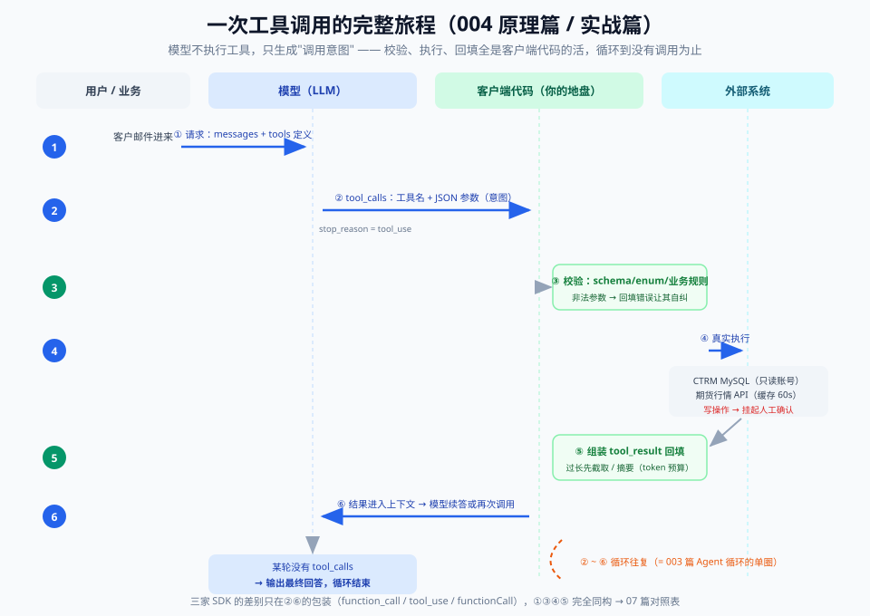

# 03 - 原理篇：一次工具调用的完整旅程

> 【本节问题】① 从请求发出到结果生成，一次工具调用经历哪五步？② 为什么说"模型不执行工具，只生成调用意图"？③ 从采样视角看，工具定义凭什么改变模型行为？④ 多轮循环什么时候停？谁来决定停？



---

## 1. 五步旅程：请求 → 调用单 → 执行 → 回填 → 续写

以 CTRM 场景为例，交易员说"查一下 CU2509 的库存和最新价"。四个角色登场：**用户**（人）、**模型**（API 侧）、**客户端**（你的 Java/Python 服务）、**外部系统**（MySQL/行情接口/邮件服务器）。

### 第 ① 步：请求带上 tools 定义

```text
POST /v1/chat/completions
{ "messages": [...对话历史...],
  "tools": [ {工具定义×4：name/description/parameters} ] }
```

工具定义**不是独立通道**，而是被序列化进 prompt 的普通 token（03 节采样视角的关键伏笔）。

### 第 ② 步：模型输出 tool_calls（stop_reason）

模型读完"库存该查、价格该查、两个都能查"后，决定**本轮不写自然语言**，输出：

```json
{ "role": "assistant",
  "tool_calls": [
    {"id": "call_a", "function": {"name": "get_inventory", "arguments": "{\"commodity\": \"CU2509\"}"}},
    {"id": "call_b", "function": {"name": "get_futures_price", "arguments": "{\"contract\": \"CU2509\"}"}} ],
  "finish_reason": "tool_calls" }
```

注意：**两个调用并行发出**（卡 5），客户端此刻可以选择并发执行。

### 第 ③ 步：客户端执行真实函数

```java
// 你的 Java 服务里，这才是一切真实发生的地方
Map<String,Object> result = switch (name) {
    case "get_inventory"    -> inventoryService.query(args.get("commodity"));   // SELECT ... FROM stock
    case "get_futures_price"-> quoteService.latest(args.get("contract"));       // 行情接口
    ...
};
```

- **这里是权限、校验、审计、幂等的全部所在**（06 篇）。
- 模型在此步**什么都不做**——它已经结束了这次生成，等待下一轮。

### 第 ④ 步：结果以 tool_result 回填

```json
{ "role": "tool", "tool_call_id": "call_a", "content": "{\"commodity\":\"CU2509\",\"warehouse\":\"上海保税\",\"quantity\":180,\"unit\":\"吨\"}" }
{ "role": "tool", "tool_call_id": "call_b", "content": "{\"contract\":\"CU2509\",\"price\":78520,\"ts\":\"2026-09-19 10:31\"}" }
```

把 assistant 消息 + 两条 tool 消息**追加进 messages**，重新发起请求（第 ⑤ 步 = 又一次第 ① 步）。

### 第 ⑤ 步：模型续写——回答或再调工具

模型读回执后二选一：信息齐了 → 生成自然语言回答（`finish_reason: stop`，循环结束）；还缺 → **继续开调用单**（回到第 ② 步）。

**- 一句话人话：模型像坐在玻璃房里的调度员——它只能填单子、看回执、再填单子，永远碰不到外面的世界；搬运和执行全是玻璃房外的你。**

## 2. 铁律：模型不执行工具，只生成调用意图

三个推论，每个都值一次生产事故的反思：

| 推论 | 含义 | 你必须做的 |
|---|---|---|
| **执行权=控制权** | 模型"想"调 `create_price_apply`，不代表业务上**该**调 | 写操作前置校验+人工确认（06 篇） |
| **参数是生成的不是取的** | 参数值来自模型对上下文的"续写"，不是从数据库取的 | 身份类参数服务端注入；业务参数服务端校验 |
| **模型对执行结果零感知** | 在回填之前，模型不知道工具成没成功 | 失败要显式回填错误信息，不能静默吞掉 |

## 3. 采样视角：为什么一份工具清单能改变模型

002 篇讲过：LLM 是自回归接龙机，每步在词表上输出一个概率分布，逐 token 采样（002 卡 4）。工具调用的全部"魔法"就发生在这里：

1. **工具定义进入上下文**：name/description/Schema 作为普通 token 混在 prompt 里；
2. **上下文改变分布**：attention 机制让"接下来该输出什么"的概率被整段上下文重塑——清单里出现 `get_inventory` + JSON Schema 后，模型在"自然语言"与"`{"name": "get_inventory", ...}`"两种续写之间产生真实概率质量；
3. **训练强化格式**：这些模型经过大量工具调用格式的 SFT/RLHF（002 卡 6），tool_calls 这种 token 序列本身被训练成高概率输出——模型不是"理解"了工具，是**学会了在合适上下文里生成这种格式**。

- **一句话人话**：工具清单不是开关，是**语料**——你在 prompt 里放置的每一个字，都在悄悄挪动下一个 token 的概率。
- **生活类比**：你把一张《可代办事项清单》放在实习生桌上，他接下来的发言就自然会围绕清单展开——不是被"下指令"，是被"环境塑形"。

这解释了 02 篇的三个现象：**描述改动影响选择准确率**（分布被重塑）、**幻觉参数**（续写惯性：编一个格式正确的值是最"顺"的续写）、**strict mode 有效**（约束解码直接把非法 token 的概率清零——物理层面的分布截断）。

## 4. 循环与停止：谁来决定结束？

```text
while True:
    resp = llm(messages, tools)            # ① + ②
    if resp.finish_reason != "tool_calls": # stop / length / filter
        return resp.text                   # 自然语言收尾
    for tc in resp.tool_calls:             # ③ 并行执行
        results = execute(tc)
    messages += [assistant_msg, *tool_msgs]# ④ 回填
    # 循环继续 → ⑤
    if loop_count > MAX_TURNS:             # 生产必备：外部刹车
        messages.append(system("已达工具轮次上限，请直接总结当前结论"))
```

停止条件三来源：**模型自停**（`stop`）、**被截断**（`length`，要当事故处理）、**你踩刹车**（`MAX_TURNS`+降级提示）。最后一项不是可选项——失控循环 = 失控账单（02 篇卡 12 的 30 轮场景就是这么来的）。

## 5. 常见异常旅程（原理层的排错地图）

| 症状 | 旅程断点 | 根因 |
|---|---|---|
| 模型不调工具，直接编答案 | ② | 描述不清/清单没进请求；或模型判断上下文已够（往往判断错） |
| arguments 解析炸了 | ② | 未开 strict + 长嵌套 Schema；或 `max_tokens` 截断 |
| 400：tool_call_id 找不到 | ④ | 回填顺序错/漏带 assistant 原消息/键拼错 |
| 模型看到结果后说"工具失败了"但其实成功了 | ④ | 回填的 content 里包了报错壳子/编码问题 |
| 循环 20 轮停不下来 | ⑤ | 错误信息不可恢复（06 篇）或没设 MAX_TURNS |

---

## 【本节自测】

1. 五步旅程分别发生在哪个角色上？哪一步是模型唯一"在场"的两步？
2. "模型不执行工具"的三个推论里，哪一条直接决定了写操作必须人工确认？
3. 从采样视角解释：为什么把 `get_futures_price` 的描述写得更详细，模型就更容易选它？
4. 为什么说 strict mode 是"物理层面"的约束？它和提示词里写"请输出合法 JSON"的本质区别？
5. 并行调用时第 ③④ 步有什么额外要求？（对比串行）
6. 循环的三种停止方式分别是什么？哪种必须由你实现？
7. `finish_reason=length` 时应该怎么处理？直接把半截 arguments 解析一下凑合用行不行？
8. 回填 tool_result 时静默吞掉异常（content=""），模型会怎么表现？为什么？
9. 用 002 篇的哪个概念解释"工具定义是常驻开销"？（两章知识连线）
10. 推理模型的思考 token 出现在五步旅程的哪个位置？它会计费吗？（002 卡 10 + 本篇）

> 答案要点：① ①②⑤在模型、③在客户端、④在双方之间；模型在 ①②⑤（即每次 API 调用）在场 ② "参数是生成的不是取的"+"执行权=控制权" ③ attention 重塑概率分布，描述 token 参与竞争，被描述强化的调用序列概率上升 ④ 约束解码直接屏蔽非法 token；提示词只是概率软引导，约束是分布硬截断 ⑤ 并发执行 + 每个结果必须按各自 id 回填、数量要一一对应 ⑥ 模型自停/截断/外部刹车；外部刹车 ⑦ 视为事故：重试该轮或降低 max_tokens 影响面；不行——半截 JSON 语义不完整 ⑧ 模型会把空结果理解为"成功但无数据"或反复重调；上下文里没有失败信号 ⑨ prompt caching 与上下文窗口（前缀复用）⑩ 在 ② 的输出里（tool_calls 之前可能有 reasoning/thinking 块）；计费，按输出 token
