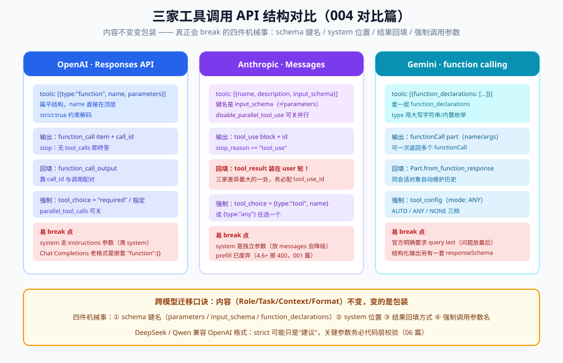

# 07 - 对比篇：各家工具调用 API 差异与选型

> 【本节问题】① 三家工具定义的结构差异一张表能装下吗？② BFCL 榜单怎么看？③ DeepSeek/Qwen 兼容 OpenAI 格式有什么坑？④ 强制调用各家怎么写？⑤ 跨模型迁移四件机械事是什么？

---

## 1. 三家 API 结构对照表（2026-09，写代码前对表）

| 维度 | OpenAI（Responses API） | Anthropic（Messages） | Gemini |
|---|---|---|---|
| 请求侧工具字段 | `tools=[{type:"function", name, description, parameters}]`（**扁平**） | `tools=[{name, description, input_schema}]` | `tools=[{function_declarations:[…]}]` |
| 模型输出意图 | output 里的 `function_call` item（含 `call_id`） | content 里的 `tool_use` block（含 `id`） | `functionCall` part（含 `name/args`） |
| 结果回填 | `function_call_output`（user 后续输入，配 `call_id`） | `tool_result` block（**装在 user 轮**，配 `tool_use_id`） | `Part.from_function_response`（同会话） |
| 停止信号 | output 无 function_call | `stop_reason=="tool_use"` | 响应无 functionCall |
| 强制调用 | `tool_choice`（"required"/指定函数） | `tool_choice={type:"tool", name}` | `tool_config`（mode: ANY） |
| strict 模式 | `strict:true`（schema 约束解码） | 支持 schema 部分约束 | 结构化输出另一套 responseSchema |
| 并行调用 | 默认可并行，`parallel_tool_calls` 可关 | 默认可并行（disable_parallel_tool_use 可关） | 支持多 functionCall |
| system 位置 | `instructions` 参数 | **独立 `system` 参数** | `system_instruction` |

**跨模型迁移口诀（回扣 001 篇）**：内容不变变包装。真正会 break 的是**四件机械事**：system 位置、schema 键名（parameters vs input_schema）、结果回填方式（call_id vs tool_result vs function_response）、强制调用参数名。

## 2. BFCL 榜单怎么读（Berkeley Function-Calling Leaderboard）

- 测什么：简单/多重/并行/多重轮次调用 + **可执行类**（真实环境执行验证，AST 静态校验之外的真刀真枪）+ 相关性（不该调用时能不能忍住）
- **"相关性"维度最值得看**：模型在"没有合适工具"时选择直答而不是硬调工具——生产幻觉调用的主要来源
- 读榜姿势：看**与你任务同类的子集分数**（点价抽取看"多重调用 + 可执行"），不要只看总分；榜单口径更新快，引用时注明版本月份（截至 2026-09 头部商用模型在可执行类普遍 70~80%+，具体以当期榜单为准）

## 3. DeepSeek / Qwen：OpenAI 兼容格式的坑

| 坑 | 现象 | 处置 |
|---|---|---|
| 字段宽松 | 部分端点忽略 `strict`，schema 约束变"建议" | 关键参数自己做代码层校验（06 篇护栏），别赌 strict |
| 并行调用 | 老版本端点一次只出一个 call | 循环回填逻辑写成"每次可能 0/1/N 个"的通用形状（05 篇代码已是） |
| tool_choice | 支持度参差 | 强制调用不可用时用 prompt 显式要求 + 代码校验兜底 |
| 工具描述语言 | 中文描述对国产模型常更稳 | 描述写中文、枚举值保持英文代码（001 篇混合提示） |

**通用兜底**：把"工具选择 + 参数生成"当普通结构化输出任务看，评估集里加"错误工具诱惑"样本（相关但不该调工具的输入），哪家都别免检。

## 4. 选型速裁（点价场景）

| 场景 | 推荐 | 理由 |
|---|---|---|
| 抽取/路由这类高频轻活 | 便宜模型 + 少量只读工具 | 调用面简单，成本敏感 |
| 多步点价建议生成 | 强模型 + 全量工具 + 高危挂起 | 语义复杂，错一步代价大 |
| 私有化/国产化要求 | DeepSeek/Qwen + 代码层校验加固 | 兼容格式迁移成本低 |
| 工具要跨多个 agent 宿主复用 | **别停在 FC，上 MCP（006）** | FC 是"单模型私有协议"，MCP 是"跨应用分发标准" |

---

## 【本节自测】

1. 三家 schema 键名三连？（要点：parameters / input_schema / function_declarations）
2. Anthropic tool_result 为什么放 user 轮？（要点：协议约定；三家最大差异）
3. BFCL"相关性"维度测什么？为什么生产最该看？（要点：不该调时忍住；幻觉调用是生产事故源）
4. 国产兼容端点的两个高频坑与兜底？（要点：strict 不生效→代码层校验；并行支持参差→通用回填形状）
5. FC 和 MCP 的关系一句话？（要点：发动机和国标油口——FC 是模型怎么调，MCP 是工具怎么标准化分发，不互斥）
