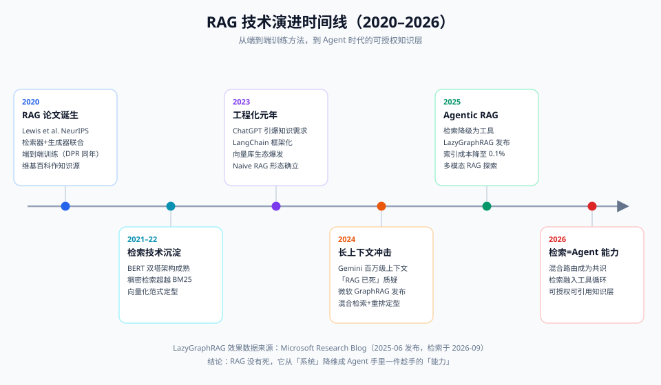

# 00-背景篇：RAG 前史与全景

> 【本节问题】① RAG 是什么时候、由谁提出来的？② 在 RAG 之前人们怎么做机器问答？③ 2023~2026 这几年 RAG 经历了哪些阶段？④ 到 2026 年的今天，RAG 在企业 AI 版图里处于什么位置？

## 1. RAG 的前史：它站在信息检索的肩膀上

RAG 不是凭空发明的。它 = **信息检索（IR）传统** + **神经生成模型** 的合流：

| 年代 | 技术 | 遗产 |
|---|---|---|
| 1970s~ | 布尔检索、倒排索引 | 图书馆式的"关键词命中"范式，今天的 Elasticsearch 仍是它 |
| 1994 | BM25（Robertson 等提出概率检索框架） | 至今仍是关键词检索的天花板，RAG 混合检索中的一路 |
| 2013 | word2vec | "语义可以用向量表示"的起点 |
| 2018~2019 | BERT、DPR 的前奏 | 双塔/交叉编码器架构成型 |
| 2020.03 | DPR（Karpukhin et al.） | 稠密段落检索证明向量检索在 QA 上超越 BM25 |
| 2020.05 | **RAG 论文**（Lewis et al., Facebook AI, NeurIPS 2020） | 正式提出 Retrieval-Augmented Generation：把维基百科检索器接进 seq2seq 生成器 |

关键认知：RAG 论文里的 RAG 是一个**模型训练方法**（端到端微调检索器+生成器）；今天工程界说的 RAG 是**无训练的系统架构**（冻结的 LLM + 外挂检索）。一词两义，面试要能分清。

## 2. 2023：工程化元年

ChatGPT 引爆后，企业最急的三件事恰好都是 RAG 的靶子：

1. **知识陈旧**：模型训练截止日之后的事一概不知；
2. **私有知识缺失**：公司合同模板、业务规则不在任何公开语料里；
3. **幻觉**：一本正经编造，企业场景不可接受。

于是 RAG 从论文走向工程：LangChain、LlamaIndex 框架化，Milvus/Qdrant/Weaviate/pgvector 向量库爆发，"ChatDocs"类产品满天飞。这个阶段的典型形态是 **Naive RAG**：切块 → 向量化 → top-k 召回 → 塞进 prompt。

## 3. 2024：长上下文冲击与混合检索成熟

Gemini 1.5 把上下文推到百万 token，"把整个知识库塞进上下文"的声音四起，RAG 第一次遭遇生存质疑。但同年三件事巩固了 RAG：

- **微软 GraphRAG 发布**：用知识图谱 + 社区摘要解决"全局性问题"（原始 GraphRAG 索引成本极高，约 3.3 万美元量级/大数据集）；
- **混合检索成为标配**：BM25 + 向量双路召回 + RRF 融合 + cross-encoder 重排的两阶段范式定型；
- **"Lost in the Middle"**（Liu et al., 2023）结论被广泛引用：长上下文中间部分的信息利用率显著下降——长 ≠ 全记得住。

## 4. 2025~2026：从"系统"降维成"能力"

- **LazyGraphRAG**（微软，2025-06 发布）：把 LLM 摘要推迟到查询时执行，索引成本降到全量 GraphRAG 的约 0.1%，全局查询质量持平且查询成本低约 700 倍（来源：Microsoft Research Blog 及 2026 RAG 路线图综述，nemorize.com，检索于 2026-09）；微软 GraphRAG 库 2026-03 发布含性能优化的新版本，相关基准工作被 ICLR 2026 接收（来源：microsoft.github.io/graphrag）。
- **混合路由成为共识**：没有人再跑"纯 GraphRAG"或"纯向量 RAG"——查询分类器把简单事实题路由给向量 RAG、多跳关系题路由给 GraphRAG（来源：bestaiweb.ai 对比分析，检索于 2026-09）。
- **Agentic RAG**：检索不再是固定管线，而是 agent 的工具，何时查、查什么、查几轮由模型决策（详见 04 进阶篇，协议衔接 003 专题）。
- **模型侧**：embedding 与 rerank 都已"两阶段定型"——bi-encoder 召回 + cross-encoder 重排（详见 07 对比篇的模型选型表）。

## 5. 全景：RAG 到底解决什么

一句话：**RAG 把"知识"从模型权重里外置出来，变成可管理、可更新、可授权、可引用的数据资产。**

四个"可"，对应企业四大刚需：

| 可 | 需求 | CTRM 映射 |
|---|---|---|
| 可更新 | 知识新鲜度 | 2026 年新版点价规则上线，当天生效，不用等模型换代 |
| 可管理 | 内容治理 | 合同模板 v3.1 替换 v3.0，删旧索引即可 |
| 可授权 | 权限隔离 | 期货部与现货部各看各的规则库（多租户） |
| 可引用 | 可追溯/合规 | 答案标注"出自《点价操作手册》第 3.2 节"，审计可查 |

以及一个反向认知：RAG **不能**解决的事——模型推理能力本身的问题（多步算术、复杂逻辑）、格式遵循、语气风格（那是微调的活）。详见 07 对比篇的"RAG vs 长上下文 vs 微调"决策表。

## 【本节自测】

1. **2020 年的 RAG 论文和今天工程说的 RAG 有什么区别？**
   要点：前者是端到端训练方法（联合微调检索器与生成器）；今天是冻结 LLM + 外挂检索的系统架构，无需训练。
2. **BM25 是哪一年、什么框架下的产物？它在 2026 年的 RAG 里还有位置吗？**
   要点：1994 年概率检索框架；有——混合检索中的关键词召回一路，专治编号、品名、数值等精确匹配。
3. **2024 年 RAG 遭遇的最大质疑是什么？**
   要点：长上下文（百万 token）冲击——"直接塞进上下文不就行了"。
4. **GraphRAG 为什么最初普及慢、后来怎么破局的？**
   要点：原始版索引要海量 LLM 调用（成本约 $33K 量级/大数据集）；LazyGraphRAG（2025-06）把摘要推迟到查询时，索引成本降至约 0.1%（来源：Microsoft Research Blog）。
5. **用"四个可"总结 RAG 的企业价值，并各给一个 CTRM 例子。**
   要点：可更新（新规则当天生效）、可管理（模板版本替换）、可授权（部门隔离）、可引用（答案标出处）。
6. **RAG 解决不了哪类问题？**
   要点：模型自身推理/算力问题、风格与格式遵循——那是微调与 prompt 工程的地盘。
