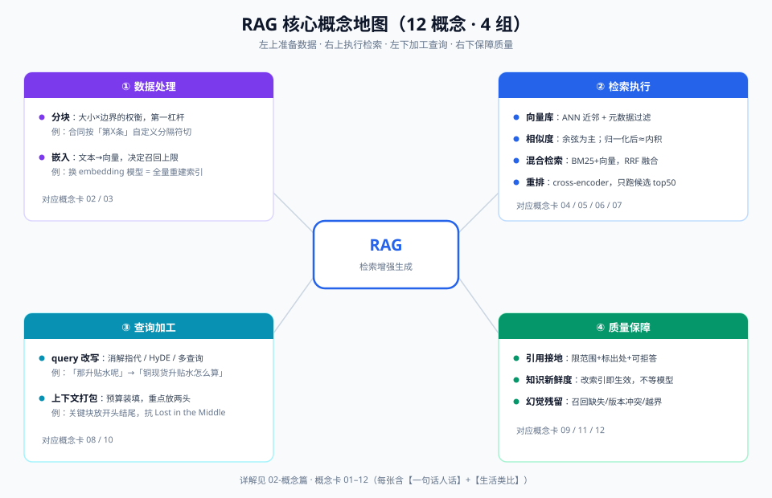

# 02-概念篇：核心概念精讲（12 张概念卡）

> 【本节问题】① RAG 的最小闭环是哪三步？② 分块、嵌入、向量库分别解决什么？③ 混合检索和重排为什么是"标配组合"？④ 引用接地、上下文打包、新鲜度、幻觉残留这四个质量概念怎么理解？

**使用说明**：每张卡 =【一句话人话】+【生活类比】+ 要点 + CTRM 映射 + 面试一句话。概念全景见下图。

---

## 卡 01：RAG 与三步闭环（索引 / 检索 / 生成）

- 【一句话人话】回答问题前先去资料库里把相关段落翻出来，让模型照着资料答，而不是凭记忆瞎猜。
- 【生活类比】开卷考试：平时不用把书背进脑子（不微调），考试时按题目翻书（检索），照着书页作答（生成），还能注明"答案在第 X 页"（引用）。
- 三步：**索引**（离线：文档→分块→向量→入库）→ **检索**（在线：问题→召回相关块）→ **生成**（块+问题→LLM→带引用答案）。
- CTRM 映射：把《点价操作手册》建成索引，交易员问"点价流程"时系统翻出 3.2 节再作答。
- 面试一句话：RAG 是用工程手段把"知识记忆"从参数转移到外部存储，换取可更新、可授权、可引用。

## 卡 02：分块 Chunking（固定 / 递归 / 语义 / 父子块）

- 【一句话人话】把长文档切成大小合适的段落，切太碎丢上下文，切太大塞不下也搜不准。
- 【生活类比】切蛋糕：块太大一块吃撑还挑不出想吃的口味；块太小只尝到一粒糖不知道是什么蛋糕。好的切法是沿奶油花纹切（语义边界）。
- 四种策略：

| 策略 | 做法 | 适用 | 坑 |
|---|---|---|---|
| 固定长度 | 每 N 字符切一刀 + 重叠 | 快糙猛 | 切断句子/表格 |
| 递归 | 按 `\n\n`→`\n`→`。` 逐级降级切 | **默认首选** | 参数需调 |
| 语义 | 相邻句 embedding 相似度骤降处切 | 长文质量高 | 索引成本高 |
| 父子块 | 小块用于检索、大块用于生成 | 手册/条款类 | 索引结构复杂 |

- CTRM 映射：合同模板按条款边界切（递归分隔符自定义"第X条"），绝不能把"违约责任"条款切成两半。
- 面试一句话：chunk_size 与 overlap 是 RAG 第一杠杆，没有之一——检索差先查切块。

## 卡 03：嵌入 Embedding

- 【一句话人话】把一段文字变成一串数字（向量），意思越近的段落数字越接近。
- 【生活类比】给每道菜写一张"口味指纹卡"（麻辣度、甜度、咸度……），以后问"想吃微辣偏甜"时按指纹比对，不用读菜名。
- 要点：bi-encoder 把 query 和文档各自独立编码成向量，速度快适合召回；模型决定语义天花板；**换 embedding 模型必须全量重建索引**。
- CTRM 映射："升贴水怎么算"能命中写着"溢价/折价的确定方式"的块——同义不同词也搜得到，这是 BM25 做不到的。
- 面试一句话：embedding 质量决定召回上限，rerank 只能在上限内排序。

## 卡 04：向量库

- 【一句话人话】专门存向量和做"最近邻搜索"的数据库，给你"最相似的 k 条"。
- 【生活类比】图书馆的智能检索台：你哼一段旋律，它把最像的几首歌抽出来给你——不用一柜一柜翻。
- 要点：核心是 ANN 近似最近邻算法（HNSW/IVF 等），牺牲一点精度换百倍速度；元数据过滤（租户/部门/时间）是生产必备能力。
- CTRM 映射：选型见 07 对比篇——Java+MySQL 团队最快路径是 pgvector，不必一上来上 Milvus。
- 面试一句话：向量库的本质 = 向量索引 + 元数据过滤 + CRUD，别只比"谁快"。

## 卡 05：相似度度量（余弦 / 内积 / L2）

- 【一句话人话】判断两个向量"像不像"的三种尺子：夹角、投影重合度、直线距离。
- 【生活类比】两个人口味像不像：看口味指纹的方向像（余弦）、重叠面积（内积）还是离得近（L2）。
- 要点：文本检索事实标准是**余弦相似度**；归一化后的向量余弦与内积等价（多数库归一化后用内积提速）；L2 受向量长度干扰，文本场景少用。
- CTRM 映射：无需选——用库默认余弦/内积即可，知道等价条件即可面试防坑。
- 面试一句话：归一化后 cosine ≡ 内积；不同库的 metric 参数名不同但语义一致。

## 卡 06：混合检索（BM25 + 向量 + RRF 融合）

- 【一句话人话】关键词检索和语义检索各搜一遍，把两份结果按排名合到一起。
- 【生活类比】招聘筛简历：HR 按硬关键词筛（"必须有 5 年 CTRM 经验"），主管按气质筛（"像是有大局观的人"），最后老板按两份名单的综合名次定面试名单。
- 要点：BM25 精确匹配强（编号/品名/数值），向量语义泛化强（同义改写）；**RRF（Reciprocal Rank Fusion）** 按名次融合：`score = Σ 1/(k + rank_i)`，k 常取 60，无需调分数纲。
- CTRM 映射："CU2509 合约点价保证金比例"——合约代码靠 BM25，"保证金比例"语义靠向量，单路都残。
- 面试一句话：纯向量检索对术语精确匹配是硬伤，混合检索几乎是生产默认。

## 卡 07：重排 Rerank

- 【一句话人话】先用便宜的召回抓 50 条，再用贵但准的模型给这 50 条重新排座次，取前几名。
- 【生活类比】海选看报名表 30 秒定去留（bi-encoder 快糙），决赛评委逐个上台细看（cross-encoder 慢准）。
- 要点：cross-encoder 把 query 和文档拼在一起过模型，精度高但不能预先索引，只能对候选实时打分；两阶段 = 效率与精度的标准折中。
- 常用模型：bge-reranker-v2-m3（开源、可私有化，常配 bge-m3）；Cohere Rerank（商用 API）。（来源：appscale.blog 2026 embedding 对比，检索于 2026-09）
- CTRM 映射：召回 50 条业务规则块，重排后取 top5 喂给 LLM——答案质量立竿见影。
- 面试一句话：rerank 是 RAG 里"性价比最高的最后一公里"，只跑 top50 控制成本（见 06 生产篇）。

## 卡 08：Query 改写（HyDE / 多查询 / 指代消解）

- 【一句话人话】用户问得糙，先让 LLM 把问题"翻译"成更容易被检索的形态再去搜。
- 【生活类比】听不懂方言的客服，先让接线员复述成标准普通话再派单。
- 三种：

| 技术 | 做法 | 治什么病 |
|---|---|---|
| HyDE | 让 LLM 先生成一个"假设答案"，拿它去搜 | 问句与答案文体不匹配 |
| 多查询 Multi-Query | 一个问题改写成 3~5 个角度分别搜，并集召回 | 表述单一漏召回 |
| 指代消解 | "它的保证金呢？"→"铜期货的保证金比例是多少？" | 多轮对话丢失主语 |

- CTRM 映射：多轮追问"那升贴水呢？"必须先改写成"铜现货升贴水怎么计算"再检索。
- 面试一句话：query 改写在查询侧投入最小、收益最稳，先做它再谈框架。

## 卡 09：引用接地（Grounded Citation）

- 【一句话人话】答案里的每个结论都要标注"来自哪块资料"，模型只能用检索到的内容作答。
- 【生活类比】论文脚注：不是"我听说"，而是"据《点价操作手册》3.2 节"——查证成本交给读者，可信度交给出处。
- 要点：prompt 模板强约束（"仅依据资料回答，标注 [资料 n]，资料不足则回答不知道"）；引用粒度到 chunk + 文档名/章节号。
- CTRM 映射：贸易合规场景答案必须可审计——"该说法出自《2026 点价规则》3.2 节"是上线门槛。
- 面试一句话：接地 = 约束生成范围 + 强制引用 + 允许拒答，三件套缺一不可。

## 卡 10：上下文打包（Context Packing）

- 【一句话人话】把重排后的资料块按预算装进 prompt：去重、按相关度排、重要内容放两头。
- 【生活类比】行李箱装箱：限重 20kg（token 预算），重的垫底（不重要放中间），常用放外袋（关键信息放开头结尾——对抗 Lost in the Middle）。
- 要点：token 预算 = 上下文窗口 − 系统提示 − 预留生成空间；相邻块合并去重；文档名+章节标题作为每块前缀。
- CTRM 映射：升贴水规则表格块 + 计算示例块相邻，打包时合并避免表格被拆散。
- 面试一句话：context packing 是"检索质量"到"生成质量"的搬运环节，搬运损耗常被忽视。

## 卡 11：知识新鲜度（Freshness）

- 【一句话人话】RAG 的知识 = 索引里的数据，数据一改答案立刻变新，不用等模型更新。
- 【生活类比】外卖菜单是屏幕上的（数据），店里菜谱改了菜单刷新就行；而"背下菜单"的服务员（模型参数）要重新培训才会知道新菜。
- 要点：索引更新策略（增量/全量/淘汰）见 06 生产篇；**换 embedding 模型是唯一必须全量重建的场景**。
- CTRM 映射：点价规则 9 月 1 日改版，8 月 31 日晚重嵌对应文档，9 月 1 日问答已是新版。
- 面试一句话：新鲜度是 RAG 区别于微调的第一卖点——数据操作 vs 模型训练。

## 卡 12：幻觉残留（Residual Hallucination）

- 【一句话人话】RAG 能大幅减少幻觉，但消灭不了——资料里没有的，模型仍可能"顺势编"。
- 【生活类比】开卷考也得防考生自由发挥：书里只有"升贴水由双方协定"，他偏写出"标准 50 元/吨"。
- 要点：三大残留源——①检索没召回（答非资料）→ 加 rerank/混合检索；②资料冲突（新旧版本并存）→ 索引只留最新版；③模型越界推理 → 引用接地 + 拒答模板 + 低 temperature。
- CTRM 映射：保证金比例写错一位小数就是资金风险——数字类答案必须逐字对照引用块。
- 面试一句话：被问"RAG 还有幻觉吗"——有，先归因到检索/冲突/越界三层再分别给解法。

## 【本节自测】

1. **RAG 三步闭环是什么？哪步在线哪步离线？**
   要点：索引（离线）/检索（在线）/生成（在线）。
2. **递归分块为什么是默认首选？**
   要点：兼顾语义边界与实现简单；固定分块易切断语义，语义分块索引成本高。
3. **为什么换了 embedding 模型必须全量重建索引？**
   要点：新旧模型的向量空间完全不同，不可比、不可混存。
4. **RRF 的公式和好处？**
   要点：score=Σ1/(k+rank)，k≈60；只依赖名次不依赖分数，免去两路分数量纲对齐。
5. **cross-encoder 为什么不能像 embedding 一样预先算好？**
   要点：它输入是 query+doc 拼接对，query 到了才能算，无法离线索引。
6. **HyDE 治什么病？**
   要点：问句与答案文体不匹配——用假设答案的"文体"去搜答案。
7. **引用接地要同时做哪三件事？**
   要点：约束生成范围、强制标注出处、允许答"不知道"。
8. **RAG 幻觉残留的三个来源与对应解法？**
   要点：召回缺失→混合检索+rerank；资料冲突→版本治理；模型越界→接地模板+拒答。
