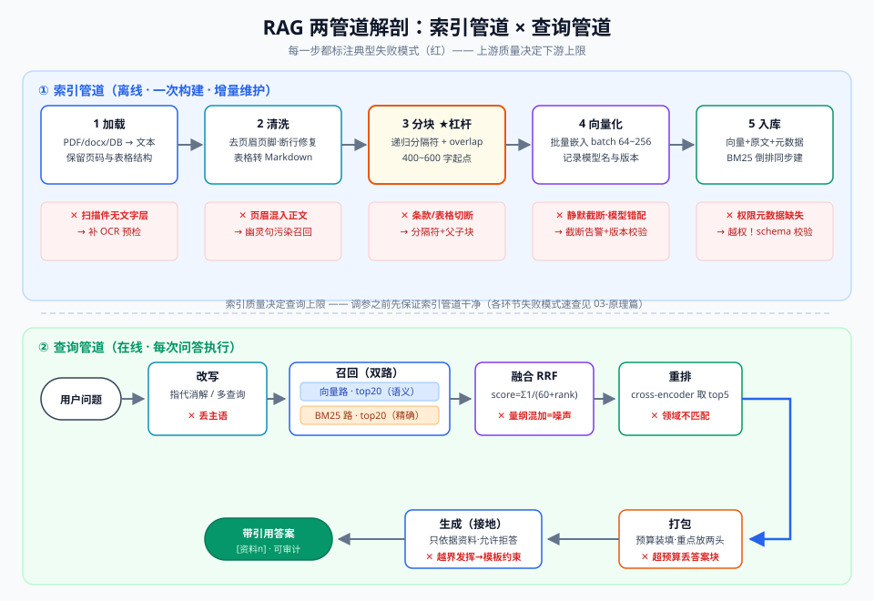
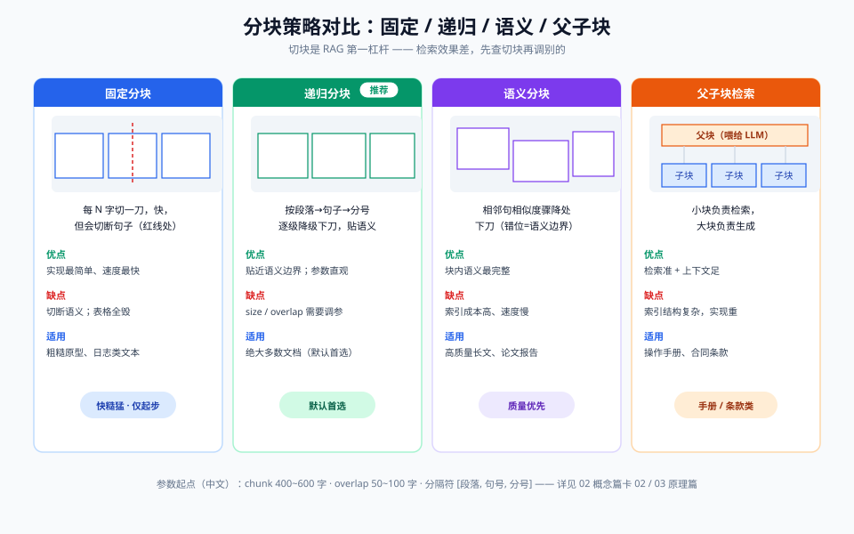
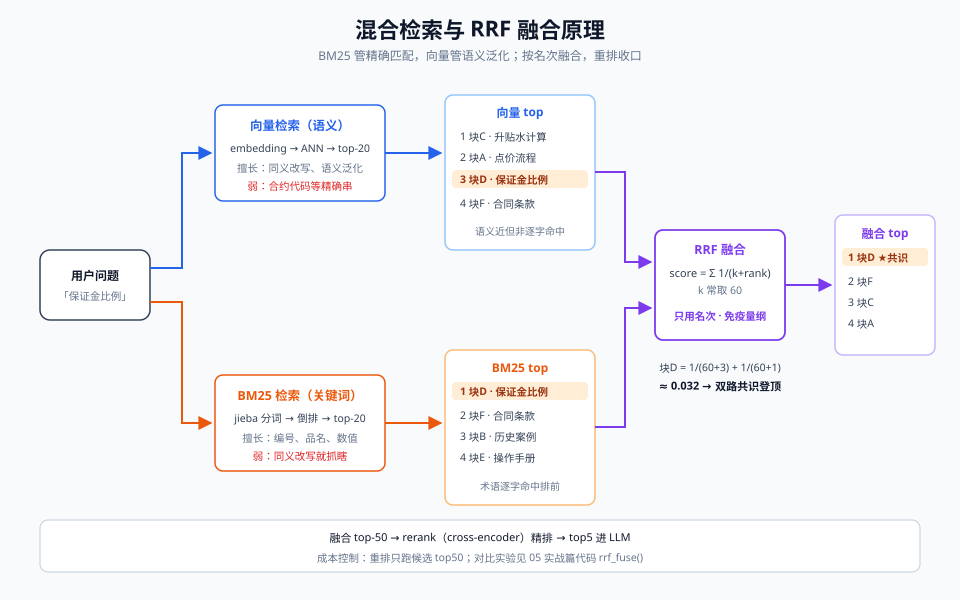

# 03-原理篇：检索管道解剖

> 【本节问题】① 一份 PDF 是怎么变成向量库里可检索的块的？② 用户一个问题进来，系统内部经过哪些环节？③ 每个环节会以什么方式失败？④ 哪些旋钮值得调、按什么顺序调？

RAG = 两条管道：**索引管道**（离线、一次构建增量维护）与**查询管道**（在线、每次问答跑一遍）。全景见下图，本章逐环节解剖。

## 一、索引管道：加载 → 清洗 → 分块 → 向量化 → 入库

### 1.1 加载（Load）

- **职责**：从 PDF/docx/HTML/Confluence/数据库把原始字节变成可解析文本。CTRM 场景四大来源：合同模板（docx/PDF）、业务规则（Word+表格）、操作手册（PDF+截图）、历史点价案例（数据库导出）。
- **工程要点**：PDF 用解析库时保留页码（引用要落到"第几页"）；数据库导出转 Markdown 表格。
- **失败模式**：扫描版 PDF 无文字层（要 OCR）；表格被解析成散乱文字（升贴水规则表全毁）。

### 1.2 清洗（Clean）

- **职责**：去页眉页脚水印、修复断行、统一全半角、表格转 Markdown、剔除目录与附录噪声。
- **工程要点**：清洗规则**按文档类型配置**（合同和手册的页眉模式不同）；保留标题层级作为后续分块的边界信号和元数据。
- **失败模式**：页眉"第 3 页 共 45 页"混进正文成为"幽灵句子"，被反复召回污染 top-k——这是新手最常踩也最不易察觉的坑。

### 1.3 分块（Chunk）—— 第一杠杆

- **职责**：把清洗后的长文切成检索友好的块。
- **策略对比**见下图（详见 02 概念篇卡 02）：

- **参数起点**（中文文本）：chunk_size 400~600 字，overlap 50~100 字，分隔符 `["\n\n", "\n", "。", "；"]` 递归切。
- **CTRM 要点**：合同按"第X条"自定义分隔符；带表格的块整体保留不拆。
- **失败模式**：切块切断语义（条款被腰斩）；块太小只有标题没有内容，召回一堆"第 3.2 条 升贴水"却无正文。

### 1.4 向量化（Embed）

- **职责**：每块 → embedding 向量（模型选型见 07 对比篇）。
- **工程要点**：批量调用（batch 64~256）；**入库时记录模型名与版本**（换模型=全量重建）；超长块先截断告警而不是静默丢弃。
- **失败模式**：embedding 模型静默截断超长输入（第 1000 字之后的内容根本没进向量，召回后看起来"答非所问"）；索引时用了模型 A、查询时用了模型 B（向量空间不通，全库检索失灵）。

### 1.5 入库（Index）

- **职责**：向量 + **原文** + **元数据**（文档名/章节/页码/版本/租户/部门/生效日期）写入向量库；同时建 BM25 倒排索引。
- **工程要点**：元数据中 `tenant_id`/`dept` 字段是权限过滤的生命线（06 生产篇）；原文必须存（生成靠原文，不靠向量反解）。
- **失败模式**：元数据缺失导致权限过滤失效（多租户事故级）；只存向量不存原文。

### 索引管道失败模式速查表

| 环节 | 典型失败 | 症状 | 解法 |
|---|---|---|---|
| 加载 | 扫描件无文字层 | 该文档永远召回不到 | OCR 预检 |
| 清洗 | 页眉页脚污染 | 召回块里有"第X页" | 按类型配清洗规则 |
| 分块 | 语义被切断 | 答案缺半句 | 递归分隔符+overlap |
| 向量化 | 超长静默截断 | 块后半内容失效 | 截断告警 |
| 入库 | 元数据缺权限字段 | 越权召回 | 入库 schema 校验 |

## 二、查询管道：改写 → 召回 → 融合 → 重排 → 打包 → 生成

### 2.1 改写（Rewrite）

多轮指代消解 + 可选多查询/HyDE（见 02 概念篇卡 08）。**失败模式**：改写丢信息（把"含税价"改没了）；多查询扩大召回也扩大噪声。

### 2.2 召回（Recall）—— 双路并行

- **向量路**：改写后 query → embedding → 向量库 top-k（k 取 20~50，给后面重排留余量）。
- **关键词路**：BM25（中文需分词，jieba）top-k 同量级。

- **失败模式**：只走向量路，"CU2509"这类合约代码匹配不到（embedding 对短代码不敏感）；query 向量空间与库不一致（1.4 的坑在查询端爆发）。

### 2.3 融合（Fuse）

RRF 按名次合并两路结果：`score(d) = Σ 1/(60 + rank_i(d))`。**失败模式**：用原始分数直接加权（BM25 分数无上界、余弦在 [-1,1]，量纲不通，直接相加等于噪声融合）。

### 2.4 重排（Rerank）—— 性价比之王

cross-encoder 给融合后的 top50 重新打分，取 top3~8。**失败模式**：rerank 模型与语料领域差异过大（金融/贸易术语表现差，需领域微调或换模型）；对 top500 全量重排（延迟和费用爆炸，见 06 生产篇"只跑 top50"）。

### 2.5 打包（Pack）

去重、相邻合并、按预算装填、关键内容放开头结尾（对抗 Lost in the Middle）、每块前缀"【文档名·章节·页码】"。**失败模式**：超预算静默丢块且不告警；丢的恰好是含答案的块。

### 2.6 生成（Generate）

引用接地模板 + 低 temperature + 允许拒答。**失败模式**：模型无视资料自由发挥（幻觉残留，02 概念篇卡 12）；引用编号对不上（模板没把资料编号传稳）。

### 查询管道失败模式速查表

| 环节 | 典型失败 | 症状 | 解法 |
|---|---|---|---|
| 改写 | 指代丢失主语 | 追问时答错对象 | 多轮消解 |
| 召回 | 术语/代码漏召回 | 问 CU2509 搜不到 | 补 BM25 路 |
| 融合 | 分数量纲混加 | 结果顺序怪异 | 用 RRF |
| 重排 | 领域不匹配 | 好块被压后 | 换/调 rerank 模型 |
| 打包 | 超预算丢答案块 | 明明召回了却答错 | 预算监控+告警 |
| 生成 | 越界发挥 | 编造数字 | 接地模板+拒答 |

## 三、调优旋钮与顺序

| 优先级 | 旋钮 | 建议动作 |
|---|---|---|
| P0 | chunk_size/overlap/分隔符 | 检索差先查切块（02 概念篇卡 02） |
| P0 | 清洗规则 | 有"幽灵句"先去页眉 |
| P1 | 混合检索 + RRF | 加 BM25 路，治代码/编号漏召回 |
| P1 | rerank | 接入即涨点，只跑 top50 |
| P2 | query 改写 | 多轮对话先做指代消解 |
| P2 | top_k / 预算 | k 给重排留余量；预算宁大勿丢 |

**调参心法**：先用评估集量化（06 生产篇 RAGAS），改一个旋钮测一次——一次改三个等于白调。

## 【本节自测】

1. **索引管道五步分别是什么？哪一步是"第一杠杆"？**
   要点：加载→清洗→分块→向量化→入库；分块。
2. **"幽灵句子"是什么环节的什么失败？**
   要点：清洗环节，页眉页脚混入正文被反复召回污染 top-k。
3. **embedding 环节的两个静默坑？**
   要点：超长输入静默截断；索引与查询用了不同模型（向量空间不一致）。
4. **RRF 与"分数直接加权"的区别？**
   要点：RRF 只用名次，免疫两路分数量纲差异。
5. **top_k 为什么取 20~50 而不是直接取 3？**
   要点：给融合和重排留余量，召回阶段宁可多不能漏（召回是上限，重排做精度）。
6. **查询管道哪一步"性价比最高"？**
   要点：rerank——接入即涨点，成本可控（只跑 top50）。
7. **为什么原文必须入库，不能只存向量？**
   要点：生成靠原文；向量无法可靠反解文本。
