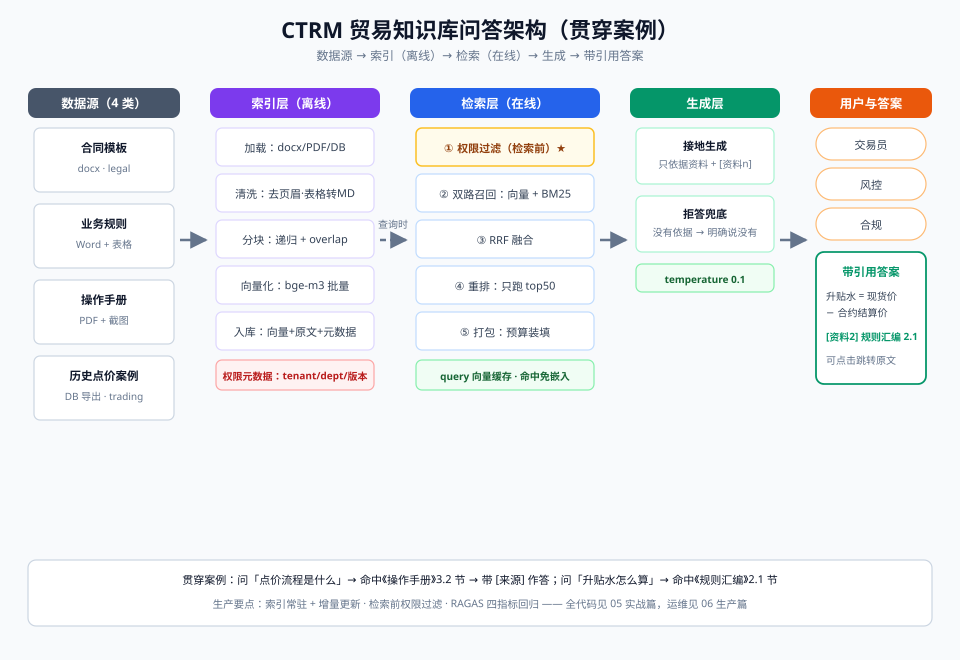

# 05-实战篇：从零搭建贸易知识库问答（Python 全代码）

> 【本节问题】① 不用 LangChain 框架，一个最小可跑的 RAG 需要多少代码？② 递归分块、BM25、RRF 手写出来长什么样？③ rerank 怎么接（商用 API 和本地模型两条路）？④ CTRM 多租户权限过滤在代码里怎么落？

## 0. 目标与架构

跑通后的效果：

```text
问：点价流程是什么？
答：点价流程分四步：①确认点价指令……[来源: 点价操作手册 · 3.2节]
问：升贴水怎么算？
答：升贴水 = 现货成交价 − 对应合约结算价，买卖双方按品种协定……[来源: 业务规则汇编 · 2.1节]
```

端到端架构（本章代码逐块实现下图每一格）：



## 1. 环境准备

```bash
# Python 3.10+
pip install openai chromadb rank_bm25 jieba
# 可选 rerank 二选一：
pip install cohere                 # 路 A：Cohere Rerank API
pip install sentence-transformers  # 路 B：本地 bge-reranker-v2-m3
```

## 2. 全量代码（单文件 `ctrm_rag.py`，约 260 行）

```python
# -*- coding: utf-8 -*-
"""
CTRM 贸易知识库问答：最小可跑 RAG
- 向量库: chromadb      - 关键词: rank_bm25 + jieba
- 融合:   手写 RRF      - 重排: cohere 或本地 bge-reranker（可选）
- embedding: 任意 OpenAI 兼容接口（OpenAI / 通义 / 智谱 / DeepSeek 等均可，
  修改 base_url 与 model 即可；国内私有化推荐 bge-m3，见 07 对比篇）
"""
import os
import jieba
import chromadb
from openai import OpenAI
from rank_bm25 import BM25Okapi

# ========== 0. 配置 ==========
EMBED_MODEL  = os.getenv("EMBED_MODEL", "text-embedding-3-small")
CHAT_MODEL   = os.getenv("CHAT_MODEL",  "gpt-4o-mini")   # 换成你的兼容端点模型
TOP_K_RECALL = 20    # 每路召回条数（给融合/重排留余量，见 03 原理篇）
RRF_K        = 60    # RRF 平滑常数
RERANK_N     = 5     # 最终喂给 LLM 的条数
CONTEXT_BUDGET = 3000  # 打包 token 预算（按字符粗估，中文 1 字≈0.7 token）

llm = OpenAI()      # 需要 OPENAI_API_KEY；兼容端点再传 base_url=...
emb = OpenAI()      # 可指向不同 base_url

# ========== 1. 语料：CTRM 示例文档（生产中来自 docx/PDF/DB 导出） ==========
DOCS = [
    {"id": "d1", "title": "点价操作手册", "sec": "3.2 触发点价", "dept": "trading",
     "text": "点价流程分四步：①买方在合约到期前向交易部提交点价指令，注明品种、合约月份与点价数量；"
             "②交易员在期货市场按指令执行买入/卖出保值头寸；③成交后系统自动生成分批点价确认单，"
             "双方经办人当日复核签字；④财务按确认单登记应收应付并释放保证金占用。单笔点价数量不得低于 300 吨。"},
    {"id": "d2", "title": "业务规则汇编", "sec": "2.1 升贴水", "dept": "trading",
     "text": "升贴水的确定：升贴水 = 现货成交价 − 对应期货合约结算价。正值为升水，负值为贴水。"
             "买卖双方应在合同订立时按品种协定基准升贴水；实际结算升贴水按交割地与基准地运费差异调整。"},
    {"id": "d3", "title": "业务规则汇编", "sec": "2.4 保证金", "dept": "risk",
     "text": "点价业务保证金比例：一般客户按合约价值的 10% 收取；信用评级 AA 及以上客户可下浮至 8%；"
             "连续两个交易日涨停的品种次日上调 3 个百分点。保证金低于维持线时系统自动推送追保通知。"},
    {"id": "d4", "title": "合同模板说明", "sec": "5.1 价格调整条款", "dept": "legal",
     "text": "背靠背合同的价格调整条款：上游采购价与下游销售价须采用同一期货合约月份为定价基准，"
             "调价周期一致，不得出现单边敞口。若上游为含税价而下游为不含税价，应在补充协议中明确税率承担方。"},
    {"id": "d5", "title": "历史点价案例", "sec": "2025Q3-CU-017", "dept": "trading",
     "text": "2025 年三季度 CU2509 合约案例：客户在贴水扩大至 180 元/吨时锁定 1200 吨点价，"
             "较均价提前两周完成，规避了后续贴水收窄风险。经验：贴水扩大期分 3 批点价，每批间隔 2 个交易日。"},
]

# ========== 2. 递归分块（02 概念篇卡 02：块 400 字 + overlap 80，按语义分隔符降级） ==========
def recursive_split(text: str, size: int = 400, overlap: int = 80) -> list[str]:
    if len(text) <= size:
        return [text]
    for sep in ["\n\n", "\n", "。", "；"]:
        parts = [p for p in text.split(sep) if p.strip()]
        if len(parts) > 1:
            chunks, cur = [], ""
            for p in parts:
                cand = (cur + sep + p) if cur else p
                if len(cand) > size and cur:
                    chunks.append(cur)
                    cur = cur[-overlap:] + p      # overlap 保证边界语义连续
                else:
                    cur = cand
            if cur:
                chunks.append(cur)
            return [c for c in chunks if c.strip()]
    # 无分隔符可用：硬切
    step = size - overlap
    return [text[i:i + size] for i in range(0, len(text), step)]

# ========== 3. embedding（批量调用） ==========
def embed(texts: list[str]) -> list[list[float]]:
    resp = emb.embeddings.create(input=texts, model=EMBED_MODEL)
    return [d.embedding for d in resp.data]

# ========== 4. 索引管道：分块 → 向量化 → 入库（向量库 + BM25） ==========
def build_index():
    chunks = []           # 每条: {doc_meta..., "text": 块原文}
    for d in DOCS:
        for i, seg in enumerate(recursive_split(d["text"])):
            chunks.append({**d, "chunk_id": f'{d["id"]}-{i}', "text": seg})

    client = chromadb.Client()
    col = client.get_or_create_collection("ctrm_kb", metadata={"hnsw:space": "cosine"})
    col.upsert(
        ids=[c["chunk_id"] for c in chunks],
        embeddings=embed([c["text"] for c in chunks]),
        documents=[c["text"] for c in chunks],
        metadatas=[{"title": c["title"], "sec": c["sec"], "dept": c["dept"]} for c in chunks],
    )

    tokenized = [list(jieba.lcut(c["text"])) for c in chunks]
    bm25 = BM25Okapi(tokenized)
    return col, bm25, chunks

# ========== 5. 双路召回（检索前权限过滤！） ==========
def vector_search(col, query: str, dept: str, k=TOP_K_RECALL):
    qv = embed([query])[0]
    r = col.query(query_embeddings=[qv], n_results=k,
                  where={"dept": dept})               # ← 检索前过滤：无权限的块根本不进上下文
    return list(zip(r["documents"][0], r["ids"][0]))

def bm25_search(bm25, chunks, query: str, dept: str, k=TOP_K_RECALL):
    toks = list(jieba.lcut(query))
    scores = bm25.get_scores(toks)
    ranked = sorted(zip(scores, chunks), key=lambda x: -x[0])
    return [(c["text"], c["chunk_id"]) for s, c in ranked[:k] if s > 0 and c["dept"] == dept]

# ========== 6. 手写 RRF 融合（score = Σ 1/(K + rank)） ==========
def rrf_fuse(list_a, list_b, k=RRF_K):
    pool = {}
    for rank, (_text, cid) in enumerate(list_a, 1):
        pool[cid] = pool.get(cid, 0.0) + 1.0 / (k + rank)
    for rank, (_text, cid) in enumerate(list_b, 1):
        pool[cid] = pool.get(cid, 0.0) + 1.0 / (k + rank)
    return sorted(pool.items(), key=lambda x: -x[1])          # [(chunk_id, rrf_score)]

# ========== 7. 重排（可选，两选一；不装包则跳过，RRF 名次兜底） ==========
def rerank(query, candidates, chunks):
    text_of = {c["chunk_id"]: c["text"] for c in chunks}
    docs = [text_of[cid] for cid, _ in candidates]

    # 路 A：Cohere Rerank API
    if os.getenv("COHERE_API_KEY"):
        import cohere
        co = cohere.Client(os.getenv("COHERE_API_KEY"))
        res = co.rerank(model="rerank-multilingual-v3.0",
                        query=query, documents=docs, top_n=RERANK_N)
        return [docs[r.index] for r in res.results]

    # 路 B：本地 bge-reranker-v2-m3（首次运行自动下载，需 GPU 或耐心 CPU）
    global _cross_encoder
    try:
        _cross_encoder
    except NameError:
        from sentence_transformers import CrossEncoder
        _cross_encoder = CrossEncoder("BAAI/bge-reranker-v2-m3")
    scores = _cross_encoder.predict([(query, d) for d in docs])
    top = sorted(range(len(docs)), key=lambda i: -scores[i])[:RERANK_N]
    return [docs[i] for i in top]

# ========== 8. 打包（预算内装填，来源前缀显式编号） ==========
def pack_context(docs: list[str]) -> str:
    out, used = [], 0
    for i, d in enumerate(docs, 1):
        if used + len(d) > CONTEXT_BUDGET:
            break                                   # 宁可少放，不可静默丢答案块而不告警
        out.append(f"[资料{i}] {d}")
        used += len(d)
    return "\n\n".join(out)

# ========== 9. 生成（引用接地三件套：限范围 + 标来源 + 允许拒答） ==========
SYSTEM = (
    "你是中基集团 CTRM 贸易知识库助手。只依据【资料】回答；"
    "每个结论标注 [资料n]；资料不足以回答时，回答'知识库中未找到依据'。禁止编造数字。"
)

def answer(query: str, dept: str = "trading"):
    col, bm25, chunks = build_index()               # demo 每次重建；生产中索引常驻，见 06 生产篇
    hits = rrf_fuse(vector_search(col, query, dept),
                    bm25_search(bm25, chunks, query, dept))
    try:                                            # rerank 可选，失败则用 RRF 前 N 兜底
        docs = rerank(query, hits, chunks)
    except Exception:
        text_of = {c["chunk_id"]: c["text"] for c in chunks}
        docs = [text_of[cid] for cid, _ in hits[:RERANK_N]]

    ctx = pack_context(docs)
    msg = llm.chat.completions.create(
        model=CHAT_MODEL, temperature=0.1,
        messages=[{"role": "system", "content": SYSTEM},
                  {"role": "user", "content": f"【资料】\n{ctx}\n\n【问题】{query}"}],
    )
    return msg.choices[0].message.content

# ========== 10. 演示 ==========
if __name__ == "__main__":
    for q in ["点价流程是什么？", "升贴水怎么算？"]:
        print(f"\n问：{q}\n答：{answer(q)}")
```

## 3. 代码与原理的对照表

| 代码位置 | 对应原理（03 原理篇） | 关键点 |
|---|---|---|
| `recursive_split` | 索引管道·分块 | 分隔符降级 + overlap |
| `embed` | 索引管道·向量化 | 批量调用；生产要记录模型版本 |
| `build_index` | 索引管道·入库 | 向量 + 原文 + 元数据三样都存 |
| `vector_search` 的 `where` | 权限过滤 | **检索前过滤**，无权限块不进上下文 |
| `bm25_search` | 查询管道·召回 | jieba 分词；只对同 dept 打分 |
| `rrf_fuse` | 查询管道·融合 | 只用名次，免疫量纲 |
| `rerank` | 查询管道·重排 | cross-encoder 只跑候选集 |
| `pack_context` | 查询管道·打包 | 预算装填 + 来源编号 |
| `SYSTEM` 模板 | 查询管道·生成 | 接地三件套 |

## 4. 从 demo 到生产的差距清单

| # | demo 做法 | 生产做法 | 见 |
|---|---|---|---|
| 1 | 每次问答重建索引 | 索引常驻 + 增量更新 | 06 生产篇 |
| 2 | `dept` 硬编码 | 租户/部门从登录态注入 | 06 生产篇 |
| 3 | 无评估 | RAGAS 四指标 + 评估集 | 06 生产篇 |
| 4 | 无缓存 | query 向量缓存 | 06 生产篇 |
| 5 | 单文件 | 服务化（Java 侧可用 HTTP 包一层给 Vue 2.7 前端） | — |

给 Java 团队的落地建议：把 `ctrm_rag.py` 用 FastAPI 包成 `/ask` 接口，CTRM 的 Vue 2.7 前端与 Java 11 后端照常调用——RAG 是独立服务，不需要改写主系统。

## 【本节自测】

1. **代码里权限过滤在哪一行实现？为什么放在召回阶段而不是生成阶段？**
   要点：`vector_search` 的 `where={"dept": dept}`；检索前过滤保证无权限内容根本不进入候选池（检索后过滤会造成 top-k 缺口）。
2. **`recursive_split` 的 overlap 起什么作用？**
   要点：相邻块重叠保证被切断的边界语义在两块中都完整。
3. **`rrf_fuse` 为什么只用名次不用原始分数？**
   要点：BM25 分数无上界、余弦相似度有界，量纲不同不能相加。
4. **rerank 失败时代码怎么兜底？**
   要点：except 后直接取 RRF 融合前 RERANK_N 条——重排是增强不是依赖。
5. **`pack_context` 超预算时为什么 break 而不是截断？**
   要点：截断会产生半块污染上下文；break 丢弃整块且生产中应告警。
6. **把 demo 变生产，最先要改的三件事？**
   要点：索引常驻+增量更新、权限从登录态注入、建立评估集与指标。
