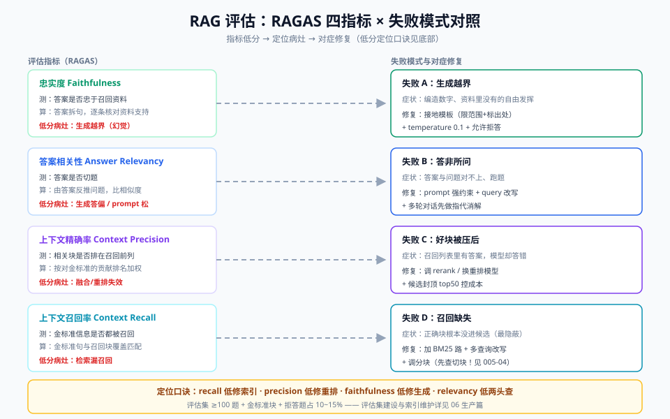

# 06-生产篇：评估、索引维护与成本

> 【本节问题】① RAG 上线后怎么量化"答得好不好"？② 评估集怎么建？③ 文档天天改，索引怎么更新？④ 多租户权限过滤为什么必须检索前？⑤ token 成本从哪里省？

## 一、评估：RAGAS 四指标

RAGAS 是目前事实标准的 RAG 自动评估框架。四个指标各管一段管道，**低分能直接定位病灶**：

| 指标 | 测什么 | 计算思路 | 低分说明哪坏了 |
|---|---|---|---|
| **Faithfulness 忠实度** | 答案是否忠于资料 | 把答案拆成陈述句，逐条核对能否由召回内容支持 | 生成端越界（幻觉）——查接地模板/temperature |
| **Answer Relevancy 答案相关性** | 答案是否切题 | 由答案反向生成若干"可能的问题"，与原问题算相似度 | 生成端答偏——查 prompt 约束 |
| **Context Precision 上下文精确率** | 召回块里相关块是否排在前面 | 召回块按与金标准的贡献排序，算排名加权精度 | 重排/融合失效——好块被压后 |
| **Context Recall 上下文召回率** | 金标准答案的信息是否都被召回覆盖 | 金标准答案的句子与召回块做覆盖匹配 | 检索端漏召回——查分块/混合检索 |

- 【一句话人话】faithfulness 管"没瞎编"，relevancy 管"答的是所问"，precision 管"给模型的资料干净"，recall 管"该给的资料给了"。
- 【生活类比】阅卷：没抄错书（忠实）、答的是这道题（切题）、草稿纸没杂讯（精确）、需要的参考页都翻到了（召回）。
- **定位口诀**：recall 低修索引（分块/召回），precision 低修重排，faithfulness 低修生成约束，relevancy 低两头都查。

## 二、评估集建设

没有评估集的调参都是玄学。最小可行评估集：

| 组成 | 数量起点 | 来源 |
|---|---|---|
| 真实问题 | 100~200 | 客服记录/业务群提问日志采样（CTRM：业务群里天天有人问规则） |
| 金标准答案 | 同上 | 业务专家确认（或 LLM 初稿+人工校对） |
| 金标准块 | 每题 1~3 个 | 专家指出"答案应出自哪段"（context recall 必需） |
| 拒答题 | 占 10~15% | 故意问知识库里没有的，验证"不知道"能力 |
| 困难题 | 占 20% | 多跳/表格/数值精确匹配，防止评估集太软 |

要点：评估集**版本化**（同 06 索引变更一起管理）；每次改动管道跑全量回归；指标趋势比单次绝对值重要。

## 三、索引更新策略

| 策略 | 触发条件 | 做法 | 风险 |
|---|---|---|---|
| **增量更新** | 文档内容修订（最常见） | 按 `updated_at` 找变更文档 → 删旧块 → 重新分块嵌入 upsert | 新旧版本并存导致答案冲突 |
| **全量重建** | **换 embedding 模型/换分块策略**（唯一必选场景） | 新 collection 双写 → 灰度切流 → 下线旧库 | 成本高；务必先在新库跑评估回归 |
| **淘汰** | 文档下线/过期 | 按 doc_id 删全部块（含 BM25 侧） | 漏删某路索引导致"僵尸块"仍被召回 |

- 【生活类比】增量=单点改菜谱改那一页；全量=换菜单版式整本重印（字体变了所有页都要重排——embedding 换模型同理，向量空间整个变了）；淘汰=下架的菜要从所有菜单渠道撤掉。
- **版本治理铁律**：同一文档同一时间**只允许一个生效版本**在索引里，旧版必须淘汰——"新旧并存"是答案自相矛盾的头号根因（02 概念篇卡 12 幻觉残留源②）。
- CTRM 例：9 月 1 日点价新规生效，8 月 31 日晚增量更新新文档、淘汰旧版块，并跑一遍"点价流程"评估子集回归。

## 四、权限过滤：检索前 vs 检索后

| | 检索前过滤（query 时 where） | 检索后过滤（取回再删） |
|---|---|---|
| 做法 | 向量库查询带 `where={"tenant":..., "dept":...}` | 先取 top-k 再在代码里删无权限项 |
| **top-k 缺口** | 无——k 条全部有效 | **有**——若 10 条中 7 条无权限，实际只剩 3 条，答案质量骤降 |
| 信息泄露 | 无权限块从未进入候选 | 无权限块已出现在管道中间（日志/调试时易泄露） |
| 性能 | 索引支持元数据过滤时开销小 | 少量预取开销 |

**裁定：多租户（CTRM 就是）必须检索前过滤。** 检索后过滤仅可用于权限维度单一、可预取超大 k 的内部场景——而且还要防中间态泄露。配合 03 原理篇"入库 schema 校验"（权限字段缺失的块禁止入库）形成闭环。

## 五、成本优化

按性价比排序的清单：

| 优先级 | 手段 | 原理 | 收益量级 |
|---|---|---|---|
| P0 | **query 向量缓存** | 同 query 不重复 embedding；命中率随用户量上升 | embedding 调用省 30%+ |
| P0 | **rerank 只跑 top50** | cross-encoder 最贵，候选集封顶 | 重排成本与延迟可控 |
| P1 | embedding 批处理 | batch 64~256 摊薄网络往返 | 索引吞吐翻倍 |
| P1 | 生成端缓存 | （问题，知识版本）为 key 缓存答案；知识更新时失效 | 高频 FAQ 场景省生成大头 |
| P2 | 小模型路由 | 简单改写/分类用小模型，生成才用大模型 | token 费用分级 |
| P2 | 检索前过滤顺带省 token | 权限过滤收窄候选，打包更聚焦 | 间接收益 |

成本监控最小集：每请求记录 `召回数/重排候选数/输入 token/输出 token` 四个数字，周报看趋势——成本劣化往往来自索引悄悄膨胀（忘淘汰旧块）。

## 六、上线检查单（浓缩版）

1. 评估集 ≥100 题且含拒答题，四指标有基线；
2. 多租户检索前过滤 + 入库 schema 校验；
3. 文档更新 SOP：增量更新 + 版本淘汰 + 回归评估；
4. rerank 候选封顶 + query 向量缓存；
5. 答案带来源（文档/章节/页码），可审计。

## 【本节自测】

1. **RAGAS 四指标分别是什么？各对应哪段管道？**
   要点：faithfulness（生成/越界）、answer relevancy（生成/切题）、context precision（重排融合）、context recall（检索召回）。
2. **context recall 低，先修什么？**
   要点：检索端——分块策略、召回路数、混合检索；不是先改 prompt。
3. **哪种情况必须全量重建索引？**
   要点：换 embedding 模型（或换分块策略）；向量空间不可比，且要做灰度与回归。
4. **"新旧版本并存"会导致什么？铁律是什么？**
   要点：答案自相矛盾（幻觉残留源之一）；同一文档同时只允许一个生效版本。
5. **检索后过滤的两大问题？**
   要点：top-k 缺口（无权限项占坑）与中间态泄露；多租户必须检索前。
6. **为什么 rerank 只跑 top50？**
   要点：cross-encoder 逐对打分最贵；50 条已覆盖融合后有效候选，封顶控成本。
7. **评估集为什么必须含拒答题？**
   要点：验证"知识库没有时答不知道"的能力——企业场景宁可不答不能编。
