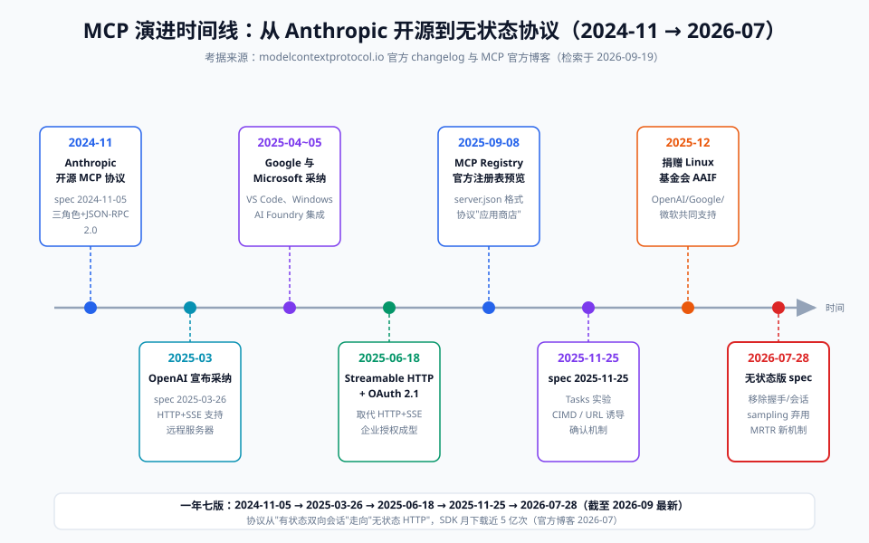

# 00-背景篇：MCP 前史与全景

> 【本节问题】① 在 MCP 之前，给 Agent 接工具到底有多痛？② MCP 是谁、什么时候、为什么做出来的？③ 它凭什么在一年多内成为事实标准？④ 2026 年协议演进到了什么形态，对我们的 CTRM 场景意味着什么？

## 1. 前史：没有 MCP 的世界

2024 年之前，给 AI 应用接外部工具/数据，本质是**每家自造接口**：

| 做法 | 代表 | 问题 |
|---|---|---|
| 私有 function calling | OpenAI（2023-06）、各家模型厂 | 格式互不兼容，换模型=重写工具层 |
| 应用内插件体系 | ChatGPT Plugins（2023-03） | 只在该应用内有效，开发者要按应用规范重写 |
| 自定义 RAG/Agent 粘合代码 | LangChain 等框架 | 工具与框架耦合，难以跨项目复用 |

结果就是 **M×N 集成地狱**：M 个 AI 应用 × N 个数据源 = M×N 份定制胶水代码。详情见 `techniques/01-问题篇`。

## 2. USB-C 类比：MCP 的一句话定位

【一句话人话】MCP 是把"AI 应用 ↔ 工具/数据"的接口**标准化成一个 USB-C 口**——AI 应用做母口（Client），工具/数据方做公口（Server），插上就能用，不用每对设备单独焊线。

【生活类比】没有 MCP：你的 CTRM 系统想接 Claude、Cursor、自家 Agent，就得像手机充电一样——苹果口、安卓口、圆孔各备一根线。有了 MCP：全部换成 USB-C，**工具只开发一次，任意 Agent 客户端即插即用**。

## 3. 时间线：从开源到事实标准

| 时间 | 事件 | 意义 |
|---|---|---|
| 2024-11-05 | **Anthropic 开源 MCP**，发布首版 spec（2024-11-05） | 提出 Host/Client/Server 三角色 + JSON-RPC 2.0 |
| 2024 底~2025 初 | Claude Desktop、Cursor、Cline 等率先支持 | 开发者社区爆发，"MCP server 一把梭" |
| 2025-03-26 | spec 更新：引入 **Streamable HTTP 前身 HTTP+SSE**，支持远程服务器 | 从本地走向远程 |
| 2025-03 | **OpenAI 宣布采纳**（Agents SDK 支持 MCP） | 两大模型厂同台 |
| 2025-04~05 | **Google DeepMind、Microsoft 宣布支持**；VS Code、Windows AI Foundry 集成 | 全主流厂商采纳 |
| 2025-06-18 | spec 大版本：**Streamable HTTP 取代 HTTP+SSE**；**OAuth 2.1 授权**体系成型 | 远程+企业级安全就绪 |
| 2025-09-08 | **MCP Registry**（官方注册表）开启预览 | 服务发现有了"应用商店" |
| 2025-11-25 | spec 更新：Tasks 实验特性、URL 模式 elicitation、CIMD 客户端元文档 | 异步长任务与企业接入 |
| 2025-12 | **MCP 捐赠给 Linux 基金会旗下 Agentic AI Foundation**（Anthropic、OpenAI、Google、Microsoft 等共同支持） | 从"Anthropic 的项目"变为"行业的协议" |
| 2026-07-28 | **最新版 spec：无状态协议核心**——移除 initialize 握手与 Mcp-Session-Id；sampling/roots/logging 弃用；Tasks 转为扩展；OAuth 再硬化 | 生产部署（负载均衡、无服务器）友好度大增 |

考据来源：MCP 官方博客《The 2026-07-28 Specification》与 Release Candidate 公告、modelcontextprotocol.io 官方 changelog（2025-11-25 版）、Agentic AI Foundation 捐赠报道；检索于 2026-09-19。生态规模：Tier 1 SDK（TypeScript/Python/Go/C#）月下载量近 5 亿次、累计超 10 亿次；公开 MCP server 上万个（官方博客与第三方统计，2026-07 数据）。

## 4. 全景：MCP 在 Agent 技术栈中的位置

- **模型层**（GPT/Claude/GLM）——只会"想"，通过 function calling 表达"我想调工具"；
- **协议层（MCP）**——把"想调什么工具、工具长什么样、结果怎么回传"标准化为 JSON-RPC 消息；
- **工具/数据层（MCP Server）**——你的 CTRM 库存、期货行情、文档检索，都包成 Server 暴露。

与 004 的衔接：function calling 是**模型内部**的工具调用机制；MCP 是**模型外部**的工具分发标准。MCP 的 tool 定义最终仍会被 Client 翻译成各家模型的 function calling 格式。

## 5. 对 CTRM 开发者的意义

| 你的处境 | 没有 MCP | 有 MCP |
|---|---|---|
| 让 Claude Desktop 查 CTRM 库存 | 写 Anthropic 专用工具层 + 部署桥接服务 | 本地跑一个 stdio MCP Server，mcp.json 配上即可 |
| 让公司内部 Agent 平台接入期货价 | 平台私有插件规范重写一遍 | 同一个 MCP Server 挂上去就能用 |
| 行情/库存口径变更 | 各客户端逐个改代码 | 只改 Server 一处，客户端零改动 |

## 【本节自测】

1. **MCP 由谁何时开源？** 要点：Anthropic 于 2024-11-05 发布并开源，2025-12 捐赠给 Linux 基金会旗下 Agentic AI Foundation。
2. **USB-C 类比具体指什么？** 要点：接口标准化——工具做成 Server 只写一次，任意支持 MCP 的客户端即插即用。
3. **M×N 集成地狱中 M 和 N 分别指什么？** 要点：M=AI 应用/客户端数量，N=数据源/工具数量，未标准化时需要 M×N 份胶水代码。
4. **Streamable HTTP 传输是哪个版本引入的？取代了什么？** 要点：2025-06-18 版正式确立，取代 2025-03-26 版的 HTTP+SSE 双端点方案。
5. **2026-07-28 版最重大的变化是什么？** 要点：无状态协议核心——移除 initialize 握手与 Mcp-Session-Id，请求自描述，可直接上普通负载均衡。
6. **为什么说"OpenAI 采纳"是 MCP 成为事实标准的转折点？** 要点：2025-03 OpenAI 宣布支持，随后 Google、Microsoft 跟进，工具生态从 Anthropic 圈扩展为跨厂标准。
7. **function calling 与 MCP 的关系？** 要点：前者是模型内部调用机制，后者是外部分发标准；MCP tool 最终仍翻译为各模型的 function calling。

下一章：`techniques/01-问题篇-M×N集成地狱.md`——深入"痛点现场"。
