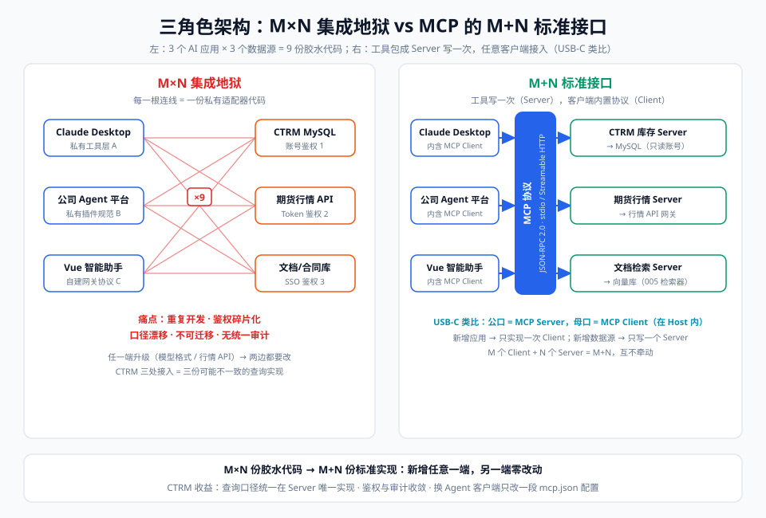

# 01-问题篇：M×N 集成地狱

> 【本节问题】① 为什么说"接一个 AI 应用到 N 个数据源"是指数级工程？② 集成地狱在 CTRM 这种企业系统里长什么样？③ 为什么插件商店模式救不了开发者？④ MCP 是用什么思路把 M×N 压成 M+N 的？

## 1. 地狱的数学：M×N

设 M = AI 应用数量（Claude Desktop、Cursor、公司自研 Agent、钉钉机器人…），N = 数据源/工具数量（MySQL、期货行情 API、SAP、文件服务器…）。

- 每个应用接每个数据源都要写一份**专用适配器**：鉴权方式、数据格式、调用协议全不同；
- 任意一端升级（模型厂改 function calling 格式、行情所改 API）→ **两边都要改**；
- N 家数据源 × M 个应用 = **M×N 份胶水代码**，且没有一份能复用。

【一句话人话】M×N 地狱就是：每台设备一根专属充电线，且线两头都是焊死的。

【生活类比】像 2010 年前的手机充电器：Nokia 的圆孔、苹果的 30 针、各家 micro-USB 互不兼容。你出差要带一包线，厂商要为每个市场单独开模。

## 2. CTRM 场景的"地狱实况"

以中基集团 CTRM 贸易系统（Java 11 + Vue 2.7 + MySQL）为例，假设领导要求：

| 需求 | 传统做法 |
|---|---|
| Claude Desktop 里查 CTRM 库存 | 写 Claude 专用工具 JSON + 本地桥接服务 + Anthropic 格式适配 |
| 公司 Agent 平台（Java 后端）里查期货价 | 按平台私有插件规范再写一遍封装 + 鉴权 |
| Vue 前端智能助手里再做一次 | Vue 2.7 前端调自建网关，网关再包一层工具协议 |
| 以上任何一处行情 API 升级 | 三个地方逐个修改、逐个回归测试 |

痛点清单（按优先级）：
1. **重复开发**：同一查询逻辑 ×3 份实现，口径漂移风险高；
2. **鉴权碎片化**：MySQL 账号、行情所 token、内部 SSO 各一套，每份胶水代码都要处理；
3. **不可迁移**：换一个 Agent 平台 = 工具层推倒重来；
4. **无统一审计**：谁在哪个应用里查了什么敏感库存数据，无处追溯。

## 3. 曾经的"半吊子解法"为什么不够

| 解法 | 为什么只是半吊子 |
|---|---|
| OpenAI 插件（2023） | 只在 ChatGPT 内有效；规范随应用走，开发者仍按"应用"适配 |
| 各模型厂 function calling | 解决"模型怎么表达要调工具"，不解决"工具怎么被多个应用复用"；004 章讲过：这是单模型私有协议 |
| LangChain 工具注册 | 工具与框架代码耦合，非 Python 场景（如 Java 的 CTRM 后端）接入成本高 |
| 自建统一网关 | 公司内部可行，但跨公司/跨生态失效——本质是私有标准 |

共同缺陷：**都是以某一方（应用/模型/框架）为中心的私有标准，缺少一个中立、开放、跨端的协议。**

## 4. MCP 的破局：把 M×N 压成 M+N

MCP 的思路简单粗暴：

- N 个数据源各自包成 **MCP Server**（写一次，遵循统一协议）；
- M 个 AI 应用各自实现一次 **MCP Client**（各大客户端已内置）；
- 从此 M×N → **M+N**，且新增应用或数据源都不牵动另一端。

CTRM 收益对照：

| 维度 | 之前 | 之后 |
|---|---|---|
| 开发量 | 每应用一份适配器 | 一个 `ctrm-inventory` MCP Server（05 章全代码） |
| 口径一致性 | 三份实现可能三套口径 | Server 内唯一实现 |
| 接入新客户端 | 重写 | mcp.json 加一段配置 |
| 审计 | 分散 | Server 出口统一记日志（06 章） |

## 5. 坑点提示

- **坑 1**：以为 MCP 取代 function calling——错。模型侧仍靠 function calling 表达调用意图，MCP 只管"工具的分发与传输"（07 章详述边界）。
- **坑 2**：以为包个 MCP Server 就能直接查生产库——Server 是给 LLM 用的入口，**权限必须最小化**（只读账号、白名单查询），06 章展开。
- **坑 3**：把协议版本当作永远不变——spec 一年数版，2026-07-28 已把握手/会话改为无状态，写代码要盯 SDK 而非裸协议。

## 【本节自测】

1. **M×N 中的 M、N 各指什么？举 CTRM 例子。** 要点：M=Claude Desktop/公司 Agent/Vue 助手等应用；N=库存库、行情 API 等数据源；未标准化需 3×3 份适配。
2. **function calling 为什么解不了集成地狱？** 要点：它是模型私有协议，解决"表达调用"而非"跨应用复用"。
3. **插件商店模式的问题？** 要点：以单一应用为中心，规范随应用走，开发者仍要按应用适配。
4. **M+N 的"N"端要做什么？** 要点：把数据源包成遵循 MCP 协议的 Server，写一次。
5. **为什么说自建统一网关只是公司内可行？** 要点：私有标准，跨公司/跨生态无互操作。
6. **接入 MCP 后，CTRM 口径一致性如何保障？** 要点：查询逻辑收敛到 Server 唯一实现，客户端零业务代码。
7. **MCP Server 直连生产库的风险？** 要点：LLM 生成的查询不可信，需最小权限只读账号与白名单。

下一章：`02-概念篇-核心概念精讲.md`——把协议拆成 12 张概念卡。
