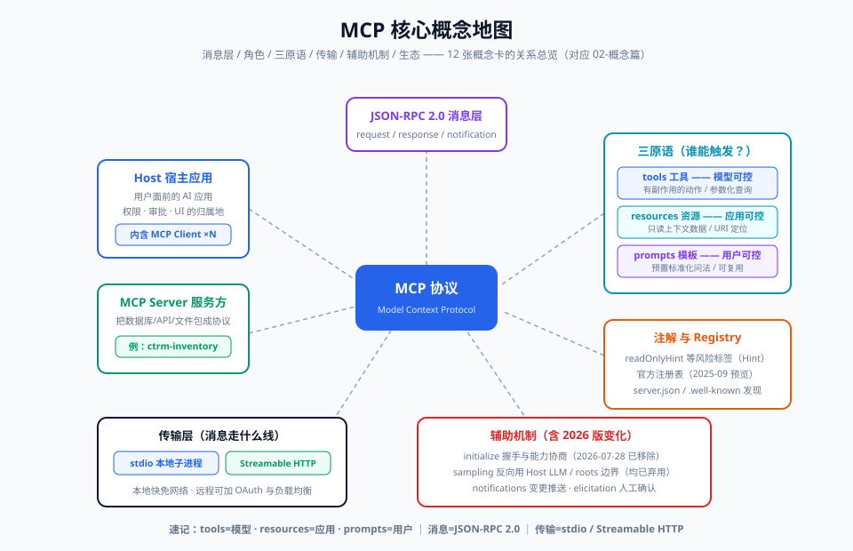

# 02-概念篇：核心概念精讲（12 张概念卡）

> 【本节问题】① Host、Client、Server 到底谁管谁？② tools / resources / prompts 三原语差别在哪？③ 底层消息长什么样、怎么握手？④ 本地与远程传输、sampling、roots、工具注解、registry 又是什么？



## 概念卡 1：Host（宿主）

【一句话人话】Host 是**用户面前的 AI 应用本体**——它内置一个或多个 MCP Client，是所有权限、审批、UI 的归属地。

【生活类比】USB-C 里的"电脑"：电脑（Host）负责决定允不允许插这个 U 盘、弹不弹授权弹窗。

- CTRM 例子：Claude Desktop、Cursor、公司 Agent 平台都是 Host。
- 面试视角：Host ≠ Client。Host 是应用，Client 是 Host 内部维护**与单个 Server 一对一连接**的组件。

## 概念卡 2：MCP Client（客户端连接器）

【一句话人话】Client 是 Host 内部与**一个** Server 保持 1:1 连接的通信代理，负责协议编解码、能力协商、消息路由。

【生活类比】电脑上的每个 USB 口：一个口对应一个设备，互不干扰。

- 关键点：1 个 Host 可开 N 个 Client，每个 Client 绑定 1 个 Server；Client 是**协议层**，不做业务。

## 概念卡 3：MCP Server（服务器）

【一句话人话】Server 是**工具/数据/模板的提供方**，把外部世界（数据库、API、文件）的能力按 MCP 协议暴露出来。

【生活类比】U 盘/移动硬盘/读卡器：只管按 USB-C 标准提供能力，不管插进哪台电脑。

- CTRM 例子：`ctrm-inventory` Server 暴露库存查询与期货价查询。
- 面试视角：Server 通过 Client 连接工作，**不直接接触模型**（sampling 例外，见卡 9）。

## 概念卡 4：三原语之一 Tools（工具，模型可控）

【一句话人话】tools 是**模型可以决定执行的动作**——有副作用、可改变状态，由模型在用户同意下调用。

【生活类比】遥控器上的按钮：模型"按下去"才生效。

- CTRM 例子：`query_inventory(warehouse, sku)`、`query_futures_price(contract, date)`。
- 控制权：**模型主导**（用户可审批），典型流 tools/list → tools/call。

## 概念卡 5：三原语之二 Resources（资源，应用可控）

【一句话人话】resources 是**只读的上下文数据**——文件内容、数据库快照、日志，由应用/用户决定挂载给模型。

【生活类比】U 盘里"打开就能看"的文件：不执行，只提供内容。

- CTRM 例子：`ctrm://inventory/snapshot/{date}` 当日库存快照 JSON。
- 支持静态 URI 与模板 URI（resource templates），可订阅变更（notifications，2026-07-28 版已改由 subscriptions/listen 承接）。

## 概念卡 6：三原语之三 Prompts（提示模板，用户可控）

【一句话人话】prompts 是**预置的可复用交互模板**——用户主动选择，把"问法"标准化。

【生活类比】售货机上的"一键套餐"按钮：点一下，问题组装好。

- CTRM 例子：`analyze_warehouse_risk(warehouse)` 一键生成"分析某仓库存风险"的完整提示。
- 三原语控制权速记：**tools=模型、resources=应用、prompts=用户**。

## 概念卡 7：JSON-RPC 2.0

【一句话人话】MCP 所有消息都是 JSON-RPC 2.0 格式——`request`（带 id）、`response`（结果或 error）、`notification`（单向不回执）三种。

【生活类比】快递单：request=寄件单（有单号 id），response=签收回执，notification=无声的群发通知。

```json
{"jsonrpc":"2.0","id":1,"method":"tools/call",
 "params":{"name":"query_inventory","arguments":{"warehouse":"SH","sku":"CU-2026"}}}
```

- 面试视角：为什么选 JSON-RPC 2.0？轻量、双向、与传输解耦（stdio/HTTP 都能跑）。

## 概念卡 8：initialize 握手与能力协商

【一句话人话】连接建立后第一件事是 `initialize` 请求：双方交换**协议版本 + 各自能力（capabilities）**，达成一致才开工。

【生活类比】两家公司合作先签框架协议：约定用哪版合同模板、各自提供哪些服务清单。

- 请求带 `protocolVersion / clientInfo / capabilities`；响应回 `serverInfo / capabilities / instructions`。
- 能力协商例：Server 声明 `{"tools":{"listChanged":true}}` 表示支持工具列表并会推送变更通知。
- **版本演进（重要）**：2026-07-28 版已**移除** initialize 握手与 `Mcp-Session-Id`，版本/能力随每个请求的 `_meta` 自带，新增 `server/discover` 供探测（SEP-2575/2567）。生产代码按 SDK 走，两者兼容。

## 概念卡 9：传输层（stdio / Streamable HTTP）

【一句话人话】传输层决定 JSON-RPC 消息"走什么线"——**stdio**：本地子进程标准输入输出；**Streamable HTTP**：远程单一 `/mcp` 端点（2025-06-18 版起取代 HTTP+SSE）。

【生活类比】stdio=同一屋里的对讲机（快、免网络）；Streamable HTTP=长途专线（可过防火墙/负载均衡）。

- 选型口诀：**本地数据、个人工具→stdio；远程共享、团队服务→Streamable HTTP + OAuth**（04 章细化）。

## 概念卡 10：Sampling（采样，server 反向用模型的 LLM）

【一句话人话】sampling 让 **Server 反向请求 Host 的 LLM 帮它干活**（`sampling/createMessage`），如对查询结果做摘要——模型不再只是发起方，也能被工具方"调用"。

【生活类比】装修师傅（Server）不懂业主审美，反过来请业主（Host）帮忙选颜色。

- 安全要点：内容必须经用户审批，Host 可改写/拒绝；成本由 Host 承担。
- **版本演进**：2026-07-28 版中 sampling **被标记弃用**（与 roots、logging 一起），改由 MRTR 等无状态机制承接；旧版客户端仍在用，面试两头都要会。

## 概念卡 11：Roots（根目录）

【一句话人话】roots 是 Host 告诉 Server"**你只能在哪些目录/URI 范围内活动**"的边界机制（`roots/list`）。

【生活类比】给装修师傅一张"只能动这几个房间"的门禁卡。

- 典型形态：`file:///d:/ai_agent_learning`；Server 应尊重但需自行校验（它是约定不是强制沙箱）。
- 2026-07-28 版同样已弃用 roots（归入 MRTR 重构）。

## 概念卡 12：工具注解（annotations）与 Registry（注册表)

【一句话人话】注解是工具的**元数据标签**（如 `readOnlyHint: true`、`destructiveHint: false`），帮 Host/用户在不执行的情况下判断风险；Registry 是官方的**服务器注册表**（2025-09-08 预览上线），MCP 世界的"应用商店"。

【生活类比】注解=食品包装上的"清真/含坚果"标签；Registry=App Store 的收录页。

```json
{"name":"query_inventory","annotations":{"readOnlyHint":true,"openWorldHint":false}}
```

- 常用注解：`readOnlyHint` / `destructiveHint` / `idempotentHint` / `openWorldHint`——注意名字带 **Hint**：是提示不是保证，Host 不能盲信（06 章安全章再敲黑板）。
- Registry 与 `.well-known` 元数据、server.json 格式配套，解决"去哪找可信 Server"的发现问题。

## 概念关系一页纸

| 概念 | 一句话 | 关键词 |
|---|---|---|
| Host | 用户面前的 AI 应用 | 权限/审批/UI |
| Client | Host 内 1:1 连接代理 | 协议编解码 |
| Server | 能力提供方 | tools/resources/prompts |
| tools | 模型可控的动作 | 副作用、tools/call |
| resources | 应用可控的只读数据 | 上下文、URI |
| prompts | 用户可控的模板 | 复用问法 |
| JSON-RPC 2.0 | 消息格式 | request/response/notification |
| initialize | 握手与能力协商 | 版本+capabilities（26-07-28 已移除） |
| 传输 | 消息通道 | stdio / Streamable HTTP |
| sampling | Server 反向用 LLM | 用户审批（已弃用） |
| roots | Server 活动边界 | 目录白名单（已弃用） |
| 注解/Registry | 风险标签 / 服务发现 | Hint 元数据 / server.json |

## 【本节自测】

1. **Host 与 Client 的区别与数量关系？** 要点：Host 是应用，Client 是其内部组件；1 Host : N Client : 每 Client 1 Server。
2. **三原语各自谁控制？** 要点：tools=模型决定，resources=应用/用户挂载，prompts=用户选择。
3. **`query_futures_price` 应做成 tool 还是 resource？为什么？** 要点：tool——模型按需主动调用；若是"每天固定快照"则可加 resource。
4. **JSON-RPC 三种消息类型？** 要点：request（带 id）、response（result/error）、notification（无 id 单向）。
5. **initialize 交换了什么？最新版还剩吗？** 要点：协议版本+能力；2026-07-28 已移除，改 _meta 每请求携带 + server/discover。
6. **两种传输的选型原则？** 要点：本地 stdio 免网络部署简单；远程 Streamable HTTP 单端点、可加 OAuth 与负载均衡。
7. **readOnlyHint 能不能当安全保证？** 要点：不能，是给 Host/用户的提示（Hint），服务端仍须自我校验。
8. **sampling 的价值与风险？** 要点：复用 Host 模型能力（摘要/分类），但内容需用户审批、成本 Host 承担，且最新版已弃用。

下一章：`03-原理篇-协议架构与生命周期.md`——把概念串成一次真实调用。
