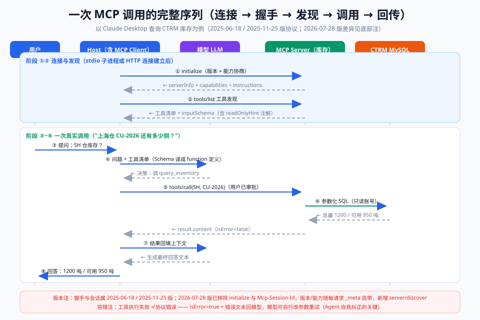

# 03-原理篇：协议架构与生命周期

> 【本节问题】① 一次"MCP 查 CTRM 库存"从点击到出结果到底经过哪几步？② 握手与能力协商的消息序列长什么样？③ tools/list 与 tools/call 的报文如何往来？④ 版本协商失败、工具调用失败时协议怎么兜底？



## 1. 协议架构分层

```text
┌───────────────────────────────────────────────┐
│  Host 应用（UI/审批/权限）                      │
│   └─ MCP Client ──┐        ┌── MCP Client ──┐ │
├───────────────────┼────────┼────────────────┼─┤
│  传输层：stdio（本地子进程） │ Streamable HTTP │ │
├───────────────────────────────────────────────┤
│  消息层：JSON-RPC 2.0（request/response/notification）│
├───────────────────────────────────────────────┤
│  服务层：tools / resources / prompts / …       │
└───────────────────────────────────────────────┘
```

要点（按优先级）：
1. **分层解耦**：服务层原语不感知传输层差异——同一份 Server 代码可同时支持 stdio 与 HTTP；
2. **Client 是消息枢纽**：模型 ↔ Host ↔ Client ↔ Server，Client 只搬运与校验，不做业务；
3. **所有消息皆 JSON-RPC 2.0**，与传输无关。

## 2. 生命周期：连接 → 握手 → 发现 → 调用 → 关闭

以"用户在 Claude Desktop（Host）里问：SH 仓 CU-2026 铜还有多少库存？"为例（基于 2025-06-18/2025-11-25 版协议，26-07-28 版差异见 §5）：

### 阶段 ①：连接建立

- stdio：Host 以**子进程**方式拉起 Server（如 `python ctrm_server.py`），stdin/stdout 即通信管道；
- Streamable HTTP：Client 向 `https://mcp.corp.com/mcp` 发 POST。

### 阶段 ②：initialize 握手

```json
→ {"jsonrpc":"2.0","id":0,"method":"initialize",
   "params":{"protocolVersion":"2025-11-25",
             "clientInfo":{"name":"claude-desktop","version":"0.10"},
             "capabilities":{"roots":{"listChanged":true}}}}
← {"jsonrpc":"2.0","id":0,"result":{"protocolVersion":"2025-11-25",
             "serverInfo":{"name":"ctrm-inventory","version":"1.0.0"},
             "capabilities":{"tools":{"listChanged":true},
                             "resources":{"subscribe":false}}}}
→ {"jsonrpc":"2.0","method":"notifications/initialized"}
```

- 版本协商：Client 报自己支持的版本，Server 回它愿用的版本；不一致则按降级规则取双方都支持的最高版本；
- 能力发现：`capabilities` 里声明"我有什么、支不支持变更推送"。

### 阶段 ③：工具发现（tools/list）

```json
→ {"jsonrpc":"2.0","id":1,"method":"tools/list"}
← {"jsonrpc":"2.0","id":1,"result":{"tools":[
   {"name":"query_inventory",
    "description":"按仓库与SKU查询CTRM现货库存",
    "inputSchema":{"type":"object","properties":{
        "warehouse":{"type":"string"},"sku":{"type":"string"}},"required":["warehouse","sku"]},
    "annotations":{"readOnlyHint":true}}]}}
```

- `inputSchema` 是 JSON Schema——Host 把它翻译成模型的 function 定义（回到 004 的世界）；
- Server 声明了 `listChanged` 后，工具增删会推 `notifications/tools/list_changed`。

### 阶段 ④：模型决策与工具调用（tools/call）

1. Host 把"库存问题 + 工具清单"发给 LLM；模型返回"我要调 query_inventory(warehouse=SH, sku=CU-2026)"（function calling）；
2. Host 审批（用户可看可拒）→ Client 发 `tools/call`：

```json
→ {"jsonrpc":"2.0","id":2,"method":"tools/call",
   "params":{"name":"query_inventory",
             "arguments":{"warehouse":"SH","sku":"CU-2026"}}}
← {"jsonrpc":"2.0","id":2,"result":{"content":[
   {"type":"text","text":"SH仓 CU-2026 电解铜：1200 吨，其中可用 950 吨"}],
   "isError":false}}
```

### 阶段 ⑤：结果回传

- Server 的 `content` 支持 text/image/resource 等多模态块；
- Host 将文本拼回上下文 → 模型生成最终回答："上海仓有 1200 吨电解铜…"。

### 阶段 ⑥：关闭

- stdio：进程退出即断；HTTP：会话关闭（旧版删 `Mcp-Session-Id`）。

## 3. 错误处理的两层

| 层 | 场景 | 表现 |
|---|---|---|
| 协议错误 | 方法不存在、参数不符 schema、版本不支持 | JSON-RPC `error` 对象（-32601 方法不存在等） |
| 工具执行错误 | 查库超时、SKU 不存在 | `result.isError=true` + 错误文本进 content，**让模型自己纠正** |

要点：工具执行失败**不是协议失败**——把错误交给模型，它能自行改参数重试（如去掉 sku 前缀再查），这是 Agent 容错设计的关键。

## 4. Server 主动推送（notifications）

- `notifications/tools/list_changed`：工具清单变了，让 Client 重新拉取；
- `notifications/resources/updated`：订阅的 resource 内容变更（26-07-28 版改由 subscriptions/listen）；
- 面试视角：MCP 是**双向**协议——不只模型问工具，工具也能"喊话"客户端（sampling/elicitation/通知）。注意 2026-07-28 版向无状态收敛后，server→client 交互改走 MRTR 模式。

## 5. 版本演进对照（2025-11-25 → 2026-07-28）

| 机制 | 2025-11-25 及以前 | 2026-07-28 |
|---|---|---|
| 握手 | initialize + notifications/initialized | 移除；版本/能力随每个请求 `_meta` 携带 |
| 会话 | Mcp-Session-Id 头 + 有状态会话 | 移除；每请求自描述，任意实例可处理 |
| 能力探测 | 握手时一次性发现 | 新增 `server/discover` 按需查询 |
| 服务器→客户端请求 | 依赖常开 SSE 流 | MRTR（input_required → 客户端带答案重试） |
| 列表缓存 | 每次全量拉取 | list 结果带 ttlMs/确定性排序，可缓存 |

来源：MCP 官方博客《The 2026-07-28 Specification》及 changelog（检索于 2026-09-19）。对 CTRM 部署的意义：远程 `ctrm-inventory` Server 不再需要 Redis 存会话/粘性会话，普通负载均衡即可横向扩展。

## 【本节自测】

1. **一次完整调用的五阶段？** 要点：连接→initialize→tools/list→tools/call→结果回传（关闭为收尾）。
2. **initialize 的请求与响应各带什么？** 要点：请求 protocolVersion/clientInfo/capabilities；响应 serverInfo/capabilities/instructions。
3. **inputSchema 的作用？** 要点：JSON Schema 描述参数，Host 翻译成模型 function 定义并用于参数校验。
4. **工具执行失败算协议错误吗？** 要点：不算，isError=true + content 错误文本，交给模型自纠正。
5. **协议错误与工具错误的区别？** 要点：前者 JSON-RPC error 层（方法/参数/版本问题），后者业务层，模型可参与修复。
6. **为什么 MCP 工具列表可以推送变更？** 要点：握手声明 listChanged 能力后，Server 发 notifications/tools/list_changed。
7. **无状态版对部署的最大好处？** 要点：请求自描述，任意实例可处理，无需会话存储/粘性路由，可上普通负载均衡与 serverless。

下一章：`04-进阶篇-三原语与传输层.md`——从"会跑"到"会设计"。
