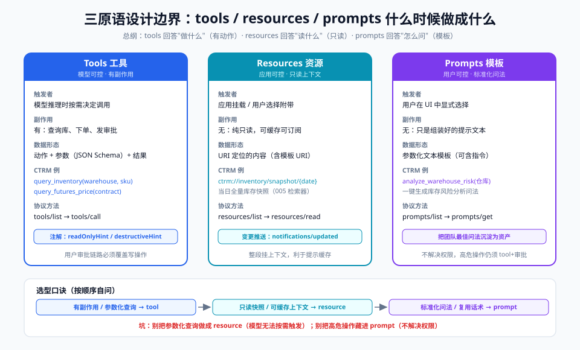

# 04-进阶篇：三原语与传输层

> 【本节问题】① 同一个能力，什么时候做成 tool、什么时候做成 resource、什么时候做成 prompt？② 本地 stdio 与远程 Streamable HTTP 该怎么选？③ sampling 如何让 Server 反向使用客户端的 LLM？④ 无状态时代的 session 与状态怎么设计？



## 1. 三原语的设计边界（决策核心）

**一句话总纲：tools 回答"做什么"，resources 回答"读什么"，prompts 回答"怎么问"。**

| 判据 | 做成 tool | 做成 resource | 做成 prompt |
|---|---|---|---|
| 是否有副作用 | 有（下单/平仓/发审批） | 无（纯读） | 无 |
| 谁触发 | 模型推理时按需 | 应用启动/用户挂载 | 用户显式选择 |
| 数据形态 | 动作+参数+结果 | URI 定位的只读内容 | 参数化文本模板 |
| 缓存友好 | 差（每次执行） | 好（快照可订阅） | 好（模板固定） |

CTRM 判例（可直接套用）：

| 需求 | 归类 | 理由 |
|---|---|---|
| 按仓库+SKU 查库存 | **tool** `query_inventory` | 模型按对话需要主动查，带查询参数 |
| 实时期货价 | **tool** `query_futures_price` | 时效性强，须模型逐次调用 |
| 当日库存快照 | **resource** `ctrm://inventory/snapshot/{date}` | 只读、可整段挂上下文、可缓存 |
| 仓库风险分析问法 | **prompt** `analyze_warehouse_risk` | 标准化分析套路，用户一键触发 |
| 生成对冲单 | tool + **强审批** | 高危副作用，readOnlyHint=false 且 Host 必须人工确认 |

坑点：
- **别把查询全做成 resource**：resource 由应用挂载，模型无法"按需带参数查询"——参数化查询请用 tool（或 resource template，但触发权仍在应用侧）；
- **别把高危操作藏进 prompt**：prompt 只是问法模板，不解决权限。

## 2. 传输选型：stdio vs Streamable HTTP

| 维度 | stdio（本地） | Streamable HTTP（远程） |
|---|---|---|
| 部署 | Host 拉起子进程，随开随用 | 独立服务，集中部署 |
| 网络 | 无网络、最快 | 过防火墙/网关，支持负载均衡 |
| 鉴权 | 依赖本机账号 | **OAuth 2.1**（06 章细化） |
| 多客户端复用 | 否（1 进程 1 Client） | 是（全团队共用一个 Server） |
| 审计 | 分散在各机器 | 集中日志、集中限流 |
| 适配场景 | 个人开发、内网数据本机用 | 企业共享、跨地域、云上 |

CTRM 选型建议（优先级）：
1. **开发/调试期**：stdio——`python ctrm_server.py` 即可，Claude Desktop 直接跑；
2. **团队推广期**：Streamable HTTP——部署成公司内网服务，统一 OAuth 接入 SSO，统一审计；
3. **跨机构共享**：HTTP + OAuth + Registry 注册，或挂网关做限流。
4. 传输无关性保障：用官方 SDK（FastMCP）写一次业务，两条传输都能挂（05 章代码演示）。

## 3. Sampling：Server 反向使用客户端的 LLM

**方向反转**：常规调用是"模型→工具"；sampling 是"工具→Host 的 LLM"（`sampling/createMessage`）。

【一句话人话】你的工具干着干着需要"动点脑子"（总结/分类/判断），不用自己买 GPU，回头请 Host 的大模型帮个忙。

【生活类比】中介带你看房，遇到条款拿不准，打电话请你（而非他自己）找律师朋友解读——律师是"你家的"资源。

CTRM 应用例：
- `query_inventory` 返回 500 行明细 → Server 发起 sampling："请把这份库存按风险等级归纳成三句话" → Host LLM 摘要后随结果返回；
- 行情异动扫描 Server 发现剧烈波动 → sampling 生成一段"给交易员的解释文本"。

安全与成本（面试高频）：
1. 内容必经**用户审批**，Host 可改写、可拒绝；
2. 计费/算力归 **Host**，Server 不可滥用（防"白嫖+注入"）；
3. **版本警示**：2026-07-28 版已将 sampling 标记弃用（与 roots/logging 同批），server→client 交互改走 MRTR；存量客户端仍在，讲解时"两版都会"最稳。

## 4. Session 与状态：从有会话到显式句柄

**旧模型（≤2025-11-25）**：Streamable HTTP 用 `Mcp-Session-Id` 维持会话——问题：粘性路由、共享会话存储（Redis）、扩容复杂。2025 年底的实测分析：1000 个开源 Server 里约 90% 根本没用 session id。

**新模型（2026-07-28）**：协议无状态，状态自己管——**显式句柄（explicit handle）模式**：

```text
tools/call create_basket {} → 返回 basket_id="BK-1024"
tools/call add_item {"basket_id":"BK-1024","sku":"CU-2026","qty":50}
tools/call checkout {"basket_id":"BK-1024"}
```

- 服务器生成句柄当工具参数回传，模型可见、可推理、可在工具间传递；
- 【生活类比】超市寄存：不再靠"门口保安记住你的脸"（会话），而是给一张**寄存凭条**（句柄）——换一个保安也认。

CTRM 启示：要把"多次查询组成一笔对冲预案"做成 MCP Server 时，直接设计 `create_hedge_plan` → 返回 plan_id → 后续 `add_leg(plan_id,…)`，天然兼容无状态新版本，也不怕负载均衡漂移。

## 5. 设计检查清单（出活口诀）

1. 有副作用吗？→ 有则 tool + 注解 + 审批；
2. 参数化查询？→ tool；只读快照？→ resource；
3. 问法要标准化？→ prompt；
4. 远程共享？→ Streamable HTTP + OAuth；个人本地？→ stdio；
5. 要跨调用状态？→ 显式句柄，不依赖协议会话；
6. 工具描述要写给人看也给模型看——它是"提示注入的第一现场"（06 章展开）。

## 【本节自测】

1. **三原语的触发者与典型场景？** 要点：tool=模型触发+动作；resource=应用挂载+只读；prompt=用户选择+模板。
2. **为什么"按仓库查库存"必须是 tool？** 要点：参数化、模型按需触发；resource 挂载权在应用侧且不带查询语义。
3. **stdio 与 Streamable HTTP 的三个决定性差异？** 要点：进程形态（子进程 vs 服务）、鉴权（本机 vs OAuth）、复用（单客户端 vs 团队共享）。
4. **sampling 的调用方向与审批责任？** 要点：Server→Host LLM（sampling/createMessage），Host 审批可拒可改，成本归 Host；新版已弃用。
5. **什么是显式句柄模式？** 要点：跨调用状态由 Server 生成 id，经模型作为普通参数传递，不依赖协议会话。
6. **旧会话模型在扩容时的两个痛点？** 要点：粘性路由与会话共享存储；新无状态版普通负载均衡即可。
7. **CTRM"对冲预案多步操作"如何无状态化？** 要点：create 返回 plan_id，后续调用显式带 plan_id。
8. **工具描述的双重读者是谁？** 要点：模型（决定是否调用）与人类（安全审批）——因此也是注入攻击面。

下一章：`05-实战篇-手写一个MCP服务器.md`——全部落成 Python 代码。
