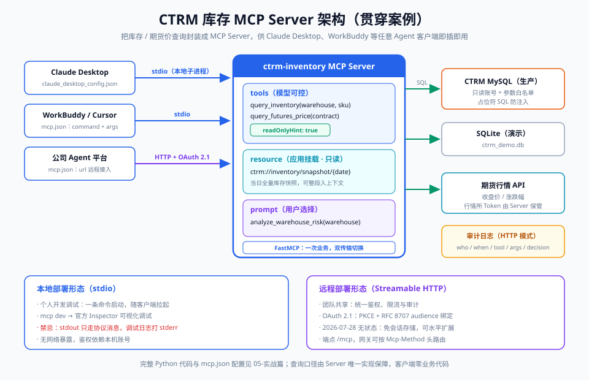

# 05-实战篇：手写一个 MCP 服务器（CTRM 库存查询）

> 【本节问题】① 用 Python 官方 SDK（FastMCP 风格）写一个能查 CTRM 库存与期货价的 Server 最少要多少代码？② tool、resource、prompt 三原语在代码里分别怎么写？③ Claude Desktop / WorkBuddy 等客户端怎么配置接入？④ 从单文件走向生产还差哪几步？



## 1. 环境准备

```bash
# Python 3.10+（官方 SDK 要求；与公司 Java 11 后端互不干扰，可作为独立服务部署）
pip install "mcp[cli]"     # 官方 SDK，内含 FastMCP 高层 API 与开发调试 CLI
```

目标 Server：`ctrm-inventory`，暴露 2 个 tool + 1 个 resource + 1 个 prompt，数据先落在 SQLite（演示），生产换 MySQL（§5 给改造要点）。

## 2. 完整代码（单文件 `ctrm_server.py`，可直接运行）

```python
"""
ctrm-inventory MCP Server
把中基 CTRM 系统的库存 / 期货价查询封装成 MCP 工具，供任意 MCP 客户端使用。
运行: python ctrm_server.py            (stdio 模式, 供 Claude Desktop/WorkBuddy 拉起)
调试: mcp dev ctrm_server.py           (官方 Inspector 可视化调试)
"""
import json
import sqlite3
from datetime import date
from pathlib import Path

from mcp.server.fastmcp import FastMCP

DB_PATH = Path(__file__).parent / "ctrm_demo.db"

mcp = FastMCP(
    name="ctrm-inventory",
    instructions="CTRM 贸易系统数据查询：库存、期货价。仅只读访问。",
)


def get_conn() -> sqlite3.Connection:
    """演示用 SQLite；生产环境换 MySQL 时仅需替换此函数（见 §5）。"""
    conn = sqlite3.connect(DB_PATH)
    conn.row_factory = sqlite3.Row
    return conn


# ---------- 原语 1: tools（模型可控、可参数化的动作/查询） ----------

@mcp.tool(
    description="按仓库与SKU查询CTRM现货库存，返回总量/可用量/在途量（单位：吨）",
    annotations={"readOnlyHint": True, "openWorldHint": False},
)
def query_inventory(warehouse: str, sku: str) -> str:
    """warehouse: 仓库代码，如 SH(上海)/GZ(广州); sku: 品种代码，如 CU-2026(电解铜)"""
    conn = get_conn()
    try:
        row = conn.execute(
            "SELECT warehouse, sku, total_qty, available_qty, in_transit_qty "
            "FROM inventory WHERE warehouse=? AND sku=?",
            (warehouse.upper(), sku.upper()),
        ).fetchone()
        if row is None:
            # 工具执行错误：返回 isError 语义，让模型自我纠正（03 章 §3）
            return json.dumps({"error": f"未找到 {warehouse}/{sku} 的库存记录"}, ensure_ascii=False)
        return json.dumps(dict(row), ensure_ascii=False)
    finally:
        conn.close()


@mcp.tool(
    description="查询指定期货合约在最近交易日的收盘价与涨跌幅",
    annotations={"readOnlyHint": True, "openWorldHint": False},
)
def query_futures_price(contract: str) -> str:
    """contract: 合约代码，如 CU2606(沪铜2606)"""
    conn = get_conn()
    try:
        row = conn.execute(
            "SELECT contract, trade_date, close_price, change_pct "
            "FROM futures_price WHERE contract=? ORDER BY trade_date DESC LIMIT 1",
            (contract.upper(),),
        ).fetchone()
        if row is None:
            return json.dumps({"error": f"未找到合约 {contract} 的行情"}, ensure_ascii=False)
        return json.dumps(dict(row), ensure_ascii=False)
    finally:
        conn.close()


# ---------- 原语 2: resource（应用挂载、只读上下文快照） ----------

@mcp.resource("ctrm://inventory/snapshot/{snap_date}")
def inventory_snapshot(snap_date: str) -> str:
    """当日(或指定日)全量库存快照，供客户端整段挂入上下文"""
    conn = get_conn()
    try:
        rows = conn.execute(
            "SELECT warehouse, sku, total_qty, available_qty, in_transit_qty "
            "FROM inventory WHERE snap_date=?",
            (snap_date or date.today().isoformat(),),
        ).fetchall()
        return json.dumps([dict(r) for r in rows], ensure_ascii=False, indent=2)
    finally:
        conn.close()


# ---------- 原语 3: prompt（用户可控的标准化问法模板） ----------

@mcp.prompt()
def analyze_warehouse_risk(warehouse: str) -> str:
    """生成'仓库库存风险分析'标准化提示"""
    return (
        f"你是一名大宗商品风控分析师。请基于 tools 查询 {warehouse} 仓库的库存"
        f"（调用 query_inventory）与相关期货价（调用 query_futures_price），"
        f"输出：1) 库存集中度；2) 价格波动敞口；3) 三条操作建议。"
    )


# ---------- 启动（stdio 传输；HTTP 见 §4） ----------

if __name__ == "__main__":
    mcp.run(transport="stdio")
```

初始化演示数据（可选，`init_db.py`）：

```python
import sqlite3
from datetime import date

conn = sqlite3.connect("ctrm_demo.db")
conn.executescript("""
CREATE TABLE IF NOT EXISTS inventory(
  warehouse TEXT, sku TEXT, total_qty REAL, available_qty REAL,
  in_transit_qty REAL, snap_date TEXT);
CREATE TABLE IF NOT EXISTS futures_price(
  contract TEXT, trade_date TEXT, close_price REAL, change_pct REAL);
""")
conn.execute("INSERT INTO inventory VALUES('SH','CU-2026',1200,950,250,?)", (date.today().isoformat(),))
conn.execute("INSERT INTO futures_price VALUES('CU2606','2026-09-18',78450,0.8)")
conn.commit(); conn.close()
```

## 3. 客户端接入配置

### Claude Desktop（`claude_desktop_config.json`）

```json
{
  "mcpServers": {
    "ctrm-inventory": {
      "command": "python",
      "args": ["D:/ai_agent_learning/006-mcp协议/techniques/ctrm_server.py"]
    }
  }
}
```

### WorkBuddy / Cursor / 通用 `mcp.json`（同一套格式）

```json
{
  "mcpServers": {
    "ctrm-inventory": {
      "command": "python",
      "args": ["D:/ai_agent_learning/006-mcp协议/techniques/ctrm_server.py"],
      "env": { "CTRM_DB_DSN": "sqlite:///ctrm_demo.db" }
    }
  }
}
```

### 远程 HTTP 模式启动（供团队共用）

```python
# 把 mcp.run 一行替换为：
mcp.run(transport="streamable-http", host="0.0.0.0", port=8000)  # 端点 http://<host>:8000/mcp
```

客户端 `mcp.json` 相应改为：

```json
{ "mcpServers": { "ctrm-inventory": { "url": "http://10.0.8.66:8000/mcp" } } }
```

调试利器：`mcp dev ctrm_server.py` 打开官方 **MCP Inspector**，可在网页里手动 tools/list、tools/call，不用等客户端。

## 4. 一次真实调用走查（对照 03 章）

```text
用户: 上海仓 CU-2026 还有多少铜？
 1. Host 启动子进程 ctrm_server.py → initialize 握手（版本/能力协商）
 2. Host 拉 tools/list → 获得两个工具的 JSON Schema
 3. 模型(function calling)决定: query_inventory(warehouse="SH", sku="CU-2026")
 4. 用户审批 → tools/call → Server 查 SQLite → {"total_qty":1200,"available_qty":950,...}
 5. 结果作为 tool result 回到模型 → 生成回答："上海仓电解铜共 1200 吨，可用 950 吨…"
```

## 5. 从 Demo 到生产（改造要点，按优先级）

1. **换数据库**：把 `get_conn()` 换成 MySQL（Java 侧已有 DBCP 连接池，Python 侧用 SQLAlchemy/PyMySQL），**必须用只读账号**；
2. **参数白名单**：warehouse/sku 用枚举校验，杜绝拼接 SQL（当前用占位符已防注入，仍建议白名单+长度限制）；
3. **鉴权与限流**：HTTP 模式挂 OAuth 2.1（06 章）与网关限流；
4. **审计日志**：在 tool 入口统一记 `who/when/tool/args/latency/rows`，脱敏后入库（06 章）；
5. **部署形态**：先内网 Docker 单实例，无状态版协议（2026-07-28）后可直接水平扩展；
6. **版本锚定**：锁定 SDK 版本号升级，2025→2026 spec 有破坏性变更（握手/会话移除）。

坑点：
- Windows 路径分隔符：`mcp.json` 里用 `/` 或 `\\`，单 `\` 会被 JSON 转义吞掉；
- stdio 模式下 **stdout 必须只输出协议消息**——print 调试日志会污染管道，请打到 stderr 或文件（2025-11-25 版已明确 stderr 可做通用日志）；
- 工具描述写太烂，模型就选不对工具：描述=给模型的"使用说明书"，含参数单位与示例。

## 【本节自测】

1. **FastMCP 里定义 tool/resource/prompt 的装饰器分别是什么？** 要点：`@mcp.tool()` / `@mcp.resource("uri模板")` / `@mcp.prompt()`，函数签名与 docstring 即 schema 来源。
2. **`annotations={"readOnlyHint": True}` 的作用？** 要点：向客户端声明工具无副作用，辅助审批 UI 与安全策略（提示非保证）。
3. **resource URI 模板怎么带参数？** 要点：`ctrm://inventory/snapshot/{snap_date}`，装饰器函数参数同名承接。
4. **stdio 模式最大的调试禁忌？** 要点：print 到 stdout 污染协议管道；日志走 stderr（或文件）。
5. **两种传输在代码里怎么切换？** 要点：`mcp.run(transport="stdio"|"streamable-http")`，业务代码零改动。
6. **客户端 mcp.json 的最小字段？** 要点：本地 `command+args`（可加 env），远程 `url`。
7. **换 MySQL 时哪三件事必须做？** 要点：只读账号、占位符/白名单查询、连接池与超时配置。
8. **`mcp dev` 是干什么的？** 要点：启动官方 Inspector 调试器，可视化 list/call 各原语。

下一章：`06-生产篇-授权安全与部署.md`——把 Demo 变成能扛审计的系统。
