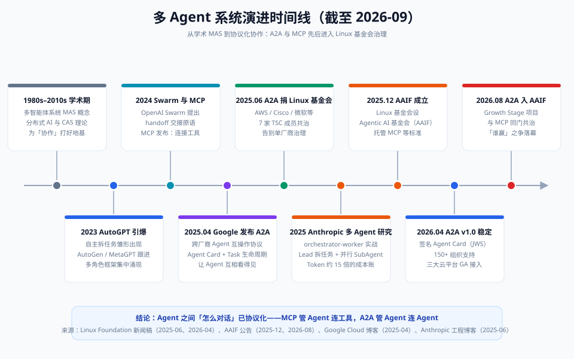

# 00 · 背景篇：多 Agent 前史与全景

> 【本节问题】① 为什么 2023 年起"多 Agent"突然爆火，它以前就存在吗？② 从学术概念到工程落地，这条线上的关键节点有哪些？③ 为什么协议化（MCP/A2A）是这个领域的分水岭？④ 站在 2026 年 9 月，多 Agent 的生态格局到底是什么样？

## 1. 多 Agent 不是新东西，LLM 让它"活"了

【一句话人话】多 Agent 系统就是"让多个各自有分工的智能体互相配合完成任务"——想法上世纪就有了，只是以前的"智能体"要么是死规则的专家系统，要么是学不出通用能力的模型，直到 LLM 出现。

【生活类比】20 年前就有"连锁店管理模式"的理论（总部-区域-门店分工），但当时招不到能独当一面的店长；LLM 出现相当于突然有了一大批"能听懂话、会干活的通用员工"，管理理论立刻能落地了。

- **1980s–2010s**：分布式人工智能（DAI）与多智能体系统（MAS）是正经学术方向，研究合同网协议、博弈、协商机制；复杂适应系统（CAS）理论（圣塔菲研究所）提供了"简单个体涌现复杂行为"的思想底座。
- **那时的困境**：Agent 的"大脑"是规则引擎或窄模型，环境一变就崩。**缺的不是协作理论，是能理解模糊指令的通用大脑。**
- **LLM 改变一切**：GPT-4 级模型让"用一个自然语言 Prompt 定义一个能理解任务的员工"成为可能，MAS 四十年积累的协作理论（分工、协商、通信协议）突然全部可用。

## 2. 工程演进时间线：9 个关键节点

优先级排序（先记这四个）：

1. **2023，Autonomous Agent 元年**：AutoGPT/BabyAGI 展示"LLM 自己拆任务自己跑"的雏形——虽然脆弱失控，但证明了方向；AutoGen（微软）与 MetaGPT 随后把"多角色对话协作"工程化。
2. **2025.04，Google 发布 A2A 协议**：Agent 之间怎么互相发现、怎么委托任务的开放标准。
3. **2025.06，A2A 捐赠 Linux 基金会**：AWS、Cisco、Google、Microsoft、Salesforce、SAP、ServiceNow 七家组成技术指导委员会（TSC）共治（来源：Linux Foundation 新闻稿，2025-06-23）。
4. **2026.08，A2A 进入 AAIF**：8 月 17 日被 Linux 基金会旗下 Agentic AI Foundation（AAIF）接纳为 Growth Stage 项目，与 MCP 同属一个中立治理屋檐下（来源：AAIF 公告，2026-08-17）。

其余节点：**2024** OpenAI 发布 Swarm（实验性 handoff 原语）、Anthropic 发布 MCP（11 月）；**2025 年中** Anthropic 发表《How we built our multi-agent research system》工程复盘；**2025.12** AAIF 成立（创始项目：MCP、Block 的 goose、OpenAI 的 AGENTS.md，由 Anthropic/Block/OpenAI 联合创办）；**2026.04** A2A v1.0 稳定版发布（签名 Agent Card，宣称 150+ 支持组织）。

## 3. 协议化是分水岭：从"私下勾兑"到"公开标准"

【一句话人话】协议化之前，Agent 之间的协作全靠各家框架自定义的私有接口——像每个部门一套暗号，跨部门就抓瞎；协议化之后，协作有了"普通话"。

| 阶段 | 协作方式 | 问题 |
|---|---|---|
| 前协议期（2023–2025 上半年） | 框架内私有对象传递（AutoGen 的 message、CrewAI 的 task 内部结构） | 换框架即重写；跨厂商不可达 |
| 协议期（2025 下半年起） | MCP（连工具）+ A2A（连 Agent）开放标准 | 尚在普及，生态碎片在收敛 |

对 Java 开发者的直观理解：**MCP 之于工具，类似 JDBC 之于数据库；A2A 之于 Agent，类似 RPC/REST 之于微服务**——你的订单服务不需要知道库存服务内部用什么技术栈，看服务契约（Agent Card ≈ 服务注册与发现）就能调用。

## 4. 2026 年 9 月的生态快照

- **治理格局**：MCP 与 A2A 已同属 AAIF（Linux 基金会），"两个协议谁赢"的争论基本落幕——官方口径是**互补**：MCP 管 Agent→工具，A2A 管 Agent→Agent（来源：AAIF 2026-08 公告）。
- **平台落地**：Microsoft Copilot Studio、Azure AI Foundry、Amazon Bedrock AgentCore、Google Vertex AI Agent Builder 均已 GA 支持 A2A（来源：Linux Foundation 2026-04 周年公告）。
- **框架格局**：LangGraph（图编排/企业可控）、OpenAI Agents SDK（轻量 handoffs）、CrewAI（角色化快速起步）、Microsoft Agent Framework（Azure 企业向）为主流；有技术社区报道称 AutoGen 转入维护模式、建议新项目改用 MAF/AG2（来源：app-lab.ai 2026 综述，非官方口径，**截至 2026-09 未见微软官方文档明确宣布 AutoGen EOL**）。
- **仍未定论**：AAIF 成员数各来源口径不一（49 家创始 → 250+ 的增长被多家媒体引用但非官方实时数字）；A2A 生产环境采用率的权威统计**截至 2026-09 未见权威披露**。

## 【本节自测】

1. **多 Agent 想法早就有，为什么 2023 年才爆发？** 要点：缺"能理解模糊指令的通用大脑"；LLM 填上了大脑，MAS 四十年协作理论立刻可用。
2. **A2A 是谁、什么时候、以什么方式进入 Linux 基金会的？** 要点：Google 2025-04 发布，2025-06-23 捐赠 Linux 基金会，七家 TSC 共治；2026-08-17 成为 AAIF Growth Stage 项目。
3. **为什么说"谁赢"之争已落幕？** 要点：MCP 与 A2A 分属两层（连工具 vs 连 Agent），互补不竞争，且已被同一基金会治理。
4. **AAIF 是什么、谁创办的？** 要点：Linux 基金会 2025-12 宣布成立的 Agentic AI Foundation；Anthropic、Block、OpenAI 联合创办；创始项目 MCP/goose/AGENTS.md。
5. **A2A v1.0 带来了什么关键增强？** 要点：签名 Agent Card（JWS 验证身份）、多租户、版本协商（2026-04 稳定）。
6. **给 Java 开发者类比 MCP 和 A2A。** 要点：MCP ≈ JDBC（连外部能力），A2A ≈ 微服务间 RPC（Agent 互调），Agent Card ≈ 服务注册与发现。
7. **本章时间线的四条"必记"节点是什么？** 要点：2023 自主 Agent 元年；2025.04 A2A 发布；2025.06 捐 Linux 基金会；2026.08 入 AAIF 与 MCP 同门。
