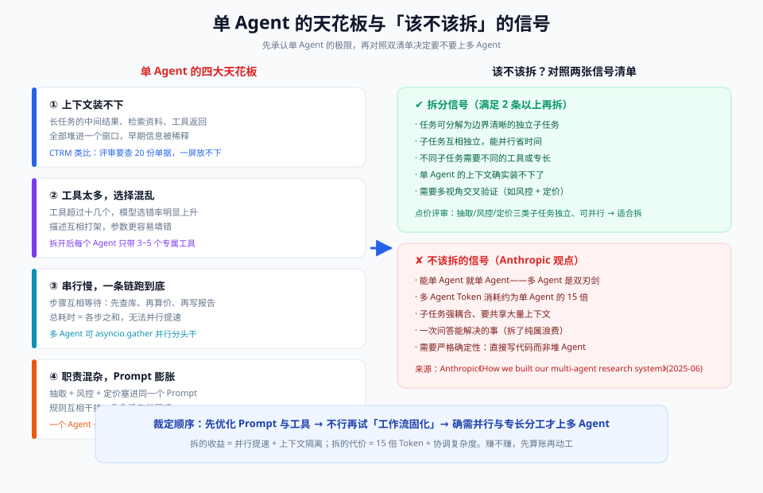

# 01 · 问题篇：单 Agent 什么时候不够用

> 【本节问题】① 单 Agent 的能力上限由什么决定，具体卡在哪四件事上？② 怎么判断我的场景"真的需要"多 Agent？③ 为什么 Anthropic 说"能单 Agent 就单 Agent"，多 Agent 的代价到底是什么？④ 点价评审这个场景，拆与不拆的账分别怎么算？

## 1. 先承认：单 Agent 的天花板是结构性的

【一句话人话】单 Agent 的天花板不靠换更强的模型解决——上下文窗口、工具列表、串行执行、单一 Prompt 这四件事是**结构性**限制，模型再强也只是把墙推远一点。

### 天花板 ①：上下文装不下

长任务的中间结果、检索到的资料、每次工具返回，全部堆进同一个窗口。评审一笔点价单要查合同、授信、行情、历史成交，资料塞满后早期信息被稀释——这就是 003 讲的 **context rot**：上下文越长，注意力越稀，前面读的"客户授信 500 万"到第 50 个工具调用时已经"记不清"了。

### 天花板 ②：工具太多，选择混乱

工具超过十几个，模型选错率明显上升：描述互相打架（`query_price` 和 `get_market_price` 区别是什么？）、参数更容易填错。研究口径常见经验值：**一个 Agent 的工具在个位数到 15 个以内表现最稳**。多 Agent 拆分后，每个 Worker 只带 3~5 个专属工具。

### 天花板 ③：串行慢，一条链跑到底

单 Agent 内部步骤天然串行：查合同 → 等结果 → 查授信 → 等结果 → 查行情……总耗时 = 各步之和。而这些查询互相独立，本可并行。多 Agent 把独立查询分给三个 Worker 同时跑，墙钟时间接近"最慢那个"而不是"全部之和"。

### 天花板 ④：职责混杂，Prompt 膨胀

把"抽取规则 + 风控规则 + 定价规则"塞进一个系统提示：规则互相干扰（抽取要求逐字引用原文，定价要求大胆推断，风格拧着来）、角色没有归属感、改一处规则影响全部。这就是 Java 老兵都懂的道理：**一个类 3000 行、40 个方法的 God Class，怎么改都是雷**。

## 2. 拆分信号清单：满足 2 条以上再拆

| 信号 | 判断问题 | 点价评审对照 |
|---|---|---|
| 任务可分解 | 能划出边界清晰的独立子任务吗？ | 抽取/风控/定价三类子任务边界清晰 ✔ |
| 可并行 | 子任务互相独立、能同时跑吗？ | 三个查询互不依赖 ✔ |
| 需要不同专长/工具 | 各子任务的工具集和 Prompt 风格差异大吗？ | 抽取要"逐字引用"，定价要"行情比对" ✔ |
| 上下文确实装不下 | 单窗口塞下全部资料后表现明显劣化吗？ | 20+ 份单据塞不下 ✔ |
| 需要交叉验证 | 结论需要多视角互相校验吗？ | 风险与定价互相印证 ✔ |

## 3. 不该拆的信号：Anthropic 的冷水要接住

Anthropic 在《How we built our multi-agent research system》（2025-06）里明确给出两句话：

> "When to use multi-agent"：**能单 Agent 就单 Agent**；多 Agent 是双刃剑。
> Token 账：**多 Agent 系统的 Token 消耗约为单 Agent 聊天的 15 倍**（Agent 模式约为聊天的 4 倍，多 Agent 放大到约 15 倍）。

不该拆的信号：

- **一次问答能解决的事**：拆出编排器纯属浪费；
- **子任务强耦合**：B 需要 A 的完整推理过程才能干活——隔离上下文反而制造信息断层；
- **追求确定性**：固定规则流程（比如金额换算、日期计算）应该写代码，不该堆 Agent；
- **Token 预算紧张**：15 倍不是修辞，是按量计费的账单。

## 4. 点价评审的拆账

**拆的收益**：抽取/风控/定价并行（3 个 Worker 各 40s，总耗时 ≈ 40s 而非 120s）；上下文隔离（风控员只看授信与合同，不被行情数据干扰）；角色聚焦（每份 Prompt 短而专）。

**拆的代价**：Token 约为单 Agent 的 15 倍量级；主管要做任务拆解与结果校验（这本身也花 Token）；多了一层协调失败的可能（06-生产篇的主题）。

**结论**：评审是高频核心业务、错误代价高、子任务天然独立——**值得拆**。反过来，"帮我查一下这个客户的授信余额"这种一句话任务，直接单 Agent + 一个工具就好。

优先级要点：
1. **先优化单 Agent**（Prompt、工具描述、上下文压缩），不行再考虑拆；
2. **再试工作流固化**（把确定步骤写死成代码流水线），只有真正需要"多视角判断 + 并行"才上多 Agent；
3. **拆之前先算 Token 账**：预估收益（时间/质量）能否覆盖 15 倍成本。

## 【本节自测】

1. **单 Agent 的四大天花板是什么？** 要点：上下文装不下、工具多选择乱、串行慢、职责混杂 Prompt 膨胀；都是结构性限制。
2. **context rot 和天花板①什么关系？** 要点：上下文越长注意力越稀释（003），多 Agent 用"上下文隔离"对症。
3. **拆分信号清单的五条是什么？** 要点：可分解、可并行、需不同专长/工具、上下文装不下、需交叉验证；满足 2 条以上再拆。
4. **Anthropic 给的 Token 倍数是多少？怎么算的？** 要点：多 Agent ≈ 单 Agent 聊天的 15 倍；Agent 模式 ≈ 4 倍，多 Agent 协调进一步放大（Anthropic 工程博客 2025-06）。
5. **为什么"子任务强耦合"不该拆？** 要点：B 需要 A 的完整推理链，隔离上下文制造信息断层，协调成本 > 收益。
6. **点价评审为什么值得拆？** 要点：高频核心、错误代价高、三个子任务独立可并行、需要交叉验证。
7. **上多 Agent 前的正确动作顺序？** 要点：优化单 Agent → 工作流固化 → 算 Token 账 → 才是多 Agent。
