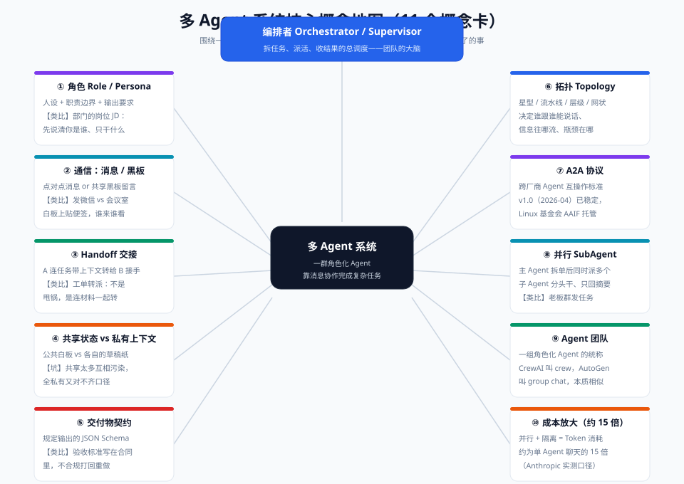

# 02 · 概念篇：核心概念精讲（11 张概念卡）

> 【本节问题】① 多 Agent 领域的术语为什么这么多，哪些是本质哪些是包装？② "角色、编排者、通信、拓扑、handoff"这几个词到底精确指什么？③ 共享状态和私有上下文为什么要分开设计？④ A2A 协议里 Agent Card、Task、Artifact 各扮演什么角色？

## 概念卡 1：多 Agent 动机

【一句话人话】多 Agent 的动机只有一个：**单 Agent 的结构性天花板（装不下、选不清、跑不快、管不住）真的卡住了业务**。
【生活类比】不是招更多人的问题，是"一件事一个人干不完"才开岗位；一个人加加班就能干的活，开会协调反而更慢。
- 坑：把多 Agent 当时髦，是 2026 年最常见的架构事故源头。

## 概念卡 2：角色（Role / Persona）

【一句话人话】角色 = 给一个 Agent 的**人设 + 职责边界 + 输出要求**，通常写进系统提示。
【生活类比】岗位 JD：你是风控专员，你只管风险，产出物格式是这份模板。
- 要素：身份（你是谁）+ 边界（只做什么、明确不做什么）+ 交付（输出 Schema）。
- 坑：角色只写"你是资深风控专家"没用——没有边界和交付物定义的角色是装饰品。

## 概念卡 3：编排者（Orchestrator / Supervisor）

【一句话人话】编排者是**拆任务、派活、收结果、做仲裁**的总调度 Agent，其他 Worker 只对它负责。
【生活类比】项目主管：把需求拆成工单分给专员，收齐结果汇总向上汇报，专员之间不直接扯皮。
- 也叫 Supervisor / Lead Agent / 主管 Agent；Anthropic 的 orchestrator-worker 模式主角。
- 坑：编排者自己也是 LLM，拆解也会错——它的输出同样需要校验。

## 概念卡 4：通信（消息 / 共享黑板）

【一句话人话】Agent 间通信两种基本形态：**点对点消息**（A 直接发内容给 B）和**共享黑板**（大家读写同一块公共空间）。
【生活类比】发微信（消息）vs 会议室白板贴便签（黑板）。
- 消息：责任清晰、易追踪，适合任务委派；黑板：松耦合、异步，适合多方共享事实（如"今天基准价"）。
- 坑：黑板写入无 Schema 约束时，会退化成"谁都能涂鸦的白板"，信息互相污染。

## 概念卡 5：拓扑（Topology）

【一句话人话】拓扑决定**谁跟谁能说话、信息往哪流**——星型、流水线、层级、网状四种基本形。
【生活类比】组织沟通结构：全部汇报给主管（星型）、流水线一道工序接一道（流水线）、逐级汇报（层级）、圆桌自由讨论（网状）。
- 拓扑是架构决策，不是实现细节：它直接决定成本、延迟、可观测性与失败模式。
- 详见 04-进阶篇与 007-04 对比图。

## 概念卡 6：Handoff 交接

【一句话人话】Handoff = A 把任务**连同上下文一起转交**给 B，B 从此接管，A 退出。
【生活类比】工单转派：不是甩一句"你处理下"，而是连材料、背景、验收标准一起打包移交。
- OpenAI Swarm/Agents SDK 把它做成一等原语：转交给谁 = 切换到谁的 Prompt 与工具集。
- 坑：只转任务不转上下文 = 甩锅，是失败模式②的根源。

## 概念卡 7：共享状态 vs 私有上下文

【一句话人话】共享状态是**大家都要对齐的事实**（公共白板）；私有上下文是**各自工作台上的草稿**（不该外泄也不该塞给别人）。
【生活类比】项目群公告（共享）vs 你自己的草稿纸（私有）。
- 多 Agent 的核心收益就是私有上下文隔离：风控员不必看到行情 API 的原始返回。
- 坑：全共享 → 互相污染、窗口爆炸；全私有 → 口径不一致（"数量"vs"手数"）。按事实类型分层共享。

## 概念卡 8：Agent 团队（Agent Team / Crew / Group Chat）

【一句话人话】Agent 团队 = 一组角色化 Agent + 一套协作规则的**统称**，各框架叫法不同本质相似。
【生活类比】项目组：CrewAI 叫 crew，AutoGen 叫 group chat，LangGraph 里是一张图——都是"人 + 协作制度"。
- 别被名词迷惑：评估任何框架的"团队"只需看三件事——怎么定角色、怎么定通信、怎么定终止条件。

## 概念卡 9：并行 Sub-Agent

【一句话人话】主 Agent 拆出多个子任务后**同时派发**给多个 SubAgent 并行执行，收回来的是摘要/交付物而非全程日志。
【生活类比】老板群发三个任务给三个专员，收三份报告，不旁听每个人的工作过程。
- Anthropic 实测：并行工具调用为多 Agent 系统节省约 90% 的时间（来源：Anthropic 工程博客 2025-06）。
- 工程实现即 `asyncio.gather` / `CompletableFuture.allOf`，05-实战篇落地。

## 概念卡 10：A2A 协议（Agent2Agent）

【一句话人话】A2A 是**跨厂商 Agent 互操作开放协议**：用 Agent Card 自我介绍，用 Task 承载任务生命周期，用 Artifact 交付产物。
【生活类比】企业间合作标准：先交换公司简介与资质（Agent Card），签合同定里程碑（Task），验收交付物（Artifact）。
- 三要素：**Agent Card**（`/.well-known/agent-card.json` 自描述能力与鉴权方式，v1.0 起支持 JWS 签名）、**Task 状态机**（submitted → working → completed/failed，可 input-required 暂停等澄清）、**Artifact**（任务产物）。
- 现状：2025-04 Google 发布 → 2025-06 捐 Linux 基金会 → 2026-04 v1.0 → 2026-08 入 AAIF（来源：Linux Foundation / AAIF 公告）。
- 与 MCP 互补：MCP 连工具，A2A 连 Agent（详见 04-进阶篇）。

## 概念卡 11：成本放大（Token × 15）

【一句话人话】多 Agent 的并行与隔离都有代价：**Token 消耗约为单 Agent 聊天的 15 倍**——每个 Worker 重复读背景、每次 handoff 携带内容、编排本身都要花钱。
【生活类比】开会本身不产出，但每个参会者的时间都在计费；人多不等于便宜，等于贵得快。
- Anthropic 口径：Agent ≈ 4× 聊天，多 Agent ≈ 15× 聊天（2025-06 工程博客）。
- 防御见 06-生产篇：预算护栏、模型分级、先抽样试跑。

## 概念速查表

| 概念 | 一句话 | Java 心智映射 |
|---|---|---|
| 角色 | 人设 + 边界 + 交付 | 岗位 JD + DTO 输出约定 |
| Orchestrator | 拆解派活收结果的调度 | 工作流引擎 / 网关路由 |
| 通信 | 消息 or 黑板 | RPC 消息 vs 共享缓存 |
| 拓扑 | 谁能和谁说话 | 服务依赖拓扑 |
| Handoff | 带上下文的任务转交 | 工单转派 + 材料移交 |
| 共享 vs 私有 | 公共事实 vs 工作草稿 | 共享缓存 vs 线程栈 |
| Agent 团队 | 角色 + 协作规则的统称 | 项目组 |
| 并行 SubAgent | 同时派发只收摘要 | CompletableFuture.allOf |
| A2A | Agent 互操作协议 | 微服务 RPC 标准 + 服务发现 |
| 成本放大 | Token ≈ 15× | 每次跨服务调用的序列化开销 ×N |

## 【本节自测】

1. **角色的三要素是什么？** 要点：身份人设、职责边界（含明确不做什么）、输出交付（Schema）。
2. **点对点消息和共享黑板怎么选？** 要点：任务委派与审计要求高 → 消息；多方共享事实、松耦合 → 黑板；黑板必须配 Schema。
3. **Handoff 和"甩锅"的区别？** 要点：是否携带上下文四件套（任务、数据、Schema、边界）。
4. **多 Agent 的核心收益为什么是"私有上下文隔离"？** 要点：每个 SubAgent 只装自己需要的上下文，对抗 context rot。
5. **Agent Card 是什么、放在哪、v1.0 加了什么？** 要点：自描述 JSON，`/.well-known/agent-card.json`，v1.0 支持 JWS 签名验证身份。
6. **A2A 的 Task 状态机主链路？** 要点：submitted → working → completed/failed；可 input-required 暂停等待澄清。
7. **15 倍 Token 的来源有哪些？** 要点：Worker 重复读背景、handoff 载荷、编排/校验自身消耗、并行放大。
8. **Agent 团队各框架叫法？** 要点：CrewAI crew、AutoGen group chat、LangGraph 图编排、OpenAI Agents SDK handoffs 网络。
