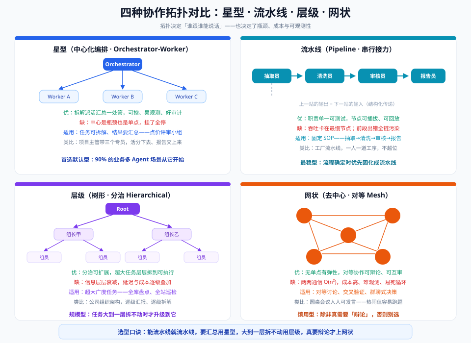
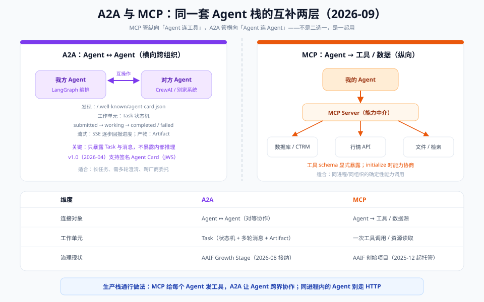

# 04 · 进阶篇：编排拓扑与 A2A 协议

> 【本节问题】① 四种拓扑各自的优劣和适用边界是什么？② A2A 协议的 Agent Card、Task 状态机、Artifact 具体怎么工作？③ A2A 和 MCP 到底怎么分工、怎么配合？④ Anthropic 的多 Agent 研究系统沉淀了哪些可直接抄的工程经验？

## 1. 四种拓扑对比

| 拓扑 | 结构 | 优点 | 缺点 | 适用 | 点价评审对照 |
|---|---|---|---|---|---|
| **星型** | 主管 + N Worker，放射通信 | 可控、易观测、好审计；上下文在主管集中 | 主管是瓶颈与单点 | 可拆解 + 需汇总 | ✔ 正是这个 |
| **流水线** | A→B→C→D 线性接力 | 职责单一可测试；节点可插拔 | 吞吐卡最慢节点；前段错全链污染 | 固定 SOP | 抽取→清洗→审核→归档 |
| **层级** | 树状，逐级拆解 | 分治可扩展，超大任务拆到可执行 | 信息层层衰减；延迟成本逐级叠加 | 超大广度任务 | 全量历史单据盘点 |
| **网状** | 对等全连 | 无单点有弹性；可辩论互审 | O(n²) 通信；难观测；易死循环 | 对等讨论/交叉验证 | 风险争议时的复核辩论 |

**选型口诀：能流水线就流水线，要汇总用星型，大到一层拆不动用层级，真要辩论才上网状。**

工程细节：
- 星型主管负载 = N 份子任务规划 + N 份结果校验。Worker 数量建议 3~5 个：再多主管上下文又开始 rot——**星型的天花板是主管的上下文**；
- 层级 = 星型的递归嵌套（每个中层又是一个小主管），代价是每层都有信息损耗，能不嵌就不嵌；
- 网状必须配全局轮次上限与终止仲裁者，否则乒乓循环烧钱（06-生产篇失败模式③）。

## 2. A2A 协议详解

【一句话人话】A2A 给"Agent 调用另一个 Agent"定了标准：先看名片（Agent Card）确认能力和鉴权，下单立任务（Task），看状态机跟踪进度，验收交付物（Artifact）。

### 2.1 Agent Card：自我介绍

部署在 `https://{host}/.well-known/agent-card.json` 的 JSON 文档，内容包括：能力描述（支持什么技能）、服务地址、鉴权方案（APIKey/HTTP Bearer/OAuth2/OIDC/mTLS 等，v1.0 支持 **JWS 签名卡**验证身份）。调用方先拉名片决定"能不能调、怎么调"。类比：微服务的服务注册信息 + OpenAPI 文档合体。协议只**声明**鉴权方案，不代执行——加不加固是实现者的责任。

### 2.2 Task：带状态机的工作单元

| 状态 | 含义 |
|---|---|
| submitted | 已受理 |
| working | 执行中（可多次更新进度） |
| input-required | 暂停，等调用方补充澄清 |
| completed | 完成，附 Artifact |
| failed | 失败，附错误 |
| canceled | 取消 |

关键设计：Agent 对调用方是**不透明**的——只能看到 Task 状态与消息，看不到对方内部推理链。这就是"把 Agent 当工具调"与"把 Agent 当对等方委托"的本质区别：前者是一次函数调用，后者是带生命周期的委托合同。传输绑定：JSON-RPC 2.0、gRPC、HTTP+JSON/REST；流式进度用 SSE（`sendMessageStream`）。

### 2.3 与 MCP 的关系：互补两层

| 维度 | A2A | MCP |
|---|---|---|
| 连接对象 | Agent ↔ Agent（对等，跨组织） | Agent → 工具/数据 |
| 工作单元 | Task（状态机 + 多轮消息 + Artifact） | 一次工具调用/资源读取 |
| 发现机制 | Agent Card（well-known URL） | initialize 能力协商 |
| 对调用方暴露 | 不透明（只有状态和消息） | 显式（工具 schema、资源内容） |
| 治理（2026-09） | AAIF Growth Stage（2026-08 接纳） | AAIF 创始项目（2025-12 起托管） |

（来源：AAIF 2026-08 公告、Linux Foundation 2025-06 新闻稿。）

灰区提示：MCP 也在加实验性 **tasks 原语**支持长任务，但 MCP Server 本质仍是"能力提供方"而非"自主协商方"；反过来，同一个 Agent 可以同时用两种方式暴露——给同步调用方当 MCP 工具，给编排方当 A2A 远程 Agent。**选型判断：对方有自己的推理循环、可能中途提问、可能跑十分钟 → A2A；固定输入输出的能力 → MCP 工具。**

## 3. Anthropic 多 Agent 研究系统：可抄的工程经验

Anthropic《How we built our multi-agent research system》（2025-06）是公开资料里最完整的多 Agent 生产复盘，四条可直接抄：

1. **Orchestrator-Worker 是主结构**：Lead Agent 负责拆解与委派，SubAgent 并行执行、只回摘要。研究类任务收益最大（内部评估比单 Agent 聊天提升 90.2%），因为子任务天然独立可并行；
2. **并行换时间**：并行工具调用与并行 SubAgent 共同节省约 90% 时间——但**仅当子任务独立时成立**；
3. **任务描述决定下限**：Lead 给 SubAgent 的任务必须写清目标、输出格式、**工具指引**（用哪些工具、别用哪些）与**努力程度**（effort pacing：该深挖还是浅尝）；SubAgent 不是"聪明到不用指令"的员工；
4. **15 倍 Token 是账不是梗**：Agent ≈ 4× 聊天，多 Agent ≈ 15× 聊天。只在任务价值足够高（用户付费研究、高风险评审）时启用；同时要处理失败模式：SubAgent 卡死、工具超时、上下文溢出——全部要有重试与熔断。

优先级要点：
1. 抄结构：Lead 拆任务 + 并行 SubAgent + 只收摘要；
2. 抄纪律：任务描述四件套（目标/格式/工具指引/努力程度）；
3. 抄账本：上线前用 15× 口径估成本，按价值分级启用。

## 【本节自测】

1. **四种拓扑各一句话优劣？** 要点：星型可控但中心瓶颈；流水线稳定但卡最慢节点；层级可扩展但层层衰减；网状弹性但 O(n²) 且易死循环。
2. **星型拓扑的天花板在哪、Worker 数量建议？** 要点：主管上下文；3~5 个。
3. **Agent Card 是什么、URL 约定、v1.0 增强？** 要点：`.well-known/agent-card.json` 自描述；JWS 签名验证身份；协议只声明鉴权不代执行。
4. **Task 状态机全链路？** 要点：submitted → working →（input-required）→ completed/failed/canceled。
5. **A2A 与 MCP 的三层区别（对象/单元/暴露）？** 要点：连 Agent vs 连工具；Task vs 单次调用；不透明 vs 显式 schema。
6. **什么时候把 Agent 暴露为 MCP 工具、什么时候用 A2A？** 要点：固定输入输出 → MCP；有自主推理、需多轮澄清、长任务 → A2A。
7. **Anthropic 经验中"任务描述四件套"？** 要点：目标、输出格式、工具指引、努力程度（effort pacing）。
8. **90.2% 与 15× 各指什么？** 要点：内部研究评估相对单 Agent 聊天的性能提升；多 Agent 相对聊天的 Token 消耗倍数。
