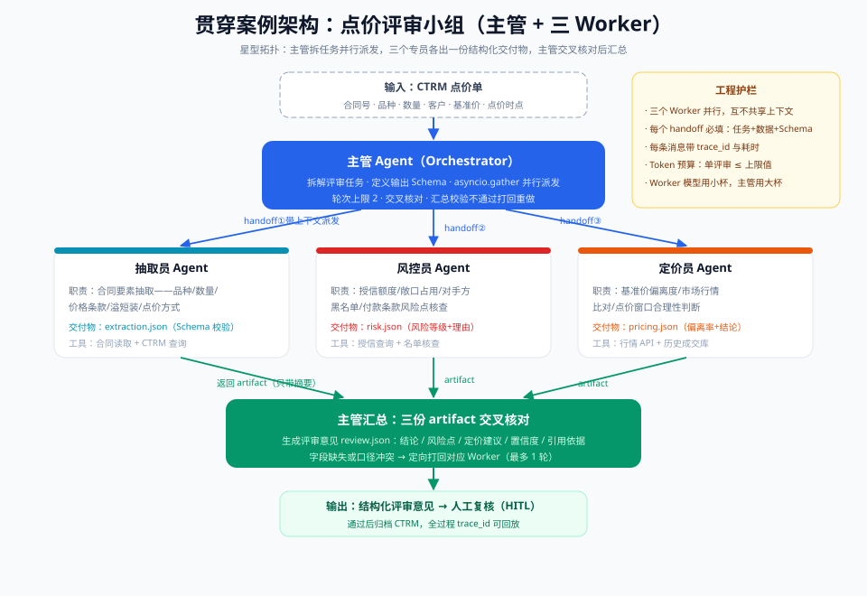

# 05 · 实战篇：手写一个多 Agent 协作（Python 全代码）

> 【本节问题】① 不用任何框架，多 Agent 协作的最小实现长什么样？② handoff 消息在代码里长什么结构？③ 并行派发与汇总校验怎么写？④ 这套手写代码和 LangGraph/OpenAI Agents SDK 的对应关系是什么？

## 0. 目标与运行方式

**贯穿案例：点价评审小组**——主管 Agent 拆解评审任务 → 并行派给三个 Worker（抽取员/风控员/定价员）→ 收齐三份结构化交付物 → 汇总生成评审意见。拓扑即 007-06 架构图：



- 仅依赖 `openai` 官方 SDK + 标准库（asyncio），无框架；
- 标题里的"双 Agent"是最小形态：把 `WORKERS` 砍到 1 个就是"主管 + 1 Worker"双 Agent 版；本篇按贯穿案例给完整的 1 + 3 版；
- Worker 模型用便宜档（生产即"模型分级路由"），主管用强档。

```bash
pip install openai>=1.40
export OPENAI_API_KEY=sk-xxxx        # Windows PowerShell: $env:OPENAI_API_KEY="sk-xxxx"
python 007_multi_agent_review.py
```

## 1. 全部代码（单文件可跑）

```python
# -*- coding: utf-8 -*-
"""
007_multi_agent_review.py —— 点价评审小组（主管 + 三 Worker）
拓扑：星型（L1 固定委派）。主管不拆 LLM 任务（拆解逻辑写死），只做派发与汇总校验。
护栏：交付物 Schema 校验、轮次上限、trace_id 全链路、Token 预算口径。
"""
import asyncio
import json
import uuid
from dataclasses import dataclass, field, asdict
from openai import AsyncOpenAI

client = AsyncOpenAI()
MODEL_WORKER = "gpt-4o-mini"   # 小杯模型：Worker 用（成本分级）
MODEL_LEAD   = "gpt-4o"        # 大杯模型：主管汇总用
MAX_TURNS    = 6               # 每个 Worker 的工具轮次上限（防循环）

# ---------- 1. 模拟 CTRM 工具（生产中替换为 MCP 工具 / DB 查询） ----------

def get_contract(contract_no: str) -> dict:
    """查合同要素（模拟 CTRM 合同表）"""
    return {"contract_no": contract_no, "variety": "电解铜", "quantity_ton": 500,
            "price_clause": "M+1 月均价 + 300", "basis_price": 73850,
            "pricing_window": "2026-09-01 ~ 2026-09-30", "tolerance": "溢短装 ±2%"}

def get_credit(customer: str) -> dict:
    """查客户授信（模拟授信表）"""
    return {"customer": customer, "credit_limit": 5_000_000, "used": 4_620_000,
            "payment_terms": "货到 30 天", "blacklisted": False}

def get_market_price(variety: str, month: str) -> dict:
    """查行情（模拟行情 API）"""
    return {"variety": variety, "settle_month": month, "spot_avg": 74120,
            "prev_month_avg": 72900, "volatility": "中"}

# ---------- 2. handoff 消息结构：四件套必填 ----------

@dataclass
class Handoff:
    trace_id: str            # 全链路追踪 ID
    from_role: str           # 派发方
    to_role: str             # 接收方
    task: str                # 任务目标（做什么）
    input_data: dict         # 输入数据（材料，而不是"你自己查"）
    output_schema: dict      # 输出契约（验收标准）
    boundary: str            # 边界（明确别做什么）

    def render(self) -> str:
        """把 handoff 渲染成发给 Worker 的消息正文"""
        return (f"[handoff {self.trace_id}] {self.from_role} → {self.to_role}\n"
                f"任务：{self.task}\n输入数据：{json.dumps(self.input_data, ensure_ascii=False)}\n"
                f"输出契约：{json.dumps(self.output_schema, ensure_ascii=False)}\n"
                f"边界：{self.boundary}")

# ---------- 3. Worker 定义：角色提示词 + 专属工具 + 输出契约 ----------

EXTRACTION_SCHEMA = {"contract_no": "str", "variety": "str", "quantity_ton": "number",
                     "price_clause": "str", "basis_price": "number", "tolerance": "str"}
RISK_SCHEMA       = {"risk_level": "enum[low,medium,high]", "credit_remaining": "number",
                     "blacklisted": "bool", "reasons": "list[str]"}
PRICING_SCHEMA    = {"deviation_pct": "number", "market_ref": "number", "conclusion": "str",
                     "reasons": "list[str]"}

WORKERS = {
    "extractor": {
        "system": ("你是点价评审小组的抽取员。只做合同要素抽取，逐字引用原文数字，"
                   "禁止推断或换算。输出必须严格是 JSON，字段按输出契约。"),
        "tools": [get_contract],
    },
    "risk": {
        "system": ("你是点价评审小组的风控员。只核查授信、敞口、黑名单与付款条款风险。"
                   "基于输入数据判断，不要重新查询行情。输出必须严格是 JSON。"),
        "tools": [get_credit],
    },
    "pricing": {
        "system": ("你是点价评审小组的定价员。只判断基准价与点价窗口的合理性，"
                   "计算偏离率保留两位小数。输出必须严格是 JSON。"),
        "tools": [get_market_price],
    },
}

# ---------- 4. Worker 执行：最小工具循环 + 轮次上限 ----------

def tool_dispatch(worker: dict, name: str, args: dict) -> str:
    for fn in worker["tools"]:
        if fn.__name__ == name:
            return json.dumps(fn(**args), ensure_ascii=False)
    return json.dumps({"error": f"未知工具 {name}"}, ensure_ascii=False)

async def run_worker(role: str, handoff: Handoff) -> dict:
    """跑一个 Worker：system = 角色卡，user = handoff 四件套；带工具循环与轮次上限"""
    worker = WORKERS[role]
    messages = [{"role": "system", "content": worker["system"]},
                {"role": "user",   "content": handoff.render()}]
    for _ in range(MAX_TURNS):                      # 轮次上限：防循环踢皮球
        resp = await client.chat.completions.create(
            model=MODEL_WORKER, messages=messages,
            tools=[{"type": "function",
                    "function": {"name": fn.__name__,
                                 "description": fn.__doc__ or fn.__name__,
                                 "parameters": {"type": "object", "properties": {}}}}
                   for fn in worker["tools"]])
        msg = resp.choices[0].message
        if not msg.tool_calls:                      # 没有工具调用 = 最终交付
            return {"role": role, "trace_id": handoff.trace_id,
                    "payload": json.loads(msg.content)}
        messages.append(msg)                        # 记录工具调用
        for tc in msg.tool_calls:                   # 执行并回填结果
            result = tool_dispatch(worker, tc.function.name, json.loads(tc.function.arguments or "{}"))
            messages.append({"role": "tool", "tool_call_id": tc.id, "content": result})
    raise RuntimeError(f"[{handoff.trace_id}] {role} 超过 {MAX_TURNS} 轮上限，熔断")

# ---------- 5. 主管：固定委派（L1）→ 并行派发 → 校验 → 汇总 ----------

def build_handoffs(trace_id: str, contract_no: str, customer: str) -> list[Handoff]:
    contract = get_contract(contract_no)            # 主管只发最小输入集合（上下文隔离）
    base = dict(trace_id=trace_id, from_role="lead")
    return [
        Handoff(**base, to_role="extractor",
                task="抽取该合同的全部评审要素",
                input_data={"contract_no": contract_no},
                output_schema=EXTRACTION_SCHEMA,
                boundary="禁止调用授信或行情工具，禁止推断"),
        Handoff(**base, to_role="risk",
                task="核查该客户与本笔交易的风险点",
                input_data={"customer": customer, "quantity_ton": contract["quantity_ton"],
                            "basis_price": contract["basis_price"]},
                output_schema=RISK_SCHEMA,
                boundary="禁止查询行情，禁止给出定价建议"),
        Handoff(**base, to_role="pricing",
                task="评估基准价与点价窗口的合理性",
                input_data={"variety": contract["variety"],
                            "settle_month": "2026-09", "basis_price": contract["basis_price"]},
                output_schema=PRICING_SCHEMA,
                boundary="禁止查询授信，禁止评价风险"),
    ]

def validate(payload: dict, schema: dict) -> list[str]:
    """交付物 Schema 校验：字段缺失 = 打回（生产中用 pydantic）"""
    missing = [k for k in schema if k not in payload]
    return [f"缺少字段: {k}" for k in missing]

async def run_lead(contract_no: str, customer: str) -> dict:
    trace_id = uuid.uuid4().hex[:8]
    print(f"[{trace_id}] 主管：拆解为 3 个子任务，并行派发")
    handoffs = build_handoffs(trace_id, contract_no, customer)

    results = await asyncio.gather(                 # 并行派发（CompletableFuture.allOf 的 Python 版）
        run_worker("extractor", handoffs[0]),
        run_worker("risk",      handoffs[1]),
        run_worker("pricing",   handoffs[2]),
    )
    for r in results:                               # 汇总校验：不合规定向打回（此处直接报错简化）
        errors = validate(r["payload"], {"extractor": EXTRACTION_SCHEMA,
                                         "risk": RISK_SCHEMA,
                                         "pricing": PRICING_SCHEMA}[r["role"]])
        if errors:
            raise ValueError(f"[{trace_id}] {r['role']} 交付不合规：{errors}")
    print(f"[{trace_id}] 三份交付物全部通过 Schema 校验，进入汇总")

    prompt = ("你是点价评审小组主管。基于三份交付物交叉核对后出具评审意见。"
              "重点核对：抽取的数量与风控/定价使用的数量是否同一口径。\n"
              + json.dumps([r["payload"] for r in results], ensure_ascii=False, indent=2))
    resp = await client.chat.completions.create(model=MODEL_LEAD, messages=[
        {"role": "system", "content": "只输出 JSON：{conclusion, risk_points, pricing_advice, confidence}"},
        {"role": "user", "content": prompt}])
    review = json.loads(resp.choices[0].message.content)
    print(f"[{trace_id}] 评审意见：{json.dumps(review, ensure_ascii=False, indent=2)}")
    return {"trace_id": trace_id, "review": review, "artifacts": [r["payload"] for r in results]}

if __name__ == "__main__":
    asyncio.run(run_lead(contract_no="CT-2026-0912", customer="华东铜业"))
```

## 2. 代码与概念的对应关系

| 代码元素 | 概念 | Java 心智映射 |
|---|---|---|
| `Handoff` 四件套 | handoff 结构化交接 | 转派工单 DTO |
| `WORKERS[role]["system"]` | 角色 Role/Persona | 岗位 JD |
| `asyncio.gather(...)` | 并行 SubAgent | `CompletableFuture.allOf` |
| `MAX_TURNS` | 轮次上限熔断 | 循环边界 + 超时 |
| `validate(payload, schema)` | 交付物 Schema 前置校验 | Bean Validation |
| `trace_id` 贯穿 | 可观测 trace | MDC / Sleuth 链路 ID |
| `MODEL_WORKER` vs `MODEL_LEAD` | 模型分级路由 | 缓存分级（本地/Redis） |
| `run_worker` 工具循环 | 单 Agent ReAct（004） | 服务内 RPC 循环 |

## 3. 优先级要点与坑

1. **先跑通"双 Agent"**：把 `WORKERS` 砍到 1 个、`gather` 只留一项——先验证 handoff 与校验链路，再加 Worker；
2. **主管不做 LLM 拆解（L1）**：拆解逻辑写死在 `build_handoffs`，把不确定性降到最低；要升级 L2（动态拆解）时，才让主管先输出子任务 JSON；
3. **Worker 的工具列表 = 角色边界**：`tools` 字段就是"只带 3~5 个专属工具"的落地，风控员物理上查不到行情；
4. **生产替换点**：`get_*` 模拟函数 → 006 讲的 MCP 工具调用；`validate` → pydantic 模型；`print` → 结构化日志上报 Langfuse/LangSmith；
5. **坑：JSON 解析崩溃**：Worker 输出夹带 markdown 代码块时 `json.loads` 会炸——生产中用 SDK 的结构化输出（`response_format`）或去掉围栏再解析。

## 4. 与框架的映射（细节见 07/009）

| 手写版 | OpenAI Agents SDK | LangGraph |
|---|---|---|
| `run_lead` 编排 | Handoff Agent 网络 / Supervisor | StateGraph + supervisor 节点 |
| `Handoff` dataclass | handoff 参数传递 | 共享 State 的 reducer |
| `asyncio.gather` | 并行子 Agent 原生支持 | Send API 并发分支 |
| 手写工具循环 | SDK 内置 | 预置 ReAct 图 |

## 【本节自测】

1. **`Handoff` 四件套是什么？缺一个会怎样？** 要点：任务、输入数据、输出契约、边界；缺了就是"甩锅式交接"，Worker 靠猜。
2. **`asyncio.gather` 对应 Java 什么原语？失败传播行为是什么？** 要点：`CompletableFuture.allOf`；任一 Worker 抛异常整体失败——生产中可 `return_exceptions=True` 收集后定向重试。
3. **为什么风控员"物理上"查不到行情？** 要点：角色工具集只挂 `get_credit`，工具边界即职责边界。
4. **`MAX_TURNS` 防的是什么失败模式？** 要点：循环踢皮球/工具死循环（06 篇失败模式③）。
5. **`validate` 打回的触发条件与动作？** 要点：交付物缺字段/不合 Schema；定向打回对应 Worker（代码里简化为报错，生产中最多回 1 轮）。
6. **升级到 L2 动态拆解要改哪里？** 要点：让主管 LLM 先输出子任务清单 JSON，`build_handoffs` 改为消费该清单，其余链路不变。
7. **最小双 Agent 版怎么裁剪？** 要点：WORKERS 留 1 个、gather 单项——先验证链路再扩编。
