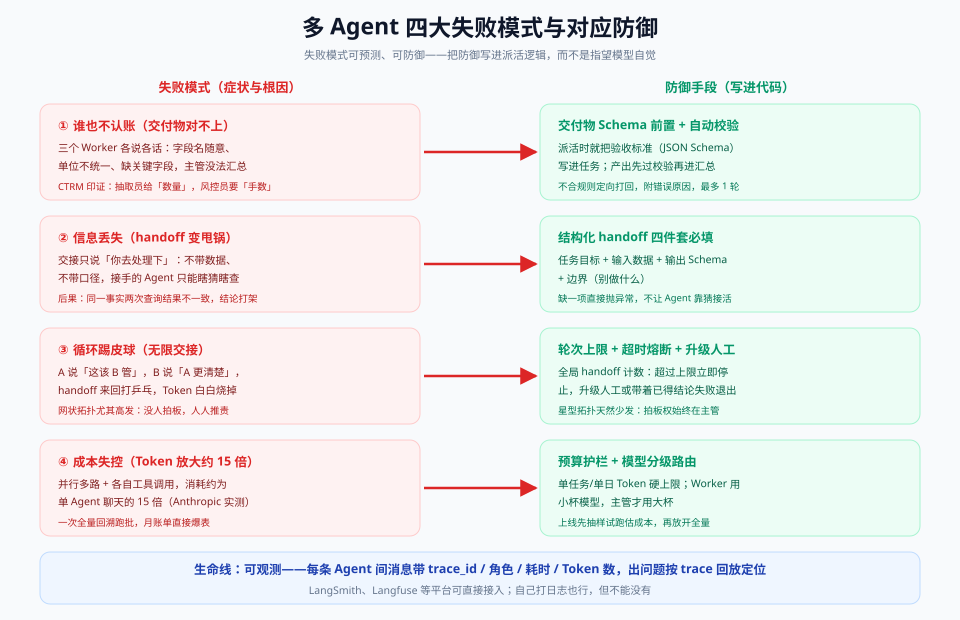

# 06 · 生产篇：成本、上下文与失败模式

> 【本节问题】① 多 Agent 系统在生产上最常见的翻车姿势是哪四种？② 每种失败模式的防御代码长什么样？③ 成本怎么预算、怎么护栏？④ 可观测性要记什么，出问题怎么回放？



## 1. 失败模式①：谁也不认账（交付物对不上）

**症状**：三个 Worker 各交各的——字段名随意（`quantity` / `qty` / `数量`）、单位不统一（吨 vs 手）、缺关键字段；主管汇总时对不齐口径，评审意见互相打架。
**根因**：只派了任务，没定契约——"交付"没有验收标准。
**防御（写进代码）**：
1. **交付物 Schema 前置**：派活时 handoff 里就带 `output_schema`（05-实战篇的 `Handoff.output_schema`）；
2. **自动校验 + 定向打回**：产出先过 pydantic/JSON Schema 校验，不合格附错误原因打回原 Worker，**最多 1 轮**；
3. **公共事实字典**：跨 Worker 的共享事实（品种代码、单位、日期格式）维护一份字典，所有角色提示词引用同一份。

## 2. 失败模式②：信息丢失（handoff 变甩锅）

**症状**：交接消息只有"你去核查一下这个合同的风险"——不带数据不带口径，接手 Agent 只能重新瞎查，两次查询结果不一致，结论冲突。
**根因**：把 handoff 当成了口头喊话，而不是材料移交。
**防御**：**结构化 handoff 四件套必填**——任务目标 + 输入数据 + 输出 Schema + 边界（05-实战篇 `Handoff` dataclass 的四个字段，缺一不可，缺了直接抛异常而不是让 Agent 猜）。

## 3. 失败模式③：循环踢皮球（无限交接）

**症状**：A 说"这该 B 管"，B 说"A 更清楚"，handoff 打乒乓球；网状拓扑里没有拍板人，Token 白白烧掉直到有人手动杀进程。
**根因**：没有全局轮次记账，没有终止仲裁者。
**防御**：
1. **全局 handoff 计数 + 轮次上限**：单任务总轮次封顶（点价评审建议 ≤ 6），超限熔断；
2. **超时熔断**：单 Worker 墙钟超时（如 120s）即失败退出；
3. **升级人工**：熔断后不是静默丢弃，而是带着已得的部分结论升级 HITL；
4. **拓扑预防**：星型天然少发——拍板权始终在主管；用网状就必须显式设仲裁者。

```python
# 防御③伪代码
class HandoffBudget:
    def __init__(self, max_hops: int = 6, timeout_s: int = 120):
        self.hops, self.max_hops, self.timeout_s = 0, max_hops, timeout_s
    def transfer(self, handoff: Handoff):
        self.hops += 1
        if self.hops > self.max_hops:
            raise EscalateToHuman(f"[{handoff.trace_id}] 交接超限，升级人工")  # 带部分结论升级
```

## 4. 失败模式④：成本失控（Token × 15）

**症状**：并行多路 + 各自工具调用，消耗约为单 Agent 聊天的 15 倍（Anthropic 口径）；一次全量历史数据回溯跑批，月账单爆表。
**根因**：把"多 Agent 不贵"当成了默认假设，没预算、没分级、没试跑。
**防御**：
1. **预算护栏**：单任务 Token 硬上限（如 ≤ 50k）、单日团队上限（如 ≤ 2M），超限拒绝开新任务；
2. **模型分级路由**：Worker 用小杯（gpt-4o-mini 级），主管/汇总才用大杯——Worker 占 Token 大头，分级立省 60%+；
3. **先抽样试跑**：上线前抽 20 笔真实单据试跑，实测均值 × 业务量 = 预算基线；
4. **按价值分级启用**：Anthropic 的判断口径——任务价值足够高（付费研究、高风险评审）才付 15 倍的溢价，低价值查询留在单 Agent。

## 5. 可观测性：每条消息都是一笔流水

多 Agent 出问题时，"模型最终输出对不对"往往查不出来——要查**过程**。最小可观测四件套：

| 记录项 | 内容 | 用途 |
|---|---|---|
| trace_id | 全链路唯一 ID，handoff 间透传 | 串联一次评审的全部消息 |
| 角色与轮次 | 谁、第几轮、调了什么工具 | 定位"谁也不认账"发生在哪个环节 |
| 耗时与 Token | 每条消息的墙钟时间 + prompt/completion Token | 成本归因到 Worker 粒度 |
| 消息全文 | handoff 与交付物原文（脱敏后） | 事后回放定位口径冲突 |

落地：自建就打结构化日志（trace_id 进 MDC，Java 开发者零学习成本）；平台化接 **LangSmith / Langfuse**（均支持多 Agent trace 树）。回放姿势：按 trace_id 拉出整棵调用树 → 找到第一个口径不一致的消息 → 修 Schema 或提示词。

## 6. 生产检查清单（上线前逐条打勾）

- [ ] 每个 Worker 的交付物有 Schema 且有自动校验 + 打回机制
- [ ] Handoff 四件套必填，缺字段抛异常
- [ ] 全局轮次上限 + 单 Worker 超时熔断 + 升级人工通道
- [ ] 单任务/单日 Token 预算护栏 + 模型分级路由
- [ ] trace_id 全链路贯穿，消息全文可回放
- [ ] 用真实数据抽样试跑过，成本基线已测算
- [ ] 已回答"为什么不写成普通代码"（需要多视角 LLM 判断，而非规则可穷举）

## 【本节自测】

1. **四大失败模式分别是什么？** 要点：交付物对不上、handoff 信息丢失、循环踢皮球、成本失控（×15）。
2. **"定向打回"和"整体重跑"的区别？** 要点：只打回不合规的那个 Worker 并附错误原因（最多 1 轮），成本与延迟都远低于整体重跑。
3. **handoff 四件套缺一个的正确行为？** 要点：抛异常拒绝执行——让 Agent 猜 = 失败模式②的起点。
4. **为什么网状拓扑更需要轮次上限？** 要点：无拍板人、两两通信，乒乓循环风险最高；星型拍板权在主管。
5. **成本防御的四个动作？** 要点：预算护栏、模型分级、抽样试跑、按价值分级启用。
6. **最小可观测四件套？** 要点：trace_id、角色与轮次、耗时与 Token、消息全文；LangSmith/Langfuse 平台化。
7. **熔断后为什么必须升级人工而不是静默丢弃？** 要点：部分结论已花费成本，HITL 兜底保住业务连续性（CTRM 评审是高风险流程，静默失败不可接受）。
8. **检查清单里"为什么不写成普通代码"考什么？** 要点：防止 LLM 化过度——规则可穷举的步骤该写代码，Agent 只用于需要多视角判断的环节。
