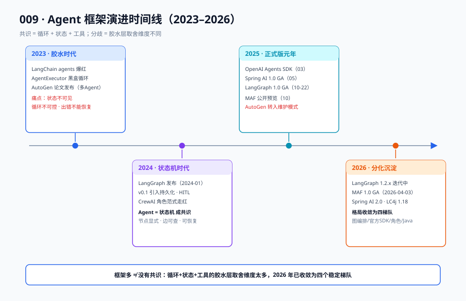

# 00 · 背景篇：为什么会有这么多框架

> 【本节问题】① Agent 框架为什么在 2023~2026 短短四年爆发式增长？② "框架太多"的真实原因是什么？③ 框架存在的本质价值是什么——没有框架就做不了 Agent 吗？④ 作为 CTRM 开发者，该如何看待这场框架混战？

## 1. 框架爆发时间线

先看一张图建立时间感（细节后文逐条展开）。



### 2023 · 胶水时代：LangChain agents 一统注意力

- 2022-11 ChatGPT 发布，2023 年上半年 Agent 概念爆发。LangChain 的 `AgentExecutor` + ReAct prompt 成了事实标准——本质是"LLM 循环 + 工具 JSON 解析"的胶水库。
- 同期 AutoGen（Microsoft Research，2023-10 论文）提出多 Agent 对话范式；MetaGPT 等角色扮演框架扎堆出现。
- 痛点显形：AgentExecutor 把控制流藏在黑盒 prompt 解析里，不可控、难调试、循环无界。社区怨声最大的三件事：**状态不可见、循环不可控、出错不能恢复**。

### 2024 · 状态机时代：把 Agent 画成图

- 2024-01 LangGraph 首次发布，作为 LangChain 生态的图编排扩展；2024-06 v0.1 稳定版引入生产级特性（持久化、Human-in-the-Loop）。（来源：博客园《LangGraph：图驱动的有状态智能体编排运行时》，2026-09 检索）
- 核心转向：**Agent 不是 prompt 循环，是状态机**。节点即步骤，边即转移，状态显式可见——正好回应 2023 年三大痛点。
- CrewAI（2024 年初爆红）反其道而行：不画图，用 Role/Goal/Backstory 的角色隐喻降低心智负担，主打"像带团队一样编排 Agent"。2024-10 宣布 1800 万美元融资（来源：aiwiki.ai，2026-09 检索）。

### 2025 · 正式版元年：各家冲 1.0，官方下场

- 2025-03 OpenAI 发布 **Agents SDK**，替代实验性 Swarm，提供 tool use、handoffs、guardrails、tracing 四件生产积木（来源：aiwiki.ai，2026-09 检索）。
- 2025-05 **Spring AI 1.0 GA**，Java 生态等来了官方答案；1.1 加入 MCP 与 agent 能力（来源：fast.io《Best AI Agent Frameworks for Java in 2026》）。
- 2025-10-01 Microsoft 公开预览 **Microsoft Agent Framework**（Semantic Kernel + AutoGen 合体），AutoGen 本体进入维护模式（来源：aiwiki.ai，2026-09 检索）。
- 2025-10-22 **LangGraph 1.0 GA**，与 LangChain 1.0 同步，官方称"持久化 Agent 框架首个稳定版"；生产用户含 Uber、LinkedIn、Klarna（来源：LangChain 博客转载、aiwiki.ai）。

### 2026 · 分化沉淀：格局收敛

- LangGraph 迭代至 1.2.x，新增 DeltaChannel、命令式 API 等（来源：博客园，2026-09 检索）；LangChain + LangGraph 合计月下载 9000 万，35% 的 Fortune 500 在用（来源：LangChain 1.25 亿美元融资公告）。
- Microsoft Agent Framework 于 2026-04-03 GA 1.0（.NET / Python）（来源：aiwiki.ai）。
- CrewAI 1.15.x 主打 Flows 工作流；Spring AI 2.0 GA（Spring Boot 4 兼容 + A2A 协议）；LangChain4j 1.15→1.18，新增 langchain4j-agentic 模块（来源：CSDN《十六个主流AI应用开发框架全面对比(2026年8月版)》《LangChain4j vs Spring AI》）。
- **格局判断**：不再有"新框架"的爆发，转而沉淀为几个稳定梯队：图编排（LangGraph / MAF）、轻量官方 SDK（OpenAI Agents SDK）、角色协作（CrewAI）、Java 生态（Spring AI / LangChain4j）。

## 2. "框架太多"的真实原因

费曼一下：所有 Agent 本质都在干同一件事——

```
while (任务未完成):
    让 LLM 看着当前状态，决定下一步（调工具 / 换话题 / 结束）
    执行这一步，把结果写回状态
```

就这三行循环，为什么能冒出几十个框架？因为**循环、状态、工具这三样东西的"胶水层"各有取舍**，每个取舍维度都能切出一个新框架：

| 取舍维度 | 一头 | 另一头 | 代表框架 |
|---|---|---|---|
| 控制流 | 显式图（看得见每条边） | 隐式循环（LLM 自主决定） | LangGraph ↔ OpenAI Agents SDK |
| 状态 | 显式共享 State（强类型） | 消息流（对话即状态） | LangGraph ↔ AutoGen/AG2 |
| 抽象心智 | 状态机（工程隐喻） | 角色/团队（组织隐喻） | LangGraph ↔ CrewAI |
| 语言生态 | Python 优先 | JVM 优先 | LangChain ↔ Spring AI / LangChain4j |
| 持久化 | 内置一等公民（checkpointer） | 留给开发者 | LangGraph ↔ 早期 CrewAI |
| 厂商绑定 | 中立 | 官方绑定自家模型 | LangChain4j ↔ OpenAI Agents SDK |

**一句话**：框架多不是因为没有共识，而是共识（循环+状态+工具）之上的工程取舍维度太多。每个框架赌的是"哪几件胶水最值得官方帮你粘好"。

给 CTRM 开发者的映射：你们写 Java 时为什么不觉得"Web 框架太多"？因为 Spring MVC 和 JAX-RS 在十年前已经完成了收敛。Agent 框架正走在 2026 年的收敛路上——**先懂共性（03 原理篇），框架只是壳**。

## 3. 框架的本质价值：不写会死，写了救命的五件事

没有框架，003 篇你已经手写出一个能跑的点价 Agent。框架不会让 Agent 变聪明，它救的是工程命：

1. **状态容器**：显式、可类型化、可校验的状态对象，替代手搓 dict 传递。
2. **调度循环**：路由、分支、并行、重试的编排，替代手写 while + if。
3. **工具运行时**：工具注册、schema 校验、超时/异常处理的统一层。
4. **持久化钩子**：每步落盘（checkpointer），崩溃恢复、暂停恢复、时间旅行——**手写最难、框架最值钱的一件**。
5. **可观测钩子**：trace/span 自动埋点，接 LangSmith / Langfuse / OTel。

反过来，框架**不帮你省**的：业务逻辑本身、prompt 质量、评估数据集、领域知识。这就是 01 问题篇的主题。

## 4. CTRM 视角：为什么本篇选 LangGraph 做贯穿案例

点价 Agent 的业务特征和 LangGraph 的能力一一对应：

| 点价业务需求 | LangGraph 对应件 |
|---|---|
| 报盘类型不同走不同流程 | 条件边（router） |
| 抽取结果要结构化可校验 | 显式 State（TypedDict） |
| 高危动作必须交易员确认 | interrupt / interrupt_before |
| 建议单挂起数小时等人审 | checkpointer 持久化中断 |
| 审计要求每步可回溯 | 每步 checkpoint + trace |
| 未来可能拆多 Agent（套保/风控） | subgraph 组合（联动 007） |

Java 对照：Spring AI 1.0 GA 后 Java 团队终于有官方框架，但其编排能力仍在追赶 LangGraph；LangChain4j 的 agentic 模块则提供了 Workflow 与声明式 AI Services 两种路线（来源：CSDN 2026-07 对比文）。07 对比篇会给出 Java 团队选型结论，这里先记住：**用 LangGraph 学概念，用 Spring AI / LangChain4j 落 JVM**，两边的概念 90% 同构。

## 【本节自测】

1. 2023→2026 框架演进的主线是什么？（要点：胶水 AgentExecutor → 状态机/图 → 各家 1.0 正式版 → 分化沉淀为稳定梯队）
2. 为什么说"框架多"是因为胶水层取舍维度多？至少说出 3 个维度。（要点：控制流显隐、状态形态、抽象心智、语言生态、持久化、厂商绑定）
3. LangGraph 1.0 GA 的时间与定位？（要点：2025-10-22，与 LangChain 1.0 同步，官方称持久化 Agent 框架首个稳定版）
4. OpenAI Agents SDK 的出身与四件核心积木？（要点：2025-03 替代 Swarm；tool use / handoffs / guardrails / tracing）
5. AutoGen 2026 年的现状？（要点：进入维护模式，与 Semantic Kernel 合并为 Microsoft Agent Framework，MAF 2026-04-03 GA）
6. 框架不帮你省哪些事？（要点：业务逻辑、prompt 质量、评估集、领域知识）
7. 点价 Agent 的哪三个业务特征最依赖框架？（要点：高危动作人审（interrupt）、长挂起（checkpointer）、每步可回溯（checkpoint+trace））
