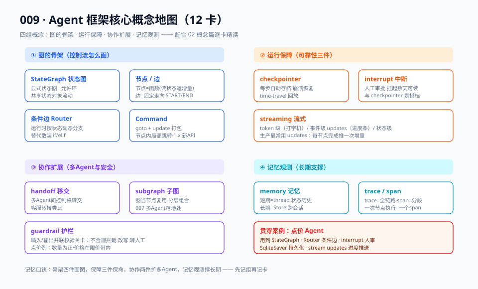

# 02 · 概念篇：框架核心概念精讲（12 张概念卡）

> 【本节问题】① LangGraph 的 StateGraph 到底是什么，和流程引擎什么关系？② checkpointer 与 interrupt 为什么是"一对搭档"？③ command、handoff、guardrail 各解决什么问题？④ 这些概念在 Spring AI / LangChain4j 里有对应物吗？

先看全景地图，12 张概念卡按图上的四组展开。



---

## 卡 1 · StateGraph（状态图）

**【一句话人话】** 用一张显式的图来定义 Agent 的所有步骤和步骤之间的走向，图上流动的是一个共享状态对象。

**【生活类比】** 工厂流水线的工序图：每个工位（节点）从传送带（状态）上取料、加工、放回去；传送带去哪个工位由轨道（边）决定。

- State 用 TypedDict 或 Pydantic 定义（LangGraph 惯例），字段显式、可校验。
- 与 BPMN/工作流引擎同构：CTRM 开发者可以把 StateGraph 理解为"给 LLM 步骤用的 Activiti"。
- 之所以能成为 Agent 的底座：图允许**环**（LLM 不确定要几轮），这是与 DAG 流程引擎的关键差异。

## 卡 2 · 节点（Node）与边（Edge）

**【一句话人话】** 节点是一段接收状态、返回状态更新的函数；边是节点之间的固定走向。

**【生活类比】** 节点是函数，边是 `return next()` 的调用关系表——只是把调用关系从代码里抽出来摆到图上。

- 节点签名：`def node(state) -> dict`，返回值是**增量更新**（patch），框架负责合并进共享状态。
- 固定边 `add_edge(a, b)`：无条件走向；起点 `START`、终点 `END` 是内置哨兵。
- 并行：多个边从同一节点扇出（fan-out），框架自动并行执行；用 reducer 指定并发结果如何合并。

## 卡 3 · Router（条件边）

**【一句话人话】** 条件边是在运行时根据当前状态动态决定"下一步去哪个节点"的分支函数。

**【生活类比】** 快递分拣机：包裹（状态）经过时，扫码器读地址决定送上哪条传送带。

```python
graph.add_conditional_edges("router", route_fn, {"price": "查价", "stock": "查库存", "end": END})
```

- `route_fn(state) -> key`，映射表把 key 指到目标节点。
- 这就是 003 篇手写 `if intent == ...` 的框架化对应物——分支逻辑从散装 if 变成图上一条可审查的线。

## 卡 4 · Command（goto + update）

**【一句话人话】** LangGraph 1.x 里节点返回值可以直接携带"状态更新 + 下一步去哪"的打包指令。

**【生活类比】** 快递员不但把包裹放上传送带，还顺手在面单上写了"下一站直接送 A 区"。

```python
from langgraph.types import Command
def node(state) -> Command:
    return Command(update={"price": 8120.0}, goto="生成建议单")
```

- 把"路由函数 + 节点函数"合一，适合分支逻辑与该节点强耦合的场景。
- 与条件边的关系：条件边是图上显式的线（全局可见），Command 是节点内的隐式跳转（局部灵活）。

## 卡 5 · Checkpointer（断点恢复）

**【一句话人话】** 在每一步执行后把整个图状态自动落盘的机制，崩溃可恢复、中断可续跑、历史可回放。

**【生活类比】** 游戏存档：每个关卡打完自动存档，死了从存档重来，还能读旧档换打法。

- 后端可选：内存（测试）、SQLite（单机/开发）、Postgres（生产）。
- 以 thread_id 为键组织存档，一个 thread 就是一次完整会话/一单业务。
- 附赠 time-travel：任意历史 checkpoint 可回放、改状态、分叉重跑。
- Java 对照：等价于"自动给每一步做 DB 事务快照"，但框架帮你把快照、序列化、恢复协议全做了。

## 卡 6 · Interrupt（人工中断）

**【一句话人话】** 让图执行到指定位置主动暂停、把控制权交给人类的机制；人确认后用 resume 恢复执行。

**【生活类比】** 采购审批流：金额超过 50 万的订单流程自动停在"待总经理审批"节点，审批人签字后流程继续。

- 两种用法：编译时 `interrupt_before=["高危节点"]`；运行时在节点内 `interrupt(payload)` 抛出。
- **与 checkpointer 是一对搭档**：中断之所以能"挂起几天再恢复"，靠的是状态已落盘。
- 点价场景：生成建议单后必须交易员确认——这是 003 篇手写 `input()` 的生产级替代（详见 04 进阶篇 + 009-06 时序图）。

## 卡 7 · Handoff（控制权移交）

**【一句话人话】** 多 Agent 场景里，把对话/任务的控制权从一个 Agent 转交给另一个 Agent 的模式。

**【生活类比】** 客服转接：一线客服解决不了，转接给售后专家，客户无感但接线人换了。

- OpenAI Agents SDK 把 handoff 做成一级原语（`transfer_to_xxx` 工具）；LangGraph 里通常用条件边/Command + 子图实现同等效果。
- 与 007 篇多 Agent 拓扑的关系：handoff 是"星型/主管型"协作里的关键动作。

## 卡 8 · Guardrail（护栏）

**【一句话人话】** 在 Agent 输入或输出上并联一道校验关卡，不合规就拦截/改写/拒答。

**【生活类比】** 高速收费站 ETC：不合规车辆（超载、未装卡）在入口就被拦下，不进主路。

- OpenAI Agents SDK 内置 guardrails（并行跑在 agent 外侧）；LangGraph 里通常实现为图上的校验节点，失败走条件边转人工或重试。
- 点价场景：抽取结果校验（数量为正、价格在限价带内）就是最典型的业务 guardrail。

## 卡 9 · Trace / Span（追踪）

**【一句话人话】** trace 是一次完整执行的全链路记录，span 是链路中的一段（一次 LLM 调用、一次工具执行）。

**【生活类比】** 物流单号（trace）与每一段"已发出→已到转运中心→派送中"的记录（span）。

- 框架自动埋点：LangGraph 每个节点执行天然是一个 span。
- 后端：LangSmith（同门）、Langfuse（开源可自托管）、OTel 标准协议。06 生产篇展开。

## 卡 10 · Memory（短期线程 / 长期存储）

**【一句话人话】** 短期记忆是单个 thread 内的状态历史（靠 checkpointer 天然获得），长期记忆是跨 thread 持久化的知识（LangGraph 用 Store）。

**【生活类比】** 短期记忆=本次工作会话的草稿纸；长期记忆=你的工作笔记本，第二天上班还带着。

- 短期：`state["messages"]` + checkpointer = 多轮对话上下文自动续。
- 长期：`InMemoryStore` / Postgres Store，按 namespace+key 存取，跨 thread 共享。
- 点价场景：客户的历史报价偏好、上次砍价记录→长期记忆；本单报盘的上下文→短期。

## 卡 11 · Subgraph（子图）

**【一句话人话】** 把一张图整体作为另一个图的节点复用，实现模块化与多 Agent 分层组合。

**【生活类比】** 公司组织架构：事业部（子图）对集团（父图）来说就是一个部门节点，内部怎么运作集团不关心。

- 父子图通过状态字段映射通信；007 篇的 supervisor 模式在 LangGraph 里最自然的实现就是"主管图 + 各专长子图"。
- CTRM 场景：点价子图、套保子图可以做成独立 subgraph，由风控主管图调度。

## 卡 12 · Streaming（token / 事件流）

**【一句话人话】** 把执行过程实时推给调用方：token 级（逐字）、事件级（每步完成推一次）、状态级（状态变更推送）。

**【生活类比】** 外卖骑手轨迹页：不是等送达才告诉你结果，而是每过一个路口更新一次位置。

- token 流：LLM 生成逐字输出，前端打字机效果（Vue 2.7 前端可用 SSE 对接）。
- 事件/节点流：`graph.stream(..., stream_mode="updates")`，每个节点完成推一次增量——生产上最有用的是"进度可见"。
- 与 checkpointer 组合：中断/恢复事件也走流，前端能感知"已挂起待审批"。

---

## Java 生态对照段

| 本篇概念 | Spring AI 对应 | LangChain4j 对应 |
|---|---|---|
| 状态/消息流 | ChatMemory + Advisor 链 | ChatMemory / AgenticScope（agentic 模块） |
| 条件路由 | 无原生（Advisor 手写分支） | agentic 模块 Workflow 编排 |
| 持久化恢复 | 无内置（自己落库） | 无内置，社区扩展 |
| interrupt 人审 | 无原生 | 无原生 |
| 工具 | @Tool / FunctionCallback | @Tool 注解 |
| guardrail | Advisor 前后置校验 | Guardrails API（1.x） |
| trace | Micrometer / OTel 原生 | OTel 支持 |

（依据：CSDN《LangChain4j vs Spring AI》2026-07、fast.io 2026、守株阁 2026-05。共同短板：**JVM 框架目前都没有 LangGraph 式内置持久化中断**，Java 团队要 HITL 得自己落库或把编排层交给 Python 服务——07 对比篇会展开。）

## 【本节自测】

1. StateGraph 与 DAG 流程引擎的关键差异？（要点：允许环，LLM 步数不定）
2. 节点返回 dict 的语义是什么？谁负责合并？（要点：增量 patch，框架按 reducer 合并进共享状态）
3. 条件边和 Command 各适合什么场景？（要点：条件边=全局显式分支；Command=节点内局部跳转+更新打包）
4. 为什么说 checkpointer 与 interrupt 是搭档？（要点：中断挂起靠状态已落盘，恢复靠读档）
5. checkpointer 的三种后端与适用环境？（要点：内存/测试、SQLite/开发单机、Postgres/生产）
6. handoff 与 subgraph 分别解决什么？（要点：handoff=控制权转交；subgraph=模块化分层复用）
7. 短期记忆和长期记忆的实现差异？（要点：thread 内状态历史 vs Store 跨 thread；点价例子）
8. trace 和 span 的关系，LangGraph 里 span 的天然单位？（要点：全链路 vs 分段；一个节点执行=一个 span）
9. streaming 三种粒度？（要点：token/事件/状态；生产最常用 updates 事件流）
10. JVM 框架在框架概念上的共同短板？（要点：无内置持久化中断/HITL，编排能力仍在追赶）
