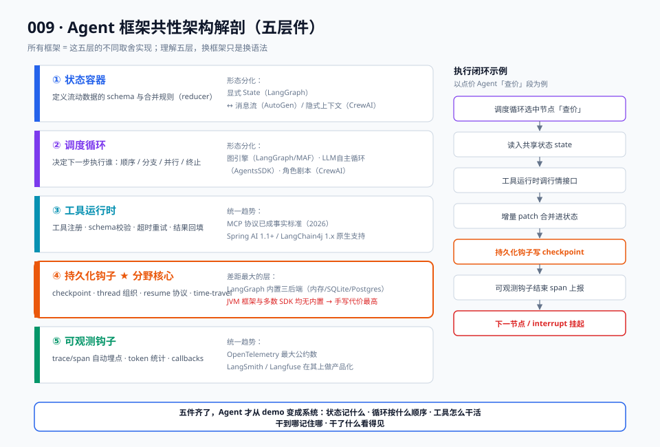
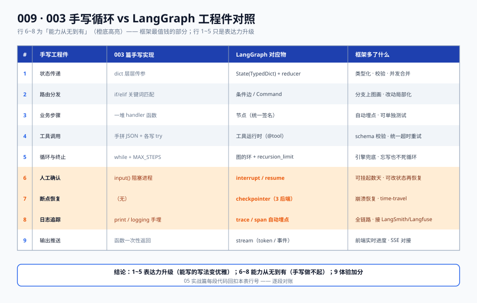

# 03 · 原理篇：框架共性架构解剖

> 【本节问题】① 剥掉 API 外壳，所有 Agent 框架的共同骨架是什么？② 003 篇手写循环的每个工程件，在框架里的对应物是什么？③ 五层共性件之间如何协作形成执行闭环？④ 为什么懂了共性件，换框架就只是"换语法"？

## 1. 五层共性件：所有框架的公约数

不管 LangGraph、OpenAI Agents SDK、CrewAI 还是 Spring AI，剥掉外壳后都在实现同一副骨架：



**【一句话人话】** 每个框架都是一台"自动贩卖机"：货道是工具运行时，投币记录是状态容器，出货控制板是调度循环，断电续卖是持久化钩子，后台流水是可观测钩子。

### 第 1 层 · 状态容器

- 职责：定义"Agent 执行过程中流动的数据"的 schema、合并规则（reducer）、校验。
- 形态分化：LangGraph 显式 TypedDict/Pydantic State；OpenAI Agents SDK 用消息列表 + run context；CrewAI 用任务间隐式上下文传递；AutoGen/AG2 用对话消息流。
- **取舍点**：状态越显式，可审计性和可控性越强，样板越多——这就是 00 背景篇"胶水层取舍"的第一维。

### 第 2 层 · 调度循环

- 职责：决定"下一步执行谁"——顺序、分支、并行、循环、终止条件。
- 形态分化：图引擎（LangGraph / MAF workflow）、LLM 自主循环（OpenAI Agents SDK 的 run loop、经典 ReAct）、角色剧本（CrewAI crew/process）、对话轮转（AutoGen group chat）。
- 循环上限（recursion limit / max_turns）是所有框架的标配安全阀。

### 第 3 层 · 工具运行时

- 职责：工具注册（name/description/参数 schema）、调用分发、超时与异常包裹、结果回填。
- 共性趋势：MCP 协议 2025~2026 成为工具接入事实标准——Spring AI 1.1+、LangChain4j 1.x 均已原生支持（来源：CSDN、fast.io，2026）。
- CTRM 对照：工具运行时 = 你的 Service 层注册表 + 统一 AOP 拦截（超时/重试/审计）。

### 第 4 层 · 持久化钩子

- 职责：状态快照（checkpoint）、线程组织（thread）、恢复协议（resume）、可选时间旅行。
- 差距最大的层：LangGraph 内置 checkpointer 三后端；OpenAI Agents SDK / CrewAI 需自建或借外部（如 Temporal）；JVM 框架基本没有内置。
- **这层是框架分野的核心**：能不能"挂起几天等人审再续跑"，取决于这层。

### 第 5 层 · 可观测钩子

- 职责：trace/span 埋点、token 统计、回调接口（callbacks）。
- 共性趋势：OpenTelemetry 成为最大公约数；LangSmith、Langfuse 在其上做产品化。

## 2. 手写循环 → 框架工程件对照表

把 003 篇手写点价 Agent 的每一件，映射到 LangGraph 的对应物——这张表是本篇的通关凭证：



| # | 003 篇手写件 | 手写实现 | LangGraph 对应 | 框架多了什么 |
|---|---|---|---|---|
| 1 | 状态传递 | dict 传参 | State（TypedDict）+ reducer | 类型化、校验、并发合并规则 |
| 2 | 路由分发 | router 函数 if/elif | 条件边 / Command | 分支上图画，可视化、局部化修改 |
| 3 | 业务步骤 | 一堆 handler 函数 | 节点 | 统一签名、自动埋点、可单独测试 |
| 4 | 工具调用 | 手拼 JSON + try/except | 工具运行时（@tool / ToolNode） | schema 校验、统一超时重试 |
| 5 | 循环与终止 | while + MAX_STEPS | 图的环 + recursion_limit | 声明式，引擎兜底 |
| 6 | 人工确认 | input() 阻塞 | interrupt / interrupt_before | 可挂起数天、可改状态后恢复 |
| 7 | 断点恢复 | 无 | checkpointer | 崩溃恢复、time-travel |
| 8 | 日志追踪 | print/logging | trace/span 自动埋点 | 全链路、接 LangSmith/Langfuse |
| 9 | 输出推送 | 无（函数返回） | stream（token/事件） | 前端实时进度 |

**读表结论**：1~5 是"表达力升级"（能写的写法变优雅），6~8 是"能力从无到有"（手写根本没做或做不起）。05 实战篇每段代码都会回扣这张表的行号。

## 3. 执行闭环：五层件如何协作

以点价 Agent"查价 → 生成建议单 → 中断等人审"这一段为例走一遍闭环：

```
调度循环(第2层)选中节点"查价"
  → 从状态容器(第1层)读入 state
  → 节点内经工具运行时(第3层)调行情接口
  → 返回增量 patch，reducer 合并进 state
  → 持久化钩子(第4层)自动写 checkpoint
  → 可观测钩子(第5层)结束本 span，上报
  → 调度循环读 state 决定下一个节点……
  → 到"生成建议单"后 interrupt 挂起（状态已落盘）
```

**费曼总结**：框架 = 状态容器定义"记什么"，调度循环定义"按什么顺序干"，工具运行时定义"怎么干实际活"，持久化钩子保证"干到哪记住哪"，可观测钩子保证"干了什么看得见"。五件齐了，Agent 才从 demo 变成系统。

## 4. 换框架 = 换语法，怎么用

理解共性件后的实战收益：

1. **读新框架文档先找五层**：状态怎么定义？循环谁控制？工具怎么注册？持久化在哪？埋点在哪？五问过完，框架已入门。
2. **迁移评估按层打分**：以 CTRM 点价需求为例，第 4 层（持久化+人审）权重最高——OpenAI Agents SDK 轻需求好用，但重状态场景 LangGraph 胜出（07 对比篇给完整决策树）。
3. **Java 平移**：Spring AI 的 ChatClient + Advisor 链对应第 2/3 层（链式编排+工具），Micrometer 对应第 5 层，但第 4 层缺位——Java 团队的典型架构是"编排层 Python LangGraph 服务化，业务层 Spring"或"Spring AI + 自建状态落库"。

## 【本节自测】

1. 五层共性件分别是什么？（要点：状态容器/调度循环/工具运行时/持久化钩子/可观测钩子）
2. 第 1 层的形态分化举两个极端？（要点：LangGraph 显式强类型 State ↔ CrewAI 隐式任务上下文）
3. 调度循环的四种形态？（要点：图引擎、LLM 自主循环、角色剧本、对话轮转）
4. 哪层是框架分野的核心，为什么？（要点：持久化钩子；决定能否长挂起人审/崩溃恢复）
5. 手写 input() 对应框架什么件，多了什么能力？（要点：interrupt；可挂起数天、可改状态后恢复）
6. MCP 与哪层共性件相关，现状如何？（要点：工具运行时；Spring AI 1.1+/LangChain4j 1.x 原生支持，2026 成事实标准）
7. "换框架五问"是哪五问？（要点：状态/循环/工具/持久化/埋点怎么定义）
8. CTRM 点价 Agent 走一遍执行闭环，checkpoint 写在哪一步之间？（要点：节点增量合并进 state 之后、下一节点调度之前）
