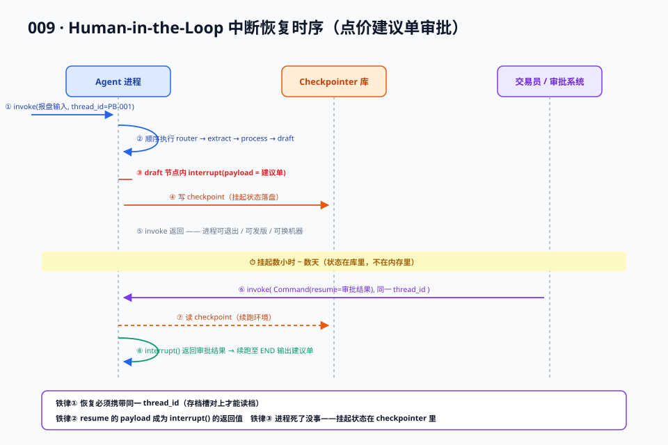

# 04 · 进阶篇：持久化与 Human-in-the-Loop

> 【本节问题】① checkpointer 落盘的到底是什么，怎么组织？② interrupt 挂起几天再恢复，协议上怎么实现？③ 跨会话的长期记忆（store）怎么用？④ 多 Agent 的 subgraph 组合怎么做？

本篇是 05 实战篇的理论预备：先把 checkpointer、interrupt、store、subgraph 四大进阶件讲透，实战篇直接用代码收割。

## 1. Checkpointer：每步自动存档

**【一句话人话】** 图的每一步执行完，框架把整个状态快照写进后端存储；thread_id 是存档槽位号。

**【生活类比】** 游戏存档系统：thread_id 是存档槽，每过一个节点自动存一次，死了读档，还能翻旧档重打（time-travel）。

### 1.1 快照里有什么

每个 checkpoint 包含：channel values（当前状态各字段的值）、待执行任务、上一步来源节点、版本号与父 checkpoint 引用。checkpoint 之间构成**链**——这就是 time-travel 能回滚的原理（沿着父指针回溯）。

### 1.2 三种后端选型

| 后端 | 场景 | CTRM 对应 |
|---|---|---|
| `InMemorySaver` | 单测、demo | 内存 Map |
| `SqliteSaver` | 本地开发、单机工具 | 嵌入式 SQLite |
| `PostgresSaver` | 生产（并发、高可靠） | 你们的生产 MySQL 角色（LangGraph 官方提供 Postgres 后端；MySQL 后端无官方支持，截至 2026-09 未见权威披露，生产建议换 Postgres 或自实现 BaseCheckpointSaver） |

### 1.3 thread 与业务单据

- 一次会话/一单业务 = 一个 thread。点价 Agent 按"报盘单号"做 thread_id，天然把 Agent 状态和业务单据对齐——CTRM 工程师的心智：**thread 就是业务流水表的行，checkpoint 就是行版本**。

## 2. Interrupt：人工中断与恢复

**【一句话人话】** 让 Agent 在指定位置停下、把问题抛给人类，人回复后从停点继续——全程状态落盘，进程可以死、可以换机器。

**【生活类比】** 信用卡大额交易人工审核：系统自动挡下可疑交易（挂起），审核员隔天上班处理（恢复），处理期间系统升级重启也不影响这单挂起。



### 2.1 两种中断姿势

```python
# 姿势 A：编译时声明——进入某节点前必停
graph = builder.compile(checkpointer=saver, interrupt_before=["生成建议单"])

# 姿势 B：运行时抛出——节点内部按业务条件动态停
from langgraph.types import interrupt, Command
def 生成建议单(state):
    proposal = build_proposal(state)
    review = interrupt({"proposal": proposal})   # 抛出中断，payload 给人看
    return {"confirmed": review["approved"]}      # resume 时这里拿到人给的结果
```

- 姿势 A：粗粒度，"这个节点永远要先审"。
- 姿势 B：细粒度，"价格越限价带才审，常规单自动过"——点价场景应选 B。

### 2.2 恢复协议（重点，面试高频）

```
第一次执行：graph.invoke(input, config={"configurable": {"thread_id": "PB-2026-001"}})
  → 跑到 interrupt 处停下，invoke 返回（状态已落盘）

人工确认后恢复：
graph.invoke(Command(resume={"approved": True}), config=同一 thread_id)
  → 从中断点续跑，interrupt() 的返回值就是 resume 的 payload
```

三条铁律：
1. **恢复必须带同一个 thread_id**——存档槽对上才读得到档。
2. **resume 的 payload 会成为 interrupt() 的返回值**——把人的决定喂回节点内部。
3. **中断期间进程可以死掉**——这就是 checkpointer 的价值，挂起状态在库里不在内存里。

### 2.3 点价业务映射

| 业务规则 | 实现选择 |
|---|---|
| 建议单必须交易员确认 | 节点内 interrupt(payload=建议单摘要) |
| 低于 500 吨小额单自动过 | interrupt 外包一层 if |
| 交易员可以改价再确认 | 审批端改 payload 数据，resume 带回，节点内覆盖建议单 |
| 确认记录留痕 | resume payload 写审计表 + checkpoint 链天然可回溯 |

## 3. Store：跨会话长期记忆

**【一句话人话】** Store 是按 namespace + key 组织的跨 thread 键值库，存"客户偏好、历史结论"这类长期知识。

**【生活类比】** checkpointer 是本次交易的草稿纸，store 是客户档案柜——这单做完草稿纸扔掉，档案柜里的客户偏好留着下次用。

```python
from langgraph.store.memory import InMemoryStore
store = InMemoryStore()
# 写：客户 C-1001 的点价偏好
store.put(("clients", "C-1001"), "pricing_pref", {"窗口": "09:00-10:30", "风格": "分批点价"})
# 读：任何 thread 里都能取
pref = store.get(("clients", "C-1001"), "pricing_pref")
```

- 编译时 `graph.compile(checkpointer=saver, store=store)` 双件齐挂。
- 生产后端同样有 Postgres Store；记忆写入的时机可以由"记忆节点"在每单结束后沉淀（跨会话学习，007 多 Agent 篇的"经验沉淀"落地处）。

## 4. Subgraph：多 Agent 组合（联动 007）

**【一句话人话】** 把一张编译好的图当作父图的一个节点，父图管战略，子图管战术。

**【生活类比】** 集团把"点价业务"整个外包给一个子公司：集团（父图）只发指令收结果，子公司内部工序（子图）自理。

```python
pricing_graph = builder.compile(checkpointer=saver)      # 点价子图
parent_builder.add_node("点价", pricing_graph)            # 子图当节点
```

- 状态对接：父子图状态字段同名则自动传递；不同名时用包装节点做映射（避免父图状态被子图污染——**接口隔离**，007 篇的通信边界原则）。
- 持久化归属：子图可复用父图 checkpointer（同一 thread 连续存档），也可独立挂（子图自己就是完整可恢复单元）。
- 007 篇 supervisor 拓扑的 LangGraph 落地：主管图 + 点价子图 + 套保子图 + 风控子图，handoff 就是主管图的条件边。

## 5. Java 生态对照段

| 本篇能力 | Spring AI / LangChain4j 现状 |
|---|---|
| 状态快照 | 无内置；自己用 Spring Data 落库（等价于手写 003 的债） |
| 人审中断 | 无原生 interrupt；常规做法：流程节点写"待审批"状态行 + 状态机（如 Spring Statemachine），回调续跑 |
| 长期记忆 | LangChain4j ChatMemory 持久化扩展 / Spring AI MessageChatMemoryAdvisor，均为对话级，非跨业务知识库 |
| subgraph | LangChain4j agentic 模块可组合 Agent；无图级嵌套语义 |

（依据：fast.io 2026、CSDN 2026-07 对比文。）结论：**Java 团队要么接受"人审部分自己建模成业务状态机"，要么把带 HITL 的编排层用 Python 服务化、Java 通过 REST/SSE 调用**——这是 07 对比篇给 Java 结论时的核心权衡。

## 【本节自测】

1. checkpoint 快照包含什么？为什么能 time-travel？（要点：状态值+待执行任务+父指针；链式结构可回溯）
2. 三种 checkpointer 后端与选型？MySQL 官方支持吗？（要点：内存/SQLite/Postgres；MySQL 无官方支持，截至 2026-09 未见权威披露）
3. interrupt 两种姿势与点价场景的正确选择？（要点：interrupt_before 声明式 vs 节点内 interrupt() 条件式；选后者）
4. 恢复协议三要素？（要点：同 thread_id + Command(resume=payload) + payload 成为 interrupt 返回值）
5. 中断期间进程死了为什么没事？（要点：挂起状态在 checkpointer 库里不在内存）
6. store 与 checkpointer 的分工？（要点：跨 thread 长期知识 vs 单 thread 会话历史）
7. subgraph 状态对接的坑？（要点：字段同名自动传/异名需映射，防父图状态污染）
8. Java 团队实现 HITL 的两条路？（要点：业务状态机自建 / Python 编排服务化）
