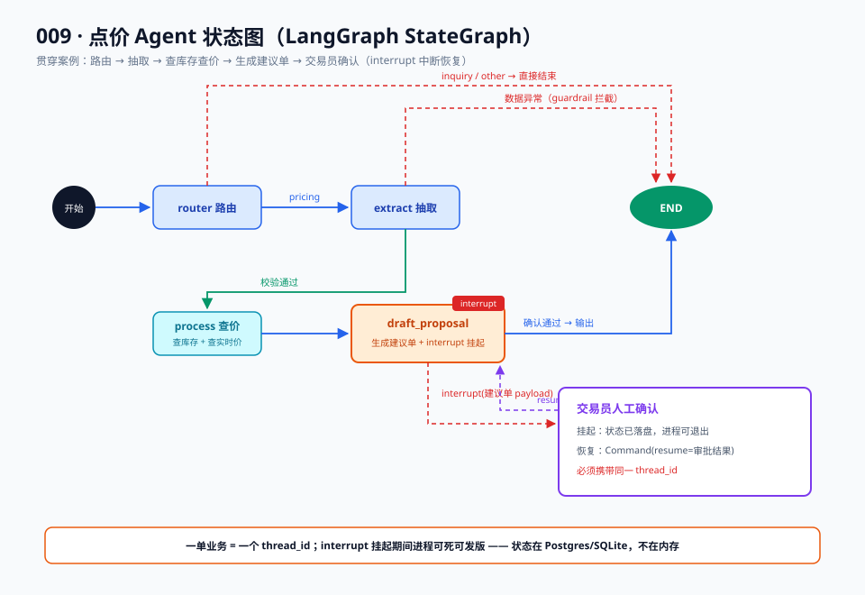

# 05 · 实战篇：LangGraph 重写点价 Agent（全代码）

> 【本节问题】① 点价 Agent 的 StateGraph 怎么定义？② 路由、抽取、查库存查价分别落成什么节点？③ 高危的建议单确认怎么用 interrupt 实现？④ checkpointer 与 stream 怎么接上？每段代码都标注"手写版对应物"，与 003 篇逐件对账。

## 1. 目标流程图



业务剧本（CTRM 场景）：客户报盘进来 → 路由判断类型 → 抽取要素（品种/数量/基差/点价窗口）→ 查库存 + 查实时价 → 生成点价建议单 → **交易员人工确认（interrupt）** → 确认后输出执行。

## 2. 全代码

> 运行环境：`pip install -U langgraph langchain langchain-openai`，`OPENAI_API_KEY` 环境变量。LangGraph 1.x API（2025-10-22 GA，来源：aiwiki.ai / LangChain 博客）。

### 2.1 状态定义

```python
# ===== State：整个 Agent 唯一的数据总线 =====
from typing import TypedDict, Literal, Annotated
from operator import add

class PricingState(TypedDict):
    raw_input: str                       # 客户原始报盘
    category: Literal["pricing", "inquiry", "other"]   # 路由结果
    extracted: dict                      # 抽取要素：品种/数量/基差/窗口
    stock_info: dict                     # 查库存结果
    price_info: dict                     # 查价结果
    proposal: dict | None                # 点价建议单
    approval: dict | None                # 人工确认结果
    audit_log: Annotated[list[str], add] # 审计日志（reducer：追加合并）
```

> **手写版对应物**：003 篇的 `state = {}` dict + 层层传参。框架差异：字段显式可校验；`audit_log` 用 `Annotated[list, add]` 声明 reducer，并行节点写日志不会互相覆盖。

### 2.2 节点一：router（路由）

```python
# ===== 节点 router：报盘类型分类 =====
from langchain.chat_models import init_chat_model

llm = init_chat_model("openai:gpt-4o-mini")   # 模型无关，可换任何 provider

ROUTER_PROMPT = """你是贸易助理。判断客户输入属于哪类：
- pricing: 报盘/点价请求
- inquiry: 仅询价咨询
- other: 无关内容
只输出一个词。"""

def router_node(state: PricingState) -> dict:
    resp = llm.invoke([("system", ROUTER_PROMPT), ("human", state["raw_input"])])
    cat = resp.content.strip()
    if cat not in ("pricing", "inquiry", "other"):
        cat = "other"                        # guardrail：越界值兜底
    return {"category": cat, "audit_log": [f"router→{cat}"]}
```

> **手写版对应物**：003 篇 `route()` 里的 if/elif 关键词匹配。框架差异：路由决策交给 LLM 更稳，兜底校验（guardrail 思想，02 概念卡 8）留在节点内；分支的**走向**不写在这里，而是声明为条件边（见 2.5）。

### 2.3 节点二：extract（要素抽取）

```python
# ===== 节点 extract：结构化抽取 + 校验 =====
from pydantic import BaseModel, Field

class Extracted(BaseModel):                  # 结构化输出 schema
    commodity: str = Field(description="品种，如 豆粕M2605")
    quantity: float = Field(description="数量（吨）")
    basis: float = Field(description="基差报价")
    window: str = Field(description="点价窗口，如 2026-09-20~2026-09-30")

EXTRACT_PROMPT = "从报盘中抽取品种、数量、基差、点价窗口。缺失字段给默认值并注明。"

def extract_node(state: PricingState) -> dict:
    resp = llm.with_structured_output(Extracted).invoke(
        [("system", EXTRACT_PROMPT), ("human", state["raw_input"])]
    )
    data = resp.model_dump()
    ok = data["quantity"] > 0                # 业务 guardrail
    return {
        "extracted": data,
        "audit_log": [f"extract ok={ok} {data['commodity']}"],
    }
```

> **手写版对应物**：003 篇手拼 JSON prompt + 手写 json.loads + try/except。框架差异：`with_structured_output` 由 LangChain 统一处理 schema 注入与解析重试；Pydantic 校验挡住脏数据——第二层（控制流正确性）的收益开始显现。

### 2.4 节点三：process（查库存 + 查价，工具运行时）

```python
# ===== 节点 process：工具调用（查库存、查价）=====
from langchain_core.tools import tool

@tool
def query_stock(commodity: str) -> dict:
    """查询某品种的可用库存。"""
    return {"commodity": commodity, "available_tons": 1200}   # 实际接 CTRM 库存接口

@tool
def query_price(commodity: str) -> dict:
    """查询某品种当前盘面价。"""
    return {"commodity": commodity, "last_price": 3120.0}     # 实际接行情接口

def process_node(state: PricingState) -> dict:
    c = state["extracted"]["commodity"]
    stock = query_stock.invoke({"commodity": c})     # schema 校验 + 统一异常包裹
    price = query_price.invoke({"commodity": c})
    return {
        "stock_info": stock,
        "price_info": price,
        "audit_log": [f"process stock={stock['available_tons']} price={price['last_price']}"],
    }
```

> **手写版对应物**：003 篇手写 `TOOLS` 描述表 + 手拼 function-calling JSON + 每个工具各写 try/except。框架差异：`@tool` 装饰器自动生成 schema；`tool.invoke()` 统一入口（超时/重试策略可全局配）——五层共性件里的"工具运行时"（03 原理篇第 3 层）。

### 2.5 条件边：路由分发与质量闸门

```python
# ===== 条件边 =====
def route_after_router(state: PricingState) -> str:
    if state["category"] == "pricing":
        return "extract"                     # 报盘 → 抽取
    return "__end__"                         # 咨询/无关 → 直接结束（生产中可转客服子图）

def route_after_extract(state: PricingState) -> str:
    q = state["extracted"]["quantity"]
    if q <= 0 or q > 100000:
        return "__end__"                     # 异常数据：拒绝（生产中应转人工）
    return "process"
```

> **手写版对应物**：003 篇主循环里的 `if intent == "pricing": ... elif ...`。框架差异：分支从"代码流"变成"图上线"——加一条新报盘类型只改映射表，不动已有节点。这正是 01 问题篇第二层收益：**控制流声明化**。

### 2.6 节点四：draft_proposal（生成建议单 + interrupt 人审）

```python
# ===== 节点 draft_proposal：建议单 + 人工确认 =====
from langgraph.types import interrupt, Command

LIMIT_BAND = (2900.0, 3400.0)                # 限价带（业务规则）

def draft_proposal_node(state: PricingState) -> dict:
    e, p = state["extracted"], state["price_info"]
    suggest = round(p["last_price"] + e["basis"], 2)
    proposal = {
        "commodity": e["commodity"], "quantity": e["quantity"],
        "suggest_price": suggest, "window": e["window"],
        "within_band": LIMIT_BAND[0] <= suggest <= LIMIT_BAND[1],
    }
    # 业务规则：越限价带的单子必须人工确认；常规单也按公司制度走人审
    review = interrupt({                       # ← 挂起！状态已落盘，进程可死
        "type": "proposal_review",
        "proposal": proposal,
        "hint": "回复 {\"approved\": bool, \"operator\": 姓名}",
    })
    # resume 后从这里继续，review 就是人工提交的 payload
    final = {**proposal,
             "suggest_price": review.get("new_price", proposal["suggest_price"]),
             "approved_by": review["operator"]}
    return {"proposal": final, "approval": review,
            "audit_log": [f"proposal approved={review['approved']} by {review['operator']}"]}
```

> **手写版对应物**：003 篇的 `input("请交易员确认(y/n): ")`。框架差异是质变：`input()` 阻塞进程、重启即丢；`interrupt()` 挂起在 checkpointer 里，**进程可以死、可以部署升级、可以换机器恢复，交易员甚至三天后批**——这就是 04 进阶篇的恢复协议，01 问题篇第三层（最值钱层）的落地。

### 2.7 组装：StateGraph + checkpointer + compile

```python
# ===== 组装与编译 =====
from langgraph.graph import StateGraph, START, END
from langgraph.checkpoint.sqlite import SqliteSaver

builder = StateGraph(PricingState)
builder.add_node("router", router_node)
builder.add_node("extract", extract_node)
builder.add_node("process", process_node)
builder.add_node("draft_proposal", draft_proposal_node)

builder.add_edge(START, "router")
builder.add_conditional_edges("router", route_after_router,
                              {"extract": "extract", "__end__": END})
builder.add_conditional_edges("extract", route_after_extract,
                              {"process": "process", "__end__": END})
builder.add_edge("process", "draft_proposal")   # process 完固定走建议单
builder.add_edge("draft_proposal", END)

# 持久化：SQLite 单机档；生产换 PostgresSaver（04 进阶篇 1.2 节）
saver = SqliteSaver.from_conn_string("pricing_agent.db")
# interrupt_before=["draft_proposal"] 可选：若想"进节点前必停"用姿势 A；
# 本例在节点内按业务条件 interrupt（姿势 B），更细粒度
graph = builder.compile(checkpointer=saver)
```

> **手写版对应物**：003 篇的 `while step < MAX_STEPS:` 主循环 + 函数调用链。框架差异：执行顺序全部声明在图上，`recursion_limit` 由引擎兜底（默认 25），不存在忘写上限死循环烧 token 的坑。

### 2.8 运行：invoke → 中断 → resume → stream

```python
# ===== 第一次执行：跑到 interrupt 自动停 =====
config = {"configurable": {"thread_id": "PB-2026-001"}}   # thread_id=报盘单号
result = graph.invoke({"raw_input": "客户A报：豆粕M2605 2000吨，基差+80，9月20到30日点价"},
                      config)
print(result["audit_log"])
# ['router→pricing', 'extract ok=True 豆粕M2605', 'process stock=1200 price=3120.0']
# 建议单已生成，挂在库里等审批。此时进程可以退出、可以发版。

# ===== 交易员确认后恢复（可能发生在几天后、另一台机器上）=====
from langgraph.types import Command
final = graph.invoke(Command(resume={"approved": True, "operator": "张贸易"}), config)
print(final["proposal"])
# {'commodity': '豆粕M2605', 'quantity': 2000.0, 'suggest_price': 3200.0,
#  'window': '2026-09-20~2026-09-30', 'within_band': True, 'approved_by': '张贸易'}

# ===== 流式：给前端 Vue 页面推实时进度（SSE 对接）=====
for chunk in graph.stream(
        {"raw_input": "客户A报：豆粕M2605 2000吨，基差+80，9月20到30日点价"},
        config, stream_mode="updates"):
    for node_name, patch in chunk.items():
        print(f"[{node_name}] 完成，更新字段: {list(patch.keys())}")
# [router] 完成，更新字段: ['category', 'audit_log']
# [extract] 完成，更新字段: ['extracted', 'audit_log'] ...
```

> **手写版对应物**：003 篇"一次性函数返回"。框架差异：updates 流让前端能画进度条（"已抽取→已查价→待审批"），token 级流（`stream_mode="messages"`）可做打字机效果——02 概念卡 12 的三个粒度在此对号。

## 3. 代码 ↔ 工程件总账

| 代码段 | 工程件 | 03 原理篇对照行 |
|---|---|---|
| 2.1 State | 状态容器（reducer） | 表行 1 |
| 2.2 router + 2.5 条件边 | 调度循环（分支） | 表行 2、5 |
| 2.3 extract（structured output） | guardrail + 状态容器校验 | 表行 2、4 |
| 2.4 @tool | 工具运行时 | 表行 4 |
| 2.6 interrupt | 人审中断 | 表行 6 |
| 2.7 SqliteSaver | 持久化钩子 | 表行 7 |
| 2.8 stream | 可观测/推送 | 表行 8、9 |

## 4. 常见坑

1. **thread_id 复用**：用旧 thread_id invoke 新输入会"接着上次状态跑"，点价单务必一单一 thread。
2. **interrupt 后重复 resume**：一次中断只消费一次 resume；重复提交同 payload 会报"无待恢复中断"。
3. **reducer 忘写**：并行节点写同一 list 字段不加 `Annotated[..., add]` 会直接覆盖而非合并。
4. **SQLite 并发锁**：SqliteSaver 单机并发差，多实例部署必须 PostgresSaver。
5. **interrupt 放在工具调用节点内**：工具已执行的部分不可撤销，中断点应设在"生成动作之后、执行动作之前"。

## 5. Java 生态对照段

同一段流程的 Java 写法骨架（伪代码对照，非完整可跑）：

```java
// Spring AI 1.x 风格：无图编排，用 Advisor 链 + 手写流程
ChatClient client = ChatClient.builder(chatModel)
    .defaultAdvisors(new MessageChatMemoryAdvisor(chatMemory))  // 记忆
    .defaultTools(new StockTools())                             // 工具（@Tool 注解）
    .build();
// 路由/分支/中断：自己写 —— @Transactional 状态行 + Spring Statemachine 实现人审挂起
```

- LangChain4j 的 `langchain4j-agentic` 模块提供 Workflow 编排（顺序/并行/循环），比 Spring AI 显式，但同样**没有内置 checkpointer/interrupt**（依据：fast.io 2026、CSDN 2026-07）。
- 工程落地建议：Java 团队可将本节 Agent 作为 Python 微服务，经 REST 暴露"提交报盘 / 查询状态 / 提交审批"三个接口，CTRM 主系统（Java）调用——人审挂起语义完全由 LangGraph 承担。

## 【本节自测】

1. PricingState 里 `Annotated[list[str], add]` 是什么，为什么需要？（要点：reducer 声明；并行写合并而非覆盖）
2. 路由决策为什么放节点内、分支走向放条件边？（要点：决策=LLM/逻辑，走向=图声明；关注点分离）
3. `with_structured_output` 替代了手写版的哪三件事？（要点：schema 注入、输出解析、重试）
4. interrupt 的 payload 在恢复时去哪了？（要点：成为 interrupt() 的返回值，节点内消费）
5. 为什么建议单节点选姿势 B（节点内 interrupt）而不是 interrupt_before？（要点：按业务条件细粒度人审）
6. thread_id 用报盘单号的好处？（要点：Agent 状态与业务单据对齐，一单一档）
7. stream_mode="updates" 推的是什么？（要点：每节点完成的增量 patch；token 级用 messages）
8. 五个坑里哪个最可能在你们 CTRM 环境先爆？（要点：开放；SQLite 并发/线程复用是高概率答案）
