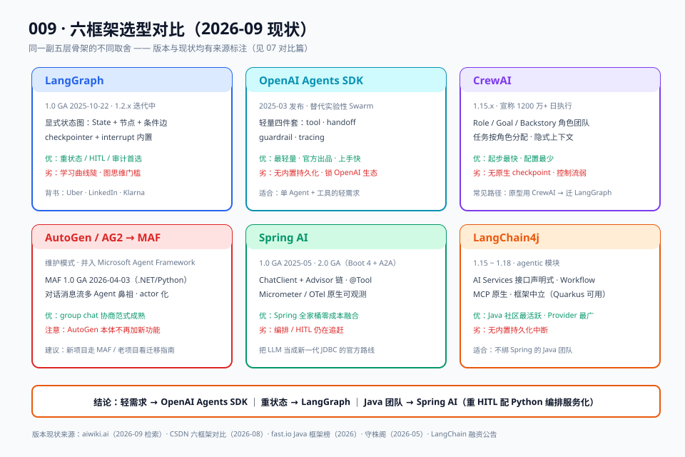

# 07 · 对比篇：框架选型决策

> 【本节问题】① 要不要上框架的判断标准是什么？② 六个主流框架在各工程件上的真实差距？③ 轻需求、重状态、Java 团队分别选谁？④ 决策树怎么走？

## 1. 先问要不要框架

框架不是信仰，是工程件采购。三连问（对照 01 问题篇三层收益）：

1. **要不要崩溃恢复 / 长挂起人审？** 要 → 框架（checkpointer/interrupt 层手写代价最高）；不要 → 手写循环完全够（003 篇就是证明）。
2. **流程会不会频繁变？** 会（新报盘类型、新审批规则）→ 框架声明式控制流值得；一次性脚本 → 不值得。
3. **要不要全链路可观测/审计？** 合规要求 → 框架 trace 钩子白送；demo → print 够了。

三问有两个以上"要"，上框架；否则保持 003 篇手写版，别为炫技付学习成本。

## 2. 六框架大表（2026-09 现状）



| 维度 | LangGraph | OpenAI Agents SDK | CrewAI | AutoGen/AG2 | Spring AI | LangChain4j |
|---|---|---|---|---|---|---|
| 版本现状 | 1.0 GA(2025-10-22)，1.2.x 迭代中 | 2025-03 发布，替代 Swarm | 1.15.x | 维护模式（并入 Microsoft Agent Framework，MAF 1.0 GA 2026-04-03） | 1.0 GA(2025-05)，2.0 GA | 1.15~1.18 |
| 抽象模型 | 显式状态图（TypedDict State） | Agent + Run loop + handoff | Role/Goal/Backstory 角色团 | 对话消息流（actor 化 0.4） | ChatClient + Advisor 链 | AI Services 接口声明 + agentic Workflow |
| 持久化/恢复 | 内置 checkpointer（内存/SQLite/Postgres）+ time-travel | 无内置（需外接） | 无原生 checkpoint | 无内置 | 无内置 | 无内置 |
| 人工中断 HITL | 一等公民（interrupt/resume） | 无原生 | 有限 | 会话级人工介入 | 无原生 | 无原生 |
| 可观测 | LangSmith/Langfuse/OTel | 内置 tracing（OTel 兼容） | 内置监控+第三方 | 0.4 内置调试监控 | Micrometer/OTel 原生 | OTel 支持 |
| MCP 支持 | 经 LangChain 生态 | 支持 | 支持 | 支持 | 1.1+ 原生 | 1.x 原生 |
| 多 Agent | subgraph/supervisor 手搭 | handoff 原语 | 原生 crew/hierarchy | 原生强项（group chat） | 基础 | agentic 模块（Workflow/A2A） |
| 语言 | Python / JS | Python / JS | Python | Python / .NET | Java（Boot 强绑定） | Java（框架中立，Quarkus/Spring 均可） |
| 生产背书 | Uber、LinkedIn、Klarna（来源：LangChain 博客/aiwiki.ai） | OpenAI 官方出品 | 1200 万+日执行（来源：aiproplaybook） | 社区治理，历史项目多 | Spring 生态 | 社区最活跃 Java AI 框架 |
| 学习曲线 | 陡（图思维） | 平缓 | 低（角色配置） | 中 | 低（对 Spring 用户） | 中 |

（来源汇总：aiwiki.ai 2026-09 检索；CSDN《十六个主流AI应用开发框架全面对比》2026-08 版；《LangChain4j vs Spring AI》2026-07；fast.io 2026；守株阁 2026-05。）

## 3. 选型决策树

```
Q0 要不要框架？（第 1 节三连问，≥2 个"要"才继续）
 │
 Q1 团队主语言？
 ├─ Java 团队
 │   ├─ 已是 Spring Boot 全家桶、需求以工具调用+RAG 为主 → Spring AI
 │   ├─ 需要多 Agent 编排/MCP 深度集成/不绑 Spring → LangChain4j
 │   └─ 必须要持久化人审（点价式 HITL）→ 编排层 Python LangGraph 服务化，
 │      Java 走 REST/SSE（02/04/05 篇结论）
 │
 └─ Python 团队
     ├─ Q2 状态重不重？（多步流程、挂起人审、审计回溯）
     │   ├─ 重状态 → LangGraph（本篇 05 实战的选择）
     │   └─ 轻（单 Agent + 工具 + 简单 handoff，可接受 OpenAI 生态）→ OpenAI Agents SDK
     │
     └─ Q3 是不是"角色分工"型任务？（研究小组、内容流水线）
         ├─ 是 → CrewAI（低配置快速起步，可靠性要求高了再迁 LangGraph——社区常见路径）
         └─ 多 Agent 对话协商/已有 AutoGen 老项目 → 新项目走 Microsoft Agent Framework，
            AutoGen 本体不再加新功能（维护模式）
```

## 4. 三条明确结论（锚点要求，可直接引用）

1. **轻需求用 OpenAI Agents SDK**：单 Agent、工具调用、简单转接，官方 SDK 四件套（tool/handoff/guardrail/tracing）覆盖，学习成本最低。代价：锁 OpenAI 生态、无内置持久化。
2. **重状态用 LangGraph**：多步流程、人审挂起、崩溃恢复、审计回溯——五层共性件全内置，生产背书最厚（Klarna 用其支撑 8500 万用户客服系统，来源：vantaige.io 2026-04）。代价：学习曲线陡、图思维门槛。
3. **Java 团队用 Spring AI**：与 Spring Boot 依赖注入/自动配置/Micrometer 零成本融合，1.0 GA 后风险可控，2.0 带来 Boot 4 + A2A（来源：fast.io）。代价：Agent 编排能力仍在追赶，重 HITL 场景需要"Python 编排服务化"混合架构或自建状态机。

## 5. CTRM 点价场景的最终建议

- **试点期（现在）**：Python LangGraph 跑点价 Agent（05 实战版），Java 主系统 REST 集成——验证业务价值。
- **规模化后（可选）**：若 HITL 需求被验证为"只需要简单审批流"，可评估迁 Spring AI + Spring Statemachine 自建持久化，消除双语言运维；若需要复杂编排（多子图、时间旅行审计），维持 LangGraph 编排层。
- **明确不推荐**：为了"技术栈统一 Java"而用 Spring AI 硬扛重状态编排——等于把 01 问题篇第三层（最值钱层）的债重新背回自己身上。

## 【本节自测】

1. 上不上框架的三连问？（要点：恢复/挂起人审？流程常变？可观测审计？）
2. 六框架里持久化+人审唯一内置的是谁？（要点：LangGraph；checkpointer + interrupt 一等公民）
3. OpenAI Agents SDK 的出身、四件套与代价？（要点：2025-03 替代 Swarm；tool/handoff/guardrail/tracing；锁生态无内置持久化）
4. AutoGen 2026 现状与新项目建议？（要点：维护模式并入 MAF（2026-04-03 GA）；新项目走 MAF）
5. Spring AI 与 LangChain4j 怎么二选一？（要点：Spring 全家桶/工具 RAG 为主→Spring AI；多 Agent/MCP/框架中立→LangChain4j）
6. "轻需求/重状态/Java 团队"三句结论？（要点：OpenAI Agents SDK / LangGraph / Spring AI）
7. CrewAI 的适用与社区常见迁移动作？（要点：角色分工型、快速起步；可靠性要求高后迁 LangGraph）
8. CTRM 点价场景试点期与规模化后的路线？（要点：LangGraph 服务化试点 → 验证后按 HITL 复杂度决定是否迁 Spring AI）
