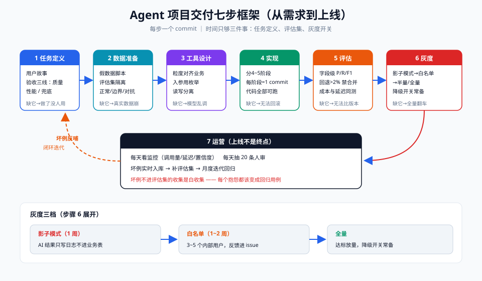

# 00 - 方法论篇：Agent 项目交付框架（从需求到上线）

> 【一句话人话】别把 Agent 项目当"调通 Demo"，要当正规软件工程交付——七个步骤一步不省，每步一个 commit，缺哪步上线就炸哪步。

【生活类比】开餐厅：任务定义=定菜单（卖什么），数据准备=备菜（食材进货），工具设计=定后厨动线（谁切谁炒谁装盘），实现=炒菜，评估=试吃+品控，灰度=先开一周晚市试运营，运营=正式营业后盯差评、补货、迭代菜单。

---

## 一、七步框架总览



| 步骤 | 回答的问题 | 关键产出 | 常见偷懒后果 |
|---|---|---|---|
| 1. 任务定义 | 到底解决谁的什么问题？ | 用户故事 + 验收标准 | 做出来没人用 |
| 2. 数据准备 | 模型看什么数据？ | 假数据脚本 + 评估集 | 上线后"真实数据一进来就崩" |
| 3. 工具设计 | Agent 能调用哪些动作？ | 工具清单 + 入参出参 schema | 工具粒度混乱，模型乱调 |
| 4. 实现 | 怎么把它跑起来？ | 分阶段代码（每阶段=1 commit） | 一坨巨型 commit 无法回滚 |
| 5. 评估 | 做得到位吗？ | 评估集 + 指标基线 | 无法回答"这版比上版好吗" |
| 6. 灰度 | 怎么安全放给用户？ | 灰度计划 + 降级开关 | 全量翻车 |
| 7. 运营 | 上线之后呢？ | 监控面板 + 反馈回路 | 上线即弃，用户流失 |

> **优先级**：如果时间只够做三件事——任务定义、评估集、灰度开关。它们决定项目"能不能交付"，其余决定"交付得好不好"。

---

## 二、步骤 1：任务定义

### 用户故事模板（所有项目卡复用）

```
作为 <角色>，
我想要 <系统能力>，
以便 <业务价值>。
```

### 验收标准三条线

| 线 | 定义 | 例子（以点价抽取为例） |
|---|---|---|
| 质量线 | 准确率/召回率达标 | 字段级 F1 ≥ 0.95 |
| 性能线 | 响应时间达标 | P95 < 3s |
| 兜底线 | 异常输入有降级 | 抽取置信度 < 0.7 时转人工 |

**红线**：没有量化验收标准的 Agent 项目不许进入实现阶段——"感觉挺准"不是标准。

---

## 三、步骤 2：数据准备

CTRM 项目统一用一套假数据生成脚本（见各项目卡），三原则：

1. **先假后真**：先用脚本生成假数据跑通全链路，再逐步换真实脱敏数据。
2. **评估集与训练/调试数据隔离**：评估集 50~200 条手工标注，永不参与调 Prompt 过程。
3. **覆盖三类样本**：正常样本（80%）、边界样本（15%，如跨月点价、部分成交）、对抗样本（5%，如中英混杂、字段缺失、恶意注入）。

**品种口径**：M=豆粕/DCE、RM=菜粕/CZCE、Y=豆油/DCE，所有表结构对齐根 README 第七节的五张表。

---

## 四、步骤 3：工具设计

Function Calling / MCP 工具设计四规则：

| 规则 | 说明 | 反例 |
|---|---|---|
| 粒度对齐业务动作 | 一个工具=一个业务人员能说清的动作 | `query_database(sql)` 这种万能工具 |
| 入参用枚举不用自由文本 | 品种用 `M/RM/Y`，不传 `"豆粕"` | 让模型自己拼 SQL |
| 只读与写操作分离 | 写操作工具必须带 `confirm` 参数 | 查询和下单混在一个工具里 |
| 每个工具有失败语义 | 返回 `{"ok": false, "reason": "..."}` 而非抛异常 | 模型收到 500 后开始幻觉 |

---

## 五、步骤 4：实现（分阶段 = 分 commit）

每个项目卡的实现都拆成 4~5 个阶段，每阶段一个 commit：

```
阶段1: 骨架 + 假数据          → commit "feat: scaffold + mock data"
阶段2: 核心链路最小可用       → commit "feat: core pipeline v0"
阶段3: 工具/检索接入          → commit "feat: tools / retrieval"
阶段4: 评估脚本 + 修 Prompt   → commit "test: eval suite + prompt tuning"
阶段5: FastAPI 服务化         → commit "feat: fastapi service"
```

**代码约定**：Python 3.10+，每个项目独立目录 `project_XX/`，`requirements.txt` 可直接安装，全部代码可跑（API Key 用环境变量 `OPENAI_API_KEY`）。

---

## 六、步骤 5：评估

| 指标类型 | 指标 | 适用项目 |
|---|---|---|
| 抽取质量 | 字段级精确率 / 召回率 / F1 | 01、06 |
| 检索质量 | Hit@5、引用正确率 | 02、04 |
| 分类质量 | 分流准确率、误路由率 | 03、05 |
| 端到端 | 人工验收通过率、任务完成率 | 全部 |
| 成本 | 单次调用 token 数、P95 延迟 | 全部 |

评估执行方式：`python eval.py --evalset eval/gold.jsonl --report report.json`，每次改 Prompt 必跑评估，指标回退超过 2% 禁止合并。

---

## 七、步骤 6：灰度

三档灰度，逐档放量：

1. **影子模式**（1 周）：AI 结果只写日志不进业务表，人工核对差异。
2. **白名单**（1~2 周）：放开给 3~5 个内部用户，反馈直接进 issue 列表。
3. **半量/全量**：准确率连续一周达标后全量，同时保留降级开关。

**降级开关设计**（每个项目必备）：

```yaml
# config.yaml —— 所有项目统一格式
agent:
  enabled: true          # 总开关：false = 走旧人工流程
  fallback: "manual"     # manual | rule | last_good_version
  confidence_threshold: 0.7
  max_retries: 2
```

---

## 八、步骤 7：运营

上线不是终点，四个日常动作：

| 动作 | 频率 | 工具 |
|---|---|---|
| 看监控：调用量/延迟/错误率/置信度分布 | 每天 | Prometheus + Grafana（或先简单日志聚合） |
| 抽样人审：每日随机抽 20 条核对 | 每天 | 审核表格 + 周报 |
| 收集坏例：用户点"不满意"的样本自动入库 | 实时 | `bad_cases` 表 |
| 月度迭代：坏例 → 补评估集 → 改 Prompt/检索 → 重评估 | 每月 | eval.py 回归 |

> **闭环心法**：坏例不进评估集的收集是白收集。每个用户抱怨都应该变成回归测试用例。

---

## 【本章自测】

1. 七步框架中哪三步优先级最高？——要点：任务定义、评估集、灰度开关，决定"能不能交付"。
2. 验收标准要覆盖哪三条线？——要点：质量线（准确率）、性能线（延迟）、兜底线（降级转人工）。
3. 工具设计为什么"入参用枚举不用自由文本"？——要点：收窄模型自由度，`M/RM/Y` 可校验，自由文本易幻觉。
4. 影子模式的含义和作用？——要点：AI 结果只记日志不进业务表，用于全量前的人机差异核对。
5. 降级开关的 `fallback` 有哪几种取值？——要点：manual 人工流程、rule 纯规则、last_good_version 上一可用版本。
6. 为什么"坏例必须进评估集"？——要点：形成回归闭环，防止改一处坏一处。
