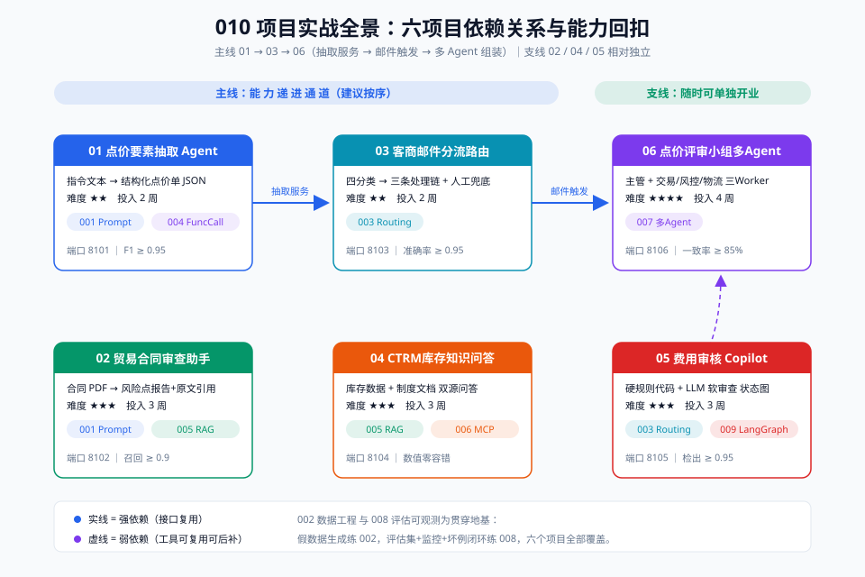

# 010 - 项目实战：把 001~009 的能力落成六个真实 CTRM 项目

> 【一句话人话】前面九章学的是"招式"，这一章是"实战擂台"——用六个围绕中基集团 CTRM 贸易系统的真实项目，把 Prompt、Function Calling、路由、RAG、MCP、LangGraph、多 Agent 全部串起来跑一遍。

【生活类比】九章笔记像是驾校学交规和打方向，项目实战就是真的开车上路：路线不同（六个项目），但方向盘、油门、刹车（九项能力）是同一套。新手别贪心，从 01 开始按顺序跑，每个项目都是一个完整闭环。

---

## 一、读者画像与环境约定

| 项目 | 约定 |
|---|---|
| 读者 | 中基集团 CTRM 贸易系统开发者 |
| 后端 | Java 11（Spring Boot），通过 HTTP 调用 AI 服务 |
| 前端 | Vue 2.7（Element UI），聊天/表格/审批流组件 |
| 数据库 | MySQL 8.x（CTRM 库存表、合同表、费用表、客户表） |
| AI 栈 | Python 3.10+ / FastAPI / OpenAI SDK（function calling）/ LangGraph / MCP |
| 业务域 | 大豆（品种 M）/ 菜粕（RM）/ 豆油（Y）等大宗商品点价、合同、库存、费用 |

> **架构基调**：Java 主系统保持不动，AI 能力以独立 Python 服务（FastAPI）旁路挂载，通过 REST + MySQL 共享数据。这是把 AI 渐进式引入成熟 Java 系统最稳妥的姿势。

---

## 二、如何选你的第一个项目

不是所有人都要按 01→06 顺序跑。按你的处境对号入座：

| 你的处境 | 建议第一个项目 | 理由 |
|---|---|---|
| 刚学完 001/004，想验证 Prompt + Function Calling | **01 点价要素抽取** | 单点能力，输入输出清晰，两周可见成果，最适合建立信心 |
| 领导要求"先做个能演示的东西" | **02 合同审查助手** | RAG 效果直观，演示冲击力强，且 02 相对独立可单独跑 |
| 运营/商务天天被邮件淹没 | **03 客服邮件分流** | 纯路由工作流，不依赖重 AI，规则+LLM 混合即可上线 |
| 业务方总来问库存、套保规则 | **04 CTRM 库存知识问答** | MCP+RAG，接好数据源后边际成本低 |
| 已有 01/03 基础，想上多 Agent | **06 点价评审小组** | 前置依赖 01 和 03，是本章"毕业项目" |
| 学完 009 LangGraph 想练手 | **05 费用审核 Copilot** | 状态机式流程，LangGraph 最佳练手场景 |

**通用建议**：第一个项目永远选"输入→输出"最清晰、评估最容易做的那一个。01 之所以是起点，是因为"一段点价指令 → 一张结构化 JSON 表"的评估集半小时就能建好。

---

## 三、项目总览表

| # | 项目 | 难度 | 预计投入 | 能力回扣（001~009） | 前置依赖 | 核心产出 |
|---|---|---|---|---|---|---|
| 01 | 点价要素抽取 Agent | ★★ | 2 周 | 001 Prompt + 004 Function Calling | 无 | 点价指令→结构化 JSON 的抽取服务 |
| 02 | 贸易合同审查助手 | ★★★ | 3 周 | 001 Prompt + 005 RAG/长文档 | 无 | 合同风险点审查报告生成器 |
| 03 | 客商邮件分流路由 | ★★ | 2 周 | 003 路由 Workflow | 无 | 邮件分类器 + 三条处理链 |
| 04 | CTRM 库存知识问答 | ★★★ | 3 周 | 005 RAG + 006 MCP | 无 | 库存/套保规则问答机器人 |
| 05 | 费用审核 Copilot | ★★★ | 3 周 | 003 路由 + 009 LangGraph | 无 | 费用单审核流程 Copilot |
| 06 | 点价评审小组多 Agent | ★★★★ | 4 周 | 007 多 Agent | 01、03 | 主管+三 Worker 的点价评审系统 |

> 难度★越多越难；投入按"下班后每天 2 小时"估算。能力编号对应本工作区 001~009 各篇笔记。

---

## 四、六项目依赖关系总图



- **主线**：01 → 03 → 06。01 产出的抽取服务是 06 评审小组的"点价要素输入源"；03 的邮件分流是 06 评审任务触发器。
- **独立线**：02（合同审查）、04（库存问答）、05（费用审核）互不依赖，也依赖主线项目，可并行开。
- **能力映射**：01=001+004，02=001+005，03=003，04=005+006，05=003+009，06=007。

---

## 五、方法论：所有项目共用一套交付框架

六个项目卡全部遵循同一交付七步（详见 [00-方法论篇](00-方法论篇-Agent项目交付框架.md)）：

```
任务定义 → 数据准备 → 工具设计 → 实现 → 评估 → 灰度 → 运营
```

每个项目卡里的"分阶段实现"严格对齐这个框架，每个阶段 = 一个 commit 粒度，做完一个提交一个。

---

## 六、目录结构

```
010-项目实战/
├── README.md                      ← 本文件（导航 + 选项目 + 总览）
├── 00-方法论篇-Agent项目交付框架.md ← 七步交付框架（所有项目共用）
├── projects/
│   ├── README.md                  ← 依赖关系图 + 能力回扣说明
│   ├── 01-点价要素抽取Agent.md
│   ├── 02-贸易合同审查助手.md
│   ├── 03-客商邮件分流路由.md
│   ├── 04-CTRM库存知识问答.md
│   ├── 05-费用审核Copilot.md
│   └── 06-点价评审小组多Agent.md
└── diagrams/                      ← 7 张 SVG 图（各笔记内引用）
    ├── 010-01-项目全景与依赖关系.svg
    ├── 010-02-项目交付七步框架.svg
    ├── 010-03-点价抽取项目架构.svg
    ├── 010-04-合同审查项目架构.svg
    ├── 010-05-邮件分流项目架构.svg
    ├── 010-06-库存问答项目架构.svg
    └── 010-07-评审小组项目架构.svg
```

---

## 七、CTRM 假数据约定（六项目共用）

所有项目都用同一套模拟数据，避免每个项目重造轮子。生成脚本见各项目卡"数据与工具准备"一节，核心表约定如下：

| 表名 | 用途 | 关键字段 |
|---|---|---|
| `ctrm_variety` | 品种字典 | code(M/RM/Y), name(豆粕/菜粕/豆油), exchange(DCE/CZCE/Y?) |
| `ctrm_inventory` | 库存表 | contract_no, variety, qty_ton, port(港口), warehouse, arrive_date, priced_flag |
| `ctrm_future_price` | 期货价 | variety, contract_month, price, quote_time |
| `ctrm_contract` | 合同表 | contract_no, counterparty, variety, qty, basis, premium, status |
| `ctrm_fee` | 费用表 | fee_no, contract_no, fee_type(运费/港杂/仓储/保险), amount, invoice_status |

品种对照（写入所有项目）：**M=豆粕（大商所 DCE）、RM=菜粕（郑商所 CZCE）、Y=豆油（大商所 DCE）**。

---

## 【本章自测】

1. 六个项目的依赖主线是哪条？为什么 06 放最后？——要点：01→03→06；06 复用 01 的抽取服务和 03 的触发链路，且多 Agent 难度最高。
2. Java 主系统 + Python AI 服务的推荐集成方式是什么？——要点：AI 以 FastAPI 旁路服务挂载，REST 调用，MySQL 共享数据，主系统零侵入。
3. 选第一个项目的原则是什么？——要点：输入输出清晰、评估集容易建、两周内能闭环。
4. 本章假数据约定了哪三个品种及其交易所？——要点：M 豆粕/DCE、RM 菜粕/CZCE、Y 豆油/DCE。
