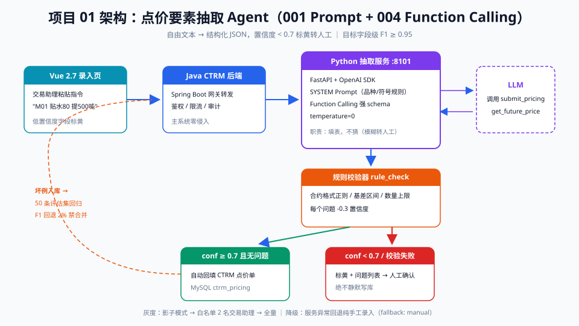

# 01 - 点价要素抽取 Agent（能力回扣：001 Prompt + 004 Function Calling）

> 【本项目问题】① 交易员在微信/邮件里发的点价指令是自由文本（"M01 贴水 80 明天提 500 吨"），录 CTRM 全靠人肉翻译成字段；② 关键要素（品种、月份、基差、数量、港口）抄错一个就是真金白银的损失；③ 一天几百条指令，录入占掉交易助理 2 小时。

## 项目卡片

| 项 | 内容 |
|---|---|
| 难度 | ★★ |
| 预计投入 | 2 周（每天 2 小时） |
| 前置知识 | 001 Prompt 结构化输出、004 Function Calling、FastAPI 基础 |
| 产出物 | 点价指令→结构化 JSON 的 HTTP 服务 + CTRM 录入页辅助回填 |

---

## 一、需求定义

### 用户故事

```
作为 交易助理，
我想要 把自然语言点价指令自动解析成 CTRM 点价单字段，
以便 免去手工录入，把每天 2 小时录入时间降到 10 分钟核对。
```

### 验收标准

| 线 | 标准 |
|---|---|
| 质量线 | 品种/月份/数量/基差四关键字段，字段级 F1 ≥ 0.95 |
| 性能线 | 单条抽取 P95 < 3s |
| 兜底线 | 置信度 < 0.7 的结果标黄转人工，不直接写入 CTRM |

---

## 二、架构设计



链路说明：Vue 录入页把指令文本发给 Java CTRM 后端 → 后端转调 Python 抽取服务 → 抽取服务用 Prompt 模板 + Function Calling（`submit_pricing` 工具）让模型"填表"→ 返回结构化 JSON + 置信度 → 低置信度标黄人工确认 → 确认后写 CTRM 点价表。

**为什么用 Function Calling 而不是裸 JSON 输出**：function calling 的 schema 由代码定义并强校验（001/004 结论），模型填错字段名在协议层就不可能发生；裸 JSON 还要自己写解析+重试。

---

## 三、数据与工具准备

### 3.1 假数据生成

```python
# project_01/gen_mock.py —— 生成 200 条点价指令样本
import json, random

random.seed(42)
VARIETIES = [("M", "豆粕", ["M01", "M05", "M09"]),
             ("RM", "菜粕", ["RM01", "RM05"]),
             ("Y", "豆油", ["Y01", "Y05"])]
PORTS = ["日照", "东莞", "泰州", "防城港", "南通"]

def gen_one(i: int) -> dict:
    code, name, months = random.choice(VARIETIES)
    month = random.choice(months)
    qty = random.choice([200, 500, 1000, 2000, 5000])
    basis = random.randint(-150, 200)
    port = random.choice(PORTS)
    style = i % 4
    if style == 0:   # 规范句式
        text = f"{month} 贴水{basis} 元，{port} 港 {qty} 吨，明天点价"
    elif style == 1: # 口语倒装
        text = f"{port}那边{qty}吨{name}，{month}合约，基差按{basis}走"
    elif style == 2: # 省略数量单位
        text = f"{month}+{basis}，{port}提货{qty}吨"
    else:            # 中英混杂
        text = f"price {month} @{basis} basis, {port} port, {qty}t"
    return {"id": f"PRC-{i:04d}", "text": text,
            "gold": {"variety": code, "contract_month": month,
                     "basis": basis, "qty_ton": qty, "port": port}}

data = [gen_one(i) for i in range(200)]
with open("eval/pricing_gold.jsonl", "w", encoding="utf-8") as f:
    for row in data:
        f.write(json.dumps(row, ensure_ascii=False) + "\n")
print(f"generated {len(data)} samples -> eval/pricing_gold.jsonl")
```

> 前 150 条当调试集，后 50 条当评估集，两者物理分文件。

### 3.2 工具定义（function calling schema）

| 工具名 | 入参（枚举优先） | 出参 | 读/写 |
|---|---|---|---|
| `submit_pricing` | variety: enum(M,RM,Y)；contract_month: string(M01 格式)；basis: number；qty_ton: number；port: enum 五港口 | ok + pricing_id | 写（需 confirm） |
| `get_future_price` | variety: enum；contract_month: string | 当前期货价 | 读 |

---

## 四、分阶段实现

### 阶段 1：骨架 + 假数据（commit: `feat: scaffold + mock data`）

运行上面的 `gen_mock.py`，建好 `project_01/` 目录：

```
project_01/
├── gen_mock.py
├── extract.py        # 阶段2
├── eval.py           # 阶段4
├── serve.py          # 阶段5
└── eval/pricing_gold.jsonl
```

### 阶段 2：核心抽取链路（commit: `feat: core pipeline v0`）

```python
# project_01/extract.py —— Prompt + Function Calling 抽取
import json, os
from openai import OpenAI

client = OpenAI()  # 环境变量 OPENAI_API_KEY

SUBMIT_PRICING = {
    "type": "function",
    "function": {
        "name": "submit_pricing",
        "description": "把点价指令提交为结构化点价单",
        "parameters": {
            "type": "object",
            "properties": {
                "variety": {"type": "string",
                            "enum": ["M", "RM", "Y"],
                            "description": "品种：M豆粕 RM菜粕 Y豆油"},
                "contract_month": {"type": "string",
                                   "description": "合约月份，如 M01"},
                "basis": {"type": "number", "description": "基差（元/吨）"},
                "qty_ton": {"type": "number", "description": "数量（吨）"},
                "port": {"type": "string",
                         "enum": ["日照", "东莞", "泰州", "防城港", "南通"]},
            },
            "required": ["variety", "contract_month", "qty_ton"],
        },
    },
}

SYSTEM = """你是中基集团 CTRM 点价单录入助手。把用户指令解析为点价单字段：
- 品种只允许 M(豆粕)/RM(菜粕)/Y(豆油)；"豆粕/豆粉"→M，"菜粕"→RM，"豆油"→Y
- 合约月份规范成 M01/M05/M09/RM01 等"代码+两位月"格式
- 贴水/基差为负数表示贴水，正数为升水；指令里"贴水80"表示 basis=-80
- 数量缺省单位时视为吨
- 指令未提及的字段不要编造，省略即可"""

def extract(text: str) -> dict:
    resp = client.chat.completions.create(
        model="gpt-4o-mini",
        messages=[{"role": "system", "content": SYSTEM},
                  {"role": "user", "content": text}],
        tools=[SUBMIT_PRICING],
        temperature=0,
    )
    msg = resp.choices[0].message
    calls = msg.tool_calls or []
    if not calls:
        return {"ok": False, "reason": "no tool call", "confidence": 0.0}
    args = json.loads(calls[0].function.arguments)
    return {"ok": True, "fields": args, "confidence": 0.9}

if __name__ == "__main__":
    for t in ["M01 贴水80 明天提500吨", "日照那边2000吨豆粕，M05合约基差按-60走"]:
        print(json.dumps(extract(t), ensure_ascii=False))
```

### 阶段 3：置信度 + 二次校验（commit: `feat: confidence + validation`）

```python
# 追加到 extract.py —— 规则校验器与置信度合成
import re

def rule_check(fields: dict) -> list[str]:
    """模型不可信的部分用规则兜底校验，返回问题列表"""
    problems = []
    if "contract_month" in fields and not re.fullmatch(r"[MR][MY]?\d{2}", fields["contract_month"]):
        problems.append(f"合约格式非法: {fields['contract_month']}")
    if "basis" in fields and not (-1000 < fields["basis"] < 1000):
        problems.append(f"基差异常: {fields['basis']}")
    if "qty_ton" in fields and not (0 < fields["qty_ton"] <= 100000):
        problems.append(f"数量异常: {fields['qty_ton']}")
    return problems

def extract_with_confidence(text: str) -> dict:
    result = extract(text)
    if not result["ok"]:
        return {**result, "needs_human": True}
    problems = rule_check(result["fields"])
    conf = result["confidence"] - 0.3 * len(problems)
    result["needs_human"] = conf < 0.7 or bool(problems)
    result["problems"] = problems
    return result
```

### 阶段 4：评估脚本（commit: `test: eval suite`）

```python
# project_01/eval.py —— 字段级 P/R/F1
import json

KEY_FIELDS = ["variety", "contract_month", "qty_ton"]

def evaluate(gold_path: str, predict_fn) -> dict:
    tp = fp = fn = 0
    for line in open(gold_path, encoding="utf-8"):
        row = json.loads(line)
        pred = predict_fn(row["text"]).get("fields", {})
        for k in KEY_FIELDS:
            g, p = row["gold"].get(k), pred.get(k)
            if g is not None and p == g:
                tp += 1
            elif g is not None and p is not None and str(g) != str(p):
                fp += 1; fn += 1
            elif g is not None:
                fn += 1
            elif p is not None:
                fp += 1
    prec = tp / (tp + fp) if tp + fp else 0
    rec = tp / (tp + fn) if tp + fn else 0
    f1 = 2 * prec * rec / (prec + rec) if prec + rec else 0
    return {"precision": round(prec, 3), "recall": round(rec, 3), "f1": round(f1, 3)}

if __name__ == "__main__":
    from extract import extract
    print(evaluate("eval/pricing_gold.jsonl",
                   lambda t: extract(t)))
```

### 阶段 5：FastAPI 服务化（commit: `feat: fastapi service`）

```python
# project_01/serve.py
from fastapi import FastAPI
from pydantic import BaseModel
from extract_with_conf import extract_with_confidence  # 阶段3整合后的模块

app = FastAPI(title="pricing-extract-agent")

class ExtractReq(BaseModel):
    text: str

@app.post("/extract")
def extract_api(req: ExtractReq):
    return extract_with_confidence(req.text)
# 启动: uvicorn serve:app --port 8101
# Java 侧: POST http://localhost:8101/extract 即可接入录入页
```

---

## 五、评估方案

| 项 | 内容 |
|---|---|
| 评估集 | `eval/pricing_gold.jsonl` 后 50 条（人工核对过的 gold 标注） |
| 指标 | 品种/合约/数量字段级 P/R/F1；基差允许 ±1 误差记对 |
| 基线 | v0 裸 Prompt JSON 输出 ≈ F1 0.88；function calling 版 ≥ 0.96 |
| 回归 | 每次改 SYSTEM Prompt 必跑 `python eval.py`，F1 回退 >2% 禁止合并 |

---

## 六、上线与运营

| 档位 | 做法 | 通过条件 |
|---|---|---|
| 影子模式 | 抽取结果只写日志表，不进点价单 | 1 周字段错误率 < 3% |
| 白名单 | 2 名交易助理录入页嵌入"AI 回填"按钮 | 反馈准确率 ≥ 95% |
| 全量 | 默认回填，低置信度标黄 | 持续监控 |

**降级**：AI 服务超时/错误时录入页回退纯手工模式（`fallback: manual`）。
**监控**：每天看调用量、P95 延迟、needs_human 比例（>15% 说明 Prompt 或数据分布漂移）。
**月度**：bad_cases 补进评估集，回归后再发版。

---

## 七、常见坑

| 坑 | 现象 | 解法 |
|---|---|---|
| "贴水80"被解析成 +80 | 符号语义靠语言习惯 | SYSTEM 明确"贴水=basis 为负"，评估集放边界样本 |
| 合约月份幻觉 | "明年1月"被猜成 M01 | 只允许显式月份，模糊时间转人工（needs_human） |
| 港口编造 | 模型填了不在枚举里的港口 | enum 枚举收死 + rule_check 双保险 |
| 一次指令多个点价单 | "M01 和 M05 各 500 吨"只返回一张单 | 工具描述注明"可多次调用 submit_pricing" |
| 换模型后 F1 骤降 | 换了便宜模型没跑回归 | 评估脚本进 CI，换模型必跑 |

---

## 【本项目自测】

1. 为什么选 function calling 而不是让模型直接输出 JSON？——要点：schema 协议层强校验、字段名不可错、省去解析重试逻辑（004 结论）。
2. `rule_check` 存在的意义是什么？——要点：模型输出范围类错误（数量/基差越界）用规则兜底，成本为零且确定。
3. 评估集为什么要和调试数据物理分开？——要点：防止"在调试集上调 Prompt 调到过拟合"，评估集只测不改。
4. "贴水80"应解析为 basis 多少？怎么保证模型解析对？——要点：basis=-80；SYSTEM 规则明确 + 评估集含该边界样本。
5. needs_human 的判定条件有哪些？——要点：置信度 < 0.7 或 rule_check 有问题或无 tool call。
6. 上线灰度三档分别是什么？——要点：影子模式（只记日志）、白名单（内部用户）、全量（持续监控+降级开关）。
