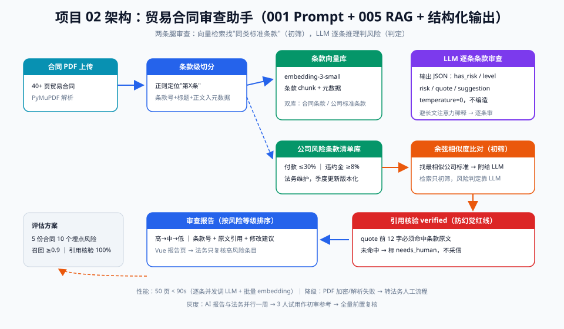

# 02 - 贸易合同审查助手（能力回扣：001 Prompt + 005 RAG/长文档）

> 【本项目问题】① 一份大豆进口合同 40+ 页，法务逐条核对条款要半天；② 公司有合同模板和风险条款清单，但新合同与模板的差异靠肉眼 diff；③ 违约条款、检验检疫、汇率条款漏看一条都可能吃大亏。

## 项目卡片

| 项 | 内容 |
|---|---|
| 难度 | ★★★ |
| 预计投入 | 3 周（每天 2 小时） |
| 前置知识 | 001 Prompt、005 RAG + 长文档切分、PDF 文本抽取 |
| 产出物 | 上传合同 PDF → 输出风险点审查报告（带原文引用） |

---

## 一、需求定义

### 用户故事

```
作为 合同管理员，
我想要 上传一份贸易合同 PDF，自动得到与公司模板差异和风险条款清单（每条附原文引用），
以便 把半天的人工初筛压缩到 10 分钟复核。
```

### 验收标准

| 线 | 标准 |
|---|---|
| 质量线 | 内置 10 个埋点风险的召回率 ≥ 0.9；每条风险必须带原文引用 |
| 性能线 | 50 页合同端到端 < 90s |
| 兜底线 | 引用找不到原文的结论一律标记"待人工"，不直接采信 |

---

## 二、架构设计



链路说明：PDF 解析（PyMuPDF）→ 按条款切分（正则定位"第X条"）→ 入向量库（条款级 chunk + 元数据）→ 审查时两条腿：① 检索公司"风险条款清单库"比对相似条款；② LLM 逐条扫描合同条款输出风险点 → 结构化审查报告（风险等级 + 原文引用 + 修改建议）→ Vue 报告页人工复核。

**设计取舍**：纯长文本一次塞给 LLM 会超上下文且注意力稀释（005 结论），所以采用"切分 + RAG 比对"混合：模板差异靠向量检索（找同类条款），风险扫描靠逐条 LLM 审查（需要推理）。

---

## 三、数据与工具准备

### 3.1 假合同生成

```python
# project_02/gen_mock_contract.py —— 生成带埋点风险的测试合同
CLAUUSES = [
    ("第一条 合同标的", "甲方购买乙方巴西大豆50000吨，含油率≥18%，水分≤13.5%。", None),
    ("第二条 价格条款", "以CBOT当年1月合约结算价+升贴水80美分/蒲式耳计价。", None),
    ("第三条 付款方式", "买方应在装船前60%款项付至卖方账户，余款货到付清。", "RISK-01: 付款比例过高，公司标准为装船前不超过30%"),
    ("第四条 检验条款", "以CIQ检验为准；如卖方对CIQ结果有异议，以SGS复检为准。", None),
    ("第五条 违约责任", "任何一方违约，违约金为合同总额的5%。", "RISK-02: 违约金低于公司标准8%"),
    ("第六条 不可抗力", "因不可抗力无法履约的，受影响方应在30日内书面通知对方。", "RISK-03: 30日通知期过长，标准为7日"),
    ("第七条 争议解决", "提交新加坡国际仲裁中心仲裁。", "RISK-04: 仲裁地不符，公司标准为中国贸促委仲裁"),
    ("第八条 汇率风险", "汇率波动风险由买方自行承担。", None),
]
with open("data/contract_BN-2026-018.txt", "w", encoding="utf-8") as f:
    for title, body, risk in CLAUUSES:
        f.write(f"{title}\n{body}\n\n")
        if risk:
            f.write(f"<!-- {risk} -->\n\n")
print("mock contract with 4 embedded risks written")
```

### 3.2 风险条款清单库（RAG 检索侧语料）

| 条款类目 | 公司标准 | 风险等级 |
|---|---|---|
| 付款比例 | 装船前 ≤30% | 高 |
| 违约金比例 | ≥ 合同额 8% | 高 |
| 不可抗力通知期 | ≤7 日 | 中 |
| 仲裁机构/地 | 中国国际贸易仲裁委员会 | 高 |
| 质量检验 | CIQ 为准 | 中 |
| 价格基准 | CBOT/WCE 对应品种主力合约 | 低 |

---

## 四、分阶段实现

### 阶段 1：骨架 + 假数据（commit: `feat: scaffold + mock contract`）

运行 `gen_mock_contract.py`，目录：

```
project_02/
├── gen_mock_contract.py
├── chunk.py       # 阶段2
├── review.py      # 阶段3
├── report.py      # 阶段4
├── serve.py       # 阶段5
└── data/
```

### 阶段 2：文档解析与条款切分（commit: `feat: pdf chunking`）

```python
# project_02/chunk.py —— 条款级切分
import re

def split_clauses(text: str) -> list[dict]:
    """按'第X条'切分，保留条款号作为元数据"""
    pattern = re.compile(r"(第[一二三四五六七八九十百]+条[^\n]*)\n")
    matches = list(pattern.finditer(text))
    clauses = []
    for i, m in enumerate(matches):
        end = matches[i + 1].start() if i + 1 < len(matches) else len(text)
        title = m.group(1).strip()
        body = text[m.end():end].strip()
        clauses.append({"clause_no": f"第{i+1}条", "title": title, "body": body})
    return clauses

def parse_pdf(path: str) -> list[dict]:
    import fitz  # pip install pymupdf
    doc = fitz.open(path)
    full = "\n".join(page.get_text() for page in doc)
    return split_clauses(full)

def parse_txt(path: str) -> list[dict]:
    return split_clauses(open(path, encoding="utf-8").read())

if __name__ == "__main__":
    for c in parse_txt("data/contract_BN-2026-018.txt"):
        print(c["clause_no"], c["title"], "|", c["body"][:30], "...")
```

### 阶段 3：RAG 比对 + LLM 逐条审查（commit: `feat: retrieval + clause review`）

```python
# project_02/review.py —— 两条腿审查
import os
import numpy as np
from openai import OpenAI

client = OpenAI()
EMBED_MODEL = "text-embedding-3-small"

# 公司风险条款清单（生产中从 MySQLcterm 标准库读）
STANDARD_CLAUSES = [
    {"cat": "付款比例", "text": "买方应在装船前支付不超过合同总额30%的款项，余款货到验收后付清。", "level": "高"},
    {"cat": "违约金",   "text": "任何一方违约，违约金为合同总额的8%。", "level": "高"},
    {"cat": "不可抗力", "text": "因不可抗力无法履约的，受影响方应在7日内书面通知对方。", "level": "中"},
    {"cat": "争议解决", "text": "争议提交中国国际经济贸易仲裁委员会仲裁。", "level": "高"},
]

def embed(texts: list[str]) -> list[list[float]]:
    resp = client.embeddings.create(model=EMBED_MODEL, input=texts)
    return [d.embedding for d in resp.data]

def build_index():
    mats = np.array(embed([c["text"] for c in STANDARD_CLAUSES]), dtype="float32")
    mats /= np.linalg.norm(mats, axis=1, keepdims=True)
    return STANDARD_CLAUSES, mats

def match_std(clause_body: str, index) -> dict:
    stds, mats = index
    v = np.array(embed([clause_body])[0], dtype="float32")
    v /= np.linalg.norm(v)
    sims = mats @ v
    best = int(np.argmax(sims))
    return {**stds[best], "similarity": round(float(sims[best]), 3)}

REVIEW_PROMPT = """你是中基集团贸易合同审查专家。审查以下合同条款，输出 JSON：
{{"has_risk": bool, "risk_points": [{{"risk": str, "level": "高|中|低",
"quote": "原文关键句", "suggestion": str}}]}}
对照公司标准：付款比例装船前不超30%；违约金不低于8%；不可抗力通知不超7日；
仲裁应为中国贸促委。没有风险就 has_risk=false，不要编造。"""

def review_clause(clause: dict, match: dict) -> dict:
    sim, level = match["similarity"], match["level"]
    user = f"条款：{clause['title']}\n{clause['body']}\n\n" \
           f"最相似公司标准（{match['cat']}，风险{level}，相似度{sim}）：{match['text']}"
    resp = client.chat.completions.create(
        model="gpt-4o-mini",
        messages=[{"role": "system", "content": REVIEW_PROMPT},
                  {"role": "user", "content": user}],
        temperature=0, response_format={"type": "json_object"},
    )
    import json
    out = json.loads(resp.choices[0].message.content)
    out["clause_no"] = clause["clause_no"]
    return out
```

### 阶段 4：报告生成（commit: `feat: report generation`）

```python
# project_02/report.py —— 汇总为审查报告
def build_report(clauses: list[dict], index) -> dict:
    findings = []
    for clause in clauses:
        match = match_std(clause["body"], index)
        r = review_clause(clause, match)
        if r.get("has_risk"):
            for p in r["risk_points"]:
                # 兜底线：引用必须能在原文中找到
                cited = p.get("quote", "") and p["quote"][:12] in clause["body"]
                findings.append({
                    "clause": r["clause_no"], "risk": p["risk"],
                    "level": p.get("level", "中"),
                    "quote": p.get("quote", ""), "verified": cited,
                    "suggestion": p.get("suggestion", ""),
                    "needs_human": not cited,
                })
    findings.sort(key=lambda x: {"高": 0, "中": 1, "低": 2}[x["level"]])
    return {"contract_clauses": len(clauses),
            "risk_count": len(findings), "findings": findings}

if __name__ == "__main__":
    from chunk import parse_txt
    from review import build_index
    idx = build_index()
    report = build_report(parse_txt("data/contract_BN-2026-018.txt"), idx)
    for f in report["findings"]:
        print(f["level"], f["clause"], f["risk"], "| 引用核验:", f["verified"])
```

### 阶段 5：FastAPI 服务化（commit: `feat: fastapi service`）

```python
# project_02/serve.py
import shutil
from fastapi import FastAPI, UploadFile
from report import build_report
from chunk import parse_pdf
from review import build_index

app = FastAPI(title="contract-review-agent")
INDEX = build_index()

@app.post("/review")
async def review(file: UploadFile):
    tmp = f"/tmp/{file.filename}"
    with open(tmp, "wb") as f:
        shutil.copyfileobj(file.file, f)
    clauses = parse_pdf(tmp)
    return build_report(clauses, INDEX)
# 启动: uvicorn serve:app --port 8102
```

---

## 五、评估方案

| 项 | 内容 |
|---|---|
| 评估集 | 5 份模拟合同，共 10 个埋点风险（`<!-- RISK-xx -->` 标记可自动抽取 gold） |
| 指标 | 埋点风险召回率 ≥ 0.9；误报率 ≤ 每份合同 1 条；引用可核验率 100% |
| 基线 | 全文直接丢给 LLM：长合同漏检 ~40%（005 注意力稀释结论） |
| 回归 | 改切分粒度或 Prompt 必跑 `eval_review.py` |

---

## 六、上线与运营

| 档位 | 做法 |
|---|---|
| 影子模式 | AI 报告与法务人工报告并行一周，比对差异 |
| 白名单 | 合同管理员 3 人试用，AI 报告仅作"初审参考" |
| 全量 | AI 报告前置，法务只复核高风险条目 |

**降级**：解析失败/PDF 加密时直接转法务人工流程。
**监控**：每份报告的"待人工"占比、各风险等级分布、端到端耗时。
**运营要点**：风险条款清单库每季度由法务更新一次——清单库质量决定检索上限。

---

## 七、常见坑

| 坑 | 现象 | 解法 |
|---|---|---|
| PDF 双栏/表格解析乱序 | 条款错切 | 条款号正则兜底 + 人工抽检前 3 份 |
| 引用幻觉 | 报告引用了原文没有的句子 | `verified` 校验：quote 片段必须命中原文，否则标 needs_human |
| 相似度高分但实质不同 | "定金"与"预付款"相似度高 | 检索只做初筛，风险判断永远交给 LLM 推理 |
| 切分粒度太细/太粗 | 单句切分丢上下文；全文切分超限 | 按"第X条"自然边界切分，条款 ≤1500 字 |
| 清单库过期 | 公司标准改了，AI 还按旧标准审 | 清单库版本化 + 法务季度评审 |

---

## 【本项目自测】

1. 为什么不把整份合同一次性丢给 LLM 审查？——要点：长上下文注意力稀释导致漏检（005），切分+逐条审查更稳。
2. RAG 在本项目里负责什么、不负责什么？——要点：负责"找最相似公司标准"做比对初筛；不负责风险判定（那靠 LLM 推理）。
3. 引用可核验（verified）机制怎么实现？——要点：要求 quote 前 12 字命中原文，未命中标 needs_human 不采信。
4. 评估集的 gold 标签从哪来？——要点：生成假合同时埋 `<!-- RISK-xx -->` 注释，脚本自动抽取为 gold。
5. 端到端 90 秒的瓶颈最可能在哪？——要点：逐条款串行调 LLM；解法是并发调用 + 批量 embedding。
6. 清单库（标准条款库）由谁维护、多久更新？——要点：法务维护，季度更新并版本化。
