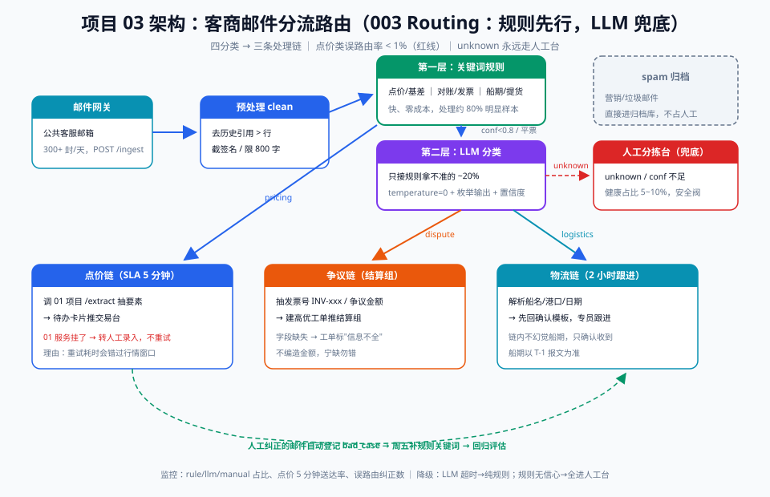

# 05 - 费用审核 Copilot（能力回扣：003 路由 + 009 LangGraph）

> 【本项目问题】① 每月 800+ 张费用单（运费/港杂/仓储/保险），人工逐张核对合同费率、发票抬头、金额上限，财务 3 人要审 5 天；② 审核规则分层次：硬规则（发票号重复）用代码查就行，模糊判断（"这笔滞期费合理吗"）才需要 LLM；③ 审核流程有明确步骤状态（初审→复核→通过/驳回），天然是状态机。

## 项目卡片

| 项 | 内容 |
|---|---|
| 难度 | ★★★ |
| 预计投入 | 3 周（每天 2 小时） |
| 前置知识 | 003 路由、009 LangGraph 状态图、条件边 |
| 产出物 | 费用单审核 Copilot：自动初审 + 风险标注 + 人工复核工作台 |

---

## 一、需求定义

### 用户故事

```
作为 财务审核员，
我想要 费用单进来先由 Copilot 自动初审并标注风险点，我只复核有风险的 20%，
以便 把 5 天的审核周期压缩到 1 天，且不放过任何异常。
```

### 验收标准

| 线 | 标准 |
|---|---|
| 质量线 | 内置 20 个问题单的检出率 ≥ 0.95；正常单误报率 ≤ 10% |
| 性能线 | 单张审核 P95 < 15s（含多步图执行） |
| 兜底线 | 图执行异常时费用单落入人工队列，绝不自动通过 |

---

## 二、架构设计

**核心思路（009 回扣）**：审核流程建模为 LangGraph 状态图——`load → hard_rules → (异常?) → soft_review → grade → (通过|驳回|人工)`。硬规则节点是纯代码（确定性），软审查节点才是 LLM（模糊判断），条件边决定走向。

本项目无专属 SVG；下图为 03 项目的路由分层架构，本项目"硬规则→软审查"的分层思想与之同源，可对照阅读：



Copilot 专属状态图见下方 ASCII。

```
            ┌─────────┐
            │  load   │ 读取费用单+合同费率
            └────┬────┘
                 ▼
         ┌───────────────┐   异常→直接 grade(reject)
         │  hard_rules   │ 纯代码：发票重复/金额超上限/费率不符
         └────┬──────────┘
              │ 通过
              ▼
         ┌───────────────┐
         │  soft_review  │ LLM：费用合理性/描述一致性/滞期费判断
         └────┬──────────┘
              ▼
         ┌───────────────┐
         │     grade     │ 汇总风险分 → pass / reject / human
         └───┬────┬──────┘
             ▼    ▼    ▼
           通过  驳回  人工复核队列
```

**分层审核的理由（003 回扣）**：确定性规则不进 LLM——发票号重复这种事 `if` 一行搞定，让 LLM 碰它只会引入不确定性；LLM 只审"合理性"这种真的需要语言理解的判断。

---

## 三、数据与工具准备

### 3.1 假费用单生成（含 20 张问题单）

```python
# project_05/gen_mock_fees.py
import json, random
random.seed(99)

FEE_TYPES = {"运费": (45, 80), "港杂": (15, 30), "仓储": (8, 20), "保险": (3, 8)}
data, problems = [], []
for i in range(200):
    ftype = random.choice(list(FEE_TYPES))
    lo, hi = FEE_TYPES[ftype]
    qty = random.choice([500, 1000, 2000, 5000])
    rate = round(random.uniform(lo, hi), 1)
    fee = {
        "fee_no": f"FY-2026-{i:04d}", "contract_no": f"HT-2026-{random.randint(0,199):04d}",
        "fee_type": ftype, "qty_ton": qty, "unit_price": rate,
        "amount": round(qty * rate, 2),
        "invoice_no": f"INV-2026-{i:04d}", "desc": f"{ftype}费 {qty} 吨",
    }
    data.append(fee)

# 埋 20 张问题单：金额超上限 / 发票重复 / 费率不符
for j, defect in enumerate(["amount_over", "invoice_dup", "rate_mismatch"] * 6 + ["amount_over", "invoice_dup"]):
    f = dict(random.choice(data))
    f["fee_no"] = f"FY-BAD-{j:04d}"
    if defect == "amount_over":
        f["amount"] = f["amount"] * 3
    elif defect == "invoice_dup":
        f["invoice_no"] = data[0]["invoice_no"]
    elif defect == "rate_mismatch":
        f["unit_price"] = 999.0
    data.append(f); problems.append({"fee_no": f["fee_no"], "defect": defect})

with open("data/fees.json", "w", encoding="utf-8") as f:
    json.dump(data, f, ensure_ascii=False, indent=1)
with open("data/fees_gold.json", "w", encoding="utf-8") as f:
    json.dump(problems, f, ensure_ascii=False, indent=1)
print(f"{len(data)} fees, {len(problems)} problem fees")
```

### 3.2 工具

| 工具 | 类型 | 用途 |
|---|---|---|
| `check_invoice_dup` | 代码函数 | 发票号重复检测（查历史库） |
| `get_contract_rate` | 代码函数 | 查合同费率上限 |
| `llm_review_desc` | LLM 节点 | 费用描述合理性软审查 |

---

## 四、分阶段实现

### 阶段 1：骨架 + 假数据（commit: `feat: scaffold + mock fees`）

运行 `gen_mock_fees.py`，目录：

```
project_05/
├── gen_mock_fees.py
├── hard_rules.py   # 阶段2
├── soft_review.py  # 阶段3
├── graph.py        # 阶段4（LangGraph）
├── serve.py        # 阶段5
└── data/
```

### 阶段 2：硬规则层（commit: `feat: hard rules`）

```python
# project_05/hard_rules.py —— 纯代码，确定性，零 token
FEE_RATE_CAPS = {"运费": 80, "港杂": 30, "仓储": 20, "保险": 8}

def check_hard(fee: dict, seen_invoices: set) -> list[dict]:
    issues = []
    if fee["invoice_no"] in seen_invoices:
        issues.append({"rule": "invoice_dup", "level": "高",
                       "detail": f"发票号 {fee['invoice_no']} 已存在"})
    cap = FEE_RATE_CAPS.get(fee["fee_type"])
    if cap and fee["unit_price"] > cap:
        issues.append({"rule": "rate_over", "level": "高",
                       "detail": f"单价 {fee['unit_price']} 超 {fee['fee_type']} 上限 {cap}"})
    expect = round(fee["qty_ton"] * fee["unit_price"], 2)
    if abs(expect - fee["amount"]) > 1:
        issues.append({"rule": "amount_mismatch", "level": "高",
                       "detail": f"金额 {fee['amount']} ≠ 数量×单价 {expect}"})
    return issues
```

### 阶段 3：软审查层（commit: `feat: soft review`）

```python
# project_05/soft_review.py —— LLM 只审合理性
import json
from openai import OpenAI
client = OpenAI()

SOFT_PROMPT = """你是费用审核专家。审核以下费用单描述的合理性：
费用类型：{fee_type}，数量：{qty_ton}吨，单价：{unit_price}，金额：{amount}。
描述：{desc}
从"描述与类型是否一致、金额量级是否离谱、有无明显漏写"三方面判断。
输出 JSON：{{"risk_points": [str], "suspicious": bool}}。无问题则空数组。"""

def soft_review(fee: dict) -> dict:
    resp = client.chat.completions.create(
        model="gpt-4o-mini", temperature=0,
        response_format={"type": "json_object"},
        messages=[{"role": "system", "content": SOFT_PROMPT.format(**fee)}])
    return json.loads(resp.choices[0].message.content)
```

### 阶段 4：LangGraph 状态图（commit: `feat: langgraph pipeline`）

```python
# project_05/graph.py —— 009 LangGraph 核心
from typing import TypedDict
from langgraph.graph import StateGraph, END
from hard_rules import check_hard
from soft_review import soft_review

class FeeState(TypedDict):
    fee: dict
    seen_invoices: set
    hard_issues: list
    soft_result: dict
    verdict: str        # pass | reject | human
    risk_score: int

def n_load(s: FeeState) -> FeeState:
    return {"fee": s["fee"], "seen_invoices": s["seen_invoices"],
            "hard_issues": [], "soft_result": {}, "verdict": "pass",
            "risk_score": 0}

def n_hard(s: FeeState) -> FeeState:
    issues = check_hard(s["fee"], s["seen_invoices"])
    return {"hard_issues": issues}

def n_soft(s: FeeState) -> FeeState:
    return {"soft_result": soft_review(s["fee"])}

def n_grade(s: FeeState) -> FeeState:
    score = len(s["hard_issues"]) * 40          # 硬问题一票重罚
    score += 20 if s.get("soft_result", {}).get("suspicious") else 0
    if score >= 40:
        verdict = "reject"
    elif score > 0:
        verdict = "human"
    else:
        verdict = "pass"
    return {"risk_score": score, "verdict": verdict}

def route_after_hard(s: FeeState) -> str:
    return "grade" if s["hard_issues"] else "soft"   # 硬规则已爆 → 免审直接打回

g = StateGraph(FeeState)
g.add_node("load", n_load)
g.add_node("hard", n_hard)
g.add_node("soft", n_soft)
g.add_node("grade", n_grade)
g.set_entry_point("load")
g.add_edge("load", "hard")
g.add_conditional_edges("hard", route_after_hard,
                        {"grade": "grade", "soft": "soft"})
g.add_edge("soft", "grade")
g.add_edge("grade", END)
app = g.compile()

def review_fee(fee: dict, seen_invoices: set) -> FeeState:
    return app.invoke({"fee": fee, "seen_invoices": seen_invoices})

if __name__ == "__main__":
    import json
    fees = json.load(open("data/fees.json", encoding="utf-8"))
    seen = {f["invoice_no"] for f in fees[:50]}
    bad = [f for f in fees if f["fee_no"].startswith("FY-BAD")][:3]
    for f in bad:
        r = review_fee(f, seen)
        print(f["fee_no"], r["verdict"], r["risk_score"], r["hard_issues"])
```

### 阶段 5：FastAPI + 审核工作台接口（commit: `feat: fastapi service`）

```python
# project_05/serve.py
import json
from fastapi import FastAPI
from pydantic import BaseModel
from graph import review_fee

app = FastAPI(title="fee-audit-copilot")
FEES = json.load(open("data/fees.json", encoding="utf-8"))
SEEN = {f["invoice_no"] for f in FEES}

class FeeIn(BaseModel):
    fee_no: str

@app.post("/audit")
def audit(req: FeeIn):
    fee = next((f for f in FEES if f["fee_no"] == req.fee_no), None)
    if not fee:
        return {"error": "not found"}
    r = review_fee(fee, SEEN)
    return {"fee_no": fee["fee_no"], "verdict": r["verdict"],
            "risk_score": r["risk_score"], "hard_issues": r["hard_issues"],
            "soft_points": r["soft_result"].get("risk_points", [])}
# 启动: uvicorn serve:app --port 8105
# Vue 2.7 复核工作台轮询 /audit 结果，human 单进入待办列表
```

---

## 五、评估方案

| 项 | 内容 |
|---|---|
| 评估集 | `fees_gold.json` 20 张问题单 + 180 张正常单 |
| 指标 | 问题单检出率 ≥0.95（按 defect 类型分桶统计）；正常单误报（reject/human）≤10% |
| 分桶 | amount_over / invoice_dup / rate_mismatch 各自检出率——防止平均数掩盖某类全漏 |
| 回归 | 改规则阈值或软审查 Prompt 必跑 eval_fees.py |

---

## 六、上线与运营

| 档位 | 做法 |
|---|---|
| 影子模式 | Copilot 结果只标注不拦截，财务照常全量人审，比对一个月 |
| 白名单 | 仅运费类单子先自动初审 |
| 全量 | 四类费用全上，human 队列保底 |

**降级**：LangGraph 执行异常 → 单子直接进人工队列（`fallback: manual`），正常单不受影响。
**监控**：verdict 分布（pass/reject/human 比例）、误报申诉数、单张审核耗时分布。
**运营要点**：财务驳回 Copilot 判定的案例每月复盘——是规则阈值问题还是软审查 Prompt 问题，分别修。

---

## 七、常见坑

| 坑 | 现象 | 解法 |
|---|---|---|
| LLM 抢硬规则的活 | 发票重复也丢给 LLM 判断 | 架构红线：确定性检查永远不进 LLM 节点 |
| 状态图循环 | grade 打回 soft 再 grade 死循环 | 图设计禁环，grade 是终点（009：图先画在纸上再写码） |
| 误报淹没复核台 | human 队列 60% 单子 | 阈值调优：risk_score 分段回放历史单找平衡点 |
| 发票集合并发不一致 | 多实例部署时 seen_invoices 不同步 | 生产中查库不传集合（本 Demo 简化为单机集合） |
| 软审查过严 | 合理滞期费被标可疑 | SOFT_PROMPT 给行业基准锚点 + 申诉案例反哺 |

---

## 【本项目自测】

1. 为什么硬规则不用 LLM 审？——要点：确定性检查用代码零成本零误差，LLM 反而引入不确定性；LLM 只做合理性这种模糊判断（003 分层思想）。
2. `route_after_hard` 条件边的意义？——要点：硬规则已爆（高危问题）就跳过软审查直接 grade 打回，省钱且快。
3. risk_score 40 分为什么直接 reject 而不进人工？——要点：40 = 至少一个硬规则问题 = 确定性违规，无需人判断；只有模糊风险才需要人。
4. 检出率为什么要按 defect 类型分桶统计？——要点：整体 0.95 可能掩盖"某类 100% 漏检"，分桶定位薄弱规则。
5. 审核流程为什么适合 LangGraph 而不是 if-else 主函数？——要点：多节点+条件分支+状态流转天然是图结构（009）；图结构可可视化、可插拔节点、可流式观测。
6. 影子模式为什么建议跑一个月而不是一周？——要点：费用审核有月度周期性（月末集中报账），周期不足会漏掉场景。
