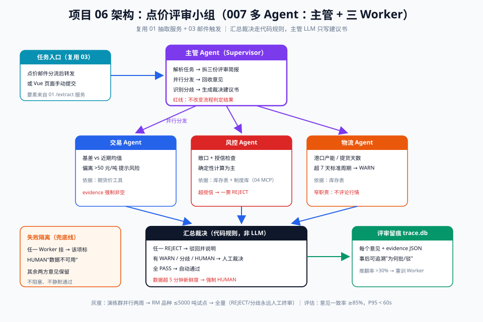

# 06 - 点价评审小组多 Agent（能力回扣：007 多 Agent；前置：01、03）

> 【本项目问题】① 大额点价（>5000 吨或单日累计超敞口上限）按规定需要"交易、风控、物流"三方会签，目前靠拉微信群人工催，平均 4 小时才批完；② 评审意见散在聊天记录里，事后无法追溯"当时为什么批/不批"；③ 行情窗口转瞬即逝，等三方凑齐黄花菜都凉了。

## 项目卡片

| 项 | 内容 |
|---|---|
| 难度 | ★★★★ |
| 预计投入 | 4 周（每天 2 小时） |
| 前置知识 | 007 多 Agent 协作、01 项目抽取服务、03 项目邮件触发、LangGraph 基础 |
| 产出物 | 主管 + 三 Worker（交易/风控/物流）的点价评审系统，附全程评审留痕 |

---

## 一、需求定义

### 用户故事

```
作为 交易台主管，
我想要 大额点价申请自动触发三方评审，各 Agent 给出带依据的评审意见，我只需裁决分歧项，
以便 会签时间从 4 小时压到 30 分钟，且每笔评审全程可追溯。
```

### 验收标准

| 线 | 标准 |
|---|---|
| 质量线 | 三 Worker 意见与资深人工评审一致率 ≥ 85%；每条意见必须引用具体数据/规则 |
| 性能线 | 三方并行评审 P95 < 60s |
| 兜底线 | 任一 Worker 失败时该项标"数据不可用，需人工"，不阻塞整体流程 |

---

## 二、架构设计



链路说明：**入口**（复用 03）：点价类邮件经分流路由后，或 Vue 页面手动提交 → 创建评审任务。**主管 Agent**：解析任务、拆解三份评审简报、分发给三个 Worker、汇总意见、识别分歧、生成裁决建议。**三个 Worker 并行**（007 Supervisor 模式）：

| Worker | 输入（复用 01 的抽取服务） | 职责 | 依据源 |
|---|---|---|---|
| 交易 Agent | 点价要素（品种/数量/基差） | 行情合理性：基差 vs 近期均值 | 期货价工具 |
| 风控 Agent | 点价要素 + 客户敞口 | 敞口/授信检查 | 库存表 + 制度库（04 的 MCP 工具） |
| 物流 Agent | 港口/数量/日期 | 提货可行性：港口产能/船期 | 库存表 |

**汇总规则**：三方全 PASS → 自动通过；任一 REJECT → 驳回并说明；有分歧 → 人工裁决页只展示分歧项。

---

## 三、数据与工具准备

### 3.1 复用前置项目

| 依赖 | 来源 | 接口 |
|---|---|---|
| 点价要素抽取 | 01 项目 `/extract` | POST text → fields |
| 邮件触发 | 03 项目 `handle_pricing` | 大额单转发到本系统 `/review` |
| 库存/期货价查询 | 04 项目 MCP 工具 | `query_inventory` / `get_future_price` |

> 这就是依赖主线 01→03→06 的意义：06 不重复造轮子，把前两个项目的能力组装成"评审小组"。

### 3.2 评审场景假数据

```python
# project_06/gen_mock_cases.py —— 30 个评审场景
import json, random
random.seed(6)

cases = []
for i in range(30):
    cases.append({
        "case_no": f"PS-{i:04d}",
        "instruction": random.choice([
            "M01 贴水-60，日照港 8000 吨，三天内点完",
            "RM05 基差+30，防城港 6000 吨，本月内分两批点价",
            "Y01 升水120，东莞 10000 吨，随行就市点价",
        ]),
        "open_exposure": round(random.uniform(0, 30000)),   # 客户当前敞口
        "credit_limit": 20000,
        "port_capacity_ton_day": random.choice([3000, 5000, 8000]),
    })
json.dump(cases, open("data/review_cases.json", "w", encoding="utf-8"),
          ensure_ascii=False, indent=1)
print(f"{len(cases)} review cases ready")
```

---

## 四、分阶段实现

### 阶段 1：骨架 + 假数据（commit: `feat: scaffold + mock cases`）

运行 `gen_mock_cases.py`，目录：

```
project_06/
├── gen_mock_cases.py
├── workers.py      # 阶段2
├── supervisor.py   # 阶段3
├── trace.py        # 阶段4（评审留痕）
├── serve.py        # 阶段5
└── data/
```

### 阶段 2：三个 Worker（commit: `feat: three workers`）

```python
# project_06/workers.py —— 各司其职，互不通气（007：窄职责）
import json
from openai import OpenAI

client = OpenAI()

def call_tool_simulate(name: str, **kw):
    """联调期用模拟工具；生产中替换为 04 项目的 MCP 工具调用"""
    return {"近期基差均值": -45, "当日基差": -60} if name == "basis_stats" \
        else {"port_capacity": 5000}

def trade_worker(case: dict) -> dict:
    """交易 Agent：基差 vs 近期均值，判断行情合理性"""
    stats = call_tool_simulate("basis_stats", variety="M")
    prompt = f"""你是交易评审Agent。点价要素：{case['instruction']}
市场数据：{stats}
判断该基差是否在合理区间（偏离均值超50元/吨需提示风险）。
输出 JSON：{{"opinion": "PASS|REJECT|WARN", "reason": str, "evidence": [str]}}"""
    return _ask(prompt)

def risk_worker(case: dict) -> dict:
    """风控 Agent：敞口 + 授信检查（确定性计算为主）"""
    import re
    m = re.search(r"(\d{4,6})\s*吨", case["instruction"])
    qty = int(m.group(1)) if m else 0
    new_exposure = case["open_exposure"] + qty
    over = new_exposure > case["credit_limit"]
    return {"opinion": "REJECT" if over else "PASS",
            "reason": f"新增敞口后 {new_exposure} 吨{'超' if over else '未超'}授信 {case['credit_limit']} 吨",
            "evidence": [f"当前敞口 {case['open_exposure']} 吨",
                         f"本笔 {qty} 吨", f"授信上限 {case['credit_limit']} 吨"]}

def logistics_worker(case: dict) -> dict:
    """物流 Agent：提货可行性"""
    import re
    m = re.search(r"(\d{4,6})\s*吨", case["instruction"])
    qty = int(m.group(1)) if m else 0
    cap = case["port_capacity_ton_day"]
    days = -(-qty // cap)  # ceil
    ok = days <= 7
    return {"opinion": "PASS" if ok else "WARN",
            "reason": f"按港口日产能 {cap} 吨需 {days} 天提完" + ("" if ok else "，超7天标准周期"),
            "evidence": [f"港口日产能 {cap} 吨/天", f"提货量 {qty} 吨"]}

def _ask(prompt: str) -> dict:
    resp = client.chat.completions.create(
        model="gpt-4o-mini", temperature=0,
        response_format={"type": "json_object"},
        messages=[{"role": "user", "content": prompt}])
    return json.loads(resp.choices[0].message.content)

WORKERS = {"trade": trade_worker, "risk": risk_worker, "logistics": logistics_worker}
```

### 阶段 3：主管 Agent（commit: `feat: supervisor`）

```python
# project_06/supervisor.py —— 007 Supervisor 模式
import json
from concurrent.futures import ThreadPoolExecutor
from openai import OpenAI
from workers import WORKERS

client = OpenAI()

def run_review(case: dict) -> dict:
    # 1. 主管拆解：这里三方输入同源（点价要素），直接并行分发
    # 2. 三个 Worker 并行评审（任一失败不阻塞 → 兜底线）
    opinions, errors = {}, []
    with ThreadPoolExecutor(max_workers=3) as pool:
        futures = {name: pool.submit(fn, case) for name, fn in WORKERS.items()}
        for name, fut in futures.items():
            try:
                opinions[name] = fut.result(timeout=55)
            except Exception as e:
                opinions[name] = {"opinion": "HUMAN",
                                  "reason": f"评审Agent异常: {e}", "evidence": []}
                errors.append(name)

    # 3. 主管汇总：裁决规则先于 LLM（确定性优先）
    verdicts = [v["opinion"] for v in opinions.values()]
    if "REJECT" in verdicts:
        rule_verdict = "rejected"
    elif "HUMAN" in verdicts:
        rule_verdict = "human"
    elif "WARN" in verdicts or len(set(verdicts)) > 1:
        rule_verdict = "human"          # 有分歧 → 人工裁决
    else:
        rule_verdict = "approved"

    # 4. 主管生成裁决建议书（LLM 只做综合陈述，不做最终决定）
    brief = client.chat.completions.create(
        model="gpt-4o-mini", temperature=0,
        messages=[{"role": "system", "content":
            "你是评审小组主管。汇总三方意见写一段 200 字内裁决建议书，"
            "逐条引用各方 evidence。分歧项要明确指出谁与谁分歧、分歧点是什么。"},
            {"role": "user", "content":
             f"案例：{case}\n三方意见：{json.dumps(opinions, ensure_ascii=False)}\n"
             f"流程判定：{rule_verdict}"}])
    return {"case_no": case["case_no"], "verdict": rule_verdict,
            "opinions": opinions, "supervisor_brief": brief.choices[0].message.content,
            "degraded_workers": errors}

if __name__ == "__main__":
    cases = json.load(open("data/review_cases.json", encoding="utf-8"))
    r = run_review(cases[0])
    print(json.dumps(r, ensure_ascii=False, indent=1))
```

### 阶段 4：评审留痕（commit: `feat: review trace`）

```python
# project_06/trace.py —— 每笔评审全程可追溯
import json, sqlite3, datetime

def init_db():
    conn = sqlite3.connect("data/review_trace.db")
    conn.execute("""CREATE TABLE IF NOT EXISTS review_trace(
        case_no TEXT, ts TEXT, worker TEXT, opinion TEXT,
        reason TEXT, evidence TEXT)""")
    conn.commit()
    return conn

def save_trace(result: dict):
    conn = init_db()
    ts = datetime.datetime.now().isoformat()
    rows = [(result["case_no"], ts, name, o["opinion"], o["reason"],
             json.dumps(o["evidence"], ensure_ascii=False))
            for name, o in result["opinions"].items()]
    rows.append((result["case_no"], ts, "supervisor", result["verdict"],
                 result["supervisor_brief"], "[]"))
    conn.executemany("INSERT INTO review_trace VALUES(?,?,?,?,?,?)", rows)
    conn.commit()

def get_trace(case_no: str) -> list[dict]:
    conn = init_db()
    cur = conn.execute("SELECT ts,worker,opinion,reason FROM review_trace "
                       "WHERE case_no=? ORDER BY ts", (case_no,))
    return [{"ts": r[0], "worker": r[1], "opinion": r[2], "reason": r[3]} for r in cur]
```

### 阶段 5：FastAPI + 人工裁决接口（commit: `feat: fastapi service`）

```python
# project_06/serve.py
from fastapi import FastAPI
from pydantic import BaseModel
from supervisor import run_review
from trace import save_trace, get_trace

app = FastAPI(title="pricing-review-board")

class CaseIn(BaseModel):
    case_no: str
    instruction: str
    open_exposure: float
    credit_limit: float
    port_capacity_ton_day: float

@app.post("/review")
def review(case: CaseIn):
    result = run_review(case.model_dump())
    save_trace(result)
    return result

@app.get("/trace/{case_no}")
def trace(case_no: str):
    return get_trace(case_no)
# 启动: uvicorn serve:app --port 8106
# Vue 裁决页：verdict=human 的单子只展示分歧项，主管建议书在侧栏
```

---

## 五、评估方案

| 项 | 内容 |
|---|---|
| 评估集 | 30 个评审场景（人工标 gold：该批/该驳/需人） |
| 指标 | 三方意见与资深人工评审一致率 ≥85%；流程判定准确率 ≥90%；留痕完整率 100% |
| 专项 | 兜底演练：手动 kill 一个 Worker，验证其余两方正常、该项转 HUMAN |
| 回归 | 改 Worker Prompt 或汇总规则必跑 eval_review.py |

---

## 六、上线与运营

| 档位 | 做法 |
|---|---|
| 影子模式 | 评审小组结果只推"演练群"，与真人会签并行两周 |
| 白名单 | 只对 RM 品种、5000 吨以下单子真用 |
| 全量 | 全品种全量，但 REJECT/分歧永远人工终审 |

**降级**：抽取服务（01）不可用 → 支持人工粘贴要素；某 Worker 挂 → 该项标 HUMAN 不阻塞。
**监控**：各 Worker 耗时/失败率、分歧率走势（突升=行情异动或 Prompt 漂移）、人工裁决推翻率。
**运营要点**：人工裁决推翻 Agent 意见的案例每周复盘——推翻率 >30% 说明某 Worker 需要重训 Prompt。

---

## 七、常见坑

| 坑 | 现象 | 解法 |
|---|---|---|
| Worker 职责蔓延 | 风 Agent 顺带评论行情 | 007 窄职责：每个 Worker 只答自己领域的问题 |
| 主管越权 | 主管自己改判 REJECT 为 PASS | 汇总规则是代码不是 LLM；主管 LLM 只写建议书 |
| 意见无依据 | "我觉得基差偏高" | evidence 字段强制非空，评审留痕表校验 |
| 并发竞态 | 两笔评审同时改同一客户敞口 | 敞口计算加锁/排队（生产用数据库事务） |
| 全员 PASS 盲目自动过 | 数据都过期也自动通过 | 工具层带数据新鲜度校验，超 5 分钟数据强制 HUMAN |
| 评审链路过长延迟 | 串行跑三方超 3 分钟 | ThreadPoolExecutor 并行 + 单 Worker 超时 55s |

---

## 【本项目自测】

1. 06 为什么排在 01、03 之后？具体复用了它们什么？——要点：01 的抽取服务提供点价要素输入；03 的邮件分流提供评审任务触发；06 只做"组装"，不重复造轮子。
2. 汇总裁决为什么用代码规则而不是让主管 LLM 决定？——要点：裁决规则（全过/有驳/分歧）是确定性逻辑，必须可解释可审计；LLM 主管只写建议书不做终审。
3. Supervisor 模式里三个 Worker 之间通信吗？为什么？——要点：不通信。窄职责+互不通气防止意见趋同（007），主管汇总时才能看到真实分歧。
4. 任一 Worker 失败时系统的正确行为？——要点：该项标 HUMAN 附失败原因，其余两方意见保留，整体进人工队列，绝不阻塞也绝不静默通过。
5. 评审留痕表为什么要存 evidence 的 JSON？——要点：事后追溯"当时为什么批/不批"，evidence 是审计的核心证据链。
6. 分歧率突升意味着什么？——要点：行情剧烈波动、数据源异常或 Prompt 漂移，需立即排查而非调阈值掩盖。
