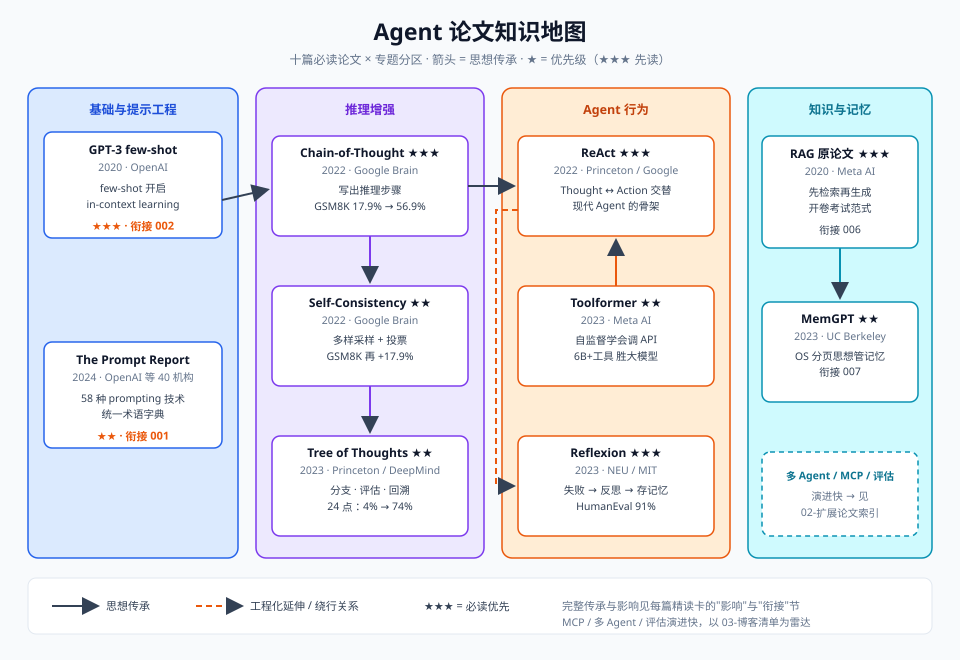
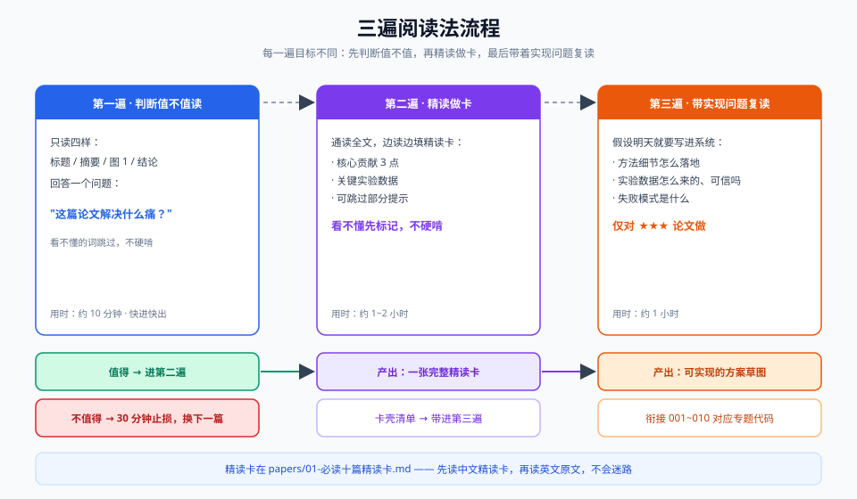

# 011-论文与资料

> AI Agent 学习工作区 · 论文精读与学习资源中心
>
> 读者画像：CTRM 贸易系统开发者，正在学 AI Agent，英文阅读能力一般。本目录的核心产品是"替你精读"的中文精读卡——帮你用最小代价把十篇奠基论文真正读进去，再按需扩展。

---

## 一、目录导航

| 位置 | 文件 | 内容 |
|---|---|---|
| `papers/` | [README.md](papers/README.md) | 精读卡索引表：十篇必读论文一览（论文/年份/一句话/对应专题/优先级） |
| `papers/` | [01-必读十篇精读卡.md](papers/01-必读十篇必读卡.md) | 十篇奠基论文的完整中文精读卡 |
| `papers/` | [02-扩展论文索引.md](papers/02-扩展论文索引.md) | 20+ 篇扩展论文分主题索引（多 Agent/工具调用/MCP/评估/记忆/长上下文） |
| `papers/` | [03-博客与官方指南.md](papers/03-博客与官方指南.md) | Anthropic / OpenAI 官方指南 + 必订阅博客清单 |
| `papers/` | [04-课程与视频.md](papers/04-课程与视频.md) | 公开课、YouTube 频道、中文资源（标注免费/付费） |
| `papers/` | [05-阅读路线图.md](papers/05-阅读路线图.md) | 按 001~010 专题的配套阅读顺序 + 每周节奏 + 间隔重复计划 |
| `diagrams/` | 011-01 ~ 011-05 | 5 张 SVG 图解（知识地图/三遍阅读法/时间线/博客地图/十二周路线图） |

---

## 二、怎么用本目录

**如果你只有 30 分钟**：打开 `papers/README.md` 索引表，按优先级 ★★★ 先看 3 张精读卡（建议 ReAct、Chain-of-Thought、RAG），只看"一句话人话 + 生活类比 + 核心贡献"三节。

**如果你有一个周末**：按三遍阅读法（见下）精读 2~3 张卡，并对照 `papers/03-博客与官方指南.md` 里的 Anthropic《Building effective agents》做交叉印证——博客讲"怎么做"，论文讲"为什么"。

**如果你在做系统设计**（比如给 CTRM 系统加 Agent 能力）：先看精读卡的"与 001~010 哪篇笔记衔接"一节，把论文思想映射到你正在写的专题代码上；工具调用看 ReAct + Toolformer，记忆看 MemGPT，检索看 RAG。

**如果你要持续跟进领域**：订阅 `03-博客与官方指南.md` 里的博客清单，每周 15 分钟扫一遍，值得深入的再回来查 `02-扩展论文索引.md`。

---

## 三、三遍阅读法

论文不是小说，读三遍比读一遍更能留住东西。每一遍的目标不同：

| 遍次 | 目标 | 做什么 | 时间 |
|---|---|---|---|
| **第一遍** | 判断值不值读 | 只读：标题、摘要、图 1、结论。回答一个问题——"这篇论文解决什么痛？" | 10 分钟 |
| **第二遍** | 精读做卡 | 通读全文，边读边填精读卡：核心贡献、关键实验数据、可跳过部分。看不懂的句子先标记，不硬啃 | 1~2 小时 |
| **第三遍** | 带着实现问题复读 | 假设你明天要把它实现到自己的系统里：方法细节、数据怎么来、失败模式是什么。这遍只对 ★★★ 论文做 | 1 小时 |

**给英文阅读能力一般的你的三个技巧**：

1. **先读本目录的精读卡，再读原文**。精读卡就是中文地图，先知道要去哪里，再走英文的路不会迷路。
2. **图 1 是论文的电梯演讲**。绝大多数顶会论文的第一张图浓缩了全文思想，看懂图 1 = 看懂 50%。
3. **善用翻译但不依赖翻译**。第一遍用整段翻译没问题；第二遍开始只查关键术语（如 `grounding`、`emergent`、`retrieval-augmented`），术语量比你想的少，重复出现的就那 100 来个。

---

## 四、编号说明

本目录的"对应专题"按 001~010 各主题笔记编号组织（提示工程、推理增强、工具调用、RAG、记忆、多智能体、评估等）。若你的工作区中 001~010 实际目录名与文中主题不完全一致，请按主题对号入座。
