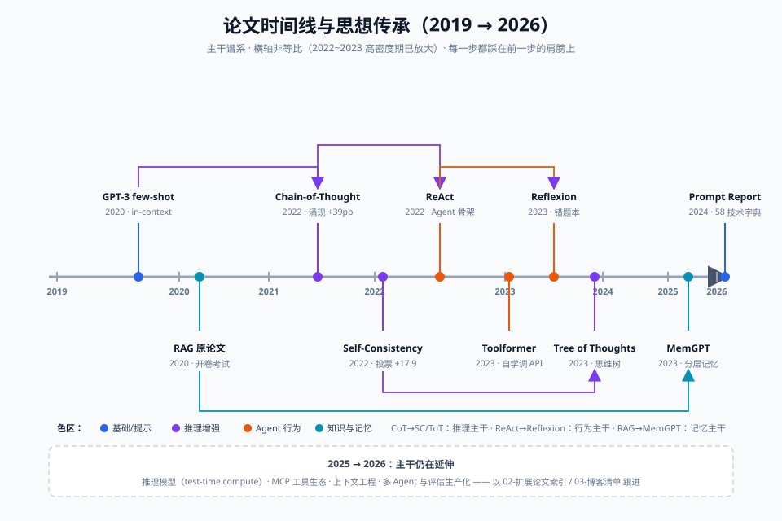

# 01-必读十篇精读卡

> 十篇奠基论文，每篇一张卡。卡上九节，顺序固定：元信息 → 一句话人话 → 生活类比 → 核心贡献 → 关键数据 → 影响 → 衔接 → 可跳过 → 自测。
> 数字均注明来源；凡未能直接核实原文表格的，标注"**需核对原文**"。

**建议消化顺序**：#8 CoT → #5 Self-Consistency → #1 ReAct → #3 Toolformer → #2 Reflexion → #4 ToT → #9 GPT-3 → #6 RAG → #7 MemGPT → #10 Prompt Report。先懂推理，再懂行动，再懂反思，最后懂基础设施。

---

## #1 ReAct：推理与行动交织（arXiv 2210.03629）

**元信息**：*ReAct: Synergizing Reasoning and Acting in Language Models* · arXiv 2210.03629 · 2022 · 普林斯顿大学 + Google Brain（Yao, Zhao, Yu, Du, Shafran, Narasimhan, Cao）· ICLR 2023

**一句话人话**：让模型像人一样"想一步、做一步"——用 Thought（内心独白）决定下一步做什么，用 Action（调工具/查资料）拿到真实结果，两者交替直到完成任务。

**生活类比**：老中医看病：号脉（观察）→ 心想"可能脾虚"（Thought）→ 开单查血常规（Action）→ 看化验单（Observation）→ 再修正判断（Thought）→ 最后开方。只让他内心独白不给化验单是 CoT，只让他开单不让他琢磨是 Act-only，ReAct 是两者交替。

**核心贡献 3 点**：
1. 证明推理（Reason）与行动（Act）**协同**优于任一单独使用——Thought 帮 Agent 规划、跟踪进度、处理异常；Action 帮 Thought 落到真实世界的事实上。
2. 给出了后来成为行业事实标准的**轨迹格式**：`Thought → Action → Observation → … → Answer`，今天所有 Agent 框架的日志长这样。
3. 展示了 **grounding 减幻觉**：推理链条落在工具返回的真实数据上，模型不再凭空编造。

**关键实验数据**（基于 PaLM-540B，few-shot 提示）：
- HotpotQA（多跳问答，EM）：Act-only 约 25.7，ReAct 约 27.4，最佳组合（CoT-SC→ReAct）达 34~35，接近当时最优。**需核对原文 Table 1**
- Fever（事实核查）：ReAct 约 64.6%，明显超过 CoT 变体（约 56~60）。**需核对原文 Table 1**
- ALFWorld（模拟家务的文字游戏）：ReAct 成功率约 71%，Act-only、CoT 均远低于此。**需核对原文 Table 2**
- WebShop（模拟网购下单）：ReAct 得分约 66.6，超过模仿学习/强化学习基线（约 30）。**需核对原文 Table 2**
- 人工检查：ReAct 在 HotpotQA 上的幻觉率显著低于 CoT——CoT 有约一半答案"推理像样但事实错误"，ReAct 因引用了真实检索结果，错也错得可解释。

**对后续领域的影响**：LangChain / LlamaIndex 的 Agent 循环、AutoGPT、Claude 的 tool use、OpenAI 的 function calling 流程，全部是 ReAct 轨迹格式的工程化。可以说：**所有"现代 Agent"都是 ReAct 的后代**。

**与 001~010 的衔接**：对应 **Agent 框架 / 工具调用**专题——你在那里写的"LLM 循环调用工具"的代码，就是本文 Figure 1 的实现。写完再看本文，会有"原来我在抄论文"的顿悟。

**可跳过部分提示**：第 4 节 ALFWorld/WebShop 的任务细节可以速读，看懂"成功率"表即可；附录的提示词全文不必逐字读，用到时再抄。

**自测 2 题**：
1. ReAct 里 Thought 的三个作用是什么？（提示：规划、跟踪、异常处理）
2. 为什么说 ReAct 比 CoT 的错误"更可解释"？

---

## #2 Reflexion：语言反思（arXiv 2303.11366）

**元信息**：*Reflexion: Language Agents with Verbal Reinforcement Learning* · arXiv 2303.11366 · 2023 · 美国东北大学 + MIT（Shinn, Cassano, Gopinath, Narasimhan, Yao）· NeurIPS 2023

**一句话人话**：Agent 失败后不让它白摔一跤——把"这次为什么错、下次怎么办"写成一条口语化的反思笔记存进记忆，下次重试时带着笔记，像人类做错题本。

**生活类比**：考驾照科目二挂了。教练的强化学习是"再练三百次、每次纠你方向盘"（改权重）；Reflexion 是你回家写了篇复盘："倒库时后视镜没调、车速太快"——下次考试前看一遍笔记，一次就过。

**核心贡献 3 点**：
1. 提出 **verbal RL** 概念：不更新模型权重，用**自然语言反思**作为反馈信号存入 episodic memory，成本几乎为零却接近强化学习的效果。
2. 给出完整的 **Actor–Evaluator–Self-Reflection** 循环：模型执行 → 环境打分 → 反思器分析失败原因 → 存记忆 → 带着记忆重试。
3. 证明反思能**跨任务泛化**：一次失败总结出的教训，在同类新任务上也用得上。

**关键实验数据**（以 GPT-3/GPT-4 为骨干）：
- HumanEval（代码生成，pass@1）：Reflexion 达 **91%**，超过 GPT-4 单次通过率约 80%。**需核对原文 Table 2**（此为 Reflexion 最著名的数字）
- ALFWorld：134 个任务完成约 130 个（约 97%），显著高于 ReAct 基线的约 71%。**需核对原文 Figure 3**
- HotpotQA：带反思的 Agent 超过 ReAct 基线若干个百分点。**需核对原文**

**对后续领域的影响**：开创"自我改进 Agent"支线。后来的 Self-Refine、CRITIC、ExpeL、各类"Agent 记忆 + 复盘"产品（包括各家 coding agent 的失败重试机制），思想源头都在这里。它也是"为什么 Agent 需要记忆系统"的最有力论据。

**与 001~010 的衔接**：对应**反思与自我改进**专题；同时是**记忆管理**专题的最佳引子——"反思存哪里、多久过期、怎么检索"，正好引出 MemGPT。

**可跳过部分提示**：第 2 节与强化学习的形式化对比（bandits、policy 更新公式）对工程实践价值不大，理解"语言反馈 vs 权重更新"的区别即可跳过；实验细节重点看 HumanEval 和 ALFWorld 两节。

**自测 2 题**：
1. Reflexion 的三个组件（Actor/Evaluator/Self-Reflection）各自干什么？
2. 它和传统强化学习的本质区别是什么？为什么说它"便宜"？

---

## #3 Toolformer（arXiv 2302.04761）

**元信息**：*Toolformer: Language Models Can Teach Themselves to Use Tools* · arXiv 2302.04761 · 2023 · Meta AI（Schick, Dwivedi-Yu, Dessì, Raileanu, Lomeli, Zettlemoyer, Cancedda, Scialom）

**一句话人话**：让模型自己学会"什么时候、在哪里、调哪个 API"——不用人工标注，靠"这个调用能不能让后续文本更好预测"来自动筛选，再微调自己。

**生活类比**：实习生自己摸索什么时候用计算器、什么时候查 Wikipedia：他先在写报告时随手试插各种工具（大量采样），然后回头检查——只有"查了之后报告明显变顺"的工具使用才保留下来（按困惑度过滤），最后照着这些好案例自我训练。

**核心贡献 3 点**：
1. **自监督工具学习流程**：采样 API 调用候选 → 用"插入调用后能否降低剩余文本的困惑度"自动过滤 → 用过滤后的数据微调。全程零人工标注。
2. 证明**小模型 + 工具 > 大模型裸考**：6B 的模型装上工具后，在多个任务上打平甚至超过大几倍的无工具模型。
3. 工具调用由模型**自主决定插入位置**（而非被问"请调用工具"），这是与 function calling 人工触发模式的本质区别。

**关键实验数据**（骨干为 GPT-J 6B）：
- LAMA 知识探测（T-REx 子集）：从约 33.5% 提升到约 53.5%（配检索 API）。**需核对原文 Table 1**
- 数学应用题：配计算器后准确率大幅提升（GPT-J 裸模型在此类任务接近瞎猜）。**需核对原文具体数字**
- 时间/日期问答：配日历 API 后显著提升。**需核对原文**
- 用了约几百万条网络文本、保留下来仅数万条有效工具样本——说明**有效的工具调用在自然文本中其实很稀少**。

**对后续领域的影响**：确立了"工具使用是可以通过数据让模型内化"的信念；OpenAI function calling、Mistral 的 tool-use 微调、各家模型的 tool training 都延续了这个思路（只是从"自监督挖掘"演进到"人工构造 + RLHF"）。MCP 生态的"模型自主选工具"理念同样源于此。

**与 001~010 的衔接**：对应**工具调用 / Function Calling**专题。你在那里学的是"怎么定义和注册工具"，本文告诉你"模型怎么学会用工具"——一个是 API 设计，一个是训练机制，合起来才完整。

**可跳过部分提示**：第 2 节流程图和第 3 节 API 定义（计算器/检索/翻译/日历/QA）值得细看；第 4 节消融实验（采样数、过滤阈值）可以扫读；第 6 节 scaling 讨论可跳。

**自测 2 题**：
1. Toolformer 用什么标准自动筛选"好的" API 调用？
2. 为什么说"6B + 工具"能威胁"百 B 裸模型"？这对工程选型意味着什么？

---

## #4 Tree of Thoughts：思维树（arXiv 2305.10601）

**元信息**：*Tree of Thoughts: Deliberate Problem Solving with Large Language Models* · arXiv 2305.10601 · 2023 · 普林斯顿大学 + Google DeepMind（Yao, Yu, Zhao, Shafran, Griffiths, Cao, Narasimhan）· NeurIPS 2023

**一句话人话**：把 CoT 的"一条道走到黑"升级成"搜索一棵思维树"——每一步生成多个候选想法，用模型自己评估它们的前景，好枝继续、坏枝剪掉，还能回溯重来。

**生活类比**：CoT 是走迷宫时凭感觉一条路走到底；ToT 是在岔路口先把每条路都看两眼（生成候选），心里掂量"这路像不像通往出口"（自评估），走错了退回岔口换一条（BFS/DFS 回溯）。就是你在贸易系统里排查 bug 时"假设-验证-回退"的人肉搜索。

**核心贡献 3 点**：
1. 把 LLM 推理形式化为**图搜索问题**：Thought 是节点，生成是扩展，自评估是启发式函数，BFS/DFS 是搜索策略——直接对接经典 AI 搜索框架。
2. 引入**中间评估**："这个思路值得继续吗？"让模型给自己的分支打分，实现剪枝，省下指数级搜索成本。
3. 证明"允许犯错和回头"对需要**规划与试错**的任务是质变，而不是 CoT 的量变延续。

**关键实验数据**（骨干 GPT-4）：
- Game of 24（凑 24 点）：标准 IO prompting 约 7.3%，CoT 仅 **4%**，CoT-SC 约 12%，ToT 达 **74%**。**需核对原文 Table 1**（4% vs 74% 是全文最戏剧性的对比）
- 创意写作（连贯段落衔接）：人工评估显著优于 IO 基线（GPT-4 在此任务上 CoT 不适用，因为中途没有"回头看"的机制）。**需核对原文 Figure 4**
- Mini Crosswords（填字游戏）：ToT 将词级解决率提升到约 60%。**需核对原文**

**对后续领域的影响**：开启"搜索式推理"研究线（Graph of Thoughts、MCTS + LLM 如 AlphaMath、rStar），也是今天"推理模型"（o1/R1 风格的 test-time compute）的先驱思想——花更多算力在推理期做搜索，而不是只靠一次前向。

**与 001~010 的衔接**：对应**推理增强 / 规划**专题。注意它和 Self-Consistency 的关系：SC 是"平行开 many 条路、只投票不回头"，ToT 是"路和路之间有结构、能回溯"——读 ToT 前先复习 SC。

**可跳过部分提示**：第 3 节三个任务的提示词与搜索设置细节，只在你要复现时才需要；第 7 节与经典搜索的哲学讨论可以跳。正文第 2 节的"四种角色（分解/生成/评估/搜索）"是精华，务必细读。

**自测 2 题**：
1. ToT 的四个模块分别对应经典搜索里的什么概念？
2. 为什么 Game of 24 上 CoT（4%）反而低于普通 IO（7.3%）？

---

## #5 Self-Consistency：自一致性（arXiv 2203.11171）

**元信息**：*Self-Consistency Improves Chain of Thought Reasoning in Language Models* · arXiv 2203.11171 · 2022 · Google Research, Brain Team（Wang, Wei, Schuurmans, Le, Chi, Narang, Chowdhery, Zhou）· ICLR 2023

**一句话人话**：同一道题让模型独立想 40 条不同的推理路，最后只取"多数派答案"——因为正确的路殊途同归，错误的理由五花八门，投票天然滤错。

**生活类比**：期货价格走势判断。一个分析师拍脑袋可能错；让十个分析团队各自独立建模、独立推演，最后看大多数团队指向哪边——独立路径的多处一致比单一路径的"自信"可信得多。注意关键在**独立**：串着问十次只会越问越像。

**核心贡献 3 点**：
1. 提出**解码策略级**的改进：不动提示词、不训模型，只把 greedy decoding 换成"多样采样 + 边缘化投票"，一行采样代码换来十几个点。
2. 用实验证明**正确答案的一致性是有效信号**：推理路径多样但终点收敛，是"真懂"的特征；单条路径的自我确定感则不可靠。
3. 证明**简单多数投票 ≈ 概率加权**：不用算 token 概率，数票就行，工程实现极简。

**关键实验数据**（已对照 arXiv 摘要与原文表格，来源：arXiv 2203.11171）：
- PaLM-540B：GSM8K **56.5% → 74.4%（+17.9%）**、SVAMP +11.0%、AQuA +12.2%、StrategyQA +6.4%、ARC-challenge +3.9%
- GPT-3（code-davinci-002）GSM8K：60.1% → **78.0%**（同样 +17.9%）
- 投票方式对比：多数投票 74.4% vs 归一化概率加权 74.1%——差别可忽略（来源：ai-papers.aktagon.com 对 Table 1 的整理，需核对原文）
- 收益随采样条数增加，**40 条**左右基本饱和；模型越大收益越大（UL2-20B 约 +3~7%，PaLM-540B 最高 +18%）。

**对后续领域的影响**：成为所有"test-time compute"方法的基线与灵感来源；今天主流 API 的 `n` 参数 + 投票、推理模型的并行采样，都是它的工程化。它也是"LLM 输出可用投票/一致性度量质量"这一通用思想的出处（呼应后续 self-verification、ensemble 评估）。

**与 001~010 的衔接**：对应**推理增强**专题，紧跟 CoT 笔记——CoT 是"写出步骤"，SC 是"写出多份步骤再投票"，两篇连读才能理解 test-time compute 的第一课。

**可跳过部分提示**：第 3.4 节的鲁棒性分析（温度、top-k、格式变化）扫一眼结论即可；数学上的"边缘化"推导不必深究，直觉上就是"按最终答案聚合"。

**自测 2 题**：
1. 为什么"独立采样 40 条再投票"有效，而"同一对话里连问 40 次"无效？
2. 工程上想用 SC 但预算只有 5 次采样，你会怎么分配温度和票数？

---

## #6 RAG：检索增强生成（arXiv 2005.11401）

**元信息**：*Retrieval-Augmented Generation for Knowledge-Intensive NLP Tasks* · arXiv 2005.11401 · 2020 · Facebook AI Research + UCL + NYU（Lewis, Perez, Piktus, Petroni, Karpukhin, Goyal, Küttler, Lewis, Yih, Rocktäschel, Riedel, Kiela）· NeurIPS 2020

**一句话人话**：回答问题前先去外部知识库把相关文档捞出来，塞进提示词再让模型作答——把模型的"记忆"从权重里搬到一个可以随时增删改的数据库里。

**生活类比**：闭卷考试 vs 开卷考试。让模型凭权重答题是闭卷，背多少答多少、过期作废（你让它讲 2023 年的新政策它只会编）；RAG 是开卷：先翻书找到相关页（向量检索），照着书答，答不上至少能说"书里没有"。对贸易系统而言，政策文件每周都在变，你绝不会让模型背政策——你让它查。

**核心贡献 3 点**：
1. 提出 **parametric memory（模型权重）+ non-parametric memory（可检索文档库）** 的双记忆架构，并证明后者让知识**可更新、可溯源、可控制**。
2. 把 seq2seq 生成器与 DPR 向量检索器**端到端联合训练**，检索不再是外挂步骤而是为生成服务的组件。
3. 给出两种变体：**RAG-Sequence**（同一批文档答完整答案）与 **RAG-Token**（不同 token 可用不同文档），后者可生成"混合证据"的答案。

**关键实验数据**（开放域问答，Exact Match）：
- Natural Questions：**44.5**（RAG-Sequence），超过 closed-book T5-11B（34.5）与 REALM 等。**需核对原文 Table 2**
- TriviaQA：约 56.8；WebQuestions：约 45.5。**需核对原文 Table 2**
- 人工评估：RAG 生成答案的**具体性与事实正确性**显著优于纯参数化的 BART 基线。
- 生成任务（WikiAir 摘要）：RAG 以更小的模型达到与专用微调模型相当的事实精确度。**需核对原文**

**对后续领域的影响**：今天所有企业知识库、企业搜索、客服机器人、codebase QA 的理论基础。从"论文里的 DPR+BART"演化为"embedding 模型 + 向量库 + 重排序 + 生成器"的现代技术栈。CTRM 系统里接合同库/法规库的方案，本质都是这篇论文。

**与 001~010 的衔接**：对应**RAG / 知识库**专题。论文只给了骨架（检索器+生成器），工程专题里学的切块策略、rerank、混合检索都是往这骨架上长肉。

**可跳过部分提示**：第 2 节的数学形式化（边缘化似然、DPR 打分公式）可以跳，理解"检索打分 + 生成概率"两个直觉即可；第 4 节消融里重点看"去检索器的退化实验"，其余扫读。

**自测 2 题**：
1. parametric 和 non-parametric memory 各指什么？RAG 为什么强调后者"可更新"？
2. 你的 CTRM 系统要让 Agent 回答"这份合同的溢短装条款"，为什么必须 RAG 而不能靠模型本身？

---

## #7 MemGPT（arXiv 2310.08560）

**元信息**：*MemGPT: Towards LLMs as Operating Systems* · arXiv 2310.08560 · 2023 · UC Berkeley（Packer, Wooders, Lin, Fang, Patil, Gonzalez）；后续团队创业成立 Letta

**一句话人话**：上下文窗口太小记不住事？借操作系统的思路：窗口内是"内存"，窗口外是"磁盘"，让模型自己调用分页函数在两者之间搬数据——它像管理虚拟内存一样管理自己的注意力。

**生活类比**：你的工位桌面 = 上下文窗口（放眼下正在处理的单证），档案柜 = 外部存储（历年合同、聊天记录）。桌面放不下全部档案，于是你练出一套习惯：把当前要用的抽屉拽到桌面，处理完的塞回去，关键结论记在便签贴桌角（核心记忆）。MemGPT 就是把这套"人肉分页"教给模型，让它自己决定什么时候换页。

**核心贡献 3 点**：
1. 提出**分层记忆架构**：main context（模型可见：系统指令 + 工作上下文 + 核心记忆）与 external context（不可见：对话历史库、文档库、归档），并用**中断驱动的函数调用**在层间搬运内容。
2. 让模型获得**自编辑记忆**：模型可调用 `core_memory_append/replace`、`conversation_search` 等函数主动读写、检索自己的记忆——记忆管理从工程管道变成模型自身的决策。
3. 展示两个落地应用：**超长文档深度问答**（分页阅读远超窗口的文档）与**跨会话长期对话**（记住用户几周前说过的偏好）。

**关键实验数据**：
- 深度文档 QA（nested_kv 类多跳检索任务，GPT-4 骨干）：在上下文被截断（如仅 2K~4K 可见）时，普通 prompt 准确率骤降，MemGPT 的分页机制能恢复大部分准确率。**需核对原文 Table 1/Figure 5 具体数字**
- 多会话聊天：人工评估中 MemGPT 在"记忆一致性""人格一致性"上显著优于固定窗口基线。**需核对原文**
- 全程只用无微调的 prompting + 函数调用——证明**记忆管理能力可以被提示工程直接激活**。

**对后续领域的影响**：奠定了"Agent 记忆系统"的设计范式：分层（工作记忆/情景记忆/语义记忆）、自编辑、检索优先。Letta 产品、LangGraph memory、Claude 的 memory tool、各类 AI 伴侣应用的长期记忆，几乎都能看到 MemGPT 的影子。标题里的 "LLMs as Operating Systems" 也成为 Agent 基础设施的重要隐喻。

**与 001~010 的衔接**：对应**记忆管理 / 长上下文**专题。与 Reflexion 连读极佳：Reflexion 说"教训要存下来"，MemGPT 回答"存哪、怎么搬、何时取"。

**可跳过部分提示**：第 2 节操作系统类比与 Figure 2 的架构图是全文核心，务必精读；两个应用的实验设置（nested_kv、haystack 类任务）看懂评估逻辑即可，附录的提示词模板在你要实现时再抄。

**自测 2 题**：
1. MemGPT 里 main context 与 external context 各存什么？靠什么机制在两者之间搬数据？
2. "核心记忆"对应工位类比里的哪样东西？为什么它值得放在永远可见的位置？

---

## #8 Chain-of-Thought：思维链（arXiv 2201.11903）

**元信息**：*Chain-of-Thought Prompting Elicits Reasoning in Large Language Models* · arXiv 2201.11903 · 2022 · Google Research, Brain Team（Wei, Wang, Schuurmans, Bosma, Ichter, Xia, Chi, Le, Zhou）

**一句话人话**：在 few-shot 示例里把"最终答案"换成"一步步推导的过程"，模型就会模仿着也先推导再作答——就这一个改动，让大模型在数学题上的准确率翻了三倍。

**生活类比**：小学数学老师不收"答案 11"，要你写"先算 2 罐 × 3 个 = 6 个，再算 5 + 6 = 11"。不是老师较真——**写出中间步骤能强迫你每一步都对**，哪里错了立刻暴露。模型同理：直接吐答案容易一步错步步错，把步骤摊开在纸面上，每步生成都以前一步的正确为条件。

**核心贡献 3 点**：
1. 发现 **emergent ability**：CoT 收益是模型规模的涌现现象——约 100B 参数以下收益趋零甚至为负，大模型才能"学会"跟着示例一步步想。这直接改写了" prompting 研究必须报告模型规模"的规范。
2. **零训练成本**：不微调、不加模型，只改提示词（8 个手写带步骤的例子），就能追平/超过"微调 GPT-3 + 验证器"的 SOTA。
3. 消融证明起作用的是**自然语言推理步骤本身**：只给等式不给推理说明，效果大打折扣——"以语言形式思考"才是关键，不是"多输出一些字"。

**关键实验数据**（已核实，来源：arXiv 2201.11903 表 1/表 2 及 arxiv.org/html 版本）：
- PaLM 540B，GSM8K：标准 prompting **17.9%** → CoT **56.9%**（+39 个百分点，8-shot，无计算器）；论文表 1 另报告配合计算器达 58.1%
- 对照组：LaMDA 137B 6.5%→17.1%；GPT-3 175B 15.6%→46.9%；Codex 19.7%→63.1%
- 符号推理 Last Letter Concatenation：0% → **63%**；Coin Flip：54.8% → 90.2%
- 背景：CoT 前的 GSM8K SOTA 是"微调 GPT-3 + 验证器"的 55%，9~12 岁人类儿童为 60%——CoT 用 8 个例子 prompting 就到了同一量级

**对后续领域的影响**：几乎所有后续推理研究的地基——Self-Consistency 是"CoT × 多采样"，ToT 是"CoT × 搜索"，ReAct 是"CoT × 工具"，Reflexion 是"CoT × 反思"。今天推理模型的"思考过程输出"也是它的规模化后裔。一纸提示词改动开启整个领域，性价比前无古人。

**与 001~010 的衔接**：对应**提示工程 / 推理增强**专题。建议作为十篇里的**第一篇**读：它是所有其他论文引用率最高的"公共祖先"。

**可跳过部分提示**：第 3.3~3.4 节的鲁棒性与消融值得看（回答"是不是碰巧"）；第 4、5 节（符号/常识推理）扫结论即可；附录的完整示例表不必读。

**自测 2 题**：
1. 为什么 CoT 在 10B 以下模型上可能失效甚至变差？
2. 消融实验如何证明"是推理步骤在起作用，而不是输出更长"？

---

## #9 GPT-3 few-shot：上下文学习（arXiv 2005.14165）

**元信息**：*Language Models are Few-Shot Learners* · arXiv 2005.14165 · 2020 · OpenAI（Brown, Mann, Ryder, Subbiah, Kaplan 等 31 人）· NeurIPS 2020

**一句话人话**：把模型堆到 175B 参数后，不需要微调——提示词里给几个输入输出示例，模型就能现场"看会"一个新任务。学习第一次搬进了上下文窗口，而不是权重。

**生活类比**：带新同事。传统微调像送他去培训班脱产三个月（改权重，成本高）；few-shot 像你把三份"客户需求 → 成品单证"的样例拍在他桌上："照着这个来"——他当场开工。GPT-3 证明了：模型够大时，"拍样例"这条路是通的。

**核心贡献 3 点**：
1. **in-context learning 概念确立**：任务适配从"改权重"变成"改上下文"，zero-/one-/few-shot 三档范式沿用至今，这是所有 prompting 研究的出发点。
2. **规模效应实证**：175B 模型的 few-shot 能力随参数量非线性增长，小模型上不成立——与后来 CoT 的"涌现"结论一脉相承。
3. 系统性的**能力边界测绘**：哪些任务 few-shot 接近 SOTA（语言建模、常识问答、翻译），哪些仍显著落后（NLI、算术）——这份"地图"直接启发了后续三年的研究议程。

**关键实验数据**（few-shot 模式，K=32 例子为主）：
- LAMBADA（长文补全）：约 86.4%，超过 SOTA；TriviaQA（闭卷问答）：约 71.2%，接近开卷 SOTA。**需核对原文 Table 3**
- SuperGLUE（综合基准）：few-shot 约 71.8，与轻量微调基线可比，但距全量微调 SOTA（约 89~90）仍有差距——**few-shot 不是万能的**。**需核对原文 Table 3**
- 两位数加法：2 位数尚可，位数一多骤降——为后来"给模型配计算器"（Toolformer）埋下伏笔。**需核对原文 Figure 3.10**
- 翻译：英语→罗马尼亚语等资源丰富方向接近无监督 SOTA；资源稀缺方向落后。**需核对原文**

**对后续领域的影响**：没有这篇就没有后九篇——CoT 是在 few-shot 示例里加步骤，ReAct 是在 few-shot 示例里加工具调用，Prompt Report 是对 few-shot 技术的全面盘点。"API + 提示词"这一商业模式本身由本文定义。

**与 001~010 的衔接**：对应**大模型基础**专题。它是十篇里唯一"纯基础"的：建议在读完 CoT/ReAct 后回头读它，体验"原来所有技巧的地基是这一个发现"。

**可跳过部分提示**：这篇 75 页，别从头读。第 1 节 + Figure 1.1 + Figure 2.1（few-shot 三模式示意）+ 第 3 节挑 2~3 个任务的表即可；第 2 节数据与训练细节、附录全部跳过。CoT 论文的实验反而比它更精炼。

**自测 2 题**：
1. in-context learning 和 fine-tuning 的区别是什么？"学习发生在哪里"各是哪里？
2. 为什么 GPT-3 的算术能力差这个"缺点"反而推动了后续研究？

---

## #10 The Prompt Report：Prompting 技术全景综述（arXiv 2406.06608）

**元信息**：*The Prompt Report: A Systematic Survey of Prompting Techniques* · arXiv 2406.06608 · 2024 · OpenAI + Microsoft Research + 普林斯顿等 40+ 机构（Schulhoff, Pinto, Pouya 等 58 位作者）

**一句话人话**：一篇把全世界 prompting 论文洗牌归类的"官方字典"：58 种技术、统一术语、六大家族，让你不再被"zero-shot CoT 和 few-shot CoT 是不是一回事"这种命名混乱折磨。

**生活类比**：贸易术语大全。/incoterms 之前，每个港口对"CIF 到底含不含卸货费"都有自己的土话；一本术语典把所有说法统一编号后，谈判效率倍增。这本文就是 prompting 领域的 Incoterms——58 种技术就像 58 个贸易条款，各有适用场景和成本。

**核心贡献 3 点**：
1. **术语统一**：梳理了 40+ 种互相冲突的命名（如 few-shot / multi-shot / in-context 的混用），给出规范词汇表——从此论文里出现的技术名词可以直接对表查询。
2. **六大家族分类法**：Zero-Shot、Few-Shot、Thought Generation（CoT 及变体）、Decomposition（任务分解）、Ensembling（SC/ToT 等）、Self-Criticism（自我批评/反思）——十篇精读卡里的技术在六大类里各有座次。
3. **BEST-LIST 实证**：跨 8 种模型、4 类数据集系统对比代表性技术，给出"什么场景用什么"的实用指引，而非只做文献堆砌。

**关键实验数据**：
- 收录并规范化 **58 种**文本 prompting 技术、40+ 术语冲突（来源：arXiv 2406.06608 摘要，已核实）
- 多语言扩展报告 40+ 语言下的 prompting 现状；BEST-LIST 实验覆盖 8 种 LLM × 4 个数据集（MMLU Pro 等）。**具体最优技术组合需核对原文**
- 重要结论之一：没有万能技术——强推理任务上 CoT 类占优，分类任务上 few-shot + 结构化输出占优。**需核对原文**

**对后续领域的影响**：成为提示工程课程、企业 prompt 规范、评测论文引用的标准术语来源；它与 Anthropic《Effective context engineering》共同构成"提示工程 → 上下文工程"演进的文献坐标。写团队 prompt 规范时，直接拿六大家族做目录。

**与 001~010 的衔接**：对应**提示工程 / 上下文工程**专题。读法特殊：**它是字典不是小说**——先读第 1~2 节的分类框架，之后按需查条目；六个家族各自对应你 001 专题里的一节代码。

**可跳过部分提示**：第 3~5 节逐条技术描述（占全文一半以上）不必通读，扫目录建立"有哪些"的地图即可；第 6 节多语言部分可跳；BEST-LIST 实验节（第 7 节）值得细读。

**自测 2 题**：
1. 六大 prompting 家族是什么？Self-Consistency 和 Reflexion 各归哪一族？
2. 为什么说"统一术语"本身就是这篇论文最重要的贡献？
